<properties 
    pageTitle="Afhankelijkheid bijhouden in de toepassing inzichten" 
    description="Gebruik, beschikbaarheid en prestaties van uw on-premises implementatie of Microsoft Azure-webtoepassing met toepassing inzichten analyseren." 
    services="application-insights" 
    documentationCenter=".net"
    authors="alancameronwills" 
    manager="douge"/>

<tags 
    ms.service="application-insights" 
    ms.workload="tbd" 
    ms.tgt_pltfrm="ibiza" 
    ms.devlang="na" 
    ms.topic="article" 
    ms.date="10/24/2016" 
    ms.author="awills"/>


# <a name="set-up-application-insights-dependency-tracking"></a>Toepassing inzichten instellen: afhankelijkheid bijhouden


[AZURE.INCLUDE [app-insights-selector-get-started-dotnet](../../includes/app-insights-selector-get-started-dotnet.md)]


Een *afhankelijkheid* is een externe onderdeel dat wordt aangeroepen door de app. Dit is meestal een service die met HTTP, een database of een bestandssysteem genoemd. In Visual Studio-toepassing inzichten, kunt u gemakkelijk zien hoe lang uw toepassing afhankelijkheden wacht en hoe vaak een oproep afhankelijkheid is mislukt.

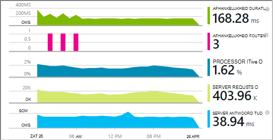

Het beeldscherm out-van-het-box afhankelijkheid rapporten momenteel oproepen naar deze soorten afhankelijkheden:

* ASP.NET
 * SQL-databases
 * ASP.NET-webpagina en WCF-services met HTTP gebaseerde bindingen
 * Lokale of externe HTTP-oproepen
 * Azure DocumentDb, tabel, blobopslag en wachtrij
* Java
 * Oproepen naar een database via een [JDBC](http://docs.oracle.com/javase/7/docs/technotes/guides/jdbc/) -stuurprogramma, zoals MySQL, SQL Server, PostgreSQL of SQLite.
* JavaScript in webpagina's - de [pagina met webonderdelen SDK](app-insights-javascript.md) automatisch Ajax worden gesprekken vastgelegd als afhankelijkheden.

U kunt uw eigen SDK oproepen naar het andere afhankelijkheden met de [API TrackDependency](app-insights-api-custom-events-metrics.md#track-dependency)bewaken schrijven.


## <a name="to-set-up-dependency-monitoring"></a>Voor het instellen van afhankelijkheid bewaken

Moet u een [Microsoft Azure](http://azure.com) -abonnement.

### <a name="if-your-app-runs-on-your-iis-server"></a>Als uw app op uw IIS-server wordt uitgevoerd

Als uw web-app op .NET 4.6 of hoger wordt uitgevoerd, kunt u een van beide [installeren van de toepassing inzichten SDK](app-insights-asp-net.md) in uw app of toepassing inzichten statuscontrole installeren. U hoeft niet beide.

Anders toepassing inzichten statuscontrole installeren op de server:

1. Op uw IIS webserver, meld u aan met beheerdersreferenties.
2. Download en voert u het [installatieprogramma van de statuscontrole](http://go.microsoft.com/fwlink/?LinkId=506648).
4. In de installatiewizard, moet u zich aanmelden bij Microsoft Azure.

    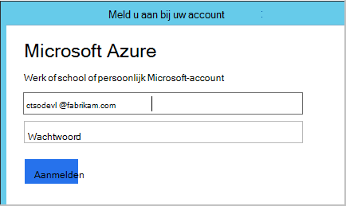

    *Fouten? Zie [problemen met](#troubleshooting).*

5. Kies de geïnstalleerde webtoepassing of website die u wilt controleren, moet u de resource die u wilt de resultaten bekijken in de portal-toepassing inzichten configureren.

    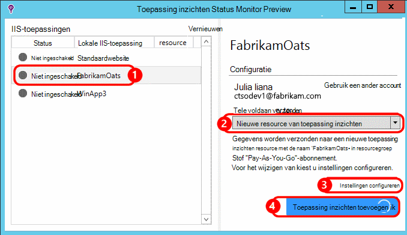

    Normaal gesproken vergt u kiest voor het configureren van een nieuwe resource en [resourcegroep][roles].

    Een bestaande bron anders gebruiken als u al ingesteld [web getest] [ availability] voor uw site of [WebClient monitoring][client].

6. IIS opnieuw starten.

    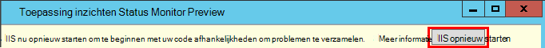

    Uw webservice wordt even worden onderbroken.

6. Zoals u ziet dat ApplicationInsights.config is ingevoegd in de web-apps die u wilt controleren.

    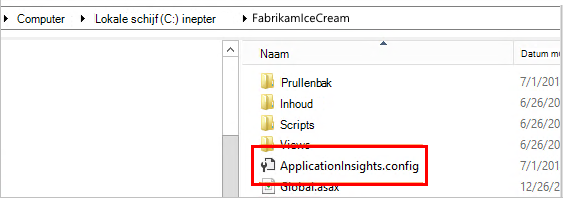

   Er zijn ook enkele wijzigingen in het web.config.

#### <a name="want-to-reconfigure-later"></a>Wilt u configureren later (opnieuw)?

Nadat u de wizard hebt voltooid, kunt u de agent opnieuw configureren wanneer u maar wilt. U kunt dit ook gebruiken als u de agent hebt geïnstalleerd, maar er sommige problemen met de eerste configuratie is.

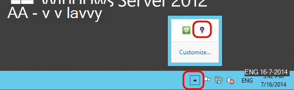


### <a name="if-your-app-runs-as-an-azure-web-app"></a>Als uw app wordt uitgevoerd als een Azure-Web-App

In het Configuratiescherm van uw Web-App van Azure toevoegen de toepassing inzichten extensie.

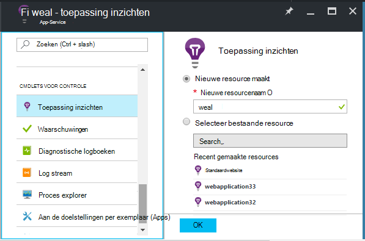


### <a name="if-its-an-azure-cloud-services-project"></a>Als dit een Azure cloud services-project is

[Scripts aan web en werknemer rollen toevoegen](app-insights-cloudservices.md#dependencies). Of [.NET framework 4.6 of hoger te installeren](../cloud-services/cloud-services-dotnet-install-dotnet.md).

## <a name="diagnosis"></a>Oplossen van prestatieproblemen afhankelijkheid

Om te beoordelen de prestaties van aanvragen op de server, opent u het blad prestaties en schuif omlaag naar het raster van aanvragen bekeken:

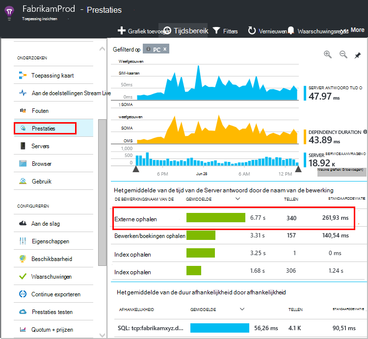

De bovenste fase duurt erg lang zijn. Laten we eens kijken als we vindt waarin de tijd is besteed.

Klik op die rij om afzonderlijke verzoek om gebeurtenissen te bekijken:


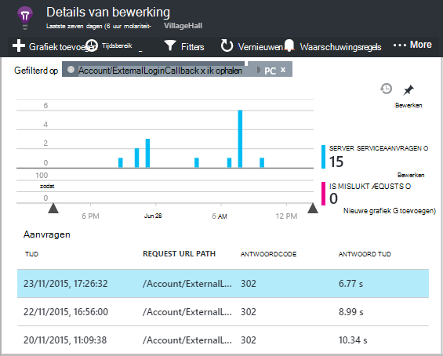

Klik op een willekeurig exemplaar langdurige als u wilt deze verder te controleren.

Schuif omlaag naar de externe afhankelijkheid oproepen die betrekking hebben op deze aanvraag:

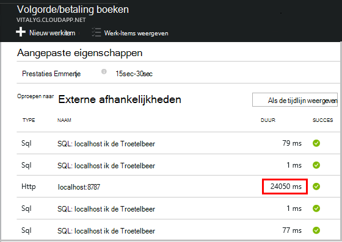

Het eruitziet grootste deel van de tijd aflossing die deze aanvraag is besteed aan een gesprek met een lokale service. 


Selecteer die rij voor meer informatie:

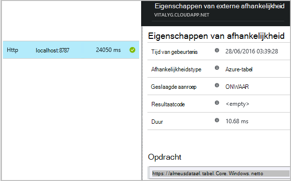

De details bevat voldoende gegevens diagnose van het probleem.


In een andere hoofdletters/kleine letters, geen gesprek afhankelijkheid lang is, maar door over te schakelen naar de tijdlijn, kunnen we zien waar de vertraging opgetreden in onze interne verwerking:


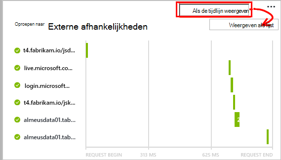


## <a name="failures"></a>Fouten

Als er mislukte aanvragen, klikt u op de grafiek.

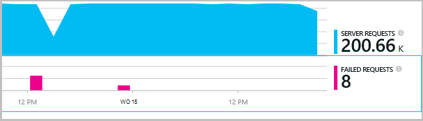

Klik op via een aanvraag met het type en het exemplaar van de aanvraag, een mislukte oproep aan een externe afhankelijkheid zoeken.


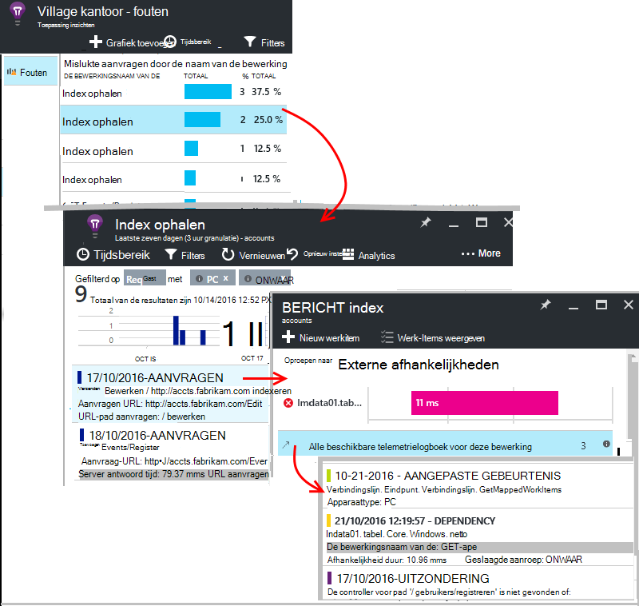


## <a name="custom-dependency-tracking"></a>Aangepaste afhankelijkheid bijhouden

De standaardmodule afhankelijkheid-items detecteert automatisch externe afhankelijkheden zoals databases en REST API's. Maar u mogelijk enkele extra onderdelen op dezelfde manier worden behandeld. 

U kunt code die wordt verzonden objectafhankelijkheidsinformatie, schrijven met de dezelfde [TrackDependency API](app-insights-api-custom-events-metrics.md#track-dependency) die wordt gebruikt door de standaard modules.

Als u uw code met een constructie die u niet zelf hebt geschreven uzelf samenstelt, kan u bijvoorbeeld alle gesprekken, om vast te stellen wat de bijdrage van deze aanbrengt in uw antwoord tijden tijd. Als u deze gegevens weergegeven in de grafieken afhankelijkheid in de toepassing inzichten, verstuurt u deze via `TrackDependency`.

```C#

            var startTime = DateTime.UtcNow;
            var timer = System.Diagnostics.Stopwatch.StartNew();
            try
            {
                success = dependency.Call();
            }
            finally
            {
                timer.Stop();
                telemetry.TrackDependency("myDependency", "myCall", startTime, timer.Elapsed, success);
            }
```

Als u uitschakelen in de standaard afhankelijkheid bijhouden-module wilt, verwijdert u de verwijzing naar DependencyTrackingTelemetryModule in [ApplicationInsights.config](app-insights-configuration-with-applicationinsights-config.md).

## <a name="troubleshooting"></a>Problemen oplossen

*Afhankelijkheid success vlag altijd ziet u waar of ONWAAR.*

* Upgrade uitvoeren naar de nieuwste versie van de SDK. Als uw .NET-versie minder dan 4.6 is, installeert u [Statuscontrole](app-insights-monitor-performance-live-website-now.md).

## <a name="next-steps"></a>Volgende stappen

- [Uitzonderingen](app-insights-asp-net-exceptions.md)
- [Gebruiker & pagina gegevens][client]
- [Beschikbaarheid](app-insights-monitor-web-app-availability.md)


<!--Link references-->

[api]: app-insights-api-custom-events-metrics.md
[apikey]: app-insights-api-custom-events-metrics.md#ikey
[availability]: app-insights-monitor-web-app-availability.md
[azure]: ../insights-perf-analytics.md
[client]: app-insights-javascript.md
[diagnostic]: app-insights-diagnostic-search.md
[metrics]: app-insights-metrics-explorer.md
[netlogs]: app-insights-asp-net-trace-logs.md
[portal]: http://portal.azure.com/
[qna]: app-insights-troubleshoot-faq.md
[redfield]: app-insights-asp-net-dependencies.md
[roles]: app-insights-resources-roles-access-control.md

 
