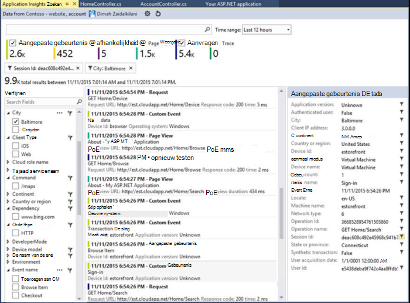
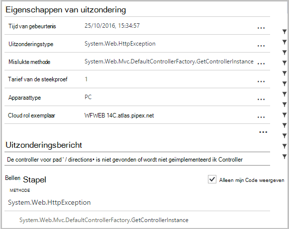
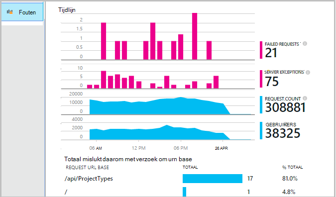
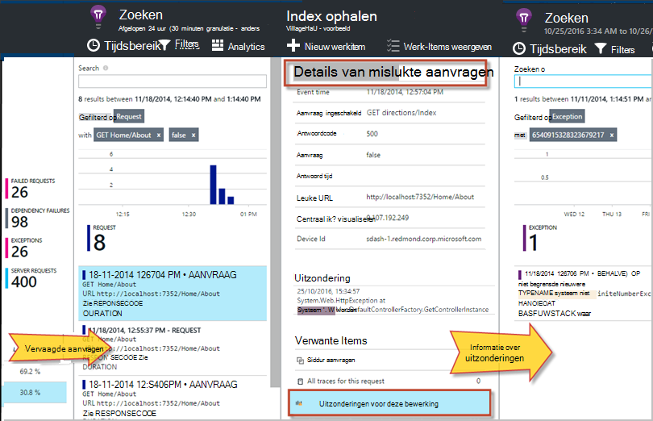
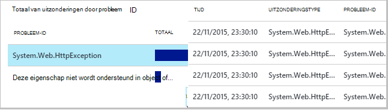
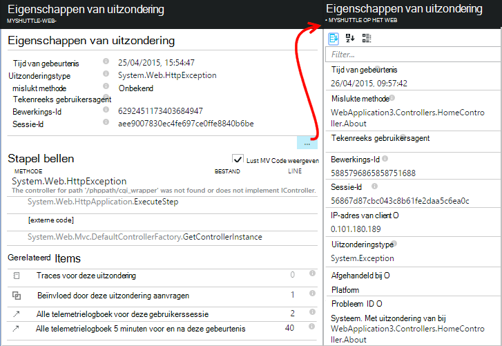
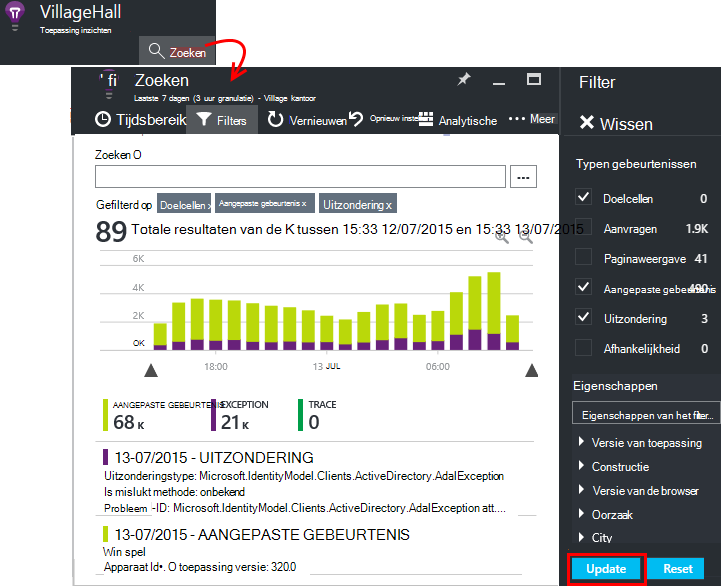
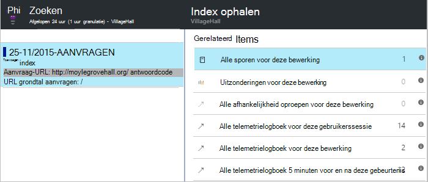

<properties 
    pageTitle="Een diagnose stellen bij fouten en uitzonderingen in ASP.NET-apps gebruiken met de toepassing inzichten" 
    description="Uitzonderingen van ASP.NET-apps samen met verzoek telemetrielogboek vastleggen." 
    services="application-insights" 
    documentationCenter=".net"
    authors="alancameronwills" 
    manager="douge"/>

<tags 
    ms.service="application-insights" 
    ms.workload="tbd" 
    ms.tgt_pltfrm="ibiza" 
    ms.devlang="na" 
    ms.topic="article" 
    ms.date="10/27/2016" 
    ms.author="awills"/>


# <a name="set-up-application-insights-diagnose-exceptions"></a>Toepassing inzichten instellen: diagnose stellen bij uitzonderingen

[AZURE.INCLUDE [app-insights-selector-get-started-dotnet](../../includes/app-insights-selector-get-started-dotnet.md)]


Door controleren of uw toepassing met [Visual Studio toepassing inzichten][start], u kunt mislukte aanvragen relateren met uitzonderingen en andere gebeurtenissen op de client en server, zodat u kunt snel een diagnose stellen bij de oorzaken.

Als u wilt controleren een ASP.NET-app, moet u [toepassing inzichten SDK toevoegen] [ greenbrown] naar uw toepassing, of [Statuscontrole op uw IIS-server installeren][redfield], of, als uw app een Azure-Web-App is, de [Toepassing inzichten extensie](app-insights-azure-web-apps.md)toevoegen.

## <a name="diagnosing-exceptions-using-visual-studio"></a>Gebruik van Visual Studio uitzonderingen diagnose

Open de app-oplossing in Visual Studio om u te helpen met foutopsporing.

De app, uitgevoerd op de server of op uw computer ontwikkeling met behulp van F5.

Open het venster toepassing inzichten zoeken in Visual Studio, en stel deze gebeurtenissen uit uw app wilt weergeven. Terwijl u bent foutopsporing, kunt u dit doen door te klikken op de knop toepassing inzichten.



Zoals u ziet dat u het rapport om weer te geven alleen uitzonderingen kunt filteren. 

*Geen uitzonderingen met? Zie [uitzonderingen vastleggen](#exceptions).*

Klik op een uitzonderingenrapport naar de tracering stapel weergeven.



Klik op de verwijzing naar een lijn in de stapel-spoor, om het gewenste bestand openen.  

## <a name="diagnosing-failures-using-the-azure-portal"></a>Oplossen van fouten met behulp van de Azure portal

Vanuit het overzicht van de toepassing inzichten van uw app de tegel fouten ziet u grafieken met uitzonderingen en mislukte HTTP-aanvragen, samen met een lijst van de aanvraag URL's die leiden de meest voorkomende fouten tot.



Klik op een van de typen mislukte aanvragen in de lijst om afzonderlijke vermeldingen van de fout. Daarvandaan, klikt u op door naar de uitzonderingen of doelcellen gegevens die zijn gekoppeld aan dit:




**U kunt ook** u kunt starten vanuit de lijst met uitzonderingen die u vindt verdere omlaag het blad fouten. Houd te klikken op totdat u uiteindelijk afzonderlijke uitzonderingen.




*Geen uitzonderingen met? Zie [uitzonderingen vastleggen](#exceptions).*

Hier kunt u kijkt u naar de stapel doelcellen en gedetailleerde eigenschappen van elke uitzondering en gerelateerde log doelcellen of andere gebeurtenissen vinden.




[Meer informatie over diagnostische zoeken][diagnostic].


## <a name="dependency-failures"></a>Afhankelijkheid fouten

Een *afhankelijkheid* is een service die uw toepassing u, meestal via een REST API of database-verbinding belt. [Toepassing inzichten statuscontrole] [ redfield] automatisch gecontroleerd allerlei soorten afhankelijkheid gesprek, het gespreksduur en slagen of mislukken meten. 

Als u gegevens afhankelijkheid, die u moet [installeren statuscontrole] [ redfield] op uw IIS-server, of als de app een Azure-Web-App is, gebruikt u de [Toepassing inzichten extensie](app-insights-azure-web-apps.md). 

Mislukte oproepen naar afhankelijkheden vindt u op het blad fouten en u kunt ook deze vinden onder Verwante Items in de gegevens voor de aanvraag en de details van uitzondering.

*Geen fouten afhankelijkheid? Dat is goed. Maar om te bevestigen dat u afhankelijkheid gegevens krijgt, opent u het blad prestaties en kijkt u naar de grafiek afhankelijkheid duur.*

 

## <a name="custom-tracing-and-log-data"></a>Aangepaste tracering en logboekgegevens

Als u diagnostische gegevens specifiek zijn voor uw app, kunt u de code voor het verzenden van uw eigen telemetriegegevens invoegen. Dit weergegeven in de diagnostische zoeken samen met de aanvraag, paginaweergave en andere gegevens automatisch verzameld. 

Hebt u verschillende opties:

* [TrackEvent()](app-insights-api-custom-events-metrics.md#track-event) wordt meestal gebruikt voor het gebruikspatronen monitoring, maar de gegevens die ook verzendt wordt weergegeven onder aangepast gebeurtenissen in diagnostische zoeken. Gebeurtenissen een naam, en kunnen uitvoeren tekenreekseigenschappen en numerieke waarop u [de diagnostische zoekopdrachten filteren kunt]aan de doelstellingen[diagnostic].
* [TrackTrace()](app-insights-api-custom-events-metrics.md#track-trace) kunt u meer gegevens zoals bericht verzenden.
* [TrackException()](#exceptions) verzendt stapel sporen. [Meer informatie over uitzonderingen](#exceptions).
* Als u al een kader logboekregistratie zoals Log4Net of NLog gebruikt, kunt u [deze logboeken vastleggen] [ netlogs] en ze in de diagnostische zoeken samen met de aanvraag en uitzondering gegevens zien.

Als u wilt zien deze gebeurtenissen, open [Zoeken][diagnostic], Filter openen en kies vervolgens aangepaste gebeurtenis, doelcellen of uitzondering.





> [AZURE.NOTE] Als uw app een groot aantal telemetrielogboek genereert, wordt het volume dat wordt verzonden naar de portal door te sturen van alleen een vertegenwoordiger fractie van gebeurtenissen automatisch in de module Geavanceerde steekproeven verkleinen. Gebeurtenissen die deel uitmaken van dezelfde bewerking worden ingeschakeld of uitgeschakeld als een groep, zodat u tussen gerelateerde gebeurtenissen navigeren kunt. [Meer informatie over steekproeven.](app-insights-sampling.md)

### <a name="how-to-see-request-post-data"></a>De weergave bepalen van de aanvraag POST-gegevens

Gegevens voor de aanvraag Stuur geen gegevens verzonden naar uw app aan een bericht-gesprek. U wilt dat deze gegevens gerapporteerd:

* [Installeer de SDK] [ greenbrown] in uw toepassingsproject.
* Code hebt ingevoegd in uw toepassing om te bellen [Microsoft.ApplicationInsights.TrackTrace()][api]. De POST-gegevens in de parameter bericht verzenden. Is er een beperking voor de toegestane grootte, dus u probeert moet te verzenden uitsluitend de essentiële gegevens.
* Wanneer u een mislukte aanvraag onderzoeken, zoek de bijbehorende traces.  




## <a name="exceptions"></a>Uitzonderingen en gerelateerde diagnostische gegevens vastleggen

Aanvankelijk weergegeven u niet in de portal de uitzonderingen die leiden fouten in uw app tot. Ziet u eventuele uitzonderingen browser (als u gebruikmaakt van de [JavaScript-SDK] [ client] in uw webpagina's). Maar de meeste serveruitzonderingen zijn onderschept door IIS en er aan het schrijven van een deel van de code kunt bekijken.

U kunt:

* **Meld u uitzonderingen expliciet** door in te voegen code in uitzonderingen verwerken om de uitzonderingen.
* **Uitzonderingen automatisch vastleggen** door het configureren van uw ASP.NET-framework. De benodigde toevoegingen zijn verschillend voor verschillende soorten framework.

## <a name="reporting-exceptions-explicitly"></a>Uitzonderingen expliciet rapportage

De eenvoudigste manier is om in te voegen een oproep naar TrackException() in een uitzonderingshandler.

JavaScript

    try 
    { ...
    }
    catch (ex)
    {
      appInsights.trackException(ex, "handler loc",
        {Game: currentGame.Name, 
         State: currentGame.State.ToString()});
    }

C#

    var telemetry = new TelemetryClient();
    ...
    try 
    { ...
    }
    catch (Exception ex)
    {
       // Set up some properties:
       var properties = new Dictionary <string, string> 
         {{"Game", currentGame.Name}};

       var measurements = new Dictionary <string, double>
         {{"Users", currentGame.Users.Count}};

       // Send the exception telemetry:
       telemetry.TrackException(ex, properties, measurements);
    }

VB

    Dim telemetry = New TelemetryClient
    ...
    Try
      ...
    Catch ex as Exception
      ' Set up some properties:
      Dim properties = New Dictionary (Of String, String)
      properties.Add("Game", currentGame.Name)

      Dim measurements = New Dictionary (Of String, Double)
      measurements.Add("Users", currentGame.Users.Count)
  
      ' Send the exception telemetry:
      telemetry.TrackException(ex, properties, measurements)
    End Try

De eigenschappen en afmetingen parameters zijn optioneel, maar zijn handig voor het [filteren en toe te voegen] [ diagnostic] extra informatie. Als u een app die verschillende spellen kan worden uitgevoerd, kan u bijvoorbeeld alle de uitzondering rapporten met betrekking tot een bepaald spel vinden. U kunt zoveel objecten als u elke woordenlijst wilt toevoegen.

## <a name="browser-exceptions"></a>Uitzonderingen in browser

De meeste browser uitzonderingen worden gemeld.

Als uw webpagina scriptbestanden van netwerken die inhoud leveren of andere domeinen bevat, zorgen dat uw script-code heeft het kenmerk ```crossorigin="anonymous"```, en dat de server [CORS kopteksten verzendt](http://enable-cors.org/). Hierdoor kunt u om een stapel doelcellen- en detailrijen voor onverwerkte JavaScript uitzonderingen van deze resources.

## <a name="web-forms"></a>Webformulieren

Voor webformulieren kunnen de HTTP-Module voor het verzamelen van de uitzonderingen wanneer er geen omleidingen geconfigureerd met CustomErrors zijn.

Maar als u actieve omleidingen, voegt u de volgende regels toe aan de functie Application_Error in Global.asax.cs. (Een Global.asax-bestand toevoegen als u er nog geen hebt).

*C#*

    void Application_Error(object sender, EventArgs e)
    {
      if (HttpContext.Current.IsCustomErrorEnabled && Server.GetLastError  () != null)
      {
         var ai = new TelemetryClient(); // or re-use an existing instance

         ai.TrackException(Server.GetLastError());
      }
    }


## <a name="mvc"></a>MVC

Als de configuratie [CustomErrors](https://msdn.microsoft.com/library/h0hfz6fc.aspx) is `Off`, uitzonderingen is beschikbaar voor de [Http-Module](https://msdn.microsoft.com/library/ms178468.aspx) voor het verzamelen van dan. Echter als dit is `RemoteOnly` (standaard), of `On`, de uitzondering is dan uitgeschakeld en niet beschikbaar voor de toepassing inzichten voor het automatisch verzamelen. U kunt die oplossen door de [System.Web.Mvc.HandleErrorAttribute class](http://msdn.microsoft.com/library/system.web.mvc.handleerrorattribute.aspx)overschrijven en de overschreven klasse toepassen, zoals wordt weergegeven voor de verschillende versies van MVC onder ([github bron](https://github.com/AppInsightsSamples/Mvc2UnhandledExceptions/blob/master/MVC2App/Controllers/AiHandleErrorAttribute.cs)):

    using System;
    using System.Web.Mvc;
    using Microsoft.ApplicationInsights;

    namespace MVC2App.Controllers
    {
      [AttributeUsage(AttributeTargets.Class | AttributeTargets.Method, Inherited = true, AllowMultiple = true)] 
      public class AiHandleErrorAttribute : HandleErrorAttribute
      {
        public override void OnException(ExceptionContext filterContext)
        {
            if (filterContext != null && filterContext.HttpContext != null && filterContext.Exception != null)
            {
                //If customError is Off, then AI HTTPModule will report the exception
                if (filterContext.HttpContext.IsCustomErrorEnabled)
                {   //or reuse instance (recommended!). see note above  
                    var ai = new TelemetryClient();
                    ai.TrackException(filterContext.Exception);
                } 
            }
            base.OnException(filterContext);
        }
      }
    }

#### <a name="mvc-2"></a>MVC 2

Het kenmerk HandleError vervangen door uw nieuwe kenmerk in uw domeincontrollers.

    namespace MVC2App.Controllers
    {
       [AiHandleError]
       public class HomeController : Controller
       {
    ...

[Voorbeeld](https://github.com/AppInsightsSamples/Mvc2UnhandledExceptions)

#### <a name="mvc-3"></a>MVC 3

Registreren `AiHandleErrorAttribute` als een globale filter in Global.asax.cs:

    public class MyMvcApplication : System.Web.HttpApplication
    {
      public static void RegisterGlobalFilters(GlobalFilterCollection filters)
      {
         filters.Add(new AiHandleErrorAttribute());
      }
     ...

[Voorbeeld](https://github.com/AppInsightsSamples/Mvc3UnhandledExceptionTelemetry)


#### <a name="mvc-4-mvc5"></a>MVC 4, MVC5

AiHandleErrorAttribute registreren als een globale filter in FilterConfig.cs:

    public class FilterConfig
    {
      public static void RegisterGlobalFilters(GlobalFilterCollection filters)
      {
        // Default replaced with the override to track unhandled exceptions
        filters.Add(new AiHandleErrorAttribute());
      }
    }

[Voorbeeld](https://github.com/AppInsightsSamples/Mvc5UnhandledExceptionTelemetry)

## <a name="web-api-1x"></a>Web API 1.x


Overschrijven System.Web.Http.Filters.ExceptionFilterAttribute:

    using System.Web.Http.Filters;
    using Microsoft.ApplicationInsights;

    namespace WebAPI.App_Start
    {
      public class AiExceptionFilterAttribute : ExceptionFilterAttribute
      {
        public override void OnException(HttpActionExecutedContext actionExecutedContext)
        {
            if (actionExecutedContext != null && actionExecutedContext.Exception != null)
            {  //or reuse instance (recommended!). see note above 
                var ai = new TelemetryClient();
                ai.TrackException(actionExecutedContext.Exception);    
            }
            base.OnException(actionExecutedContext);
        }
      }
    }

U kunt dit overschreven kenmerk specifieke controller toevoegen of toe te voegen aan de configuratie van de globale filter in de klas WebApiConfig: 

    using System.Web.Http;
    using WebApi1.x.App_Start;

    namespace WebApi1.x
    {
      public static class WebApiConfig
      {
        public static void Register(HttpConfiguration config)
        {
            config.Routes.MapHttpRoute(name: "DefaultApi", routeTemplate: "api/{controller}/{id}",
                defaults: new { id = RouteParameter.Optional });
            ...
            config.EnableSystemDiagnosticsTracing();

            // Capture exceptions for Application Insights:
            config.Filters.Add(new AiExceptionFilterAttribute());
        }
      }
    }

[Voorbeeld](https://github.com/AppInsightsSamples/WebApi_1.x_UnhandledExceptions)

Er zijn een aantal zaken die de uitzondering filters kunnen worden verwerkt. Bijvoorbeeld:

* Uitzonderingen van controller constructors. 
* Uitzonderingen van bericht handlers. 
* Uitzonderingen bij routering. 
* Uitzonderingen tijdens de reactie inhoud serialisatie. 

## <a name="web-api-2x"></a>Web API 2.x

Een implementatie van IExceptionLogger toevoegen:

    using System.Web.Http.ExceptionHandling;
    using Microsoft.ApplicationInsights;

    namespace ProductsAppPureWebAPI.App_Start
    {
      public class AiExceptionLogger : ExceptionLogger
      {
        public override void Log(ExceptionLoggerContext context)
        {
            if (context !=null && context.Exception != null)
            {//or reuse instance (recommended!). see note above 
                var ai = new TelemetryClient();
                ai.TrackException(context.Exception);
            }
            base.Log(context);
        }
      }
    }

Dit aan de services in WebApiConfig toevoegen:

    using System.Web.Http;
    using System.Web.Http.ExceptionHandling;
    using ProductsAppPureWebAPI.App_Start;

    namespace WebApi2WithMVC
    {
      public static class WebApiConfig
      {
        public static void Register(HttpConfiguration config)
        {
            // Web API configuration and services

            // Web API routes
            config.MapHttpAttributeRoutes();

            config.Routes.MapHttpRoute(
                name: "DefaultApi",
                routeTemplate: "api/{controller}/{id}",
                defaults: new { id = RouteParameter.Optional }
            );
            config.Services.Add(typeof(IExceptionLogger), new AiExceptionLogger()); 
        }
      }
  }

[Voorbeeld](https://github.com/AppInsightsSamples/WebApi_2.x_UnhandledExceptions)

Als alternatief, kunt u het volgende doen:

2. De enige ExceptionHandler vervangen door een aangepaste implementatie van IExceptionHandler. Dit heet alleen als het kader nog steeds kunnen kiezen welk antwoordbericht is wilt verzenden (niet wanneer de verbinding wordt verbroken bijvoorbeeld) 
3. Uitzondering Filters (zoals beschreven in de sectie op Web API 1.x domeincontrollers hierboven) - is niet wordt genoemd in alle gevallen.


## <a name="wcf"></a>WCF

Een klasse die breidt de mogelijkheden kenmerk en implementeert IErrorHandler en IServiceBehavior toevoegen.

    using System;
    using System.Collections.Generic;
    using System.Linq;
    using System.ServiceModel.Description;
    using System.ServiceModel.Dispatcher;
    using System.Web;
    using Microsoft.ApplicationInsights;

    namespace WcfService4.ErrorHandling
    {
      public class AiLogExceptionAttribute : Attribute, IErrorHandler, IServiceBehavior
      {
        public void AddBindingParameters(ServiceDescription serviceDescription,
            System.ServiceModel.ServiceHostBase serviceHostBase,
            System.Collections.ObjectModel.Collection<ServiceEndpoint> endpoints,
            System.ServiceModel.Channels.BindingParameterCollection bindingParameters)
        {
        }

        public void ApplyDispatchBehavior(ServiceDescription serviceDescription, 
            System.ServiceModel.ServiceHostBase serviceHostBase)
        {
            foreach (ChannelDispatcher disp in serviceHostBase.ChannelDispatchers)
            {
                disp.ErrorHandlers.Add(this);
            }
        }

        public void Validate(ServiceDescription serviceDescription, 
            System.ServiceModel.ServiceHostBase serviceHostBase)
        {
        }

        bool IErrorHandler.HandleError(Exception error)
        {//or reuse instance (recommended!). see note above 
            var ai = new TelemetryClient();

            ai.TrackException(error);
            return false;
        }

        void IErrorHandler.ProvideFault(Exception error, 
            System.ServiceModel.Channels.MessageVersion version, 
            ref System.ServiceModel.Channels.Message fault)
        {
        }
      }
    }

Het kenmerk toevoegen aan de service-implementaties:

    namespace WcfService4
    {
        [AiLogException]
        public class Service1 : IService1 
        { 
         ...

[Voorbeeld](https://github.com/AppInsightsSamples/WCFUnhandledExceptions)

## <a name="exception-performance-counters"></a>Uitzondering prestatie-items

Als u [geïnstalleerd statuscontrole hebt] [ redfield] op de server, kunt u een grafiek van het tarief weer dat uitzonderingen, gemeten door .NET krijgen. Dit geldt ook voor zowel verwerkte en onverwerkte .NET-uitzonderingen.

Open een blade metrisch Explorer, een nieuwe grafiek toevoegen en selecteer **uitzondering rente**, vermeld onder prestatie-items. 

.NET framework berekent het tarief weer dat door het aantal uitzonderingen tellen in een interval en te delen door de lengte van het interval. 

Houd er rekening mee dat deze van de 'Uitzonderingen' telling berekend door de portal-toepassing inzichten afwijken zullen te tellen TrackException rapporten. De intervallen worden verschillende en de SDK niet verzenden TrackException rapporten voor alle afgehandeld en niet-verwerkte uitzonderingen.

<!--Link references-->

[api]: app-insights-api-custom-events-metrics.md
[client]: app-insights-javascript.md
[diagnostic]: app-insights-diagnostic-search.md
[greenbrown]: app-insights-asp-net.md
[netlogs]: app-insights-asp-net-trace-logs.md
[redfield]: app-insights-monitor-performance-live-website-now.md
[start]: app-insights-overview.md

 
