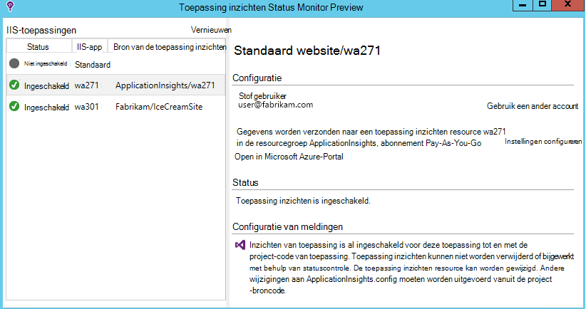
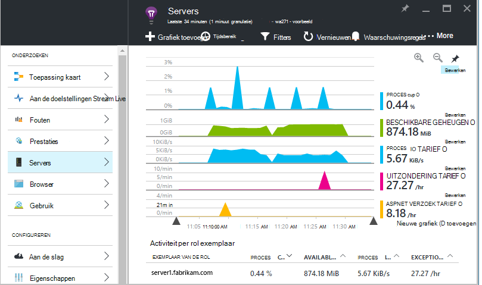
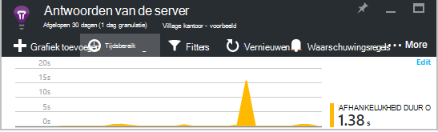
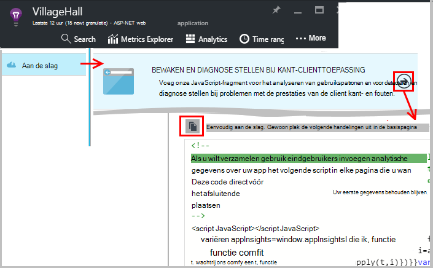
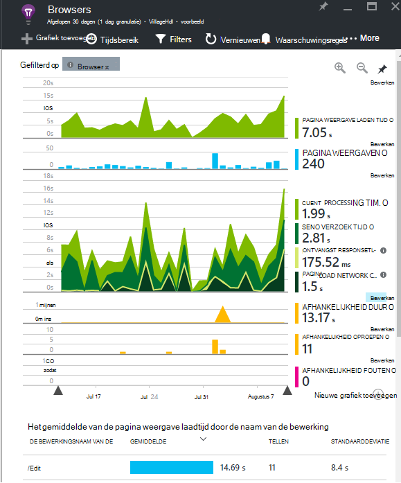
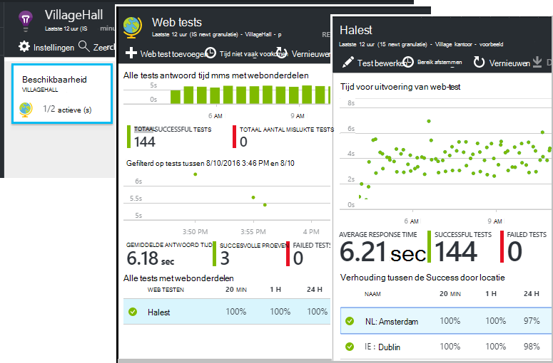
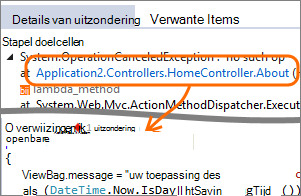
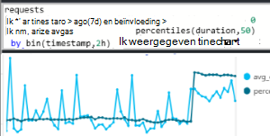
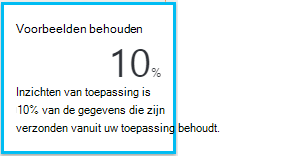

<properties 
    pageTitle="Kneepjes van toepassing inzichten | Microsoft Azure" 
    description="Na het aan de slag met de toepassing inzichten, als volgt een overzicht van de functies die u kunt verkennen." 
    services="application-insights" 
    documentationCenter=".net"
    authors="alancameronwills" 
    manager="douge"/>

<tags 
    ms.service="application-insights" 
    ms.workload="tbd" 
    ms.tgt_pltfrm="ibiza" 
    ms.devlang="na" 
    ms.topic="article" 
    ms.date="10/27/2016" 
    ms.author="awills"/>

# <a name="more-telemetry-from-application-insights"></a>Meer telemetrielogboek van toepassing inzichten

Nadat u [toegevoegd toepassing inzichten aan uw ASP.NET-code hebt](app-insights-asp-net.md), zijn er enkele dingen die u doen kunt om nog meer telemetrielogboek. 

## <a name="if-your-app-runs-on-your-iis-server-"></a>Als uw app op uw IIS-server wordt uitgevoerd...

Als uw app wordt gehost in IIS-servers in uw besturingselement, installeert u de statuscontrole van de toepassing inzichten op de servers. Als dit al geïnstalleerd, kunt u niet nodig hebt te doen.

1. Op elke IIS-webserver, meld u aan met beheerdersreferenties.
2. Download en voert u het [installatieprogramma van de statuscontrole](http://go.microsoft.com/fwlink/?LinkId=506648).
3. In de installatiewizard, moet u zich aanmelden bij Microsoft Azure.

U hoeft niet te doen, maar u kunt bevestigen dat de cmdlets voor controle is ingeschakeld voor uw app.



(U kunt ook gebruiken statuscontrole [controle gedurende runtime inschakelen](app-insights-monitor-performance-live-website-now.md), zelfs als u uw apps in Visual Studio niet instrument.)

### <a name="what-do-you-get"></a>Wat krijgt u?

Als statuscontrole is geïnstalleerd op de servers, krijgt u enkele extra telemetrielogboek:

* Afhankelijkheid telemetrielogboek (SQL-oproepen en andere oproepen die zijn aangebracht door uw app) voor .NET 4.5-apps. (Nieuwere versies .NET, statuscontrole is niet vereist voor afhankelijkheid telemetrielogboek.) 
* Uitzondering stapel sporen weergeven meer details.
* Van prestatiemeteritems. In de toepassing inzichten, wordt deze items weergegeven in het blad Servers. 



Om te zien meer of minder items, [de grafieken bewerken](app-insights-metrics-explorer.md). Als het prestatiemeteritem dat u wilt niet in de set beschikbaar, kunt u [toe te voegen aan de set die worden verzameld door de prestaties van item-module](app-insights-performance-counters.md).

## <a name="if-its-an-azure-web-app-"></a>Als dit een Azure web-app is...

Als uw app wordt uitgevoerd als een Azure WebApp, gaat u naar het Configuratiescherm van Azure voor de app of VM en het blad toepassing inzichten te openen. 

### <a name="what-do-you-get"></a>Wat krijgt u?

* Uitzondering stapel sporen weergeven meer details.
* Afhankelijkheid telemetrielogboek (SQL-oproepen en andere oproepen die zijn aangebracht door uw app) voor .NET 4.5-apps. (Nieuwere versies .NET, de extensie is niet vereist voor afhankelijkheid telemetrielogboek.) 



(U kunt ook deze methode gebruiken om te [controleren tijdens runtime inschakelen](app-insights-monitor-performance-live-website-now.md), zelfs als u de app in Visual Studio niet instrument.)

## <a name="client-side-monitoring"></a>Aan de clientzijde bewaken

U kunt de SDK die wordt verzonden telemetriegegevens van de server (back-end) van uw toepassing hebt geïnstalleerd. U kunt nu toevoegen aan de clientzijde bewaken. Hiermee kunt u gegevens op gebruikers, sessies, paginaweergaven, en eventuele uitzonderingen of loopt die in de browser optreden. U kunt ook wel uw eigen code om bij te houden van de manier waarop gebruikers werken met uw app, rechts naar beneden af op het uitgebreide niveau van muisklikken en toetsaanslagen te schrijven.

De toepassing inzichten JavaScript-fragment toevoegen aan elke webpagina telemetrielogboek ophalen van clientbrowsers.

1. Open de toepassing inzichten resource voor de app in Azure.
2. Open aan de slag, clientzijde beeldscherm, en kopieer het fragment.
3. Plak deze zodat het wordt weergegeven in de kop van elke pagina met webonderdelen - meestal dat kunt u dit doen door deze plakken in de pagina modelindeling.



Zoals u ziet dat de code bevat de instrumentation-toets die de bron van de toepassing aangeeft.

### <a name="what-do-you-get"></a>Wat krijgt u?

* U kunt JavaScript als u wilt verzenden, [aangepaste telemetrielogboek van uw webpagina's](app-insights-api-custom-events-metrics.md), bijvoorbeeld om bij te houden op een knop schrijven.
* In [analyses](app-insights-analytics.md), gegevens in `pageViews` en AJAX-gegevens in `dependencies`. 
* [Prestaties van de client en gegevens over zoekgebruik](app-insights-javascript.md) in het blad Browsers.




[Meer informatie over webpagina's bijhouden.](app-insights-web-track-usage.md)


## <a name="track-application-version"></a>Versie van de toepassing bijhouden

Zorg ervoor dat `buildinfo.config` wordt gegenereerd door het proces MSBuild. In het bestand .csproj toevoegen:  

```XML

    <PropertyGroup>
      <GenerateBuildInfoConfigFile>true</GenerateBuildInfoConfigFile>    <IncludeServerNameInBuildInfo>true</IncludeServerNameInBuildInfo>
    </PropertyGroup> 
```

Wanneer deze de opbouwen info bevat, de toepassing inzichten webmodule **versie van toepassing** als een eigenschap automatisch toegevoegd aan alle items van telemetrielogboek. Waarmee u filteren op versie bij het uitvoeren van [Diagnostische zoekopdrachten](app-insights-diagnostic-search.md) of bij het [verkennen van de doelstellingen](app-insights-metrics-explorer.md). 

Echter, zoals u ziet dat het versienummer opbouwen wordt gegenereerd alleen door MS Build, niet door de ontwikkelaar opbouwen in Visual Studio.


## <a name="availability-web-tests"></a>Beschikbaarheid van web tests

Stuur uw web-app HTTP-aanvragen met regelmatige tussenpozen van de wereld. We een waarschuwing weergegeven als het antwoord traag of onbetrouwbare is.

In de toepassing inzichten bron voor de app, klikt u op de tegel beschikbaarheid als u wilt toevoegen, bewerken en weergeven van web tests.

U kunt meerdere tests uitvoeren op meerdere locaties toevoegen.



[Meer informatie](app-insights-monitor-web-app-availability.md)

## <a name="custom-telemetry-and-logging"></a>Aangepaste telemetrielogboek en gegevens vastleggen

De toepassing inzichten-pakketten die u hebt toegevoegd aan uw code bieden een API die u vanuit uw toepassing bellen kunt.

* [Uw eigen gebeurtenissen en statistieken genereren](app-insights-api-custom-events-metrics.md), bijvoorbeeld tot aantal zakelijke activiteiten of monitor prestaties.
* [Opname log sporen](app-insights-asp-net-trace-logs.md) van Log4Net, NLog of System.Diagnostics.Trace.
* [Filter, wijzigen, of uitbreiding van](app-insights-api-filtering-sampling.md) de standaard telemetrielogboek dat wordt verzonden vanuit uw app door te schrijven Telemetrielogboek-Processors. 


## <a name="powerful-analysis-and-presentation"></a>Krachtige analyses en presentatie

Er zijn tal van manieren om uw gegevens verkennen. Als u onlangs met toepassing inzichten beginnen hebt, raadpleegt u deze artikelen:

||
|---|---
|[**Diagnostische gegevens zoeken bijvoorbeeld gegevens**](app-insights-visual-studio.md)<br/>Gebeurtenissen zoals aanvragen, uitzonderingen afhankelijkheid oproepen, log sporen en paginaweergaven zoeken en filteren. Visual Studio, gaat u naar de code uit stapel sporen.|
|[**Aan de doelstellingen Explorer voor geaggregeerde gegevens**](app-insights-metrics-explorer.md)<br/>Verkennen, filteren en segmenteren geaggregeerde gegevens zoals tarieven van aanvragen, fouten en uitzonderingen; antwoord tijden, laadtijden van pagina.|
|[**Dashboards**](app-insights-dashboards.md#dashboards)<br/>Gegevens uit meerdere bronnen samenvoegen en delen met anderen. Ideaal voor samengestelde toepassingen en voor doorlopende weergeven in de ruimte team.  |
|[**Aan de doelstellingen Stream Live**](app-insights-metrics-explorer.md#live-metrics-stream)<br/>Wanneer u een nieuwe build implementeert, bekijk dan deze indicatoren dicht bij de realtime prestaties om ervoor te zorgen dat alles werkt zoals verwacht.|
|[**Analytics**](app-insights-analytics.md)<br/>Beantwoord lastige vragen over de prestaties en het gebruik van uw app met behulp van deze krachtige querytaal.|
|[**Handmatige en automatische waarschuwingen**](app-insights-alerts.md)<br/>Automatische waarschuwingen u aanpassen van uw app normale patronen van telemetrielogboek en de inwerkingtreding wanneer er iets buiten de gebruikelijke patroon. U kunt ook waarschuwingen instellen op bepaalde niveaus van aangepaste of aan de doelstellingen.|

## <a name="data-management"></a>Gegevensbeheer

|||
|---|---|
|[**Continue exporteren**](app-insights-export-telemetry.md)<br/>Kopieer alle uw telemetrielogboek op te slaan, zodat u deze, kunt u uw eigen manier analyseren kunt.|
|**Toegang tot gegevens API**<br/>Binnenkort beschikbaar.|
|[**Steekproeven**](app-insights-sampling.md)<br/>Hiermee reduceert u de snelheid en kunt u binnen de limiet van uw prijzen laag blijven.|