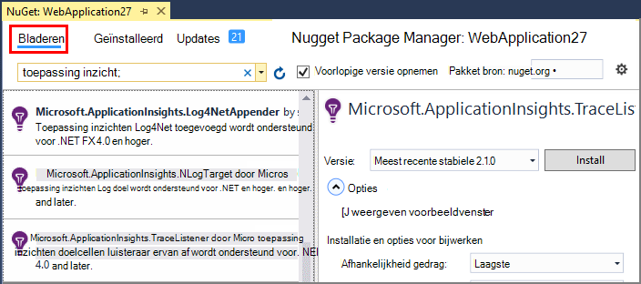
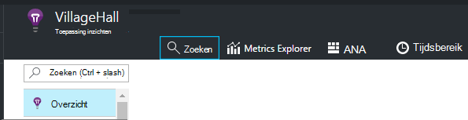
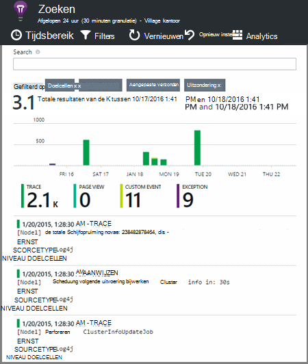

<properties 
    pageTitle="Logboeken voor het traceren van .NET in toepassing inzichten te verkennen" 
    description="Zoeken in een logboek gegenereerd met doelcellen, NLog of Log4Net." 
    services="application-insights" 
    documentationCenter=".net"
    authors="alancameronwills" 
    manager="douge"/>

<tags 
    ms.service="application-insights" 
    ms.workload="tbd" 
    ms.tgt_pltfrm="ibiza" 
    ms.devlang="na" 
    ms.topic="article" 
    ms.date="07/21/2016" 
    ms.author="awills"/>
 
# <a name="explore-net-trace-logs-in-application-insights"></a>Logboeken voor het traceren van .NET in toepassing inzichten te verkennen  

Als u NLog, log4Net of System.Diagnostics.Trace voor diagnostische traceren in uw ASP.NET-toepassing, kunt u uw logboeken verzonden inzicht krijgen in [Visual Studio toepassing]hebben[start], waar u kunt verkennen en deze doorzoeken aan. De logboeken samengevoegd met de andere telemetrielogboek die afkomstig zijn uit uw toepassing, zodat u kunt de traces die is gekoppeld aan het onderhoud van elke gebruikersaanvraag identificeren en ze met andere gebeurtenissen en uitzondering-rapporten relateren.


> [AZURE.NOTE] Hebt u de module van de opname log nodig? Dit is een handige adapter voor 3e derden vastleggen, maar als u geen al NLog, log4Net of System.Diagnostics.Trace gebruikt, kunt bellen alleen van [Toepassing inzichten TrackTrace()](app-insights-api-custom-events-metrics.md#track-trace) rechtstreeks.


## <a name="install-logging-on-your-app"></a>Installeer de app aanmelden

Installeer de door u gekozen logboekregistratie framework in uw project. Dit moet resulteren in een vermelding in app.config of web.config.

Als u System.Diagnostics.Trace gebruikt, moet u een fragment toevoegen aan web.config:

```XML

    <configuration>
     <system.diagnostics>
       <trace autoflush="false" indentsize="4">
         <listeners>
           <add name="myListener" 
             type="System.Diagnostics.TextWriterTraceListener" 
             initializeData="TextWriterOutput.log" />
           <remove name="Default" />
         </listeners>
       </trace>
     </system.diagnostics>
   </configuration>
```

## <a name="configure-application-insights-to-collect-logs"></a>Toepassing inzichten te logboeken verzamelen configureren

**[Toepassing inzichten toevoegen aan uw project](app-insights-asp-net.md)** als u dat nog niet hebt gedaan. Hier ziet u een optie voor het verzamelen van het logboek opnemen.

Of **Toepassing inzichten configureren** via het contextmenu van uw project in Solution Explorer. Selecteer de optie aan **configureren doelcellen verzameling**.

*Toepassing inzichten menu of log verzamelen de optie geen?* Probeer op te [lossen](#troubleshooting).


## <a name="manual-installation"></a>Handmatige installatie

Gebruik deze methode als uw projecttype wordt niet ondersteund door het installatieprogramma van toepassing inzichten (bijvoorbeeld een Windows bureaublad project). 

1. Als u van plan bent om log4Net of NLog te gebruiken, kunt u dit in uw project installeren. 
2. In Solution Explorer met de rechtermuisknop op het project en kies **NuGet-pakketten beheren**.
3. Zoeken naar "Toepassing inzichten"

    

4. Selecteer het juiste pakket - een van:
  + Microsoft.ApplicationInsights.TraceListener (om vast te leggen System.Diagnostics.Trace oproepen)
  + Microsoft.ApplicationInsights.NLogTarget
  + Microsoft.ApplicationInsights.Log4NetAppender

Het pakket NuGet de benodigde stroombaan is geïnstalleerd en wijzigt ook web.config of app.config.

## <a name="insert-diagnostic-log-calls"></a>Diagnostische logboeken oproepen invoegen

Als u System.Diagnostics.Trace gebruikt, zou een normale oproep:

    System.Diagnostics.Trace.TraceWarning("Slow response - database01");

Als u liever log4net of NLog:

    logger.Warn("Slow response - database01");


## <a name="using-the-trace-api-directly"></a>Rechtstreeks de tracering API gebruiken

U kunt de toepassing inzichten tracering API rechtstreeks bellen. De logboekregistratie adapters deze API gebruiken. 

Bijvoorbeeld:

    var telemetry = new Microsoft.ApplicationInsights.TelemetryClient();
    telemetry.TrackTrace("Slow response - database01");

Een voordeel van TrackTrace is dat u relatief lange gegevens in het bericht kunt plaatsen. U kunt bijvoorbeeld er POST-gegevens coderen. 

Bovendien kunt u een prioriteitsniveau toevoegen aan uw bericht. En, zoals andere telemetrielogboek, kunt u eigenschapwaarden die u gebruiken kunt om te filteren of in de zoekresultaten voor verschillende groepen sporen toevoegen. Bijvoorbeeld:


    var telemetry = new Microsoft.ApplicationInsights.TelemetryClient();
    telemetry.TrackTrace("Slow database response",
                   SeverityLevel.Warning,
                   new Dictionary<string,string> { {"database", db.ID} });

Hiermee kunt u, zou in [Zoeken][diagnostic], uitfilteren eenvoudig alle berichten van een bepaalde prioriteitsniveau met betrekking tot een bepaalde database.

## <a name="explore-your-logs"></a>De logboeken verkennen

Uw app, hetzij in de foutopsporingsmodus voor uitvoeren of het live dashboard implementeren.

In van uw app overzicht blade in [de portal toepassing inzichten][portal], kies [Zoeken][diagnostic].





U kunt doen, bijvoorbeeld:

* Filteren op log sporen of op items met specifieke eigenschappen
* Een specifiek item in detail controleren.
* Zoeken naar andere telemetrielogboek met betrekking tot één gebruikersverzoek (dat wil zeggen, met de dezelfde bewerkingsnummer) 
* De configuratie van deze pagina opslaan als favoriet

> [AZURE.NOTE] **Een steekproef.** Als uw toepassing een groot aantal gegevens stuurt en u de toepassing inzichten SDK voor ASP.NET versie 2.0.0-beta3 of hoger gebruikt, kan de functie Geavanceerde steekproeven werken en slechts een percentage van uw telemetrielogboek verzenden. [Meer informatie over steekproeven.](app-insights-sampling.md)

## <a name="next-steps"></a>Volgende stappen

[Een diagnose stellen bij fouten en uitzonderingen in ASP.NET][exceptions]

[Meer informatie over het zoeken][diagnostic].


## <a name="troubleshooting"></a>Problemen oplossen

### <a name="how-do-i-do-this-for-java"></a>Hoe moet ik dit doen voor Java?

Gebruik de [Java log adapters](app-insights-java-trace-logs.md).

### <a name="theres-no-application-insights-option-on-the-project-context-menu"></a>Er is geen optie inzichten die toepassing in het contextmenu van project

* Controleer toepassing inzichten hulpmiddelen op deze computer ontwikkeling is geïnstalleerd. In het menu Extra van Visual Studio, uitbreidingen en Updates, zoekt u inzicht krijgen in hulpmiddelen voor toepassingen. Als deze niet in het tabblad geïnstalleerde, open het tabblad Online en installeer het.
* Dit kan een type project dat niet wordt ondersteund door de toepassing inzichten hulpmiddelen voor zijn. [Handmatige installatie](#manual-installation)gebruiken.

### <a name="no-log-adapter-option-in-the-configuration-tool"></a>De optie voor geen log-adapter via het configuratiehulpprogramma

* U moet het kader logboekregistratie eerst installeren.
* Als u System.Diagnostics.Trace gebruikt, controleert u of u [hebt geconfigureerd in `web.config` ](https://msdn.microsoft.com/library/system.diagnostics.eventlogtracelistener.aspx).
* Hebt u de nieuwste versie van toepassing inzichten's hebt ontvangen? In het menu voor Visual Studio- **hulpmiddelen** , kies **Extensions en Updates**en open het tabblad **Updates** . Als de toepassing inzichten hulpmiddelen die map staat, klikt u op om bij te werken.


### <a name="emptykey"></a>Ik krijg een foutmelding 'Instrumentation toets kan niet leeg zijn'

Lijkt erop dat u het pakket van logboekregistratie adapter Nuget zonder installatie van toepassing inzichten hebt geïnstalleerd.

Klik in Solution Explorer met de rechtermuisknop op `ApplicationInsights.config` en kies **Update toepassing inzichten**. Krijgt u een dialoogvenster met een uitnodiging te melden bij een Azure en maak een bron-toepassing inzichten, of een bestaande opnieuw gebruiken. Die dit moet doen.

### <a name="i-can-see-traces-in-diagnostic-search-but-not-the-other-events"></a>Ik zie sporen in diagnostische zoeken, maar niet de andere gebeurtenissen

Soms kan dit een tijdje voor alle gebeurtenissen en aanvragen voor via de pijplijn duren.

### <a name="limits"></a>Hoeveel gegevens blijven behouden?

Maximaal 500 gebeurtenissen per seconde van elke toepassing. Gebeurtenissen worden gedurende zeven dagen bewaard.

### <a name="im-not-seeing-some-of-the-log-entries-that-i-expect"></a>Ik zie geen enkele van de logboekvermeldingen die ik verwacht

Als uw toepassing een groot aantal gegevens stuurt en u de toepassing inzichten SDK voor ASP.NET versie 2.0.0-beta3 of hoger gebruikt, kan de functie Geavanceerde steekproeven werken en slechts een percentage van uw telemetrielogboek verzenden. [Meer informatie over steekproeven.](app-insights-sampling.md)

## <a name="add"></a>Volgende stappen

* [Beschikbaarheid en serverreactie tests instellen][availability]
* [Problemen oplossen][qna]


<!--Link references-->

[availability]: app-insights-monitor-web-app-availability.md
[diagnostic]: app-insights-diagnostic-search.md
[exceptions]: app-insights-asp-net-exceptions.md
[portal]: https://portal.azure.com/
[qna]: app-insights-troubleshoot-faq.md
[start]: app-insights-overview.md

 
