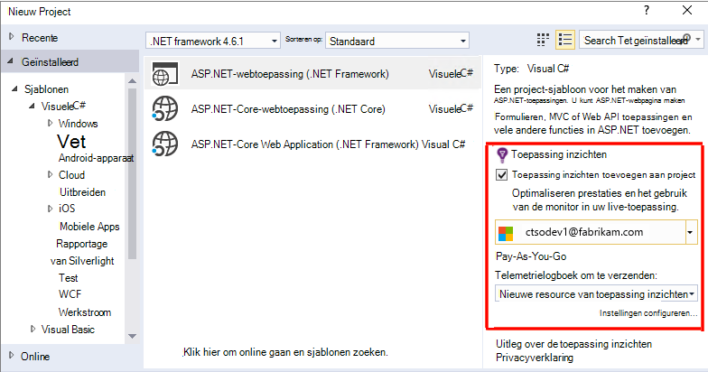
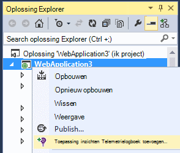
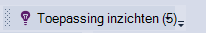
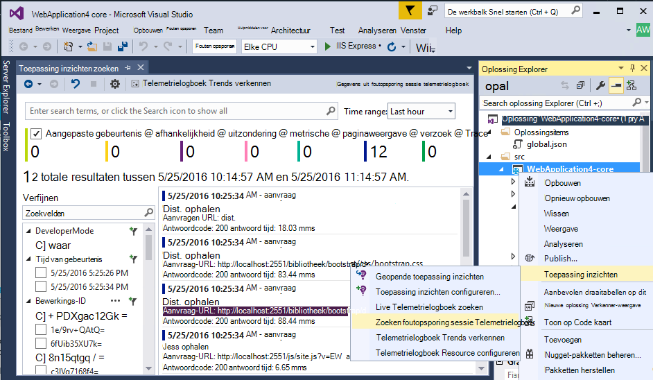
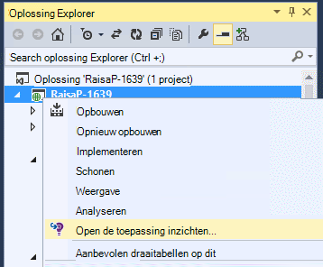
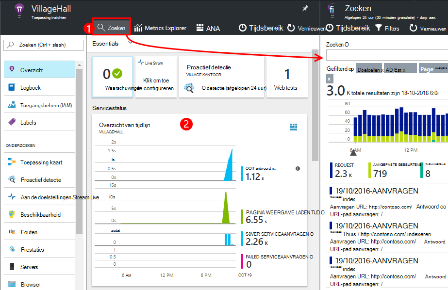
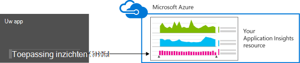
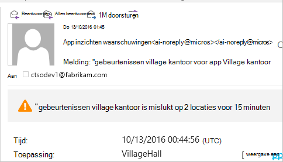
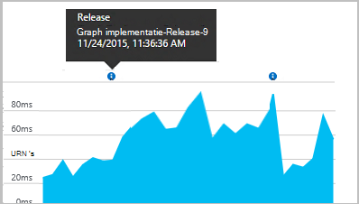
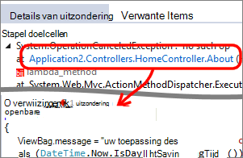

<properties 
    pageTitle="App webanalyse instellen voor ASP.NET met toepassing inzichten | Microsoft Azure" 
    description="Prestaties, beschikbaarheid en gebruiksanalyses voor uw website ASP.NET configureren die worden gehost on-premises implementatie of in Azure wordt aangegeven." 
    services="application-insights" 
    documentationCenter=".net"
    authors="NumberByColors" 
    manager="douge"/>

<tags 
    ms.service="application-insights" 
    ms.workload="tbd" 
    ms.tgt_pltfrm="ibiza" 
    ms.devlang="na" 
    ms.topic="get-started-article" 
    ms.date="10/13/2016" 
    ms.author="awills"/>


# <a name="set-up-application-insights-for-aspnet"></a>Toepassing inzichten instellen voor ASP.NET

[Visual Studio toepassing inzichten](app-insights-overview.md) bewaakt uw live-toepassing kunt [opsporen en onderzoeken prestatieproblemen en uitzonderingen,](app-insights-detect-triage-diagnose.md)en [Ontdek hoe uw app wordt gebruikt](app-insights-overview-usage.md).  Dit werkt voor apps die worden gehost op uw eigen on-premises implementatie IIS-servers of in de cloud VMs, evenals Azure-Webapps.


## <a name="before-you-start"></a>Voordat u begint

U nodig hebt:

* Visual Studio 2013 update 3 of hoger. Later is het beter.
* Een abonnement op [Microsoft Azure](http://azure.com). Als uw team of uw organisatie een Azure-abonnement heeft, kunt de eigenaar u aan toevoegen, met uw [Microsoft-account](http://live.com). 

Er zijn alternatieve artikelen om te bekijken als u geïnteresseerd bent in:

* [Het opzetten van een web-app tijdens runtime](app-insights-monitor-performance-live-website-now.md)
* [Azure cloudservices](app-insights-cloudservices.md)

## <a name="ide"></a>1. toepassing inzichten SDK toevoegen


### <a name="if-its-a-new-project"></a>Als u een nieuw project...

Controleer of dat toepassing inzichten is ingeschakeld wanneer u een nieuw project in Visual Studio maakt. 





### <a name="-or-if-its-an-existing-project"></a>... of, als dit een bestaand project is

Met de rechtermuisknop op het project in Solution Explorer en kies **Toevoegen toepassing inzichten Telemetrielogboek** of **Toepassing inzichten configureren**.



* ASP.NET-Core project? - [Volg deze instructies om op te lossen een paar regels met code](https://github.com/Microsoft/ApplicationInsights-aspnetcore/wiki/Getting-Started#add-application-insights-instrumentation-code-to-startupcs). 


## <a name="run"></a>2. uw app uitvoeren

Uw toepassing met F5 uitvoeren en probeer het zelf: verschillende pagina's om te genereren sommige telemetrielogboek openen.

In Visual Studio ziet u een telling van de gebeurtenissen die zijn geregistreerd. 



## <a name="3-see-your-telemetry"></a>3. Zie uw telemetrielogboek...

### <a name="-in-visual-studio"></a>... in Visual Studio

Open het venster toepassing inzichten in Visual Studio: klik op de knop toepassing inzichten, of met de rechtermuisknop op uw project in Solution Explorer:



Deze weergave worden gegenereerd in de serverzijde van uw app telemetrielogboek. Experimenteren met de filters en klik op een willekeurige gebeurtenis om meer details zichtbaar.

[Meer informatie over de hulpmiddelen voor de toepassing inzichten in Visual Studio](app-insights-visual-studio.md).

<a name="monitor"></a> 
### <a name="-in-the-portal"></a>Klik in de portal...

Tenzij u ervoor hebt gekozen *SDK installeren alleen,* kunt u ook het telemetrielogboek bij de portal van de web-toepassing inzichten te zien. 

De portal heeft meer grafieken, analytische hulpmiddelen en dashboards dan Visual Studio. 


Open de toepassing inzichten bron in de [portal van Azure](https://portal.azure.com/).



De portal wordt geopend in een weergave van het telemetrielogboek uit uw app:

* De eerste telemetrielogboek wordt weergegeven in [Live stroom van de doelstellingen](app-insights-metrics-explorer.md#live-metrics-stream).
* Afzonderlijke gebeurtenissen worden weergegeven in **zoekresultaten** (1). Gegevens duurt een paar minuten moet worden weergegeven. Klik op een willekeurige gebeurtenis om te zien van de eigenschappen. 
* Geaggregeerde aan de doelstellingen worden weergegeven in de grafieken (2). Dit kan een paar minuten duren voor gegevens moeten worden hier weergegeven. Klik op een grafiek om te openen van een blade met meer details.

[Meer informatie over het gebruik van de toepassing inzicht krijgen in de portal van Azure](app-insights-dashboards.md).

## <a name="4-publish-your-app"></a>4. uw app publiceren

Uw app publiceren naar uw IIS-server of Azure. Bekijk [Live aan de doelstellingen gegevensstroom](app-insights-metrics-explorer.md#live-metrics-stream) om ervoor te zorgen dat alles soepel wordt uitgevoerd.

Hier ziet u uw telemetrielogboek samenstellen omhoog in de toepassing inzichten-portal, waar u kunt controleren van de doelstellingen, zoek uw telemetrielogboek en [dashboards](app-insights-dashboards.md)instellen. U kunt ook de krachtige [analyses query taal](app-insights-analytics.md) gebruiken te gebruik en de prestaties analyseren of zoek naar specifieke gebeurtenissen. 

U kunt ook blijven uw telemetrielogboek in [Visual Studio](app-insights-visual-studio.md) met hulpprogramma's zoals diagnostische zoeken en [Trends](app-insights-visual-studio-trends.md)analyseren.

> [AZURE.NOTE] Als uw app voldoende telemetrielogboek stuurt benadering deze [limieten beperken](app-insights-pricing.md#limits-summary), schakelt u automatische [steekproeven](app-insights-sampling.md) op. Steekproeven Hiermee reduceert u de hoeveelheid telemetrielogboek verzonden vanaf de app: behoud gecorreleerde gegevens voor diagnose.


##<a name="land"></a>Wat 'Toevoegen toepassing inzichten'?

Toepassing inzichten verzendt telemetrielogboek uit uw app bij de toepassing inzichten-portal (die wordt gehost in Microsoft Azure):



De opdracht ook drie dingen:

1. Het pakket toepassing inzichten Web SDK NuGet toevoegen aan uw project. Als u wilt zien in Visual Studio, met de rechtermuisknop op het project en kies NuGet-pakketten beheren.
2. Maak een resource van toepassing inzichten in [de portal van Azure](https://portal.azure.com/). Dit is waar ziet u uw gegevens. Hiermee haalt u de *toets heeft instrumentation,* waarmee de resource.
3. Hiermee voegt u de sleutel instrumentation in `ApplicationInsights.config`, zodat de SDK telemetrielogboek naar de portal verzenden kunt.

Als u wilt, kunt u deze stappen handmatig doen voor [ASP.NET-4](app-insights-windows-services.md) of [ASP.NET Core](https://github.com/Microsoft/ApplicationInsights-aspnetcore/wiki/Getting-Started).

### <a name="to-upgrade-to-future-sdk-versions"></a>Upgrade uitvoeren naar toekomstige SDK versies

Als u wilt upgraden naar een [nieuwe versie van de SDK](https://github.com/Microsoft/ApplicationInsights-dotnet-server/releases), NuGet pakket manager opnieuw openen en te filteren op geïnstalleerd pakketten. Selecteer Microsoft.ApplicationInsights.Web en kies van Upgrade.

Als u eventuele aanpassingen in ApplicationInsights.config hebt aangebracht, sla een kopie van deze voordat u upgrade en daarna de wijzigingen in de nieuwe versie samenvoegen.

## <a name="add-more-telemetry"></a>Meer telemetrielogboek toevoegen

### <a name="web-pages-and-single-page-apps"></a>Webpagina's en één pagina apps

1. [De JavaScript-fragment toevoegen](app-insights-javascript.md) aan uw webpagina's aan het licht van de Browser en het gebruik bladen met gegevens over paginaweergaven, worden geladen, browser uitzonderingen, AJAX gesprek prestaties aantallen gebruikers en -sessie.
2. [Aangepaste gebeurtenissen code](app-insights-api-custom-events-metrics.md) om te tellen, tijd of gebruikersacties maateenheid.

### <a name="dependencies-exceptions-and-performance-counters"></a>Afhankelijkheden, beperkingen en prestatiemeteritems

[Statuscontrole installeren](app-insights-monitor-performance-live-website-now.md) op elk van de servers om extra telemetrielogboek over uw app. Dit is wat u krijgt:

* [Prestatiemeteritems](app-insights-performance-counters.md) - 
CPU, geheugen, schijf en andere items met betrekking tot uw app. 
* [Uitzonderingen](app-insights-asp-net-exceptions.md) - meer gedetailleerde telemetrielogboek voor sommige uitzonderingen.
* [Afhankelijkheden](app-insights-asp-net-dependencies.md) - oproepen naar REST API of SQL-services. Achterhalen of traag antwoorden van externe onderdelen prestatieproblemen in uw app veroorzaken. (Als uw app op .NET 4.6 wordt uitgevoerd, u hoeft niet statuscontrole om deze telemetrielogboek.)

### <a name="diagnostic-code"></a>Diagnostische code

Hebt u een probleem? Als u code invoegen in uw app wilt om op te sporen deze, hebt u verschillende opties:

* [Opname log sporen](app-insights-asp-net-trace-logs.md): als u al gebruikt Log4N, NLog of System.Diagnostics.Trace om doelcellen gebeurtenissen, en vervolgens de uitvoer kan worden verzonden naar de toepassing inzichten, zodat u deze met aanvragen kan relateren, zoeken door de werkmap en analyseren. 
* [Aangepaste gebeurtenissen en statistieken](app-insights-api-custom-events-metrics.md): gebruik TrackEvent() en TrackMetric() in server- of webpagina code.
* [Tag telemetrielogboek met aanvullende eigenschappen](app-insights-api-filtering-sampling.md#add-properties)

Gebruik de [zoekfunctie](app-insights-diagnostic-search.md) om te zoeken en relateren specifieke gebeurtenissen en [analyses](app-insights-analytics.md) uitvoeren van krachtige query's.

## <a name="alerts"></a>Waarschuwingen

De eerste informatie als uw app problemen heeft zijn. (Niet wacht totdat uw gebruikers u vertellen!) 

* [Maken web tests](app-insights-monitor-web-app-availability.md) om ervoor te zorgen dat uw site is zichtbaar is op het web.
* [Proactief diagnostische gegevens](app-insights-proactive-diagnostics.md) automatisch uitgevoerd (als uw app heeft een bepaalde minimale hoeveelheid verkeer). U hoeft niet te iets doen om ze ingesteld. Ze zien u als uw app een ongebruikelijk aantal mislukte aanvragen bevat.
* [Metrische waarschuwingen instellen](app-insights-alerts.md) om u te waarschuwen als een meting een drempelwaarde kruist. U kunt ze instellen van een aangepaste maatstelsel die code u in uw app.

Standaard worden meldingen verzonden naar de eigenaar van de Azure abonnement. 



## <a name="version-and-release-tracking"></a>Versie en het bijbehorende bijhouden

### <a name="track-application-version"></a>Versie van de toepassing bijhouden

Zorg ervoor dat `buildinfo.config` wordt gegenereerd door het proces MSBuild. In het bestand .csproj toevoegen:  

```XML

    <PropertyGroup>
      <GenerateBuildInfoConfigFile>true</GenerateBuildInfoConfigFile>    <IncludeServerNameInBuildInfo>true</IncludeServerNameInBuildInfo>
    </PropertyGroup> 
```

Wanneer deze de opbouwen info bevat, de toepassing inzichten webmodule **versie van toepassing** als een eigenschap automatisch toegevoegd aan alle items van telemetrielogboek. Waarmee u filteren op versie bij het uitvoeren van [Diagnostische zoekopdrachten](app-insights-diagnostic-search.md) of bij het [verkennen van de doelstellingen](app-insights-metrics-explorer.md). 

Echter, zoals u ziet dat het versienummer opbouwen wordt gegenereerd alleen door MS Build, niet door de ontwikkelaar opbouwen in Visual Studio.

### <a name="release-annotations"></a>Release aantekeningen

Als u Visual Studio Team Services gebruikt, kunt u [een markering voor aantekeningen ophalen](app-insights-annotations.md) toegevoegd aan uw grafieken wanneer u een nieuwe versie.




## <a name="next-steps"></a>Volgende stappen

| | 
|---|---
|**[Werken met de toepassing inzichten in Visual Studio](app-insights-visual-studio.md)**<br/>Voor foutopsporing in met telemetrielogboek, diagnostische gegevens, zoeken, detailanalyse naar code.|
|**[Werken met de toepassing inzichten-portal](app-insights-dashboards.md)**<br/>Dashboards, krachtige hulpprogramma's voor diagnose en analytische, waarschuwingen, een kaart live afhankelijkheid aan uw toepassing en telemetrielogboek exporteren. |
|**[Meer gegevens toevoegen](app-insights-asp-net-more.md)**<br/>Gebruik, beschikbaarheid, afhankelijkheden, uitzonderingen bewaken. Integreer traces van logboekregistratie kaders. Schrijf aangepaste telemetrielogboek. | 


