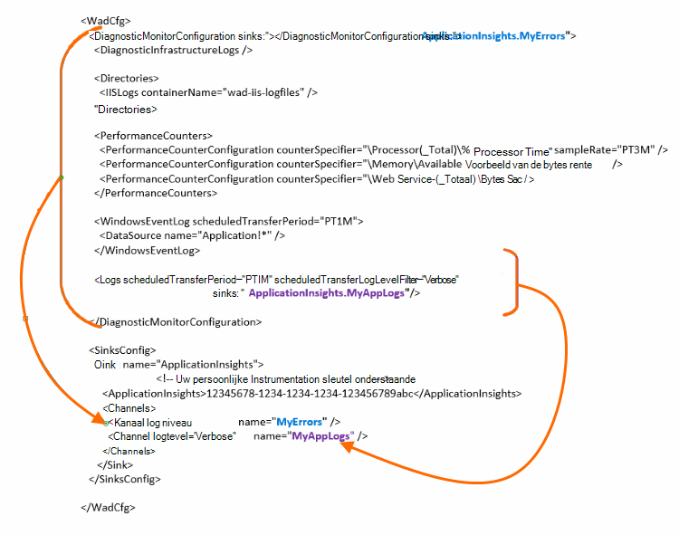

<properties
    pageTitle="Azure diagnostische logboeken verzenden inzicht krijgen in toepassing"
    description="De details van de Cloudservices van Azure diagnostische logboeken die zijn verzonden naar de portal-toepassing inzichten configureren."
    services="application-insights"
    documentationCenter=".net"
    authors="sbtron"
    manager="douge"/>

<tags
    ms.service="application-insights"
    ms.workload="tbd"
    ms.tgt_pltfrm="ibiza"
    ms.devlang="na"
    ms.topic="article"
    ms.date="11/17/2015"
    ms.author="awills"/>

# <a name="configure-azure-diagnostic-logging-to-application-insights"></a>Azure diagnostische gegevens vastleggen inzicht krijgen in toepassing configureren

Bij het instellen van een Cloud Services-project of een virtuele Machine in Microsoft Azure [Azure een diagnostische logboeken kunt genereren](../vs-azure-tools-diagnostics-for-cloud-services-and-virtual-machines.md). U kunt dit op verzonden naar toepassing inzichten, zodat u deze samen met diagnostic en het gebruik telemetrielogboek verzonden analyseren kunt vanuit binnen de app door de toepassing inzichten SDK hebben. Het logboek met Azure bevat gebeurtenissen in het beheer van de app zoals starten, stoppen, loopt, evenals prestatie-items. Het logboek bevat ook gesprekken in de app aan System.Diagnostics.Trace.

In dit artikel worden de configuratie van de diagnostische gegevens vastleggen in detail.

U moet Azure SDK 2,8 in Visual Studio geïnstalleerd.

## <a name="get-an-application-insights-resource"></a>Een resource van toepassing inzichten ophalen

Voor de beste ervaring, [de toepassing inzichten SDK aan elke functie van de Cloud Services-app toevoegen](app-insights-cloudservices.md)of [aan welke app u wilt uitvoeren in uw VM](app-insights-overview.md). U kunt de diagnostische gegevens die moeten worden geanalyseerd verzend en dezelfde toepassing inzichten resource weergegeven.

U kunt ook als u niet wilt gebruiken de SDK - kunt bijvoorbeeld als de app nog is live - u alleen [een nieuwe resource van toepassing inzichten maakt](app-insights-create-new-resource.md) in de portal van Azure. Kies **Diagnostisch hulpprogramma Azure** als het toepassingstype.


## <a name="send-azure-diagnostics-to-application-insights"></a>Azure diagnostisch hulpprogramma verzenden naar toepassing inzichten

Als u uw app-project bijwerken, klikt u vervolgens in Visual Studio Selecteer elke rol, kiest u de eigenschappen en selecteer **verzenden diagnostisch hulpprogramma toepassing inzicht krijgen**in het tabblad configuratie.

Als al uw app live is, gebruikt u Visual Studio Server Explorer of Cloudservices explorer om de eigenschappen van de app te openen. Selecteer **verzenden diagnostisch hulpprogramma inzicht krijgen in toepassing**.

In elk geval wordt u gevraagd voor de details van de toepassing inzichten resource die u hebt gemaakt.

[Meer informatie over het instellen van toepassing inzichten voor een Cloud Services-app](app-insights-cloudservices.md).

## <a name="configuring-the-azure-diagnostics-adapter"></a>De diagnostische gegevens van Azure-adapter configureren

Alleen-lezen op als u wilt selecteren de onderdelen van het logboek die u inzicht krijgen in toepassing verzendt. Standaard alles is verstuurd, waaronder: Microsoft Azure gebeurtenissen. van prestatiemeteritems; oproepen vanuit de app naar System.Diagnostics.Trace aanwijzen.

Azure diagnostische gegevens worden opgeslagen gegevens aan Azure Storage tabellen. U kunt echter ook alle recht streepje of een deel van de gegevens inzicht krijgen in toepassing door te configureren 'sinks' en 'kanalen' in de configuratie bij gebruik van Azure diagnostisch hulpprogramma extensie 1,5 of hoger.

### <a name="configure-application-insights-as-a-sink"></a>Toepassing inzichten configureren als een Sink

Wanneer u de roleigenschappen van de gebruikt om in te stellen 'Gegevens verzenden naar toepassing inzichten', de SDK Azure (2,8 of later) voegt een `<SinksConfig>` element naar de openbare [configuratiebestand Azure diagnostische gegevens](https://msdn.microsoft.com/library/azure/dn782207.aspx) van de rol.

`<SinksConfig>`Hiermee definieert u de extra sink waar de gegevens van Azure diagnostische gegevens kunnen worden verzonden.  Een voorbeeld `SinksConfig` er als volgt uitziet:

```xml

    <SinksConfig>
     <Sink name="ApplicationInsights">
      <ApplicationInsights>{Insert InstrumentationKey}</ApplicationInsights>
      <Channels>
        <Channel logLevel="Error" name="MyTopDiagData"  />
        <Channel logLevel="Verbose" name="MyLogData"  />
      </Channels>
     </Sink>
    </SinksConfig>

```

De `ApplicationInsights` element Hiermee geeft u op de toets instrumentation waarmee de toepassing inzichten resource waarnaar de gegevens van Azure diagnostische gegevens worden verzonden. Wanneer u de resource selecteert, wordt deze automatisch ingevuld op basis van de `APPINSIGHTS_INSTRUMENTATIONKEY` service te configureren. (Als u deze handmatig instellen wilt, krijgt u de sleutel in de Essentials vervolgkeuzelijst van de resource.)

`Channels`de gegevens die worden verzonden naar de sink definiëren. Het kanaal fungeert als een filter. De `loglevel` kenmerk kunt u het niveau voor logboekregistratie wie het kanaal stuurt opgeven. De beschikbare waarden zijn: `{Verbose, Information, Warning, Error, Critical}`.

### <a name="send-data-to-the-sink"></a>Gegevens verzenden naar de sink

Verzenden gegevens inzicht krijgen in de toepassing vangen door het kenmerk sinks onder het knooppunt DiagnosticMonitorConfiguration toe te voegen. Het element sinks toevoegen aan elk knooppunt geeft aan dat u gegevens die worden verzameld uit die en eventuele knooppunten eronder worden verzonden naar de opgegeven sink.

De standaard gemaakt door de SDK Azure is bijvoorbeeld de Azure diagnostische gegevens te verzenden:

```xml

    <DiagnosticMonitorConfiguration overallQuotaInMB="4096" sinks="ApplicationInsights">
```

Maar als u alleen foutenlogboeken verzenden wilt, een in aanmerking voor de naam van de sink met de naam van een kanaal:

```xml

    <DiagnosticMonitorConfiguration overallQuotaInMB="4096" sinks="ApplicationInsights.MyTopDiagdata">
```

Zoals u ziet dat we de naam van de Sink die we gedefinieerd gebruiken, samen met de naam van een kanaal die we hierboven hebt gedefinieerd.

Als u alleen wilt uitgebreide toepassingslogboeken verzenden inzicht krijgen in toepassing en voegt u het kenmerk sinks naar toe de `Logs` knooppunt.

```xml

    <Logs scheduledTransferPeriod="PT1M" scheduledTransferLogLevelFilter="Verbose" sinks="ApplicationInsights.MyLogData"/>
```

U kunt ook meerdere gootstenen opnemen in de configuratie op verschillende niveaus in de hiërarchie. In dat geval wordt de opgegeven op het hoogste niveau van de hiërarchie sink fungeert als een globale-instelling en een opgegeven bij de besluiten afzonderlijke element element zoals een overschrijven die algemene instelling.

Hier volgt een volledig voorbeeld van de openbare configuratiebestand die hiermee alle fouten inzicht krijgen in toepassing worden (opgegeven bij het `DiagnosticMonitorConfiguration` knooppunt) en daarnaast uitgebreide niveau logboeken voor de logboeken aan de toepassing (opgegeven bij het `Logs` knooppunt).

```xml

    <WadCfg>
     <DiagnosticMonitorConfiguration overallQuotaInMB="4096"
       sinks="ApplicationInsights.MyTopDiagData"> <!-- All info below sent to this channel -->
      <DiagnosticInfrastructureLogs />
      <PerformanceCounters>
        <PerformanceCounterConfiguration counterSpecifier="\Processor(_Total)\% Processor Time" sampleRate="PT3M" sinks="ApplicationInsights.MyLogData/>
        <PerformanceCounterConfiguration counterSpecifier="\Memory\Available MBytes" sampleRate="PT3M" />
        <PerformanceCounterConfiguration counterSpecifier="\Web Service(_Total)\Bytes Total/Sec" sampleRate="PT3M" />
      </PerformanceCounters>
      <WindowsEventLog scheduledTransferPeriod="PT1M">
        <DataSource name="Application!*" />
      </WindowsEventLog>
      <Logs scheduledTransferPeriod="PT1M" scheduledTransferLogLevelFilter="Verbose"
            sinks="ApplicationInsights.MyLogData"/>
       <!-- This specific info sent to this channel -->
     </DiagnosticMonitorConfiguration>

     <SinksConfig>
      <Sink name="ApplicationInsights">
        <ApplicationInsights>{Insert InstrumentationKey}</ApplicationInsights>
        <Channels>
          <Channel logLevel="Error" name="MyTopDiagData"  />
          <Channel logLevel="Verbose" name="MyLogData"  />
        </Channels>
      </Sink>
     </SinksConfig>
    </WadCfg>
```



Er zijn enkele beperkingen waarmee u rekening moet houden met deze functionaliteit:

* Kanalen zijn alleen bedoeld voor gebruik met Logboektype en niet de prestatie-items. Als u een kanaal met een prestatiemeteritem element opgeven, wordt deze genegeerd.
* Het niveau voor logboekregistratie voor een kanaal niet langer zijn dan het niveau voor logboekregistratie voor wat door Azure diagnostische gegevens worden verzameld. Bijvoorbeeld: u kunt niet toepassing Log fouten in het element logboeken verzamelen en willen verzenden uitgebreid logboeken aan de toepassing inzicht synchroniseren. Het kenmerk scheduledTransferLogLevelFilter moet altijd gelijk verzamelen of meer logboeken dan de logboeken u probeert te verzenden naar een sink.
* U kunt een blob-gegevens verzameld door de extensie Azure diagnostisch hulpprogramma verzenden naar toepassing inzichten. Bijvoorbeeld opgegeven onder het knooppunt mappen. Voor vastlopen wordt de werkelijke crashdump nog steeds worden verzonden naar blob storage en alleen een melding dat de crashdump is gegenereerd inzicht krijgen in toepassing wordt verzonden.

## <a name="related-topics"></a>Verwante onderwerpen

* [Azure Cloudservices met toepassing inzichten controleren](app-insights-cloudservices.md)
* [PowerShell gebruiken voor Azure diagnostisch hulpprogramma verzenden naar toepassing inzichten](app-insights-powershell-azure-diagnostics.md)
* [Azure diagnostisch hulpprogramma configuratiebestand](https://msdn.microsoft.com/library/azure/dn782207.aspx)
