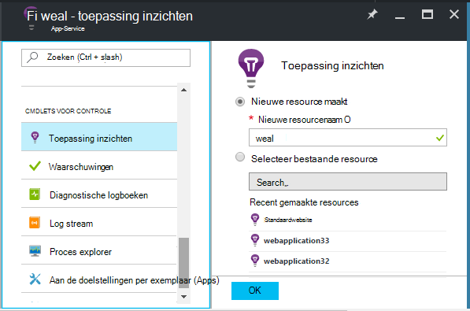
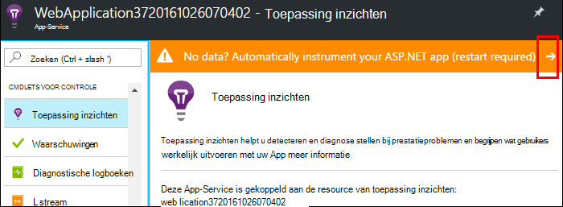
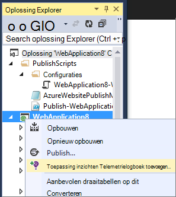
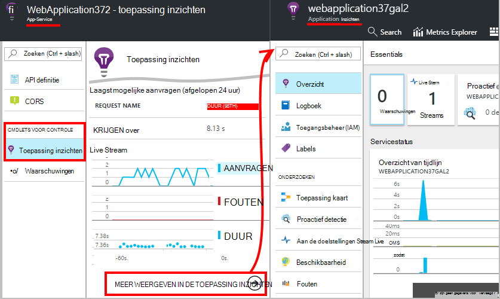
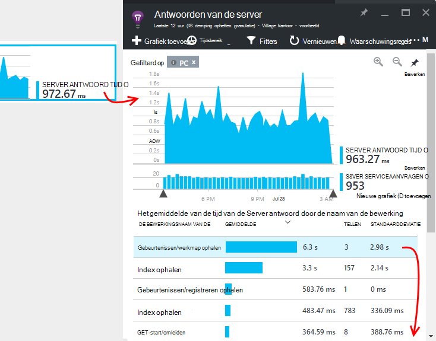
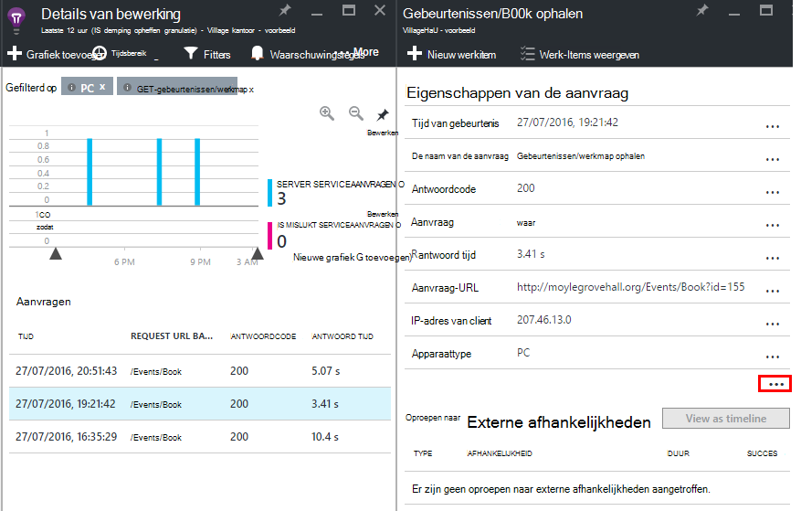

<properties
    pageTitle="Azure web app prestaties controleren | Microsoft Azure"
    description="Toepassingsprestaties monitoring voor Azure Webapps. Diagram laden en reactie tijd, objectafhankelijkheidsinformatie en waarschuwingen instellen op de prestaties."
    services="application-insights"
    documentationCenter=".net"
    authors="alancameronwills"
    manager="douge"/>

<tags
    ms.service="azure-portal"
    ms.workload="na"
    ms.tgt_pltfrm="na"
    ms.devlang="na"
    ms.topic="article"
    ms.date="10/24/2016"
    ms.author="awills"/>

# Azure web app prestaties controleren

Klik in de [Portal van Azure](https://portal.azure.com) kunt u instellen toepassing prestatiecontroles voor uw [Azure-WebApps](../app-service-web/app-service-web-overview.md). [Visual Studio toepassing inzichten](app-insights-overview.md) instruments uw app om te verzamelen over de activiteiten verzenden naar de service-toepassing inzichten, waar ze worden opgeslagen en geanalyseerd. Er, kunnen metrische grafieken en hulpmiddelen voor zoeken worden gebruikt om te helpen vaststellen van problemen, de prestaties verbeteren en gebruik kunt beoordelen.

## Runtime of tijd maken

U kunt configureren door het opzetten van de app op twee manieren controleren:

* **Runtimefout** - kunt u een controle extensie wanneer uw web-app al live prestaties. Het is niet nodig opnieuw opbouwen of uw app opnieuw te installeren. U krijgt een standaardset met pakketten die antwoord tijden, success tarieven, uitzonderingen, afhankelijkheden, enzovoort controleren. 
 
* **Tijd gemaakt** - kunt u een pakket installeren in uw app in de ontwikkelingsfase bevindt. Deze optie is flexibeler. Naast de dezelfde standaard-pakketten, kunt u de code het telemetrielogboek aanpassen of uw eigen telemetrielogboek verzenden schrijven. U kunt zich aanmelden specifieke activiteiten of record gebeurtenissen op basis van de semantiek van uw app-domein. 

## Tijd instrumentation uitvoeren met de toepassing inzichten

Als u al een WebApp in Azure wordt aangegeven uitvoert, al krijgt u enkele monitoring: aanvraag en fout tarieven. Toepassing inzichten om meer, zoals antwoord tijden toevoegen en oproepen naar afhankelijkheden monitoring, Slimme detectie en de krachtige analyses query taal. 

1. **Selecteer toepassing inzichten** in het deelvenster Azure beheer voor uw web-app.

    

 * Kies naar een nieuwe resource maakt, tenzij u al een toepassing inzichten resource instellen voor deze app via een andere weg.

2. **Instrument uw web-app** nadat inzichten van toepassing is geïnstalleerd. 

    

3. **Monitor uw app**.  [Expore de gegevens](#explore-the-data).

U kunt later bouwen en implementeren van de app met inzichten van toepassing als u wilt.

*Hoe ik toepassing inzichten te verwijderen, of gaat u naar verzenden naar een andere resource?*

* In Azure wordt aangegeven, opent u het blad web app-besturingselement en klik onder hulpmiddelen voor het ontwikkelen, openen **extensies**. Verwijder de toepassing inzichten extensie. Klik onder controle, kies toepassing inzichten en maken of selecteren de gewenste bron.

## De app met toepassing inzichten maken

Toepassing inzichten kunnen meer gedetailleerde telemetrielogboek worden verstrekt door een SDK in uw app installeren. U kunt met name doelcellen Logboeken, [aangepaste telemetrielogboek schrijven](../application-insights/app-insights-api-custom-events-metrics.md), verzamelen en krijg meer gedetailleerde uitzondering rapporten.

1. **In Visual Studio** (update 2013 2 of hoger), de toepassing inzichten SDK toevoegen aan uw project.

    

    Als u wordt gevraagd aan te melden, gebruikt u de referenties voor uw Azure-account.

    De bewerking heeft twee effecten:

 1. Hiermee maakt u een resource van toepassing inzichten in Azure wordt aangegeven, waar telemetrielogboek is opgeslagen, geanalyseerd en weergegeven.
 2. Het pakket toepassing inzichten NuGet aan uw code wordt toegevoegd en geconfigureerd voor het telemetrielogboek verzenden naar de Azure resource.

2. **Test de telemetrielogboek** door de app uit te voeren op de computer ontwikkeling (F5).

3. **De app publiceren** naar Azure op de gebruikelijke manier. 

*Hoe schakel ik tussen om te verzenden naar een andere toepassing inzichten resource?*

* Met de rechtermuisknop op het project in Visual Studio, kies **toepassing inzichten > configureren** en kies de gewenste bron. Krijgt u de optie voor het maken van een nieuwe resource. Bouw die tabellen opnieuw en implementeer deze opnieuw.

## De gegevens verkennen

1. Op het blad toepassing inzichten van uw web-app het Configuratiescherm, ziet u Live aan de doelstellingen, waarin wordt getoond vergaderverzoeken en fouten binnen een tweede of twee deze zich voordoet. Het is bijzonder nuttig zijn weergeven wanneer u opnieuw bent met het publiceren van uw app - kunt u problemen ondervindt direct zien.

2. Klik tot en met de volledige toepassing inzichten resource.

    
    

    U kunt ook gaan er rechtstreeks vanaf Azure resource navigatie.

2. Klik op tot en met een grafiek om meer details:

    

    U kunt [aanpassen aan de doelstellingen bladen](../application-insights/app-insights-metrics-explorer.md).

3. Klik op tot en met verder naar Zie afzonderlijke gebeurtenissen en hun eigenschappen:

    

    U ziet het '...' koppeling om alle eigenschappen te openen.

    U kunt [zoekopdrachten aanpassen](../application-insights/app-insights-diagnostic-search.md).

Gebruik de [Analytics query taal](../application-insights/app-insights-analytics-tour.md)voor krachtiger zoekacties via uw telemetrielogboek.

## Volgende stappen

* [Diagnostisch hulpprogramma Azure inschakelen](app-insights-azure-diagnostics.md) inzicht krijgen in toepassing worden verzonden.
* [De doelstellingen van de servicestatus service monitor](../monitoring-and-diagnostics/insights-how-to-customize-monitoring.md) om ervoor te zorgen dat uw service is alleen beschikbaar en heeft gereageerd.
* Cross een drempelwaarde voor [meldingen ontvangen](../monitoring-and-diagnostics/insights-receive-alert-notifications.md) wanneer operationele gebeurtenissen plaatsvinden of aan de doelstellingen.
* Gebruik [Toepassing inzichten voor JavaScript-apps en webpagina's](app-insights-web-track-usage.md) client telemetrielogboek vanuit de browsers die naar een webpagina te gaan.
* De [beschikbaarheid van web tests instellen](app-insights-monitor-web-app-availability.md) om te worden gewaarschuwd als uw site is niet beschikbaar.
