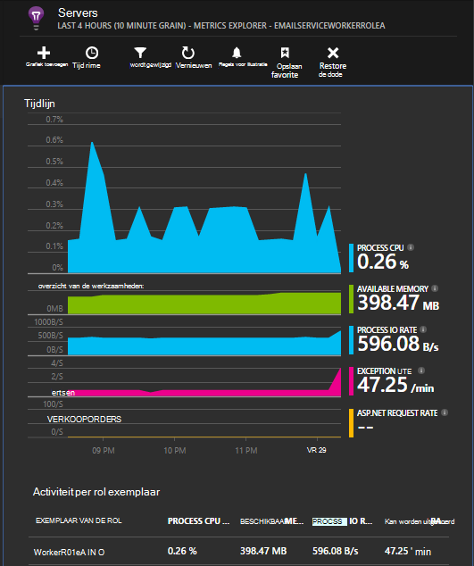

<properties
   pageTitle="Toepassing inzichten voor Cloudservices van Azure"
   description="Bewaak uw web en werknemer rollen effectief met toepassing inzichten"
   services="application-insights"
   documentationCenter=""
   authors="soubhagyadash"
   manager="douge"
   editor="alancameronwills"/>

<tags
   ms.service="application-insights"
   ms.devlang="na"
   ms.tgt_pltfrm="ibiza"
   ms.topic="article"
   ms.workload="tbd"
   ms.date="03/02/2016"
   ms.author="sdash"/>

# <a name="application-insights-for-azure-cloud-services"></a>Toepassing inzichten voor Cloudservices van Azure


*Inzichten van toepassing is in de proefversie van*

[Microsoft Azure Cloud service apps](https://azure.microsoft.com/services/cloud-services/) kan worden gecontroleerd door [Visual Studio toepassing inzichten] [ start] voor beschikbaarheid, prestaties, fouten en gebruik. Met het soort feedback dat u over de prestaties en de effectiviteit van uw app in de natuur krijgen, kunt u beslissen de richting van het ontwerp dat in elke ontwikkelingscyclus.


U hebt een abonnement op [Microsoft Azure](http://azure.com)nodig. Meld u aan met een Microsoft-account, die u misschien voor Windows, XBox Live of andere Microsoft-cloudservices. 


#### <a name="sample-application-instrumented-with-application-insights"></a>Voorbeeld-toepassing die zijn geïmplementeerd met toepassing inzichten

Bekijk deze [steekproef-toepassing](https://github.com/Microsoft/ApplicationInsights-Home/tree/master/Samples/AzureEmailService) waarin toepassing inzichten wordt toegevoegd aan een cloudservice met twee werknemer rollen gehost in Azure wordt aangegeven. 

Het volgende wordt uitgelegd hoe u uw eigen cloud service project aan te passen op dezelfde manier.

## <a name="create-an-application-insights-resource-for-each-role"></a>Een resource van toepassing inzichten voor elke rol maken

Een toepassing inzichten resource is waarop uw telemetriegegevens worden geanalyseerd en weergegeven.  

1.  Klik in de [portal van Azure][portal], een nieuwe resource van toepassing inzichten maakt. Kies ASP.NET-app voor toepassingstype. 

    

2.  Een kopie van de sleutel Instrumentation duren. U moet dit kort voor het configureren van de SDK.

    


Gewoonlijk is het [raadzaam een afzonderlijke bron voor de gegevens van elke functie web- en werknemer maken](app-insights-separate-resources.md). 

Als alternatief, u kunt gegevens uit alle rollen naar slechts één resource stuurt, maar stelt u een [standaardeigenschap] [ apidefaults] zodat u kunt filteren en groeperen van de resultaten van elke rol.

## <a name="sdk"></a>Een installatiefout met de SDK in elk project


1. Bewerk in Visual Studio, de NuGet-pakketten van uw project cloud-app.

    


2. Voor web rollen, moet u de [Toepassing inzichten voor Web](http://www.nuget.org/packages/Microsoft.ApplicationInsights.Web) NuGet-pakket toevoegen. Deze versie van de SDK bevat modules die servercontext zoals functiegegevens toevoegen. Voor de werknemer rollen, gebruikt u de [Toepassing inzichten voor Windows-Servers](https://www.nuget.org/packages/Microsoft.ApplicationInsights.WindowsServer/).

    


3. Configureer de SDK om gegevens te verzenden aan iedere resource van toepassing inzichten.

    De sleutel instrumentation instellen als een configuratie-instelling in het bestand `ServiceConfiguration.Cloud.cscfg`. ([Voorbeeld](https://github.com/Microsoft/ApplicationInsights-Home/blob/master/Samples/AzureEmailService/AzureEmailService/ServiceConfiguration.Cloud.cscfg)).
 
    ```XML
     <Role name="WorkerRoleA"> 
      <Setting name="APPINSIGHTS_INSTRUMENTATIONKEY" value="YOUR IKEY" /> 
     </Role>
    ```
 
    In een functie geschikt opstarten door de instrumentation-sleutel uit de configuratie-instelling te instellen:

    ```C#
     TelemetryConfiguration.Active.InstrumentationKey = RoleEnvironment.GetConfigurationSettingValue("APPINSIGHTS_INSTRUMENTATIONKEY");
    ```

    Opmerking, dezelfde naam `APPINSIGHTS_INSTRUMENTATIONKEY` van de configuratie instelling worden gebruikt door hulpprogramma's voor diagnose Azure rapportage. 


    Deze stap herhalen voor elk rol in uw toepassing. Zie de voorbeelden:
 
 * [Webrol](https://github.com/Microsoft/ApplicationInsights-Home/blob/master/Samples/AzureEmailService/MvcWebRole/Global.asax.cs#L27)
 * [Werknemer rol](https://github.com/Microsoft/ApplicationInsights-Home/blob/master/Samples/AzureEmailService/WorkerRoleA/WorkerRoleA.cs#L232)
 * [Voor webpagina 's](https://github.com/Microsoft/ApplicationInsights-Home/blob/master/Samples/AzureEmailService/MvcWebRole/Views/Shared/_Layout.cshtml#L13)   

4. Stel het ApplicationInsights.config-bestand moet altijd worden gekopieerd naar de uitvoermap. 

    (In het ziet u berichten waarin u wordt gevraagd naar de toets instrumentation er plaatsen. Voor cloud-toepassingen is het echter beter om dit uit het bestand .cscfg instellen. Dit zorgt ervoor dat de rol juist wordt geïdentificeerd in de portal.)


#### <a name="run-and-publish-the-app"></a>Uitvoert en het publiceren van de app

Uw app uitvoeren en meld u aan bij Azure. Open de toepassing inzichten bronnen die u hebt gemaakt en u afzonderlijke gegevenspunten weergegeven in [zoekresultaten](app-insights-diagnostic-search.md)te zien krijgt en gegevens in [Metrisch Explorer](app-insights-metrics-explorer.md)samengevoegd. 

Voeg meer telemetrielogboek - raadpleegt u de secties hierna - en vervolgens publiceren uw app als u live diagnostic en het gebruik van feedback. 


#### <a name="no-data"></a>Er zijn geen gegevens?

* Open de [zoekopdracht] [ diagnostic] tegel om afzonderlijke gebeurtenissen weer te geven.
* Gebruikt u de toepassing, verschillende pagina's te openen zodat sommige telemetrielogboek wordt gegenereerd.
* Wacht een paar seconden en klikt u op vernieuwen.
* Zie [problemen met de][qna].


## <a name="more-telemetry"></a>Meer telemetrielogboek

De secties hierna weergeven om aanvullende telemetrielogboek van verschillende aspecten van de toepassing.


## <a name="track-requests-from-worker-roles"></a>Bijhouden aanmeldingsaanvragen van werknemer rollen

In de web-rollen verzamelen de module aanvragen automatisch van gegevens over HTTP-aanvragen. Zie de [steekproef MVCWebRole](https://github.com/Microsoft/ApplicationInsights-Home/tree/master/Samples/AzureEmailService/MvcWebRole) voor voorbeelden van hoe u het standaardgedrag van de siteverzameling kunt negeren. 

U kunt de prestaties van oproepen naar werknemer rollen vastleggen door ze op dezelfde manier als HTTP-aanvragen bijhouden. Het verzoek telemetrielogboek type metingen in toepassing inzichten, een maateenheid benoemde server kant werk dat kan worden timed en kunt onafhankelijk slagen of mislukken. Terwijl de HTTP-aanvragen worden automatisch opgenomen door de SDK, kunt u uw eigen code om bij te houden aanvragen aan werknemer rollen kunt invoegen.

Zie de twee steekproeven werknemer rollen geïmplementeerd op rapport aanvragen: [WorkerRoleA](https://github.com/Microsoft/ApplicationInsights-Home/tree/master/Samples/AzureEmailService/WorkerRoleA) en [WorkerRoleB](https://github.com/Microsoft/ApplicationInsights-Home/tree/master/Samples/AzureEmailService/WorkerRoleB)

## <a name="azure-diagnostics"></a>Azure diagnostische gegevens

[Diagnostisch hulpprogramma Azure](../vs-azure-tools-diagnostics-for-cloud-services-and-virtual-machines.md) -gegevens bevat rol management gebeurtenissen, items en toepassingslogboeken aan de. U kunt deze verzonden inzicht krijgen in toepassing hebben, zodat u ze samen met de rest van uw telemetrielogboek zien kunt, wordt een diagnose stellen bij problemen eenvoudiger.

Azure diagnostische gegevens zijn met name handig als een rol onverwacht of kan niet worden gestart.

1. Met de rechtermuisknop op de rol (niet de project!) om de eigenschappen te openen en selecteer **Inschakelen diagnostische hulpprogramma's**, **hulpprogramma's voor diagnose inzicht krijgen in toepassing verzenden**.

    

    **Of als de app al gepubliceerde en wordt uitgevoerd is**, open Server Explorer of wolk Verkenner met de rechtermuisknop op de app en selecteer dezelfde optie.

3.  Selecteer dezelfde toepassing inzichten resource als uw andere telemetrielogboek.

    Als u wilt, kunt u een andere resource instellen in verschillende configuraties (Cloud, lokaal) om te voorkomen dat de ontwikkeling gegevens gescheiden van live gegevens.

3. (Optioneel) [uitsluiten enkele van de Azure diagnostische hulpprogramma's](app-insights-azure-diagnostics.md) die u wilt worden doorgeschakeld naar toepassing inzichten. De standaardinstelling is alles.

### <a name="view-azure-diagnostic-events"></a>Azure diagnostische gebeurtenissen weergeven

Waar vind ik de diagnostische hulpprogramma's:

* Prestatie-items worden weergegeven als aangepast aan de doelstellingen. 
* Windows-gebeurtenislogboeken worden weergegeven als sporen en aangepaste gebeurtenissen.
* Logboeken aan de toepassing, ETW-logboeken en alle hulpprogramma's voor diagnose infrastructuur logboeken weergegeven als sporen.

Zie prestatiemeteritems en aantallen gebeurtenissen, open [De Verkenner de doelstellingen](app-insights-metrics-explorer.md) en een nieuwe grafiek toevoegen:


Gebruik [Zoeken](app-insights-diagnostic-search.md) kunt u zoeken in de verschillende logboeken voor het traceren door diagnostisch hulpprogramma Azure verzonden. Bijvoorbeeld als u een unhanded uitzondering had in een rol waardoor de rol vastlopen en Prullenbak, dat informatie zou worden weergegeven in de toepassing kanaal van gebeurtenissenlogboek van Windows. U kunt de zoekfunctionaliteit kijkt u naar het gebeurtenissenlogboek van Windows-fout en krijgen van de volledige stacktrace voor de uitzondering zodat u kunt de oorzaak van het probleem te vinden.


## <a name="app-diagnostics"></a>App diagnostische gegevens

Azure diagnostische gegevens met de automatisch toegevoegde logboekvermeldingen die uw app genereert met System.Diagnostics.Trace. 

Maar als u de Log4N of NLog kaders al gebruikt, kunt u ook het [vastleggen van hun sporen log][netlogs].

[Aangepaste gebeurtenissen en aan de doelstellingen bijhouden] [ api] in client of server of beide, voor meer informatie over de prestaties en het gebruik van de toepassing.

## <a name="dependencies"></a>Afhankelijkheden

Toepassing inzichten SDK kunt melden oproepen die uw app aanbrengt in externe afhankelijkheden zoals REST API's en SQL-servers. Hiermee kunt u zien of een bepaalde afhankelijkheid wordt veroorzaakt door traag antwoorden of fouten.

Als uw toepassing .NET framework 4.6 of hoger gebruikt, kunt u niet nodig hebt te doen. 

Stel de rol web/werknemer met de [Toepassing inzichten Agent](app-insights-monitor-performance-live-website-now.md) ook wel 'statuscontrole".

De toepassing inzichten-Agent gebruiken met uw web/werknemer rollen:

* De map [AppInsightsAgent](https://github.com/Microsoft/ApplicationInsights-Home/tree/master/Samples/AzureEmailService/WorkerRoleA/AppInsightsAgent) en de twee bestanden in deze toevoegen aan uw web/werknemer rol projecten. Zorg ervoor dat u de eigenschappen van hun opbouwen instellen zodat ze altijd worden gekopieerd naar de uitvoermap. Deze bestanden installeren de agent.
* Het begin van de taak als weergegeven [hier](https://github.com/Microsoft/ApplicationInsights-Home/tree/master/Samples/AzureEmailService/AzureEmailService/ServiceDefinition.csdef#L18)toevoegen aan het bestand CSDEF.
* Opmerking: *Werknemer rollen* is als weergegeven [hier](https://github.com/Microsoft/ApplicationInsights-Home/tree/master/Samples/AzureEmailService/AzureEmailService/ServiceDefinition.csdef#L44)drie omgevingsvariabelen vereist. Dit is niet vereist voor web rollen.

### <a name="dependency-reports"></a>Afhankelijkheid rapporten

Hier volgt een voorbeeld van wat u bij de portal-toepassing inzichten te zien:

* Uitgebreide hulpprogramma's voor diagnose met automatisch gecorreleerde aanvragen en afhankelijkheden:

    

* Prestaties van de Webrol met objectafhankelijkheidsinformatie:

    

* Hier volgt een schermafbeelding van het vergaderverzoeken en objectafhankelijkheidsinformatie voor de rol van een werknemer:

    

## <a name="exceptions"></a>Uitzonderingen

Zie [Uitzonderingen voor controle in de toepassing inzichten](app-insights-asp-net-exceptions.md) voor informatie over hoe u onverwerkte uitzonderingen uit een ander web application grafiektypen ophalen kunt.

De rol van de web voorbeeld heeft MVC5 en Web API 2. De onverwerkte uitzonderingen vanuit 2 zijn geregistreerd met de volgende items:

* [AiHandleErrorAttribute](https://github.com/Microsoft/ApplicationInsights-Home/blob/master/Samples/AzureEmailService/MvcWebRole/Telemetry/AiHandleErrorAttribute.cs) instellen [hier](https://github.com/Microsoft/ApplicationInsights-Home/blob/master/Samples/AzureEmailService/MvcWebRole/App_Start/FilterConfig.cs#L12) voor besturing voor MVC5
* [AiWebApiExceptionLogger](https://github.com/Microsoft/ApplicationInsights-Home/blob/master/Samples/AzureEmailService/MvcWebRole/Telemetry/AiWebApiExceptionLogger.cs) instellen [hier](https://github.com/Microsoft/ApplicationInsights-Home/blob/master/Samples/AzureEmailService/MvcWebRole/App_Start/WebApiConfig.cs#L25) voor besturing voor Web API-2

Er zijn twee manieren voor het bijhouden van uitzonderingen voor werknemer rollen.

* TrackException(ex)
* Als u de toepassing inzichten doelcellen luisteraar ervan af NuGet-pakket hebt toegevoegd, kunt u System.Diagnostics.Trace aan te melden uitzonderingen. [Codevoorbeeld.](https://github.com/Microsoft/ApplicationInsights-Home/blob/master/Samples/AzureEmailService/WorkerRoleA/WorkerRoleA.cs#L107)

## <a name="performance-counters"></a>Prestatie-items

De volgende items zijn al dan niet standaard verzameld:

    * \Process(??APP_WIN32_PROC??)\% processortijd
    * \Memory\Available bytes
    * \.NET CLR Exceptions(??APP_CLR_PROC??)\# van uitzonderingen gegenereerd / sec
    * \Process (??. APP_WIN32_PROC??) \Private bytes
    * \Process (??. APP_WIN32_PROC??) \IO gegevens Bytes/sec
    * \Processor(_Total)\% processortijd

Bovendien zijn het volgende ook verzameld voor web rollen:

    * \ASP.NET toepassingen (??. APP_W3SVC_PROC??) \Requests/sec    
    * \ASP.NET toepassingen (??. APP_W3SVC_PROC??) \Request Execution tijd
    * \ASP.NET toepassingen (??. APP_W3SVC_PROC??) \Requests toepassing wachtrij

U kunt extra aangepaste of andere items van de prestaties van windows opgeven als weergegeven [hier](https://github.com/Microsoft/ApplicationInsights-Home/blob/master/Samples/AzureEmailService/WorkerRoleA/ApplicationInsights.config#L14)

  

## <a name="correlated-telemetry-for-worker-roles"></a>Gecorreleerde Telemetrielogboek voor werknemer rollen

Dit is een uitgebreide diagnostische ervaring, wanneer u kunt zien wat onder leiding van een aanvraag is mislukt of hoge latentie. Met web rollen, de SDK worden automatisch ingesteld correlatie tussen gerelateerde telemetrielogboek. Voor werknemer rollen, kunt u een aangepaste telemetrielogboek initialisatiefunctie een algemene Operation.Id contextkenmerk voor alle telemetrielogboek hiervoor instellen. Hierdoor kunt u zien of het probleem latentie/mislukt vanwege een afhankelijk of uw code, in één oogopslag is veroorzaakt! 

Hier ziet u hoe:

* Stel de correlatie-Id in een CallContext als weergegeven [hier](https://github.com/Microsoft/ApplicationInsights-Home/blob/master/Samples/AzureEmailService/WorkerRoleA/WorkerRoleA.cs#L36). In dit geval gebruiken we de ID aanvragen als de correlatie-id
* Een aangepaste TelemetryInitializer-implementatie, die de Operation.Id wordt ingesteld op de correlationId instellen boven toevoegen. Hier wordt getoond: [ItemCorrelationTelemetryInitializer](https://github.com/Microsoft/ApplicationInsights-Home/blob/master/Samples/AzureEmailService/WorkerRoleA/Telemetry/ItemCorrelationTelemetryInitializer.cs#L13)
* De aangepaste telemetrielogboek initialisatiefunctie toevoegen. U kunt dit doen in het bestand ApplicationInsights.config of in code als weergegeven [hier](https://github.com/Microsoft/ApplicationInsights-Home/blob/master/Samples/AzureEmailService/WorkerRoleA/WorkerRoleA.cs#L233)

Dat is alles. De portal-ervaring is al bekabeld omhoog om te helpen u alle bijbehorende telemetrielogboek in één oogopslag zien:


## <a name="client-telemetry"></a>Client-telemetrielogboek

[De SDK JavaScript toevoegen aan uw webpagina's] [ client] telemetrielogboek op basis van een browser zoals pagina weergave telt, laadtijden van pagina, script uitzonderingen, en om te laten u aangepaste telemetrielogboek schrijven in uw pagina scripts.

## <a name="availability-tests"></a>Beschikbaarheid van de tests

[Web tests instellen] [ availability] te controleren of uw toepassing blijft, live en heeft gereageerd.


## <a name="example"></a>Voorbeeld

[Het voorbeeld](https://github.com/Microsoft/ApplicationInsights-Home/tree/master/Samples/AzureEmailService) bewaakt een service met een Webrol en twee werknemer rollen.

## <a name="exception-method-not-found-on-running-in-azure-cloud-services"></a>Uitzondering "methode niet gevonden" over het uitvoeren van Azure Cloud Services

U voor .NET 4.6 maken? 4.6 wordt niet automatisch ondersteund in Azure Cloud Services-rollen. [4.6 op elke rol installeren](../cloud-services/cloud-services-dotnet-install-dotnet.md) voordat u uw app.

## <a name="related-topics"></a>Verwante onderwerpen

* [Azure diagnostisch hulpprogramma verzenden naar een toepassing inzichten configureren](app-insights-azure-diagnostics.md)
* [PowerShell gebruiken voor Azure diagnostisch hulpprogramma verzenden naar toepassing inzichten](app-insights-powershell-azure-diagnostics.md)


[api]: app-insights-api-custom-events-metrics.md
[apidefaults]: app-insights-api-custom-events-metrics.md#default-properties
[apidynamicikey]: app-insights-separate-resources.md#dynamic-ikey
[availability]: app-insights-monitor-web-app-availability.md
[azure]: app-insights-azure.md
[client]: app-insights-javascript.md
[diagnostic]: app-insights-diagnostic-search.md
[netlogs]: app-insights-asp-net-trace-logs.md
[portal]: http://portal.azure.com/
[qna]: app-insights-troubleshoot-faq.md
[redfield]: app-insights-monitor-performance-live-website-now.md
[start]: app-insights-overview.md 
