<properties 
    pageTitle="Demonstratie: telemetrielogboek met SQL-Database van toepassing inzichten exporteren" 
    description="Continu toepassing inzichten-gegevens exporteren naar SQL door middel van Stream analyses." 
    services="application-insights" 
    documentationCenter=""
    authors="noamben" 
    manager="douge"/>

<tags 
    ms.service="application-insights" 
    ms.workload="tbd" 
    ms.tgt_pltfrm="ibiza" 
    ms.devlang="na" 
    ms.topic="article" 
    ms.date="03/06/2015" 
    ms.author="awills"/>
 
# <a name="walkthrough-export-to-sql-from-application-insights-using-stream-analytics"></a>Demonstratie: Exporteren naar SQL vanuit toepassing inzichten gebruik van de Stream Analytics

In dit artikel leest u hoe u uw telemetriegegevens van [Visual Studio toepassing inzichten] [ start] in een Azure SQL-database met behulp van [Continue exporteren] [ export] en [Azure Stream Analytics](https://azure.microsoft.com/services/stream-analytics/). 

Continue exporteren overgezet uw telemetriegegevens naar Azure-opslag in de indeling van JSON. We de JSON-objecten door middel van Azure Stream analyses parseren en rijen in een database maken.

(Meer in het algemeen, continue exporteren is de manier om uw eigen analyse van de telemetrielogboek uw apps naar toepassing inzichten verzenden uitvoeren. U kunt u aanpassen in dit codevoorbeeld om andere dingen die u met de geëxporteerde telemetrielogboek, zoals de aggregatie van gegevens te doen.)

We beginnen met ervan uitgegaan dat u al de app die u wilt controleren.


In dit voorbeeld we de gegevens van de weergave pagina gebruiken, maar het patroon dat in dezelfde kan eenvoudig worden uitgebreid met andere gegevenstypen zoals aangepaste gebeurtenissen en uitzonderingen. 


## <a name="add-application-insights-to-your-application"></a>Toepassing inzichten toevoegen aan uw toepassing


Aan de slag:

1. [Toepassing inzichten voor uw webpagina's instellen](app-insights-javascript.md). 

    (In dit voorbeeld richten we ons op het verwerken van gegevens van de pagina weergave van de clientbrowsers, maar u ook toepassing inzichten voor de serverzijde van uw [Java](app-insights-java-get-started.md) of [ASP.NET](app-insights-asp-net.md) -app en proces aanvraag, afhankelijkheid en andere telemetrielogboek server kan instellen.)


5. Uw app publiceren en telemetriegegevens weergegeven in uw toepassing inzichten resource bekijken.


## <a name="create-storage-in-azure"></a>Opslag in Azure maken

Continue exporteren wordt altijd gegevens aan een Azure Storage-account, dus moet u eerst de opslag maken.

1. Een opslag-account maken van uw abonnement in de [portal van Azure][portal].

    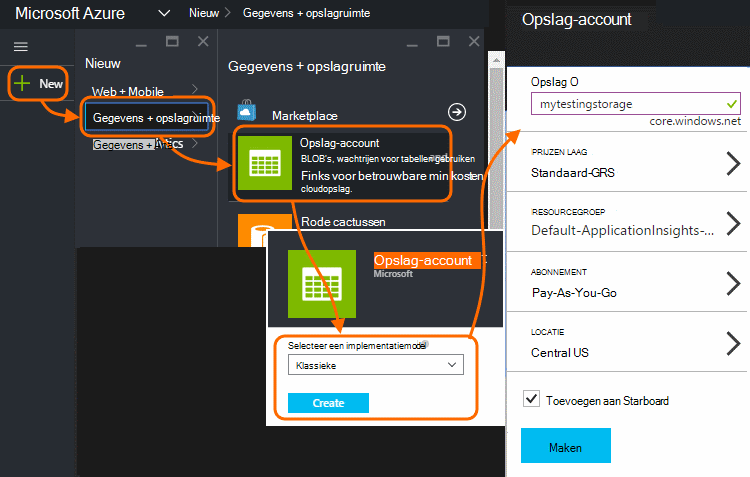

2. Een container maken

    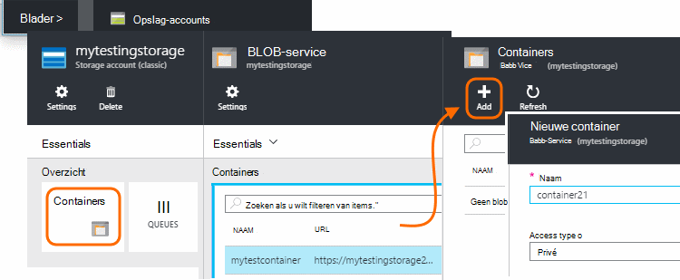

3. Kopieer de toegangstoets opslag

    U moet deze spoedig voor het instellen van de invoer voor de stream analytics-service.

    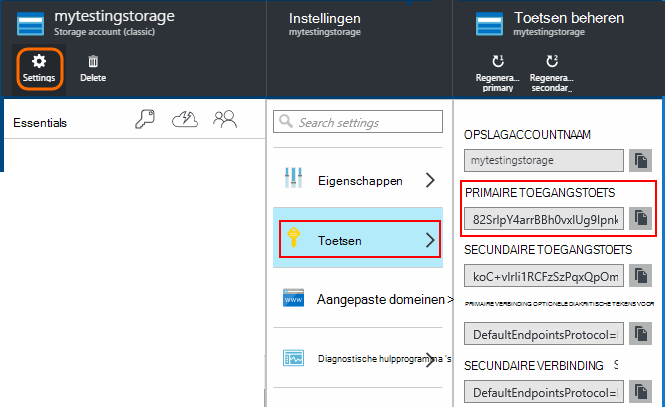

## <a name="start-continuous-export-to-azure-storage"></a>Continue exporteren naar Azure opslag starten

1. Blader naar de bron van de toepassing inzichten die u voor uw toepassing hebt gemaakt in de portal Azure.

    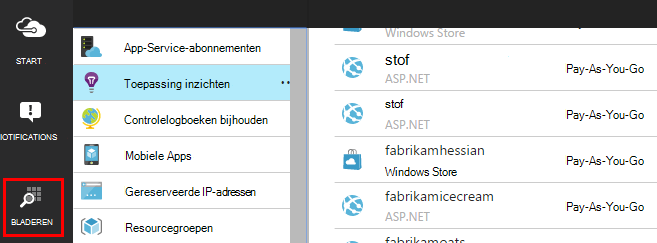

2. Maak een doorlopend exporteren.

    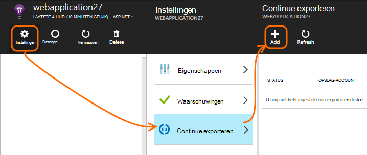


    Selecteer het opslag-account dat u eerder hebt gemaakt:

    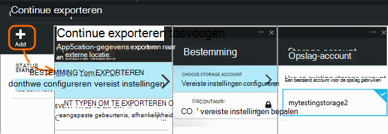
    
    Stel de typen gebeurtenissen die u wilt zien:

    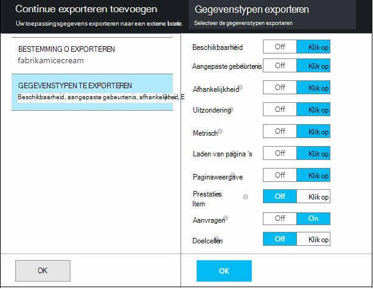


3. Laat sommige gegevens worden verzameld. Gaan zitten terug en laat uw toepassing gebruiken voor een tijdje personen. Telemetrielogboek komen en ziet u statistische grafieken in [metrische explorer](app-insights-metrics-explorer.md) en afzonderlijke gebeurtenissen in [Diagnostische zoeken](app-insights-diagnostic-search.md). 

    En ook de gegevens worden geëxporteerd naar uw opslag. 

4. Controleren de geëxporteerde gegevens, in de portal - kiest u **Bladeren**, selecteer uw opslag-account en klik vervolgens op **Containers** - of in Visual Studio. Kies in Visual Studio, **weergeven / Cloud Explorer**, en open Azure / opslag. (Als u deze optie niet hebt, moet u de SDK Azure installeren: Open het dialoogvenster Nieuw Project en open Visual C# / Cloud / Microsoft Azure SDK krijgen voor .NET.)

    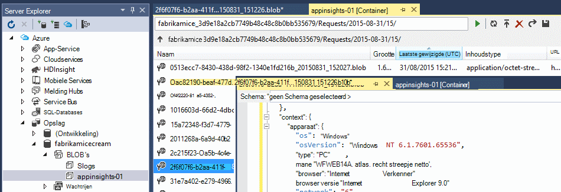

    Noteer het algemene deel van de naam van het pad, die wordt afgeleid van de naam en instrumentation toepassingstoets. 

De gebeurtenissen worden naar blob-bestanden in de indeling van JSON geschreven. Elk bestand kan een of meer gebeurtenissen bevatten. Dus willen we lezen van gegevens van de gebeurtenis en de velden die we horen uitfilteren. Er zijn alle typen wat die we met de gegevens doen kan, maar onze abonnement vandaag is het gebruik van de Stream Analytics de om gegevens te verplaatsen naar een SQL-database. Die wordt vergemakkelijkt een groot aantal interessante query's uitvoeren.

## <a name="create-an-azure-sql-database"></a>Een Azure SQL-Database maken

Opnieuw beginnen uit uw abonnement in [Azure-portal][portal], de database maken (en een nieuwe server, tenzij u hebt al een) waarin u de gegevens hebt schrijven.

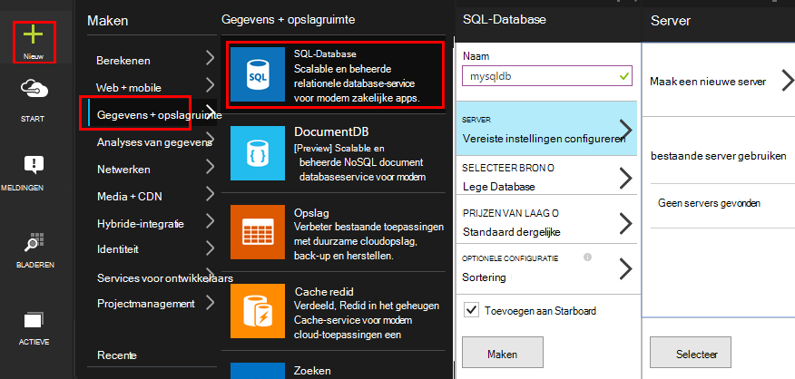


Zorg ervoor dat de database-server voor toegang tot Azure services:


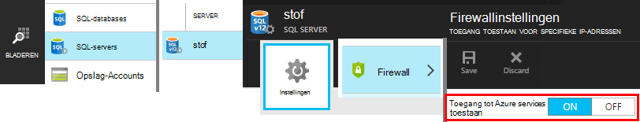

## <a name="create-a-table-in-azure-sql-db"></a>Een tabel maken in Azure SQL-DB

Verbinding maken met de database gemaakt in de vorige sectie met uw voorkeur Beheerhulpmiddel. In dit scenario we gebruiken [SQL Server Management Tools](https://msdn.microsoft.com/ms174173.aspx) (SSMS).

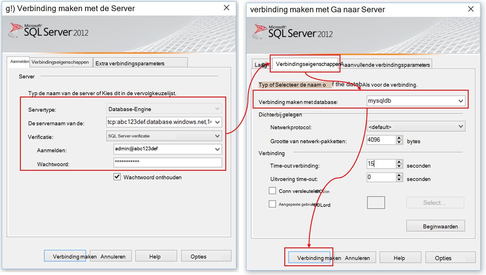

Een nieuwe query maken en uitvoeren van de volgende T-SQL:

```SQL

CREATE TABLE [dbo].[PageViewsTable](
    [pageName] [nvarchar](max) NOT NULL,
    [viewCount] [int] NOT NULL,
    [url] [nvarchar](max) NULL,
    [urlDataPort] [int] NULL,
    [urlDataprotocol] [nvarchar](50) NULL,
    [urlDataHost] [nvarchar](50) NULL,
    [urlDataBase] [nvarchar](50) NULL,
    [urlDataHashTag] [nvarchar](max) NULL,
    [eventTime] [datetime] NOT NULL,
    [isSynthetic] [nvarchar](50) NULL,
    [deviceId] [nvarchar](50) NULL,
    [deviceType] [nvarchar](50) NULL,
    [os] [nvarchar](50) NULL,
    [osVersion] [nvarchar](50) NULL,
    [locale] [nvarchar](50) NULL,
    [userAgent] [nvarchar](max) NULL,
    [browser] [nvarchar](50) NULL,
    [browserVersion] [nvarchar](50) NULL,
    [screenResolution] [nvarchar](50) NULL,
    [sessionId] [nvarchar](max) NULL,
    [sessionIsFirst] [nvarchar](50) NULL,
    [clientIp] [nvarchar](50) NULL,
    [continent] [nvarchar](50) NULL,
    [country] [nvarchar](50) NULL,
    [province] [nvarchar](50) NULL,
    [city] [nvarchar](50) NULL
)

CREATE CLUSTERED INDEX [pvTblIdx] ON [dbo].[PageViewsTable]
(
    [eventTime] ASC
)WITH (PAD_INDEX = OFF, STATISTICS_NORECOMPUTE = OFF, SORT_IN_TEMPDB = OFF, DROP_EXISTING = OFF, ONLINE = OFF, ALLOW_ROW_LOCKS = ON, ALLOW_PAGE_LOCKS = ON)

```

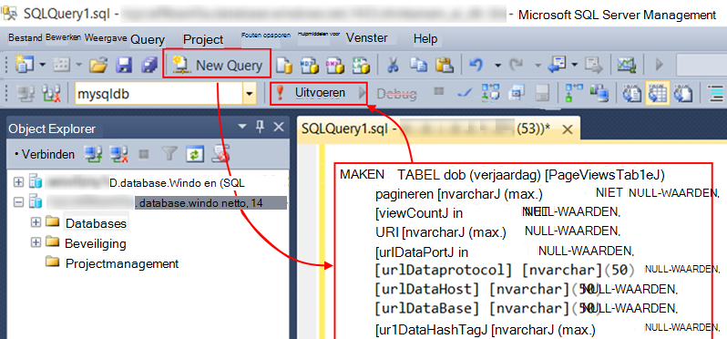

In dit voorbeeld gebruiken we gegevens uit de paginaweergaven. Als u wilt zien van de andere beschikbare gegevens, de JSON-uitvoer controleren en raadpleegt u de [gegevensmodel exporteren](app-insights-export-data-model.md).

## <a name="create-an-azure-stream-analytics-instance"></a>Een exemplaar van de Azure Stream analyses maken

Selecteer de Azure Stream Analytics-service in de [Klassieke Azure-Portal](https://manage.windowsazure.com/)en een nieuwe taak van de Stream analyses maken:


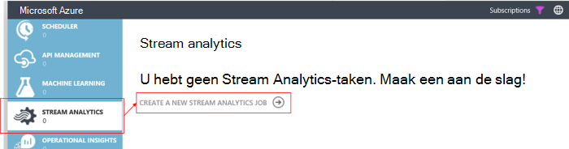


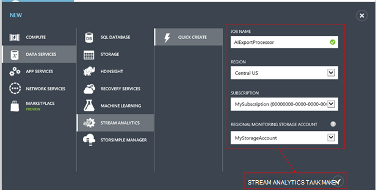

Wanneer u de nieuwe taak maakt, moet u de details uitvouwen:

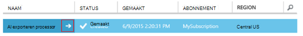

#### <a name="set-blob-location"></a>Locatie van de blob instellen

Instellen dat deze invoer uit uw blob continue exporteren uitvoeren:

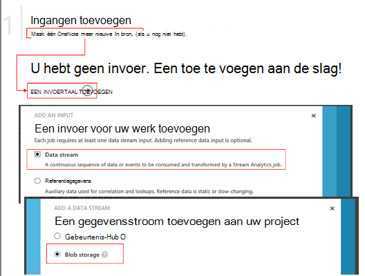

U moet nu de primaire sleutel van de toegang van uw Account opslag, die u eerder hebt genoteerd. Stel dit in als de Accountsleutel opslag.

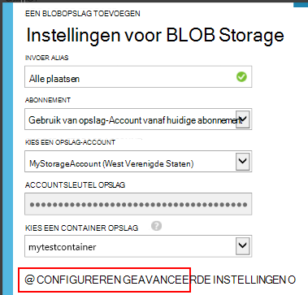

#### <a name="set-path-prefix-pattern"></a>Set pad voorvoegselpatroon 

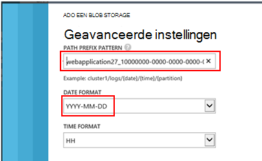

Zorg ervoor dat de datumnotatie ingesteld op **Jjjj-MM-DD** (met **streepjes**).

Het pad voorvoegsel patroon geeft aan hoe Stream Analytics geeft als resultaat de invoer bestanden in de opslag. Moet u instellen dat deze overeenkomen met hoe continue exporteren de gegevens zijn opgeslagen. Stel deze als volgt:

    webapplication27_12345678123412341234123456789abcdef0/PageViews/{date}/{time}

In dit voorbeeld is:

* `webapplication27`is de naam van de resource van toepassing inzichten, **alle in kleine letters**. 
* `1234...`is de sleutel instrumentation van de toepassing inzichten resource **met streepjes verwijderd**. 
* `PageViews`is het type gegevens wilt analyseren. De beschikbare typen, is afhankelijk van het filter dat u in continue exporteren instellen. De geëxporteerde gegevens om te zien van de andere beschikbare soorten controleren en raadpleegt u de [gegevensmodel exporteren](app-insights-export-data-model.md).
* `/{date}/{time}`een patroon is letterlijk geschreven.

Als u de naam en iKey van uw toepassing inzichten resource, Essentials open op de overzichtspagina of open instellingen.

#### <a name="finish-initial-setup"></a>De eerste configuratie voltooien

Bevestig de serialisatie-indeling:

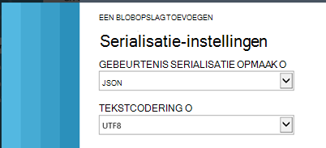

De wizard te sluiten en wacht totdat de installatie te voltooien.

>[AZURE.TIP] Gebruik de functie voorbeeld om te controleren of u het pad van de invoer juist hebt ingesteld. Als dit mislukt: Controleer of er gegevens beschikbaar is in de opslagruimte voor de steekproef tijdsbereik die u hebt gekozen. De definitie van de invoer bewerken en controleer u stelt u de opslag-account, pad voorvoegsel en datumnotatie correct.

## <a name="set-query"></a>De query instellen

Open de querysectie:

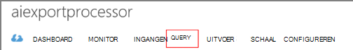

Vervang de standaardquery met:

```SQL

    SELECT flat.ArrayValue.name as pageName
    , flat.ArrayValue.count as viewCount
    , flat.ArrayValue.url as url
    , flat.ArrayValue.urlData.port as urlDataPort
    , flat.ArrayValue.urlData.protocol as urlDataprotocol
    , flat.ArrayValue.urlData.host as urlDataHost
    , flat.ArrayValue.urlData.base as urlDataBase
    , flat.ArrayValue.urlData.hashTag as urlDataHashTag
      ,A.context.data.eventTime as eventTime
      ,A.context.data.isSynthetic as isSynthetic
      ,A.context.device.id as deviceId
      ,A.context.device.type as deviceType
      ,A.context.device.os as os
      ,A.context.device.osVersion as osVersion
      ,A.context.device.locale as locale
      ,A.context.device.userAgent as userAgent
      ,A.context.device.browser as browser
      ,A.context.device.browserVersion as browserVersion
      ,A.context.device.screenResolution.value as screenResolution
      ,A.context.session.id as sessionId
      ,A.context.session.isFirst as sessionIsFirst
      ,A.context.location.clientip as clientIp
      ,A.context.location.continent as continent
      ,A.context.location.country as country
      ,A.context.location.province as province
      ,A.context.location.city as city
    INTO
      AIOutput
    FROM AIinput A
    CROSS APPLY GetElements(A.[view]) as flat


```

Zoals u ziet dat de eerste paar eigenschappen specifiek voor de pagina weergavegegevens zijn. Uitvoer van andere typen telemetrielogboek heeft verschillende eigenschappen. Zie de [naslag voor data model voor de eigenschaptypen en waarden gedetailleerde.](app-insights-export-data-model.md)

## <a name="set-up-output-to-database"></a>Uitvoer met database instellen

Selecteer SQL als de uitvoer.

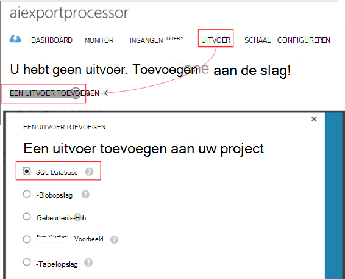

Geef de SQL-database.


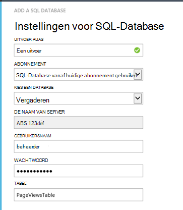

De wizard te sluiten en wacht totdat een melding dat de uitvoer is ingesteld.

## <a name="start-processing"></a>Verwerking starten

De taak op de actiebalk start:

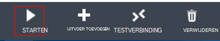

U kunt kiezen of om te beginnen met het verwerken van de gegevens die vanaf nu of beginnen eerdere gegevens. De laatste is handig als u hebt continue exporteren al een tijdje wordt uitgevoerd.


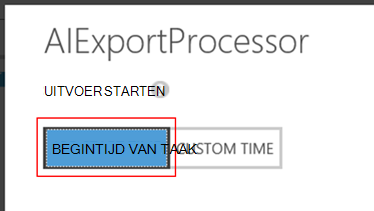

Na een paar minuten, gaat u terug naar SQL Server Management Tools en bekijk de gegevens die doorloopt in. Gebruik bijvoorbeeld een query als volgt:

    SELECT TOP 100 *
    FROM [dbo].[PageViewsTable]


## <a name="related-articles"></a>Verwante artikelen

* [Exporteren naar SQL via een rol werknemer](app-insights-code-sample-export-telemetry-sql-database.md)
* [Exporteren naar PowerBI door middel van Stream analyses](app-insights-export-power-bi.md)
* [Gedetailleerd overzicht van de eigenschaptypen en waarden voor gegevensmodellen.](app-insights-export-data-model.md)
* [Continue exporteren in de toepassing inzichten](app-insights-export-telemetry.md)
* [Toepassing inzichten](https://azure.microsoft.com/services/application-insights/)

<!--Link references-->

[diagnostic]: app-insights-diagnostic-search.md
[export]: app-insights-export-telemetry.md
[metrics]: app-insights-metrics-explorer.md
[portal]: http://portal.azure.com/
[start]: app-insights-overview.md

 