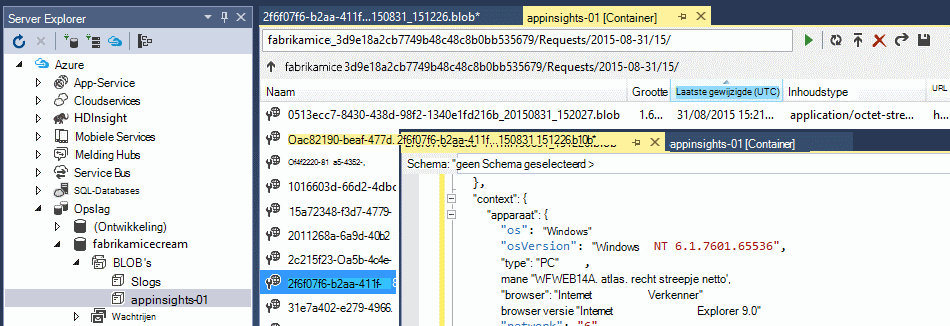

<properties 
    pageTitle="Voorbeeld: gegevens die zijn geëxporteerd vanaf toepassing inzichten parseren" 
    description="Uw eigen analyse van telemetrielogboek in toepassing inzichten code met behulp van de functie continue exporteren. Gegevens opslaan in SQL." 
    services="application-insights" 
    documentationCenter=""
    authors="mazharmicrosoft" 
    manager="douge"/>

<tags 
    ms.service="application-insights" 
    ms.workload="tbd" 
    ms.tgt_pltfrm="ibiza" 
    ms.devlang="na" 
    ms.topic="article" 
    ms.date="01/05/2016" 
    ms.author="awills"/>
 
# Voorbeeld: gegevens die zijn geëxporteerd vanaf toepassing inzichten parseren

In dit artikel leest hoe u de JSON-gegevens die zijn geëxporteerd vanaf toepassing inzichten verwerken. Als u bijvoorbeeld schrijven we code om uw telemetriegegevens van [Visual Studio toepassing inzichten] verplaatsen[ start] in een Azure SQL-database met behulp van [Continue exporteren][export]. (U kunt ook deze [met behulp van de Stream Analytics](app-insights-code-sample-export-sql-stream-analytics.md)bereiken, maar hier ons doel is om aan te geven wat code.) 

Continue exporteren overgezet uw telemetrielogboek naar Azure-opslag in de indeling van JSON, zodat we enkele programmacode parseren van de JSON-objecten en rijen in een databasetabel maken, wordt schrijven.

Meer in het algemeen, continue exporteren is de manier om uw eigen analyse van de telemetrielogboek uw apps naar toepassing inzichten verzenden uitvoeren. U kunt dit voorbeeld hiervoor andere dingen die u met de geëxporteerde telemetrielogboek kan aanpassen.

We beginnen met ervan uitgegaan dat u al de app die u wilt controleren.

## Toepassing inzichten SDK toevoegen

Om te controleren van uw toepassing, kunt u met het [toevoegen van een toepassing inzichten SDK] [ start] in uw toepassing. Er zijn verschillende SDK's en hulpprogramma's voor andere platforms, IDEs en talen. U kunt webpagina's, Java of ASP.NET-endwebservers en mobiele apparaten van verschillende soorten controleren. De SDK's telemetrielogboek verzenden naar de [toepassing inzichten portal][portal], waar u kunt gebruik onze krachtige analyses en diagnostische hulpprogramma's en de gegevens naar opslag exporteren.

Aan de slag:

1. Een [account in Microsoft Azure](https://azure.microsoft.com/pricing/)aanvragen.
2. Klik in de [portal van Azure][portal], een nieuwe resource van toepassing inzichten voor de app toevoegen:

    

    (Uw app-type en abonnement kunnen afwijken.)
3. Snel aan de slag om het instellen van de SDK voor het type app openen

    

    Als het type app niet wordt weergegeven, gaat u naar de [Aan de slag] [ start] pagina.

4. In dit voorbeeld bent we een WebApp, controle, zodat we de Azure hulpmiddelen in Visual Studio gebruiken kunt voor het installeren van de SDK. We zien dit de naam van de resource van onze toepassing inzichten:

    

## Opslag in Azure maken

Gegevens uit de toepassing inzichten wordt altijd geëxporteerd naar een Azure Storage-account in de indeling van JSON. Afkomstig is van deze opslag dat uw code de gegevens worden gelezen.

1. Een "klassieke" opslag-account maken van uw abonnement in de [portal van Azure][portal].

    

2. Een container maken

    

## Continue exporteren naar Azure opslag starten

1. Blader naar de bron van de toepassing inzichten die u voor uw toepassing hebt gemaakt in de portal Azure.

    

2. Maak een doorlopend exporteren.

    

    Selecteer het opslag-account dat u eerder hebt gemaakt:

    
    
    Stel de typen gebeurtenissen die u wilt zien:

    

3. Laat sommige gegevens worden verzameld. Gaan zitten terug en laat uw toepassing gebruiken voor een tijdje personen. Telemetrielogboek komen en ziet u statistische grafieken in [metrische explorer](app-insights-metrics-explorer.md) en afzonderlijke gebeurtenissen in [Diagnostische zoeken](app-insights-diagnostic-search.md). 

    En ook de gegevens worden geëxporteerd naar uw opslag. 

4. De geëxporteerde gegevens controleren. Kies in Visual Studio, **weergeven / Cloud Explorer**, en open Azure / opslag. (Als u deze optie niet hebt, moet u de SDK Azure installeren: Open het dialoogvenster Nieuw Project en open Visual C# / Cloud / Microsoft Azure SDK krijgen voor .NET.)

    

    Noteer het algemene deel van de naam van het pad, die wordt afgeleid van de naam en instrumentation toepassingstoets. 

De gebeurtenissen worden naar blob-bestanden in de indeling van JSON geschreven. Elk bestand kan een of meer gebeurtenissen bevatten. Dus willen we lezen van gegevens van de gebeurtenis en de velden die we horen uitfilteren. Er zijn alle typen wat die we met de gegevens doen kan, maar onze abonnement vandaag is het schrijven van code als u wilt de gegevens met een SQL-database verplaatsen. Die wordt vergemakkelijkt een groot aantal interessante query's uitvoeren.

## Een Azure SQL-Database maken

In dit voorbeeld wordt we code als u wilt de gegevens in een database push schrijven.

Opnieuw beginnen uit uw abonnement in [Azure-portal][portal], de database maken (en een nieuwe server, tenzij u hebt al een) waarin u de gegevens hebt schrijven.

Zorg ervoor dat de database-server voor toegang tot Azure services:

## De rol van een werknemer maken 

Nu kunnen eindelijk we [sommige code](https://sesitai.codeplex.com/) parseren van de JSON in de geëxporteerde BLOB's schrijven, en records in de database maken. Aangezien de store exporteren en de database beide in Azure wordt aangegeven zijn, wordt we de code uitvoeren in een beheerdersrol Azure werknemer.

Deze code haalt automatisch welke eigenschappen aanwezig zijn in de JSON. Zie [gegevensmodel exporteren](app-insights-export-data-model.md)voor beschrijvingen van de eigenschappen.

#### Werknemer rol project maken

Maak een nieuw project voor de werknemer rol in Visual Studio:

#### Verbinding maken met het account opslag

In Azure wordt aangegeven, moet u de verbindingsreeks ophalen uit uw opslag-account:

Visual Studio, de instellingen van de rol werknemer met de verbindingsreeks van de opslag-account te configureren:

#### Pakketten

In Solution Explorer met de rechtermuisknop op uw project werknemer rol en kies NuGet-pakketten beheren.
Zoeken naar en installeer deze pakketten: 

 * EntityFramework 6.1.2 of later - We gebruiken deze om het schema van de tabel DB in de browser, genereren op basis van de inhoud van de JSON in de blob.
 * JsonFx - We gebruiken deze voor het samenvoegen van de JSON aan C# class eigenschappen.

Gebruik dit hulpprogramma om te genereren C#-klasse uitzoomen onze één JSON-document. Er moeten kleine wijzigingen zoals JSON matrices samenvoegen in één C# eigenschap in één kolom inschakelen in DB tabel (ex. urlData_port) 

 * [JSON C# class genereren](http://jsonclassgenerator.codeplex.com/)

## Code 

U kunt deze code in plaatsen `WorkerRole.cs`.

#### Invoer

    using Microsoft.WindowsAzure.Storage;

    using Microsoft.WindowsAzure.Storage.Blob;

#### De opslag-verbindingsreeks ophalen

    private static string GetConnectionString()
    {
      return Microsoft.WindowsAzure.CloudConfigurationManager.GetSetting("StorageConnectionString");
    }

#### De werknemer met regelmatige tussenpozen uitvoeren

Vervang de bestaande uitvoeren methode en kies het gewenste interval. Deze moet ten minste één uur, omdat de functie exporteren is één JSON-object in een uur voltooid.

    public override void Run()
    {
      Trace.TraceInformation("WorkerRole1 is running");

      while (true)
      {
        Trace.WriteLine("Sleeping", "Information");

        Thread.Sleep(86400000); //86400000=24 hours //1 hour=3600000
                
        Trace.WriteLine("Awake", "Information");

        ImportBlobtoDB();
      }
    }

#### Elk object JSON als een tabelrij invoegen

    public void ImportBlobtoDB()
    {
      try
      {
        CloudStorageAccount account = CloudStorageAccount.Parse(GetConnectionString());

        var blobClient = account.CreateCloudBlobClient();
        var container = blobClient.GetContainerReference(FilterContainer);

        foreach (CloudBlobDirectory directory in container.ListBlobs())//Parent directory
        {
          foreach (CloudBlobDirectory subDirectory in directory.ListBlobs())//PageViewPerformance
          {
            foreach (CloudBlobDirectory dir in subDirectory.ListBlobs())//2015-01-31
            {
              foreach (CloudBlobDirectory subdir in dir.ListBlobs())//22
              {
                foreach (IListBlobItem item in subdir.ListBlobs())//3IAwm6u3-0.blob
                {
                  itemname = item.Uri.ToString();
                  ParseEachBlob(container, item);
                  AuditBlob(container, directory, subDirectory, dir, subdir, item);
                } //item loop
              } //subdir loop
            } //dir loop
          } //subDirectory loop
        } //directory loop
      }
      catch (Exception ex)
      {
        //handle exception
      }
    }

#### Parseren van elke blob

    private void ParseEachBlob(CloudBlobContainer container, IListBlobItem item)
    {
      try
      {
        var blob = container.GetBlockBlobReference(item.Parent.Prefix + item.Uri.Segments.Last());
    
        string json;
    
        using (var memoryStream = new MemoryStream())
        {
          blob.DownloadToStream(memoryStream);
          json = System.Text.Encoding.UTF8.GetString(memoryStream.ToArray());
    
          IEnumerable<string> entities = json.Split('\n').Where(s => !string.IsNullOrWhiteSpace(s));
    
          recCount = entities.Count();
          failureCount = 0; //resetting failure count
    
          foreach (var entity in entities)
          {
            var reader = new JsonFx.Json.JsonReader();
            dynamic output = reader.Read(entity);
    
            Dictionary<string, object> dict = new Dictionary<string, object>();
    
            GenerateDictionary((System.Dynamic.ExpandoObject)output, dict, "");
    
            switch (FilterType)
            {
              case "PageViewPerformance":
    
              if (dict.ContainsKey("clientPerformance"))
                {
                  GenerateDictionary(((System.Dynamic.ExpandoObject[])dict["clientPerformance"])[0], dict, "");
                }
    
              if (dict.ContainsKey("context_custom_dimensions"))
              {
                if (dict["context_custom_dimensions"].GetType() == typeof(System.Dynamic.ExpandoObject[]))
                {
                  GenerateDictionary(((System.Dynamic.ExpandoObject[])dict["context_custom_dimensions"])[0], dict, "");
                }
              }
    
            PageViewPerformance objPageViewPerformance = (PageViewPerformance)GetObject(dict);
    
            try
            {
              using (var db = new TelemetryContext())
              {
                db.PageViewPerformanceContext.Add(objPageViewPerformance);
                db.SaveChanges();
              }
            }
            catch (Exception ex)
            {
              failureCount++;
            }
            break;
    
            default:
            break;
          }
        }
      }
    }
    catch (Exception ex)
    {
      //handle exception 
    }
    }

#### Een woordenlijst voor elk document JSON voorbereiden

    private void GenerateDictionary(System.Dynamic.ExpandoObject output, Dictionary<string, object> dict, string parent)
        {
            try
            {
                foreach (var v in output)
                {
                    string key = parent + v.Key;
                    object o = v.Value;

                    if (o.GetType() == typeof(System.Dynamic.ExpandoObject))
                    {
                        GenerateDictionary((System.Dynamic.ExpandoObject)o, dict, key + "_");
                    }
                    else
                    {
                        if (!dict.ContainsKey(key))
                        {
                            dict.Add(key, o);
                        }
                    }
                }
            }
            catch (Exception ex)
            {
            //handle exception 
            }
        }

#### De JSON-document in C# class telemetrielogboek objecteigenschappen cast

     public object GetObject(IDictionary<string, object> d)
        {
            PropertyInfo[] props = null;
            object res = null;

            try
            {
                switch (FilterType)
                {
                    case "PageViewPerformance":

                        props = typeof(PageViewPerformance).GetProperties();
                        res = Activator.CreateInstance<PageViewPerformance>();
                        break;

                    default:
                        break;
                }

                for (int i = 0; i < props.Length; i++)
                {
                    if (props[i].CanWrite && d.ContainsKey(props[i].Name))
                    {
                        props[i].SetValue(res, d[props[i].Name], null);
                    }
                }
            }
            catch (Exception ex)
            {
            //handle exception 
            }

            return res;
        }

#### PageViewPerformance-klassebestand gegenereerd uitzoomen JSON-document

    public class PageViewPerformance
    {
        [DatabaseGenerated(DatabaseGeneratedOption.Identity)]
        public Guid Id { get; set; }

        public string url { get; set; }

        public int urlData_port { get; set; }

        public string urlData_protocol { get; set; }

        public string urlData_host { get; set; }

        public string urlData_base { get; set; }

        public string urlData_hashTag { get; set; }

        public double total_value { get; set; }

        public double networkConnection_value { get; set; }

        public double sendRequest_value { get; set; }

        public double receiveRequest_value { get; set; }

        public double clientProcess_value { get; set; }

        public string name { get; set; }

        public string internal_data_id { get; set; }

        public string internal_data_documentVersion { get; set; }

        public DateTime? context_data_eventTime { get; set; }

        public string context_device_id { get; set; }

        public string context_device_type { get; set; }

        public string context_device_os { get; set; }

        public string context_device_osVersion { get; set; }

        public string context_device_locale { get; set; }

        public string context_device_userAgent { get; set; }

        public string context_device_browser { get; set; }

        public string context_device_browserVersion { get; set; }

        public string context_device_screenResolution_value { get; set; }

        public string context_user_anonId { get; set; }

        public string context_user_anonAcquisitionDate { get; set; }

        public string context_user_authAcquisitionDate { get; set; }

        public string context_user_accountAcquisitionDate { get; set; }

        public string context_session_id { get; set; }

        public bool context_session_isFirst { get; set; }

        public string context_operation_id { get; set; }

        public double context_location_point_lat { get; set; }

        public double context_location_point_lon { get; set; }

        public string context_location_clientip { get; set; }

        public string context_location_continent { get; set; }

        public string context_location_country { get; set; }

        public string context_location_province { get; set; }

        public string context_location_city { get; set; }
    }

#### DBcontext voor SQL-interactie door entiteit Framework

    public class TelemetryContext : DbContext
    {
        public DbSet<PageViewPerformance> PageViewPerformanceContext { get; set; }
        public TelemetryContext()
            : base("name=TelemetryContext")
        {
        }
    }

De verbindingsreeks DB met naam toevoegen `TelemetryContext` in `app.config`.

## Schema (alleen informatie)

Dit is het schema voor de tabel die wordt gegenereerd voor PageView.

> [AZURE.NOTE] U hoeft niet te dit script uitvoeren. De kenmerken in de JSON Hiermee bepaalt u de kolommen in de tabel.

    CREATE TABLE [dbo].[PageViewPerformances](
    [Id] [uniqueidentifier] NOT NULL,
    [url] [nvarchar](max) NULL,
    [urlData_port] [int] NOT NULL,
    [urlData_protocol] [nvarchar](max) NULL,
    [urlData_host] [nvarchar](max) NULL,
    [urlData_base] [nvarchar](max) NULL,
    [urlData_hashTag] [nvarchar](max) NULL,
    [total_value] [float] NOT NULL,
    [networkConnection_value] [float] NOT NULL,
    [sendRequest_value] [float] NOT NULL,
    [receiveRequest_value] [float] NOT NULL,
    [clientProcess_value] [float] NOT NULL,
    [name] [nvarchar](max) NULL,
    [User] [nvarchar](max) NULL,
    [internal_data_id] [nvarchar](max) NULL,
    [internal_data_documentVersion] [nvarchar](max) NULL,
    [context_data_eventTime] [datetime] NULL,
    [context_device_id] [nvarchar](max) NULL,
    [context_device_type] [nvarchar](max) NULL,
    [context_device_os] [nvarchar](max) NULL,
    [context_device_osVersion] [nvarchar](max) NULL,
    [context_device_locale] [nvarchar](max) NULL,
    [context_device_userAgent] [nvarchar](max) NULL,
    [context_device_browser] [nvarchar](max) NULL,
    [context_device_browserVersion] [nvarchar](max) NULL,
    [context_device_screenResolution_value] [nvarchar](max) NULL,
    [context_user_anonId] [nvarchar](max) NULL,
    [context_user_anonAcquisitionDate] [nvarchar](max) NULL,
    [context_user_authAcquisitionDate] [nvarchar](max) NULL,
    [context_user_accountAcquisitionDate] [nvarchar](max) NULL,
    [context_session_id] [nvarchar](max) NULL,
    [context_session_isFirst] [bit] NOT NULL,
    [context_operation_id] [nvarchar](max) NULL,
    [context_location_point_lat] [float] NOT NULL,
    [context_location_point_lon] [float] NOT NULL,
    [context_location_clientip] [nvarchar](max) NULL,
    [context_location_continent] [nvarchar](max) NULL,
    [context_location_country] [nvarchar](max) NULL,
    [context_location_province] [nvarchar](max) NULL,
    [context_location_city] [nvarchar](max) NULL,
    CONSTRAINT [PK_dbo.PageViewPerformances] PRIMARY KEY CLUSTERED 
    (
     [Id] ASC
    )WITH (PAD_INDEX = OFF, STATISTICS_NORECOMPUTE = OFF, IGNORE_DUP_KEY = OFF, ALLOW_ROW_LOCKS = ON, ALLOW_PAGE_LOCKS = ON) ON [PRIMARY]
    ) ON [PRIMARY] TEXTIMAGE_ON [PRIMARY]

    GO

    ALTER TABLE [dbo].[PageViewPerformances] ADD  DEFAULT (newsequentialid()) FOR [Id]
    GO

Als u wilt zien in dit voorbeeld in actie, [downloaden](https://sesitai.codeplex.com/) de volledige werken-code, wijzigen de `app.config` instellingen en publiceren van de rol van de werknemer met Azure.

## Verwante artikelen

* [Exporteren naar SQL via een rol werknemer](app-insights-code-sample-export-telemetry-sql-database.md)
* [Continue exporteren in de toepassing inzichten](app-insights-export-telemetry.md)
* [Toepassing inzichten](https://azure.microsoft.com/services/application-insights/)
* [Gegevensmodel exporteren](app-insights-export-data-model.md)
* [Meer voorbeelden en scenario 's](app-insights-code-samples.md)

<!--Link references-->

[diagnostic]: app-insights-diagnostic-search.md
[export]: app-insights-export-telemetry.md
[metrics]: app-insights-metrics-explorer.md
[portal]: http://portal.azure.com/
[start]: app-insights-overview.md

 
