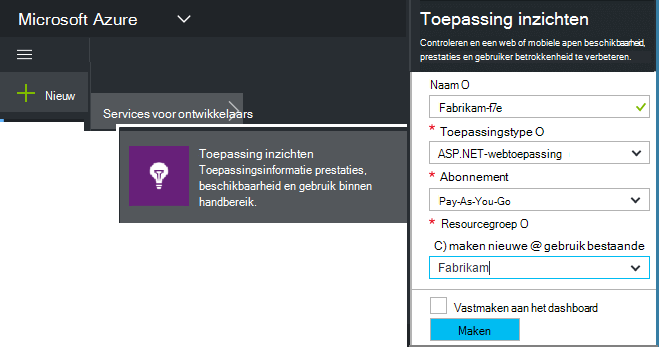
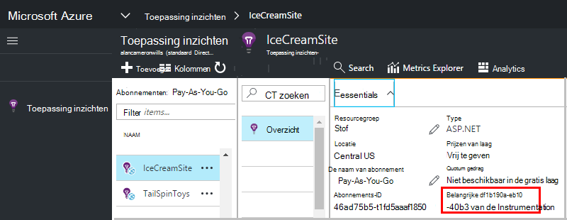

<properties 
    pageTitle="Maak een nieuwe resource van toepassing inzichten | Microsoft Azure" 
    description="Het instellen van de toepassing inzichten monitoring voor een nieuwe live toepassing. Web gebaseerde benadering." 
    services="application-insights" 
    documentationCenter=""
    authors="alancameronwills" 
    manager="douge"/>

<tags 
    ms.service="application-insights" 
    ms.workload="tbd" 
    ms.tgt_pltfrm="ibiza" 
    ms.devlang="na" 
    ms.topic="article" 
    ms.date="08/26/2016" 
    ms.author="awills"/>

# Maak een toepassing inzichten-bron

Visual Studio-toepassing inzichten worden gegevens over het gebruik van de toepassing weergegeven in een Microsoft Azure- *resource*. Maken van een nieuwe resource is dus deel van [het instellen van toepassing inzichten te houden op een nieuwe toepassing][start]. In veel gevallen dit automatisch kan worden uitgevoerd door de IDE en die het beste waarop de invoegtoepassing is beschikbaar is. Maar in sommige gevallen, maakt u een resource handmatig.

Nadat u de resource hebt gemaakt, kunt u de sleutel instrumentation ophalen en gebruiken die de SDK configureren in de toepassing. Hiermee wordt het telemetrielogboek verzonden naar de resource.

## Aanmelden voor Microsoft Azure

Als u nog niet u een [Microsoft-account, wordt er een nu hebt](http://live.com). (Als u services zoals Outlook.com, OneDrive, Windows Phone of XBox Live gebruikt, u al een Microsoft-account.)

U moet ook een abonnement op [Microsoft Azure](http://azure.com). Als uw team of uw organisatie een Azure-abonnement heeft, kunt de eigenaar u hieraan toevoegen met uw Windows Live ID.

Of u een nieuw abonnement kunt maken. De gratis account kunt u proberen alles in Azure wordt aangegeven. Nadat de proefperiode is verstreken, vindt u mogelijk het pay-as-you-go abonnement gepast is, als u geen gratis services afgeschreven. 

Wanneer u hebt toegang tot een abonnement, meld u aan bij de toepassing inzichten bij [http://portal.azure.com](https://portal.azure.com), en gebruiken van uw Live ID om aan te melden.

## Maak een toepassing inzichten-bron
  

In de [portal.azure.com](https://portal.azure.com), een resource van toepassing inzichten items toevoegen:

* **Toepassingstype** van invloed is op wat u ziet op het blad overzicht samen met de eigenschappen die beschikbaar zijn in [metrische explorer][metrics]. Als u uw type app niet ziet, kiest u ASP.NET.
* **Resourcegroep** is nuttig voor het beheren van eigenschappen zoals beheren in access. Als u andere Azure resources al hebt gemaakt, kunt u kiezen om te zetten deze nieuwe resource in dezelfde groep.
* **Abonnement** is uw account betaling in Azure wordt aangegeven.
* **Locatie** is waar we uw gegevens blijven. Momenteel worden niet gewijzigd.
* **Toevoegen aan startboard** past een tegel voor snelle toegang voor de resource op de startpagina van de Azure. Aanbevolen.

Als u de app is gemaakt, wordt een nieuwe blade weergegeven. Dit is waar ziet u prestatie- en gebruiksgegevens over uw app. 

Om terug naar het volgende wanneer u Meld u aan bij Azure, zoek voor van uw app snel aan de slag tegel in het bord starten (beginscherm). Of klik op Bladeren om te vinden.

## Kopieer de instrumentation-toets

De toets instrumentation geeft de bron die u hebt gemaakt. U moet deze om de SDK te geven.

## De SDK in uw app installeren

Installeer de toepassing inzichten SDK in uw app. Deze stap is intensief afhankelijk van het type van de toepassing. 

Gebruik de instrumentation-toets voor het configureren van [de SDK geïnstalleerde in uw toepassing][start].

De SDK bevat standaard modules die telemetrielogboek verzenden zonder dat u hoeft code te schrijven. Gebruikersacties of een diagnose stellen bij problemen uitgebreider, [gebruikt u de API] [ api] naar uw eigen telemetrielogboek verzenden.

## Zie telemetriegegevens

Sluit het blad snel aan de slag om terug te keren naar uw blade toepassing in de portal van Azure.

Klik op de tegel zoeken als u wilt zien van [Diagnostische gegevens zoeken][diagnostic], waarbij de eerste gebeurtenissen wordt weergegeven. 

Klik op vernieuwen na een paar seconden als u meer gegevens verwacht.

## Een resource maken automatisch

U kunt een [PowerShell-script](app-insights-powershell-script-create-resource.md) om te maken van een resource automatisch schrijven.

## Volgende stappen

* [Een dashboard maken](app-insights-dashboards.md)
* [Diagnostische gegevens zoeken](app-insights-diagnostic-search.md)
* [Aan de doelstellingen verkennen](app-insights-metrics-explorer.md)
* [Gebruiksanalyses query's schrijven](app-insights-analytics.md)

<!--Link references-->

[api]: app-insights-api-custom-events-metrics.md
[diagnostic]: app-insights-diagnostic-search.md
[metrics]: app-insights-metrics-explorer.md
[start]: app-insights-overview.md

 