<properties
    pageTitle="Dashboards en navigatie in de portal-toepassing inzichten | Microsoft Azure"
    description="Weergaven van uw belangrijkste APM grafieken en query's maken."
    services="application-insights"
    documentationCenter=""
    authors="alancameronwills"
    manager="douge"/>

<tags
    ms.service="application-insights"
    ms.workload="tbd"
    ms.tgt_pltfrm="ibiza"
    ms.devlang="multiple"
    ms.topic="article" 
    ms.date="10/18/2016"
    ms.author="awills"/>

# Navigatie en Dashboards in de toepassing inzichten-portal

Nadat u [ingesteld toepassing inzichten aan uw project hebt](app-insights-overview.md), weergegeven telemetriegegevens over de prestaties en het gebruik van de app in resource van toepassing inzichten van uw project in de [portal van Azure](https://portal.azure.com).

## Uw telemetrielogboek zoeken

Meld u aan bij de [Azure-portal](https://portal.azure.com) en Ga naar de resource van toepassing inzichten die u hebt gemaakt voor de app.

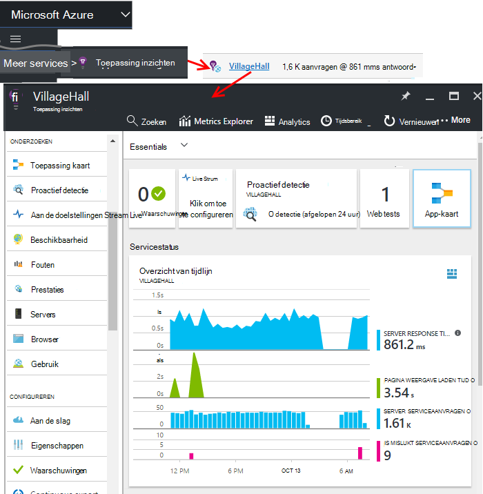

Het overzicht blad (pagina) voor de app wordt een overzicht van de belangrijkste diagnostische prestatiemetingen van uw app en is een gateway naar de andere functies van de portal.

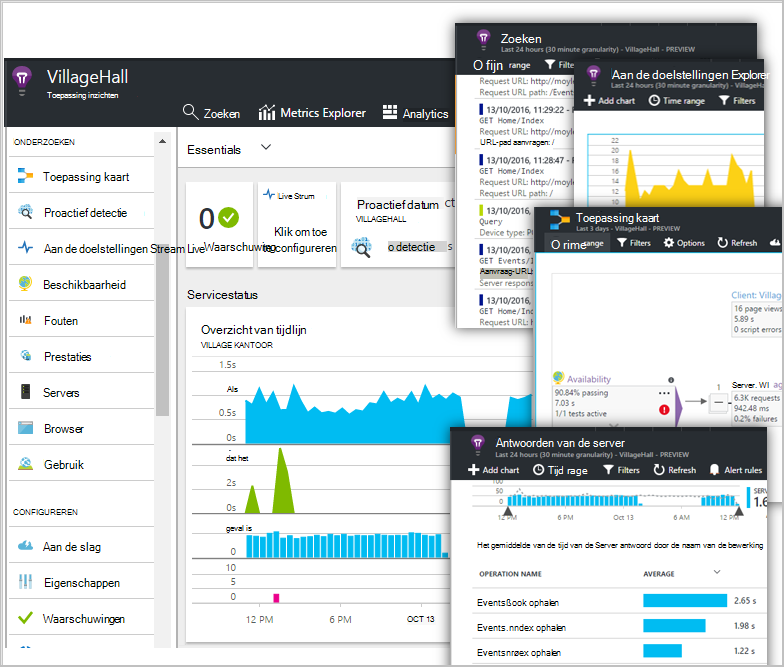

U kunt een van de andere grafieken aanpassen en de notities vastzetten aan een dashboard. Kleurencategorieën, u kunt brengen samen de belangrijkste grafieken van andere apps.

## Dashboards

Het eerste wat dat u ziet nadat u zich hebt aangemeld bij de [portal van Microsoft Azure](https://portal.azure.com) is een dashboard. Hier kunt u overbrengen samen de grafieken die meest belangrijk voor u over alle uw Azure resources, inclusief telemetrielogboek van [Visual Studio toepassing inzichten](app-insights-overview.md)zijn.
 

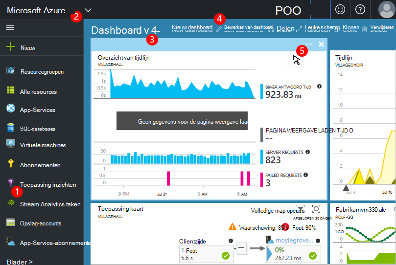

1. **Navigeren naar specifieke bronnen** , zoals uw app in de toepassing inzichten: Gebruik de balk links.
2. **Terug naar het huidige dashboard**of overschakelen naar andere recente weergaven: gebruik het vervolgkeuzemenu op linksboven.
3. **Schakeloptie dashboards**: Gebruik de vervolgkeuzelijst op de titel van de dashboard
4. **Maken, bewerken, en delen dashboards** op de werkbalk dashboard.
5. **Bewerken van het dashboard**: plaats de muisaanwijzer op een tegel en gebruik vervolgens de bovenste balk verplaatsen, aanpassen of deze verwijderen.

## Toevoegen aan een dashboard

Wanneer u een blade of reeks grafieken die is interessants bekijkt, kunt u een kopie van het aan het dashboard vastmaken. U ziet het volgende keer dat u hiernaar terugkeert, wordt er.

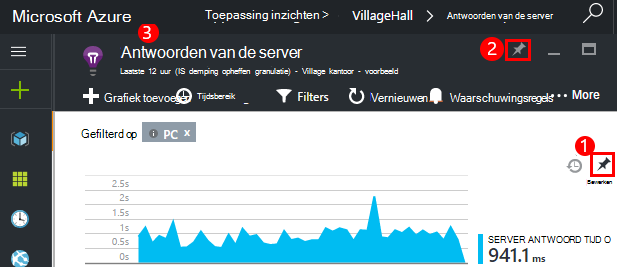

1. Pincode-grafiek naar dashboard. Een kopie van de grafiek wordt weergegeven op het dashboard.
2. Het hele blad aan het dashboard vastmaken: deze wordt weergegeven op het dashboard als een tegel die u kunt klikken op tot en met.
3. Klik op de linkerbovenhoek om terug te keren naar de huidige dashboard. Vervolgens kunt u de vervolgkeuzelijst om terug te keren naar de huidige weergave.

Zoals u ziet dat grafieken worden gegroepeerd in tegels: een tegel meer dan één grafiek kan bevatten. U vastmaken de hele tegel aan het dashboard.

### Een query in Analytics vastmaken

U kunt ook [pincode Analytics](app-insights-analytics-using.md#pin-to-dashboard) grafieken aan een [gedeelde](#share-dashboards-with-your-team) dashboard. Hiermee kunt u grafieken van een willekeurige query samen met de doelstellingen van de standaard toevoegen. (Er wordt een kosten voor deze functie.)

## Een tegel op het dashboard aanpassen

Als u een tegel hebt op het dashboard, kunt u deze kunt aanpassen.

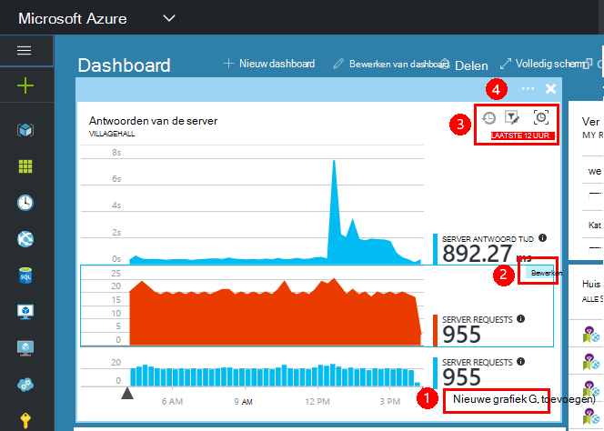

1. Een grafiek toevoegen aan de tegel. 
2. Stel de meetwaarde, groeperen op dimensie en stijl (tabel, grafiek) van een grafiek.
3. Sleep over het diagram om te zoomen. Klik op de knop ongedaan maken als het interval; opnieuw wilt instellen filter-eigenschappen instellen voor de grafieken op de tegel.
4. Tegel titel instellen.

Tegels vastgemaakt uit metrische explorer bladen hebben opties voor het bewerken van meer dan van een overzicht blade vastgemaakte tegels.

De oorspronkelijke tegel die u vastgemaakt wordt niet beïnvloed door de bewerkingen.

## Schakelen tussen dashboards

U kunt meer dan één dashboard opslaat en tussen de notitieblokken schakelen. Wanneer u een grafiek of blade vastmaakt, worden ze worden opgeteld aan het huidige dashboard.

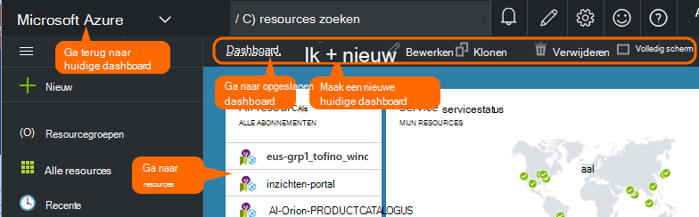

Bijvoorbeeld, kunnen er één dashboard voor het volledige scherm weergeven in de team-ruimte, en een andere voor algemene ontwikkeling.

Klik op het dashboard, een blade wordt weergegeven als een tegel: Klik hierop om naar het blad te gaan. Een grafiek wordt overgenomen door de grafiek in de oorspronkelijke locatie.

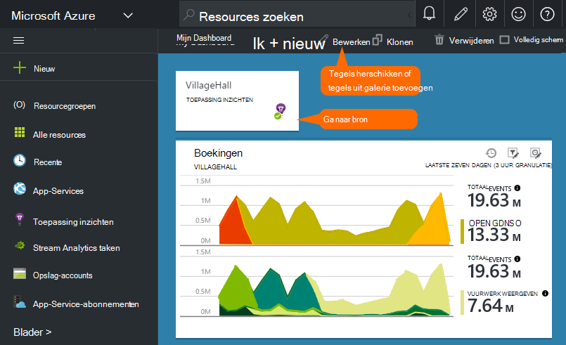

## Delen van dashboards

Wanneer u een dashboard hebt gemaakt, kunt u deze delen met andere gebruikers.

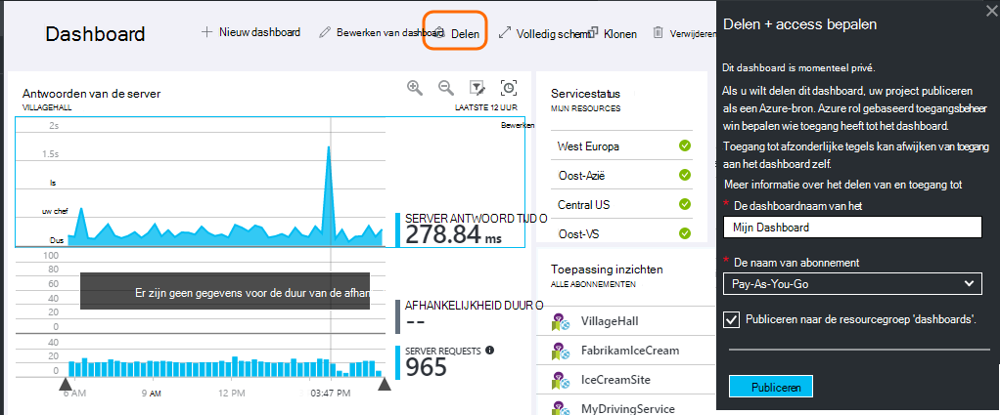

Meer informatie over [rollen en beheren in access](app-insights-resources-roles-access-control.md).

## App-navigatie

Het overzicht blad is de gateway bij naar meer informatie over uw app.

* **Een grafiek of de tegel** - Klik op een tegel of in een grafiek als u wilt zien van meer details over wat wordt weergegeven.

### Overzicht blade knoppen

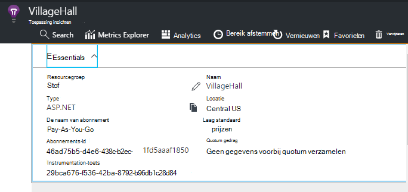

* [**Aan de doelstellingen Explorer**](app-insights-metrics-explorer.md) - uw eigen grafieken van prestaties en het gebruik maken.
* [**Zoeken**](app-insights-diagnostic-search.md) - specifieke exemplaren van gebeurtenissen, zoals aanvragen, uitzonderingen, onderzoeken of meld u sporen.
* [**Analytics**](app-insights-analytics.md) - krachtige query's van uw telemetrielogboek.
* **Tijdsbereik** - het bereik weergegeven door alle grafieken op het blad aanpassen.
* **Verwijderen** - verwijderen de resource van toepassing inzichten voor deze app. U moet ook de toepassing inzichten-pakketten verwijderen uit uw app-code, of de [toets instrumentation](app-insights-create-new-resource.md#copy-the-instrumentation-key) bewerken in uw app om te leiden telemetrielogboek naar een andere toepassing inzichten resource.

### Essentials-tabblad

* [Instrumentation toets](app-insights-create-new-resource.md#copy-the-instrumentation-key) - kunt u deze resource app identificeren. 
* Prijzen - functies beschikbaar en ingestelde volume caps maken.

### App-navigatiebalk

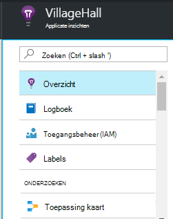

* **Overzicht** - terug naar het blad app-overzicht.
* **Activiteit log** - waarschuwingen en Azure administratieve gebeurtenissen.
* [**Toegangsbeheer**](app-insights-resources-roles-access-control.md) - toegang tot bieden aan teamleden en anderen.
* [**Labels**](../resource-group-using-tags.md) - gebruik tags om te groeperen van uw app met anderen.

ONDERZOEKEN

* [**Toepassing kaart**](app-insights-app-map.md) - actieve map met de onderdelen van de toepassing, afgeleid van de objectafhankelijkheidsinformatie.
* [**Proactief diagnostisch hulpprogramma**](app-insights-proactive-diagnostics.md) - controleren recente prestaties meldingen.
* [**Live gegevensstroom**](app-insights-metrics-explorer.md#live-stream) - vaste set handomdraai aan de doelstellingen, nuttig zijn bij het implementeren van een nieuwe build of foutopsporing.
* [**Beschikbaarheid / Web tests**](app-insights-monitor-web-app-availability.md) -normale aanvragen verzenden naar uw web-app van rond de world.* 
* [**Fouten, Performance**](app-insights-web-monitor-performance.md) - uitzonderingen, mislukt tarieven en reactietijden voor aanvragen voor uw app en voor aanmeldingsaanvragen van uw app aan [afhankelijkheden](app-insights-asp-net-dependencies.md).
* [**Prestaties**](app-insights-web-monitor-performance.md) - antwoord tijd, afhankelijkheid antwoord tijden. 
* [Servers](app-insights-web-monitor-performance.md) - items. Beschikbaar als u [Statuscontrole installeren](app-insights-monitor-performance-live-website-now.md).

* **Browser** - paginaweergave en AJAX prestaties. Beschikbaar als u [uw webpagina's instrument](app-insights-javascript.md).
* **Gebruik** - pagina weergeven, gebruiker en sessie telt. Beschikbaar als u [uw webpagina's instrument](app-insights-javascript.md).

CONFIGUREREN

* **Aan de slag** - inline zelfstudie.
* **Eigenschappen** - instrumentation sleutel, abonnement en resource-id.
* [Waarschuwingen](app-insights-alerts.md) - metrische waarschuwing configuratie.
* [Doorlopend exporteren](app-insights-export-telemetry.md) - uitvoer van telemetrielogboek met Azure storage configureren.
* [Prestaties testen](app-insights-monitor-web-app-availability.md#performance-tests) - het instellen van een synthetische belasting van uw website.
* [Quota en prijzen](app-insights-pricing.md) en [opname steekproeven](app-insights-sampling.md).
* **Toegang tot de API** - [los aantekeningen](app-insights-annotations.md) maken en voor de Data Access-API.
* [**Items werken**](app-insights-diagnostic-search.md#create-work-item) - verbinding maken met een werk analysesysteem zodat u bugs bij te werken tijdens het controleren van telemetrielogboek kunt maken.

Instellingen

* Als u [**vergrendelingen**](..\resource-group-lock-resources.md) - Azure resources vergrendelen
* [**Automatiseringsscript**](app-insights-powershell.md) - een definitie van de Azure resource exporteren, zodat u deze als een sjabloon gebruiken kunt om te maken van nieuwe resources.

ONDERSTEUNING

* **Verzoek voor ondersteuning** - vereist een betaald abonnement. Zie ook [Help-informatie opvragen](app-insights-get-dev-support.md).

## Hoe nu verder?

||
|---|---
|[Aan de doelstellingen explorer](app-insights-metrics-explorer.md) Filter en segment|
|[Diagnostische gegevens zoeken](app-insights-diagnostic-search.md) Zoeken en gebeurtenissen, gebeurtenissen, controleren en bugs bij te werken maken |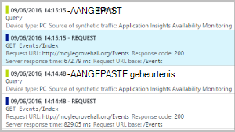
|[Analytics](app-insights-analytics.md) Krachtige querytaal| 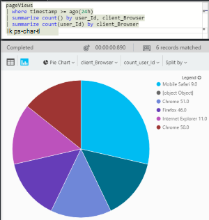

