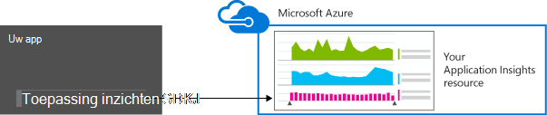

<properties 
    pageTitle="Gegevensretentie en opslag in de toepassing inzichten" 
    description="Bewaarbeleid en privacy verklaring omtrent het informatiebeheerbeleid" 
    services="application-insights" 
    documentationCenter=""
    authors="alancameronwills" 
    manager="douge"/>

<tags 
    ms.service="application-insights" 
    ms.workload="tbd" 
    ms.tgt_pltfrm="ibiza" 
    ms.devlang="na" 
    ms.topic="article" 
    ms.date="05/17/2016" 
    ms.author="awills"/>

# Gegevens verzamelen, en opslag in de toepassing inzichten 

*Er is een toepassing inzichten in de proefversie.*

Wanneer u [Visual Studio toepassing inzichten] installeert[ start] SDK in uw app, het telemetrielogboek over uw app verzendt naar de Cloud. Natuurlijk wilt verantwoordelijk ontwikkelaars u weten precies welke gegevens worden verzonden, wat gebeurt er met de gegevens en hoe ze nu de controle kunnen houden. Met name kan vertrouwelijke gegevens worden verzonden, waar is opgeslagen en hoe veilig is het? 

Eerst het kort:

* De standaard telemetrielogboek modules die worden uitgevoerd 'afmelden bij het vak' zijn waarschijnlijk gevoelige gegevens te verzenden naar de service. Het telemetrielogboek heeft betrekking op laden, prestaties en het gebruik van de doelstellingen uitzondering rapporten en andere diagnostische gegevens. De belangrijkste gebruikersgegevens zichtbaar zijn in de diagnostische rapporten worden URL's; maar de app niet mag in elk geval plaats vertrouwelijke gegevens als tekst zonder opmaak in een URL.
* U kunt de code die wordt verzonden extra aangepaste telemetrielogboek om u te helpen met diagnostische hulpprogramma's en het gebruik van controle schrijven. (Deze uitbreiden is een handige functie van de toepassing inzichten.) Het is mogelijk, per ongeluk naar deze programmacode schrijven zodat het persoonlijke en andere gevoelige gegevens bevat. Als uw toepassing met dergelijke gegevens werkt, moet u sterke controleren processen toepassen op alle code die u schrijft.
* Tijdens het ontwikkelen en testen van uw app, is het gemakkelijk te controleren wat wordt verzonden door de SDK. De gegevens worden weergegeven in de foutopsporing uitvoer vensters van de IDE en de browser. 
* De gegevens worden bewaard in [Microsoft Azure](http://azure.com) -servers in de Verenigde Staten. (Maar elke locatie kan worden uitgevoerd door de app.) Azure heeft [krachtige beveiliging verwerkt en voldoet aan een breed scala van naleving worden](https://azure.microsoft.com/support/trust-center/). Alleen u en uw team aangewezen hebt toegang tot uw gegevens. Microsoft personeel kunt beperkte toegang tot het alleen in bepaalde beperkte omstandigheden met uw kennis. Dit versleuteld tijdens overdracht, maar niet in de servers.

De rest van dit artikel meer volledig wordt ingegaan op wordt deze antwoorden. Deze is zo ontworpen dat zelfstandig, zodat u deze kunt weergeven voor collega's die geen deel uitmaken van uw team.

## Wat is een toepassing inzichten?

[Visual Studio-toepassing inzichten] [ start] is een service van Microsoft die u helpt verbeteren de prestaties en bruikbaarheid van uw live-toepassing. Deze bewaakt uw toepassing altijd die deze wordt uitgevoerd, zowel tijdens het testen en nadat u hebt gepubliceerd of deze geïmplementeerd. Toepassing inzichten Hiermee maakt u grafieken en tabellen die u, bijvoorbeeld weergeven, welke tijdstippen u zorgen dat de meeste gebruikers, hoe heeft gereageerd de app wordt uitgevoerd en hoe u ook deze door een externe services waarvan deze afhankelijk is aangeboden. Als er loopt, fouten of prestatieproblemen ondervindt, kunt u zoeken via de telemetriegegevens in detail voor een diagnose stellen bij de oorzaak. En de service wordt u e-mailberichten verzenden als er wijzigingen in de beschikbaarheid en de prestaties van uw app.

Wilt u deze functionaliteit, kunt u een toepassing inzichten SDK installeren in uw toepassing, dat deel van de code uitmaakt. Wanneer uw app wordt uitgevoerd, wordt de SDK de werking bewaakt en telemetrielogboek verzonden naar de toepassing inzichten-service. Dit is een cloudservice die worden gehost door [Microsoft Azure](http://azure.com). (Maar toepassing inzichten werkt voor alle toepassingen, niet alleen items die worden gehost in Azure wordt aangegeven.)

De service-toepassing inzichten worden opgeslagen en het telemetrielogboek geanalyseerd. Als u wilt zien van de analyse of in de zoekresultaten tot en met de opgeslagen telemetrielogboek, meld u aan bij uw Azure-account en opent u de resource van toepassing inzichten voor uw toepassing. U kunt ook toegang tot de gegevens delen met andere leden van uw team of met de opgegeven Azure abonnees.

U kunt gegevens die zijn geëxporteerd vanaf de service-toepassing inzichten, bijvoorbeeld met een database of naar externe extra hebben. U voorzien elk hulpmiddel van een speciale sleutel die u vanaf de service downloaden. De toets kan worden ingetrokken indien nodig. 

Toepassing inzichten SDK's zijn beschikbaar voor een bereik van toepassingstypen: webservices die worden gehost in uw eigen J2EE of ASP.NET-servers of in Azure; web clients - dat wil zeggen de code die wordt uitgevoerd in een webpagina. bureaublad-apps en services; apparaat-apps zoals Windows Phone-, iOS en Android. Worden alle telemetrielogboek verzenden naar dezelfde service.

## Welke gegevens worden deze verzameld?

### Ziet u hoe gegevens worden verzameld?

Er zijn drie bronnen van gegevens:

* De SDK, die u met uw app integreren [in de ontwikkelingsfase bevindt](app-insights-asp-net.md) of [tijdens runtime](app-insights-monitor-performance-live-website-now.md). Er zijn verschillende SDK's voor verschillende toepassingstypen. Er is ook een [SDK voor webpagina's](app-insights-javascript.md), die in de browser de eindgebruiker samen met de pagina wordt geladen.

 * Elke SDK heeft een aantal [modules](app-insights-configuration-with-applicationinsights-config.md), die het gebruik van verschillende technieken voor het verzamelen van verschillende soorten telemetrielogboek.
 * Als u de SDK hebt geïnstalleerd in de ontwikkelingsfase bevindt, kunt u de API voor het verzenden van uw eigen telemetrielogboek, naast de standaard modules. Deze aangepaste telemetrielogboek kunt opnemen alle gegevens die u wilt verzenden.
* In sommige-endwebservers, zijn er ook agenten die samen met de app uitvoeren en telemetrielogboek over processor en geheugen netwerk welke verzenden. Bijvoorbeeld kunnen Azure VMs, Docker hosts en [J2EE servers](app-insights-java-agent.md) deze agenten hebben.
* [Beschikbaarheid van de tests](app-insights-monitor-web-app-availability.md) worden uitgevoerd door Microsoft processen die aanvragen verzenden naar uw web-app met regelmatige tussenpozen. De resultaten zijn verzonden naar de service-toepassing inzichten.

### Welke soorten gegevens zijn verzameld?

De belangrijkste categorieën zijn:

* [Web server telemetrielogboek](app-insights-asp-net.md) - HTTP-aanvragen.  URI, tijd verwerking van de aanvraag, antwoordcode, IP-adres van client. Sessie-id.
* [Webpagina's](app-insights-javascript.md) - pagina, de gebruiker en de sessie telt. Laadtijden van pagina. Uitzonderingen. AJAX-oproepen.
* Prestatiemeteritems - geheugen, CPU, IO, welke netwerk.
* Clients en servers context - besturingssysteem, landinstelling, apparaattype, browser, schermresolutie.
* [Uitzonderingen](app-insights-asp-net-exceptions.md) en loopt - **stack wordt**, bouwen-id, type CPU. 
* [Afhankelijkheden](app-insights-asp-net-dependencies.md) - oproepen naar externe services zoals REST, SQL, AJAX. URI of verbindingstekenreeks, duur, success, opdracht.
* [Beschikbaarheid van de tests](app-insights-monitor-web-app-availability.md) - duur van de test en stappen, antwoorden.
* [Logboeken aanwijzen](app-insights-search-diagnostic-logs.md) en [aangepaste telemetrielogboek](app-insights-api-custom-events-metrics.md) - **Alles wat u in uw logboeken of telemetrielogboek code**.

[Meer details](#data-sent-by-application-insights).

## Hoe kan ik nagaan wat worden verzameld?

Als u de app met Visual Studio ontwikkelt, voert u de app in de foutopsporingsmodus voor (F5). Het telemetrielogboek wordt weergegeven in het uitvoervenster. Hierin kunt u deze kopiëren en een JSON voor eenvoudig inspectie notatie. 

Er is ook een beter leesbaar weergave in het venster diagnostische gegevens.

Open voor webpagina's van uw browser foutopsporing venster.

### Kan ik schrijven code als u wilt filteren van de telemetrielogboek voordat deze is verzonden?

Dit zou mogelijk door een [telemetrielogboek processor Plug](app-insights-api-filtering-sampling.md)schrijven.

## Hoe lang wordt de gegevens bewaard? 

Onbewerkte gegevenspunten (dat wil zeggen items die u in diagnostische zoeken controleren kunt) worden zeven dagen bewaard. Als u nodig hebt om de gegevens die langer dan die, kunt u [doorlopend exporteren](app-insights-export-telemetry.md) om deze te kopiëren naar een opslag-account.

Geaggregeerde gegevens (dat wil zeggen aantallen, gemiddelden en andere statistische gegevens die u in de Verkenner metrisch ziet) worden op een gelijk is aan of 1 minuut voor 30 dagen, en 1 uur of 1 dag (afhankelijk van het type) ten minste 90 dagen bewaard.

## Wie toegang heeft tot de gegevens?

De gegevens voor u zichtbaar is en, als er een organisatieaccount kan uw teamleden. 

Er kan u en uw teamleden worden geëxporteerd en kan worden gekopieerd naar andere locaties en doorgegeven aan andere personen.

#### Wat doet Microsoft met de gegevens die mijn app wordt verzonden naar toepassing inzichten?

Microsoft gebruikt de gegevens alleen alleen worden aangeboden als de service voor u.

## Waar is de gegevens opgeslagen? 

* In de Verenigde Staten. 

#### Kan deze ergens anders worden opgeslagen, bijvoorbeeld in Europa? 

* Niet op dit moment. 

#### Betekent dat mijn app heeft tot in de Verenigde Staten worden gehost?

* Nee. Uw toepassing kan elke locatie, worden uitgevoerd in uw eigen on-premises implementatie-hosts of in de Cloud.

## Hoe veilig is mijn gegevens?  

Inzichten van toepassing is een Azure-Service in de proefversie. Terwijl u in de proefversie van we werken tot de bescherming van uw gegevens per het beleid wordt beschreven in het [Azure beveiliging, Privacy en naleving whitepaper](http://go.microsoft.com/fwlink/?linkid=392408).

De gegevens worden opgeslagen in Microsoft Azure-servers. Voor-accounts in de Portal Azure worden accountbeperkingen beschreven in het [document van Azure beveiliging, Privacy en naleving](http://go.microsoft.com/fwlink/?linkid=392408). Voor accounts in de Visual Studio Team Services-Portal is het document [Visual Studio Team Services-gegevensbescherming](http://download.microsoft.com/download/8/E/E/8EE6A61C-44C2-4F81-B870-A267F1DF978C/MicrosoftVisualStudioOnlineDataProtection.pdf) is van toepassing. 

Toegang tot uw gegevens door Microsoft personeel is beperkt. We toegang tot uw gegevens met uw toestemming en als het noodzakelijk is ter ondersteuning van het gebruik van de toepassing inzichten is. 

Gegevens in aggregaat in alle onze klanten toepassingen (zoals gegevens tarieven en gemiddelde grootte van sporen) wordt gebruikt om de toepassing inzichten te verbeteren.

#### Kan van iemand anders telemetrielogboek ertoe leiden dat mijn gegevens toepassing inzichten?

Ze kunnen extra telemetrielogboek sturen naar uw account met behulp van de toets instrumentation, u in de code van uw webpagina's vindt. Met voldoende aanvullende gegevens, zou uw doelstellingen niet exact overeen met de prestaties en het gebruik van uw app.

Als u code wilt met andere projecten delen, moet u uw sleutel instrumentation verwijderen.

## Is de gegevens versleuteld? 

Niet binnen de servers op dit moment.

Alle gegevens worden gecodeerd doorloopt datacenters.

#### Is de gegevens tijdens overdracht van mijn toepassing met toepassing inzichten servers versleuteld?

Ja, we https gebruiken om gegevens te sturen naar de portal van bijna alle SDK's, inclusief endwebservers, apparaten en HTTPS webpagina's. De enige uitzondering is verzonden vanuit simpel HTTP webpagina's gegevens. 

## Persoonlijke informatie

#### Kan Personally Identifiable informatie (PII) inzicht krijgen in toepassing worden verzonden? 

Ja, is het mogelijk. 

Als de algemene richtlijnen:

* Meest standaard telemetrielogboek (dat wil zeggen telemetrielogboek verzonden zonder dat u schrijft een code,) bevat geen expliciete PII. Maar is het mogelijk om aan te geven personen door implicatie uit een verzameling gebeurtenissen.
* Berichten uitzondering en doelcellen kunnen PII bevatten
* Aangepaste telemetrielogboek - dat wil zeggen oproepen zoals TrackEvent die u schrijft in code met behulp van de API of log traces - kunt u kiezen gegevens bevat.

De tabel aan het einde van dit document bevat meer gedetailleerde beschrijvingen van de gegevens die worden verzameld.

#### Kan ik verantwoordelijk voor het voldoen aan wet- en regelgeving met betrekking tot PII?

Ja. Het is uw verantwoordelijkheid om ervoor te zorgen dat het verzamelen en gebruiken van de gegevens met regelgeving en met de Microsoft Online Services-voorwaarden voldoet.

U moet uw klanten correct informeren over de gegevens door die uw toepassing worden verzameld en hoe de gegevens worden gebruikt.

#### Kunnen mijn gebruikers uitschakelen toepassing inzichten?

Niet rechtstreeks. We bieden niet een schakeloptie waarmee uw gebruikers werken kunnen uitschakelen toepassing inzichten.

U kunt echter dergelijke functie implementeren in uw toepassing. De SDK's bevatten de instelling voor een API die uitgeschakeld telemetrielogboek siteverzameling worden. 

#### Mijn toepassing verzamelen per ongeluk gevoelige informatie. Kan toepassing inzichten sleept u deze gegevens zodat deze wordt niet behouden?

Toepassing inzichten niet filteren of de gegevens hebt verwijderd. U moet de gegevens correct beheren en verstuur van dergelijke gegevens inzicht krijgen in toepassing.

## Gegevens die zijn verzonden door de toepassing inzichten

De SDK's verschillen tussen platforms en er zijn verschillende onderdelen die u kunt installeren. (Verwijzen naar de [toepassing inzichten - aan de slag][start].) Elk onderdeel Hiermee worden verschillende gegevens.

#### Soorten gegevens die zijn verzonden in verschillende scenario 's

De actie  | Gegevensklassen die worden verzameld (Zie de volgende tabel)
---|---
[Toepassing inzichten SDK aan een .NET-web-project toevoegen][greenbrown] | ServerContext Geïmpliceerd Prestatiemeteritems Aanvragen **Uitzonderingen** Sessie gebruikers
[Statuscontrole op IIS installeren][redfield]|Afhankelijkheden ServerContext Geïmpliceerd Prestatiemeteritems
[Toepassing inzichten SDK toevoegen aan een Java-web-app][java]|ServerContext Geïmpliceerd Aanvragen Sessie gebruikers
[JavaScript SDK aan webpagina toevoegen][client]|ClientContext  Geïmpliceerd Pagina ClientPerf AJAX
[Standaardeigenschappen definiëren][apiproperties]|**Eigenschappen** van alle standaardkleuren of aangepaste gebeurtenissen
[Gesprek TrackMetric][api]|Numerieke waarden **Eigenschappen**
[Gesprekken bijhouden *][api]|De gebeurtenisnaam van de **Eigenschappen**
[Gesprek TrackException][api]|**Uitzonderingen** Stackdump **Eigenschappen**
SDK kan geen gegevens verzamelen. Bijvoorbeeld:   -geen toegang tot prestatiemeteritems  -uitzondering in telemetrielogboek initialisatiefunctie | SDK diagnostische gegevens
 

Voor [SDK's voor andere platforms][platforms], raadpleegt u hun documenten.

#### De soorten verzamelde gegevens

Verzamelde gegevens class | (Niet een volledige lijst) bevat 
---|---
**Eigenschappen**|**Alle gegevens - bepaald door uw code**
DeviceContext |ID, IP-, landinstelling, Apparaatmodel, netwerk, netwerktype, OEM-naam, schermresolutie, rol exemplaar, de naam van de rol, Type apparaat
ClientContext |Landinstelling, taal, netwerk, venster resolutie-besturingssysteem
Sessie | sessie-id
ServerContext |De computernaam van de, landinstelling, OS, apparaat, gebruikerssessie, gebruikerscontext, bewerking 
Geïmpliceerd |geografische locatie van IP-adres, tijdstempel,-besturingssysteem browser
Aan de doelstellingen | De naam van de metrische en waarde
Gebeurtenissen | De gebeurtenisnaam van de en waarde
PageViews | URL en de pagina of de schermnaam van het
Client perf | De naam van de URL's / pagina's, laadtijd voor browser
AJAX | HTTP-oproepen van een webpagina naar server
Aanvragen |URL, duur, antwoordcode
Afhankelijkheden|Type (SQL, HTTP,...), verbindingsreeks of URI, synchronisatie/asynchrone, duur, success, SQL-instructie (met statuscontrole)
**Uitzonderingen** | Type, **bericht**, oproep stapels, bron bestands- en lijn getal, thread-id
Loopt vast | Proces-id, de id van bovenliggend proces, vastlopen thread-id; patch installeren, -id, opbouwen;  uitzonderingstype, adres, reden; verborgen symbolen en registreert, binaire begin- en -adressen, binaire naam en het pad, cpu-type
Doelcellen | **Bericht** en ernst niveau
Prestatiemeteritems | Processortijd, beschikbare geheugen, tarief van de aanvraag, uitzondering rente, proces eigen bytes, IO rente, duur van de aanvraag, wachtrijlengte aanvragen
Beschikbaarheid | Web test antwoordcode, duur van elke stap test, de naam van de test, tijdstempel, success, antwoord tijd, testlocatie
SDK diagnostische gegevens | Bericht traceren of uitzondering 

U kunt [uitschakelen enkele van de gegevens door bewerken ApplicationInsights.config][config]

## Tegoeden

Dit product bevat GeoLite2 gegevens die zijn gemaakt door MaxMind, verkrijgbaar via [http://www.maxmind.com](http://www.maxmind.com).

## Video 's

#### Inleiding

> [AZURE.VIDEO application-insights-introduction]

#### Aan de slag

> [AZURE.VIDEO getting-started-with-application-insights]

<!--Link references-->

[api]: app-insights-api-custom-events-metrics.md
[apiproperties]: app-insights-api-custom-events-metrics.md#properties
[client]: app-insights-javascript.md
[config]: app-insights-configuration-with-applicationinsights-config.md
[greenbrown]: app-insights-asp-net.md
[java]: app-insights-java-get-started.md
[platforms]: app-insights-platforms.md
[pricing]: http://azure.microsoft.com/pricing/details/application-insights/
[redfield]: app-insights-monitor-performance-live-website-now.md
[start]: app-insights-overview.md

 