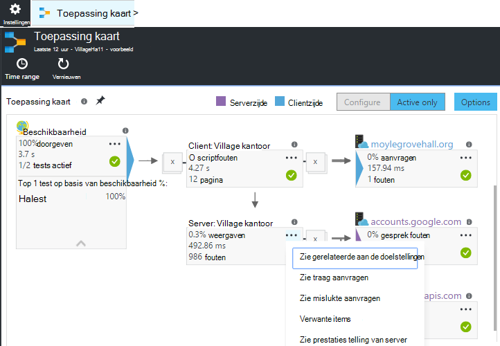

<properties 
    pageTitle="Diagnose van problemen met afhankelijkheden in toepassing inzichten" 
    description="Fouten en vertragingen veroorzaakt door afhankelijkheden zoeken" 
    services="application-insights" 
    documentationCenter=""
    authors="alancameronwills" 
    manager="douge"/>

<tags 
    ms.service="application-insights" 
    ms.workload="tbd" 
    ms.tgt_pltfrm="ibiza" 
    ms.devlang="na" 
    ms.topic="article" 
    ms.date="05/12/2016" 
    ms.author="awills"/>
 
# <a name="diagnosing-issues-with-dependencies-in-application-insights"></a>Diagnose van problemen met afhankelijkheden in toepassing inzichten


Een *afhankelijkheid* is een externe onderdeel dat wordt aangeroepen door de app. Dit is meestal een service die met HTTP, een database of een bestandssysteem genoemd. Of in uw script webpagina dit kan een oproep AJAX terug naar de server. In Visual Studio-toepassing inzichten, kunt u gemakkelijk zien hoe lang uw toepassing afhankelijkheden wacht en hoe vaak een oproep afhankelijkheid is mislukt.

## <a name="where-you-can-use-it"></a>Waar u deze kunt gebruiken

Afmelden bij het vak is afhankelijkheid monitoring momenteel beschikbaar zijn voor:

* ASP.NET-web-apps en services worden uitgevoerd op een IIS-server of op Azure
* [Java-WebApps](app-insights-java-agent.md)
* [Webpagina 's](https://azure.microsoft.com/blog/ajax-collection-in-application-insights/)

Voor andere typen, zoals apparaat-apps, kunt u uw eigen monitor de [TrackDependency-API](app-insights-api-custom-events-metrics.md#track-dependency)gebruiken.

Het beeldscherm out-van-het-box afhankelijkheid rapporten momenteel oproepen naar deze soorten afhankelijkheden:

* ASP.NET
 * SQL-databases
 * ASP.NET-webpagina en WCF-services met HTTP gebaseerde bindingen
 * Lokale of externe HTTP-oproepen
 * Azure DocumentDb, tabel, blobopslag en wachtrij
* Java
 * Oproepen naar een database via een [JDBC](http://docs.oracle.com/javase/7/docs/technotes/guides/jdbc/) -stuurprogramma, zoals MySQL, SQL Server, PostgreSQL of SQLite.
* Webpagina 's
 * [AJAX-oproepen](app-insights-javascript.md)

Klik nogmaals kunt u uw eigen SDK oproepen worden gedaan om de andere afhankelijkheden te houden kunt schrijven.

## <a name="to-set-up-dependency-monitoring"></a>Voor het instellen van afhankelijkheid bewaken

Installeer de juiste agent voor de host-server.

Platform | Installeren
---|---
IIS-Server | Ofwel [Statuscontrole op de server installeren](app-insights-monitor-performance-live-website-now.md) of [Upgrade van uw toepassing naar .NET framework 4.6 of hoger](http://go.microsoft.com/fwlink/?LinkId=528259) en installeer de [Toepassing inzichten SDK](app-insights-asp-net.md) in uw app.
Azure WebApp | [Toepassing inzichten extensie](app-insights-azure-web-apps.md)
Java-webserver | [Java-WebApps](app-insights-java-agent.md)
Webpagina 's | [JavaScript-beeldscherm](app-insights-javascript.md) (Geen aanvullende instellingen voorbij webpagina monitoring)
Azure-Cloudservice |  [Gebruik opstarten taak](app-insights-cloudservices.md#dependencies) of [installeren .NET framework 4.6 +](../cloud-services/cloud-services-dotnet-install-dotnet.md)  

De statuscontrole voor IIS-Servers niet nodig hebt u om uw bronproject met de toepassing inzichten SDK opnieuw te maken. 

## <a name="application-map"></a>Toepassing kaart

Toepassing kaart fungeert als visueel hulpmiddel om te ontdekken afhankelijkheden tussen de onderdelen van de toepassing. 



In de vakken, kunt u navigeren naar relevante afhankelijkheid en overige diagrammen.

Klik op de kleine [x] om samen te vouwen van een substructuur.

De plattegrond aan het [dashboard](app-insights-dashboards.md), waar deze zich volledig functioneel pincode.

[Meer informatie](app-insights-app-map.md).

## <a name="diagnosis"></a>Oplossen van prestatieproblemen afhankelijkheid in de webserver

Om te bepalen de prestaties van aanvragen op de server:


Schuif omlaag naar het raster van aanvragen bekeken:


De bovenste fase duurt erg lang zijn. Laten we eens kijken als we vindt waarin de tijd is besteed.

Klik op die rij om afzonderlijke verzoek om gebeurtenissen te bekijken:


Klik op een willekeurig exemplaar langdurige als u wilt deze verder te controleren.

> [AZURE.NOTE] Schuif omlaag iets kiezen van een exemplaar. Latentie in de pijplijn kan betekenen dat de gegevens voor de bovenste exemplaren onvolledig is.

Schuif omlaag naar de externe afhankelijkheid oproepen die betrekking hebben op deze aanvraag:


Het eruitziet grootste deel van de tijd aflossing die deze aanvraag is besteed aan een gesprek met een lokale service. 

Selecteer die rij voor meer informatie:


De details bevat voldoende gegevens diagnose van het probleem.


## <a name="failures"></a>Fouten

Als er mislukte aanvragen, klikt u op de grafiek.


Klik op via een aanvraag met het type en het exemplaar van de aanvraag, een mislukte oproep aan een externe afhankelijkheid zoeken.


## <a name="custom-dependency-tracking"></a>Aangepaste afhankelijkheid bijhouden

De standaardmodule afhankelijkheid-items detecteert automatisch externe afhankelijkheden zoals databases en REST API's. Maar u mogelijk enkele extra onderdelen op dezelfde manier worden behandeld. 

U kunt code die wordt verzonden objectafhankelijkheidsinformatie, schrijven met de dezelfde [TrackDependency API](app-insights-api-custom-events-metrics.md#track-dependency) die wordt gebruikt door de standaard modules.

Als u uw code met een constructie die u niet zelf hebt geschreven uzelf samenstelt, kan u bijvoorbeeld alle gesprekken, om vast te stellen wat de bijdrage van deze aanbrengt in uw antwoord tijden tijd. Als u deze gegevens weergegeven in de grafieken afhankelijkheid in de toepassing inzichten, verstuurt u deze via `TrackDependency`.

```C#

            var success = false;
            var startTime = DateTime.UtcNow;
            var timer = System.Diagnostics.Stopwatch.StartNew();
            try
            {
                success = dependency.Call();
            }
            finally
            {
                timer.Stop();
                telemetry.TrackDependency("myDependency", "myCall", startTime, timer.Elapsed, success);
            }
```

Als u uitschakelen in de standaard afhankelijkheid bijhouden-module wilt, verwijdert u de verwijzing naar DependencyTrackingTelemetryModule in [ApplicationInsights.config](app-insights-configuration-with-applicationinsights-config.md).


## <a name="ajax"></a>AJAX

Zie [webpagina's](app-insights-javascript.md).


 