<properties
    pageTitle="Detecteren, sorteren, een diagnose stellen bij"
    description="Loopt analyseren en gedetecteerd en diagnose stellen bij prestatieproblemen in uw toepassingen"
    authors="alancameronwills"
    services="application-insights"
    documentationCenter=""
    manager="douge"/>

<tags
    ms.service="application-insights"
    ms.workload="tbd"
    ms.tgt_pltfrm="ibiza"
    ms.devlang="na"
    ms.topic="article" 
    ms.date="11/06/2015"
    ms.author="awills"/>

# Ontdekken, te sorteren en te analyseren met toepassing inzichten

*Er is een toepassing inzichten in de proefversie.*

Toepassing inzichten Hiermee kunt u bepalen hoe uw app wordt uitgevoerd en die wordt gebruikt wanneer het live is. En als er een probleem is, krijgt u informatie over deze, kunt u nagaan wat het resultaat en kunt u de oorzaak bepalen.

Hier volgt een account van een team die webtoepassingen ontwikkelt:

* *'Een paar dagen geleden, wordt geïmplementeerd een "klein" hotfix. We een keer globaal test niet uitgevoerd, maar helaas sommige onverwachte wijzigen in de nettolading, veroorzaakt door incompatibiliteit tussen de voorste en achterste uiteinden hebt samengevoegd. Direct serveruitzonderingen toenam, onze waarschuwing gestart en we zijn aangebracht op de hoogte van de situatie. Een paar muisklikken ergens anders op de portal-toepassing inzichten wij weinig gegevens uit uitzondering callstacks om het probleem vast te stellen. We onmiddellijk ongedaan en de schade beperkt. Toepassing inzichten heeft dit deel van de devops cyclus aangebracht heel eenvoudig en sneller."*

Laten we eens kijken hoe het ontwikkelteam van een typisch web toepassing inzichten gebruikt om de prestaties te houden. Volgen we het team Fabrikam Bank die het online banksysteem (OBS) ontwikkelt.

Het team werkt op een cyclus als volgt:

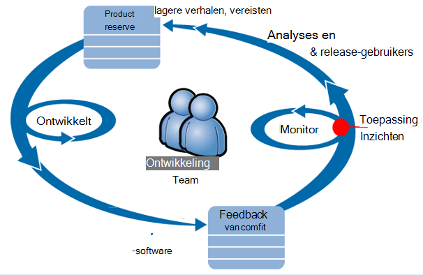

Vereisten ontstaan hun ontwikkeling achterstallig werk (takenlijst). Ze werken kortom sprints, die vaak werken software - meestal in de vorm van verbeteringen en uitbreidingen voor de bestaande toepassing bieden. De live-app wordt regelmatig bijgewerkt met de nieuwe functies. Het is live, bewaakt het team deze voor prestaties en het gebruik met behulp van de toepassing inzichten op te geven. Deze analyse-feeds weer aan hun ontwikkeling achterstallig werk.

Het team gebruikt toepassing inzichten om te controleren van de live webtoepassing nauw voor:
* Prestaties. Ze willen begrijpen hoe antwoord tijden variëren met verzoek om tellen; hoeveel CPU, het netwerk, schijf en andere resources worden gebruikt; en waar vind ik de knelpunten.
* Fouten. Als er uitzonderingen of mislukte aanvragen, of als een prestatie-item buiten het bereik vertrouwd gaat, het team moet snel weten dat ze kunnen doen.
* Gebruik. Wanneer er een nieuwe functie wordt uitgebracht, wordt het team wilt u weten in welke mate deze worden gebruikt en of gebruikers problemen met deze hebt.

Richten we ons op het gedeelte feedback van de cyclus:

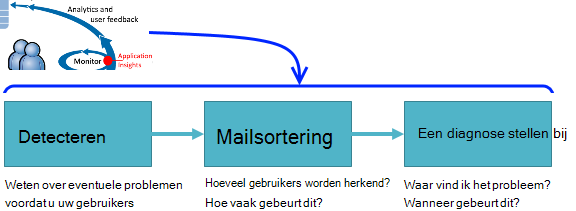

## Beschikbaarheid van slechte detecteren

Marcela Markova is een hoge ontwikkelaar op het team OBS en potentiële klanten op online prestaties controleren duurt. Ze stelt verschillende [web tests][availability]:

* Een enkel-URL-toets voor de belangrijkste aantekening toevoegen voor de app, http://fabrikambank.com/onlinebanking/. Ze stelt criterium van HTTP-code 200 en tekst 'Welkom!'. Als deze test mislukt, is er iets serieus er mis met het netwerk of de servers of wellicht een probleem met de implementatie. (Of iemand het Welkom heeft gewijzigd! bericht op de pagina zonder haar weten dat.)

* Een grondigere meerdere stappen test, die zich aanmeldt en wordt een lopende rekening vermelding, controle van enkele belangrijke informatie op elke pagina. Deze test controleert of de koppeling naar de database met gebruikersaccounts werkt. Ze gebruikt een factitief klant-id: een aantal voor testdoeleinden worden bijgehouden.

Met deze tests instellen, is de Marcela er zeker van te zijn dat het team snel wordt weten over een storing.  

Fouten worden weergegeven als rode puntjes aan de grafiek van web testen:

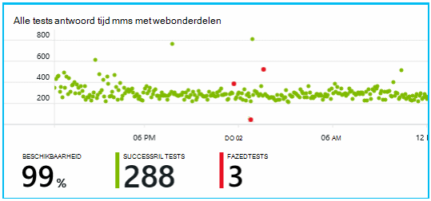

Een melding over een fout wordt belangrijker worden gestuurd naar het ontwikkelteam maar. Op die manier weten ze hierover voordat u vrijwel alle klanten.

## Prestatiegegevens controleren

Klik op de overzichtspagina in de toepassing inzichten er is een grafiek met een aantal [belangrijke maateenheden][perf].

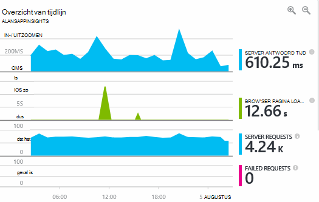

Laadtijd voor pagina browser wordt afgeleid van telemetrielogboek verzonden rechtstreeks vanuit webpagina's. Server antwoord tijd, server verzoek tellen en aantal mislukte aanvraag zijn alle gemeten in de webserver en verzonden naar toepassing inzichten daarvandaan.

Marcela is iets betrokken met de server antwoord graph, waarin de gemiddelde tijd tussen wanneer de server een HTTP-aanvraag ontvangt in de browser van een gebruiker en wanneer deze het antwoord geeft als resultaat. Het is niet ongebruikelijk om een variatie in deze grafiek weer te geven zoals belasting op het systeem varieert. Maar in dit geval er moet dat een relatie tussen kleine verhogingen van het aantal van aanvragen en groot groter is in de tijd antwoord lijkt. Dat kan geven aan dat het systeem alleen op de grenzen werkt. 

Ze opent de grafieken Servers:

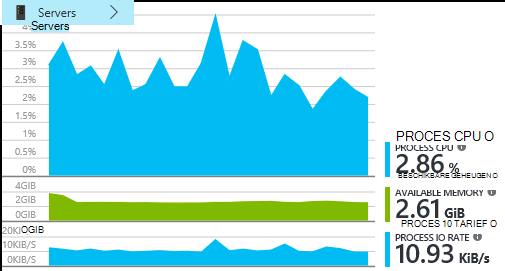

Er is geen teken van de resource beperking er, dus wellicht dat de dalen in de server antwoord grafieken zijn alleen vallen samen.

## Waarschuwingen

Toch wil ze de tijden antwoord gaten houden. Als ze te hoog gaat, die ze wil weten over deze direct.

Zodat zij Hiermee stelt u een [waarschuwingen][metrics], voor antwoord momenten groter is dan de drempelwaarde voor een normale. Het resultaat is haar betrouwbaarheid die zij over deze weten moet als antwoord tijden traag zijn.

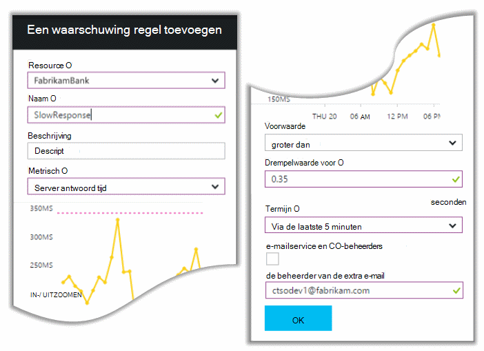

Waarschuwingen kunnen worden ingesteld op een groot aantal andere aan de doelstellingen. U kunt bijvoorbeeld een e-mailberichten ontvangen als het aantal uitzondering wordt hoog, anders wordt de beschikbare geheugen lage of als er is een piek in clientaanvragen.

## Proactief diagnostische waarschuwingen

Volgende dag, een e-mailwaarschuwingen van toepassing inzichten binnenkomen. Maar wanneer ze de wordt geopend, vindt u ze niet wordt de melding voor een antwoord tijd die zij ingesteld. In plaats daarvan krijgt ze er is een plotselinge toename van mislukte aanvragen - dat wil zeggen aanvragen die mislukt codes van 500 of meer geretourneerd.

Mislukte aanvragen zijn waar gebruikers een fout - meestal na een uitzondering opgetreden in de code hebt gezien. Wellicht zien zij een bericht met tekst "Helaas niet kan we nu de details van uw bijwerken" of, bij absolute gênante slechtste, een Stackdump op het scherm van de gebruiker, ter beschikking gesteld door de webserver.

Deze melding is onverwacht, omdat de laatste keer dat zij hebt bekeken, het aantal mislukte aanvraag encouragingly laag is. Er is een klein aantal mislukte naar verwachting in een bezet server. 

Het is ook een stukje een verrassing voor haar omdat ze niet hoeft te worden deze waarschuwing configureren. Proactief diagnostische gegevens wordt in feite automatisch geleverd met toepassing inzichten. Automatisch wordt aangepast aan van uw app gebruikelijke mislukt patroon en fouten "wordt gebruikt om te" op een bepaalde pagina of onder hoge belasting of gekoppeld aan andere aan de doelstellingen. De waarschuwing wordt alleen als er een nooit meer dan wat ze is kunnen verwachten komen.

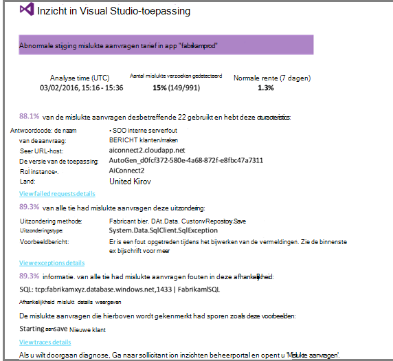

Dit is een zeer handige e-mailadres. Deze verhogen niet alleen een waarschuwing; een groot aantal de mailsortering en diagnostische werk, de optie ook doet.

Deze ziet u hoeveel klanten worden beïnvloed, en welke webpagina's of bewerkingen. Marcela kunt bepalen of ze het hele team bezig dit als een detailanalyse fire wil of of kan worden genegeerd tot de volgende week.

Het e-mailbericht wordt ook weergegeven dat een bepaalde uitzondering opgetreden en - even interessanter - dat de fout gekoppeld aan mislukte oproepen naar een bepaalde database is. Hier wordt uitgelegd waarom de fout ineens weergegeven hoewel van Marcela team alle updates niet onlangs geïmplementeerd. 

Zij hiermee de leider van de database-team. Ja, ze een warm oplossing in de afgelopen half uur; vrijgegeven en bestaande, wellicht misschien was er een schemawijziging secundaire...

Het probleem is dus voor de manier waarop wordt vastgesteld, zelfs voordat het wordt onderzocht logboeken en binnen 15 minuten ervan die het gevolg zijn. Marcela klikken kunt u echter op de koppeling naar de toepassing inzichten te openen. Deze rechtstreeks naar een mislukte aanvraag hebt geopend, en ze de mislukte database bellen in de bijbehorende lijst met afhankelijkheid oproepen kan zien. 

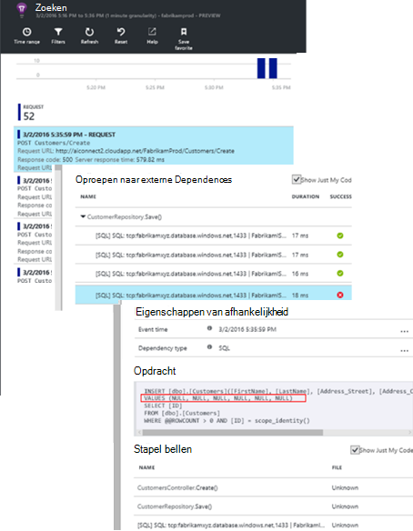

## Uitzonderingen detecteren

Feite redelijk van setup, worden [uitzonderingen](app-insights-asp-net-exceptions.md) gemeld toepassing inzicht krijgen automatisch. Ze kunnen ook worden opgenomen expliciet door in te voegen oproepen naar [TrackException()](app-insights-api-custom-events-metrics.md#track-exception) in de code:  

    var telemetry = new TelemetryClient();
    ...
    try
    { ...
    }
    catch (Exception ex)
    {
       // Set up some properties:
       var properties = new Dictionary <string, string>
         {{"Game", currentGame.Name}};

       var measurements = new Dictionary <string, double>
         {{"Users", currentGame.Users.Count}};

       // Send the exception telemetry:
       telemetry.TrackException(ex, properties, measurements);
    }

Het team Fabrikam Bank heeft die is voortgekomen altijd telemetrielogboek te verzenden op een uitzondering, tenzij er een duidelijke herstel.  

Hun strategie is in feite zelfs breder is dan: ze telemetrielogboek in elk geval waar de klant gefrustreerde is in wat ze uitvoeren, wilt ongeacht of deze met een uitzondering in de code al dan niet overeenkomt verzenden. Bijvoorbeeld, als het externe systeem voor tussen bank geeft als een bericht 'kan deze transactie niet voltooien' om een operationele reden (geen fout van de klant resultaat) vinden vervolgens ze die gebeurtenis.

    var successCode = AttemptTransfer(transferAmount, ...);
    if (successCode < 0)
    {
       var properties = new Dictionary <string, string>
            {{ "Code", returnCode, ... }};
       var measurements = new Dictionary <string, double>
         {{"Value", transferAmount}};
       telemetry.TrackEvent("transfer failed", properties, measurements);
    }

TrackException wordt gebruikt om te rapporteren uitzonderingen omdat deze een kopie van de stapel stuurt; TrackEvent wordt gebruikt om andere gebeurtenissen. U kunt de eigenschappen die mogelijke nuttig zijn in diagnose koppelen.

Uitzonderingen en gebeurtenissen worden weergegeven in de [Diagnostische zoeken] [ diagnostic] blade. U kunt inzoomen op deze om te zien van de aanvullende eigenschappen en doelcellen stapelen.

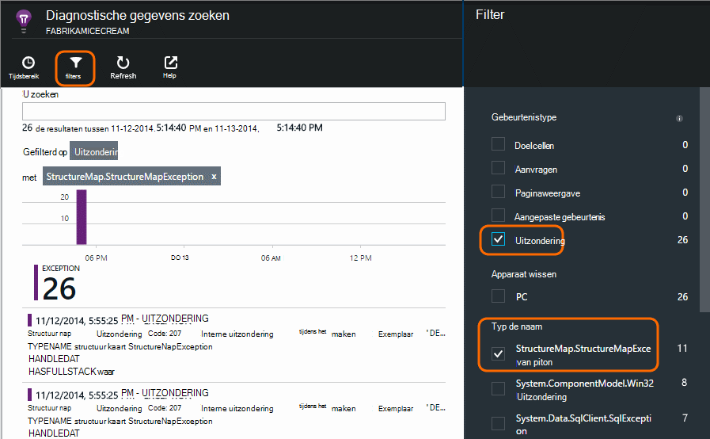

## Gebruikersactiviteiten controleren

Wanneer reacties consistente zijn en er enkele uitzonderingen zijn, wordt het team ontwikkelaar kunt zien over hoe u het verbeteren van de gebruikers, en hoe u aanmoedigen meer gebruikers om de gewenste doelstellingen te bereiken.

Een normale gebruiker reis via de website bevat bijvoorbeeld een wissen Verkoopoverzicht: veel klanten kijkt u naar de tarieven van verschillende soorten lening; Sommige van deze Vul het formulier aanhalingstekens; in en van de personen die aan een offerte, een paar verdergaan en verricht de lening.

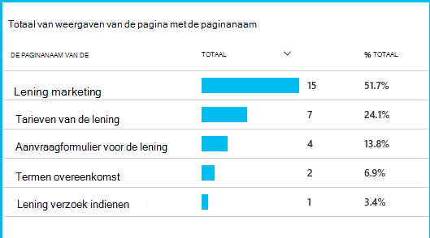

Door te overwegen waar de grootste getallen van klanten neerzetten af, kan het bedrijf informatie over het ophalen van meer gebruikers door naar de onderkant van het verkoopoverzicht werken. In sommige gevallen is er mogelijk een gebruikerservaring (UX)-fout - bijvoorbeeld de knop 'volgende' is moeilijk te vinden, of de instructies niet duidelijk zijn. Er zijn meer waarschijnlijk meer aanzienlijk bedrijven redenen decoratieve-outs: wellicht de lening tarieven te hoog zijn.

Ongeacht de redenen, helpt de gegevens het team komen wat gebruikers mee bezig zijn. Meer bijhouden oproepen kunnen worden ingevoegd als u wilt werken meer details. TrackEvent() kan worden gebruikt om te tellen eventuele gebruikersacties, uit de kleine details op een afzonderlijke knop naar aanzienlijk prestaties zoals betaalt een lening af.

Het team wordt ophalen gebruikt voor informatie over de gebruikersactiviteit. Tegenwoordig wanneer ze een nieuwe functie ontwerpt, werken deze af hoe ze feedback over het gebruik ervan krijgt. Ze ontwerpen bijhouden oproepen in de functie van de begindatum. Met het soort feedback kan het verbeteren van de functie in elke ontwikkelingscyclus.

## Proactief bewaken  

Marcela niet alleen gaan zitten rond het wachten op meldingen. Snel na elke opnieuw te installeren, gaat zij eens kijken [antwoord tijden] [ perf] -zowel de algehele afbeelding als de tabel met de laagst mogelijke aanvragen, evenals uitzondering telt.  

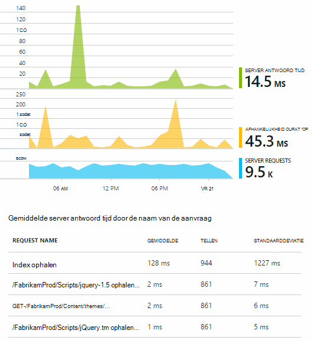

Ze kan de gevolgen voor de prestaties van elke implementatie, Beoordeel meestal vergelijken elke week met de laatste. Als er een plotselinge verslechtering, verheft zij die met de relevante ontwikkelaars.

## Mailsortering

Mailsortering - beoordeling van de ernst en de omvang van een probleem - is de eerste stap na detectie. Moeten we het team middernacht benadrukken? Of dit mag blijven tot de volgende handige tussenruimte in achterstallig werk? Er zijn enkele belangrijke vragen in mailsortering.

Hoe veel gebeurt dit? De grafieken op het blad overzicht geven sommige perspectief aan een probleem. Bijvoorbeeld de toepassing Fabrikam gegenereerd vier web test waarschuwingen één 's nachts. De grafiek bekijkt in de ochtend, kan het team zien dat er daadwerkelijk sommige rode puntjes, zijn wel nog steeds de meeste tests groen zijn. Inzoomen op de grafiek beschikbaarheid, is het wissen van te zijn dat deze problemen vanaf één toets locatie zijn. Dit is duidelijk een netwerkprobleem dat dit gevolgen heeft slechts één route en waarschijnlijk schakelt zelf.  

Daarentegen, is een stijging dramatische en stabiele in de grafiek uitzondering telt een antwoord of vaak duidelijk iets zorgen over.

Er is een handige mailsortering-e-mailbericht probeer het zelf. Als u hetzelfde probleem ondervindt, weet u dat u reële.

Welk deel van de gebruikers worden herkend? Als u een ruw antwoord, het tarief weer dat is mislukt door het aantal sessie te delen.

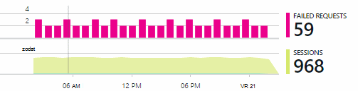

Vergelijk in het geval van traag antwoord wordt de tabel met de laagst mogelijke reageert aanvragen met de frequentie van het gebruik van elke pagina.

Het is belangrijk het geblokkeerde scenario? Als dit een functionele probleem geblokkeerd door een bepaalde gebruiker verhaal, maakt het uit veel? Als klanten kunnen niet hun rekeningen betalen, is dit ernstige; Als uw scherm kleur voorkeuren kunnen zij niet wijzigen, kunt wellicht deze wacht. De details van de gebeurtenis of uitzondering of de identiteit van de pagina traag ziet u waar klanten problemen.

## Diagnose

Diagnose is niet helemaal hetzelfde als voor foutopsporing in. Voordat u tracering via de code begint, moet u een idee van why, waar en wanneer het probleem optreedt.

**Wanneer gebeurt dit?** De historische weergave die is verstrekt door de gebeurtenis en metrisch grafieken kunt u gemakkelijk correlatie effecten met mogelijke oorzaken. Als er door onregelmatige pieken in antwoord tijd of uitzondering tarieven, bekijkt u de aanvraag telling: als dit waar de pieken op hetzelfde moment, zal deze als een probleem met bronnen eruitziet. Wilt u meer processor of geheugen toewijzen? Of is het een afhankelijkheid die het selectievakje laden kan geen beheren?

**Is het ons?**  Als er een plotselinge decoratieve in prestaties van een bepaald type - bijvoorbeeld wanneer de klant wil een rekeningoverzicht - aanvraag en vervolgens de mogelijkheid bestaat mogelijk een externe subsysteem in plaats van de webtoepassing. In aan de doelstellingen Explorer, schakelt u het tarief van afhankelijkheid is mislukt en duur afhankelijkheid tarieven en hun geschiedenis de loop van de afgelopen enkele uren of dagen met het probleem gevonden vergelijken. Als er zijn correleren wijzigingen, klikt u vervolgens een extern subsysteem mogelijk te wijten.  

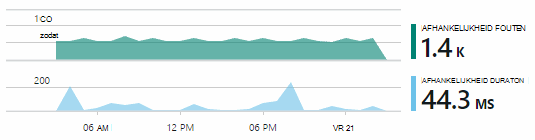

Enkele afhankelijkheidsproblemen traag zijn geolocatie problemen. Fabrikam Bank Azure virtuele machines gebruikt en ontdekt dat ze had per ongeluk zich de webserver en account server in verschillende landen. Een aanzienlijk is veroorzaakt door het migreren van een van deze.

**Wat we doen?** Als het probleem niet wordt weergegeven in een afhankelijkheid en zo niet altijd er, wordt deze waarschijnlijk veroorzaakt door een recente wijziging. Het historische perspectief verstrekt door de grafieken metrische en gebeurtenis kunt u gemakkelijk plotselinge wijzigingen correlatie met implementaties. Die wordt het zoeken naar het probleem.

**Wat gebeurt er?** Enkele problemen slechts zelden en kunnen lastig zijn om te achterhalen door te testen offline. Alle we kunt doen om te proberen om vast te leggen van de bug wanneer het zich daadwerkelijk live voordoet is. U kunt de stackdumps in uitzondering rapporten controleren. Bovendien kunt u de tracering oproepen schrijven met uw favoriete logboekregistratie framework of TrackTrace() of TrackEvent().  

Fabrikam had een tussentijds probleem met overdrachten tussen account, maar alleen met bepaalde accounttypen. Als u wilt weten over beter wat is er, ze TrackTrace() oproepen aan de belangrijkste punten uit de code, het accounttype als een eigenschap bijvoegen bij elk gesprek ingevoegd. Die een handomdraai uitfilteren alleen die sporen in diagnostische zoeken. Ze ook parameterwaarden als eigenschappen en maateenheden gekoppeld aan de trace-gesprekken.

## Omgaan met deze

Nadat u het probleem hebt vastgesteld, kunt u een abonnement te doen. Wellicht moet u een recente wijziging terugdraaien of wellicht u kunt alleen verdergaan en op te lossen. Als de correctie is ingevuld, kunt toepassing inzichten u nagaan of u is voltooid.  

Het ontwikkelteam van Fabrikam Bank duren een meer gestructureerde aanpak aan prestatiemeting dan ze gebruikt om te voordat ze toepassing inzichten gebruikt.

* Ze instellen prestaties doelen in specifieke maatregelen in de overzichtspagina van toepassing inzichten.

* Ze ontwerpen prestatiemetingen in de toepassing van de begindatum, zoals de criteria die de voortgang van de gebruiker door 'schoorstenen.' meten  

## Gebruik

Toepassing inzichten kunnen ook worden gebruikt voor meer informatie over wat gebruikers doen met een app. Zodra deze soepel wordt uitgevoerd, wilt het team weten welke functies de populairste zijn, wat gebruikers wel en problemen met te houden en hoe vaak ze keert u terug. Zodat ze hun komende werk prioriteit te bepalen. En ze waarmee het succes van elke functie als onderdeel van de ontwikkelingscyclus kunnen plannen. [Zie voor meer informatie][usage].

## Uw toepassingen

Die staat dus hoe een team gebruik toepassing inzichten niet alleen aan de afzonderlijke problemen oplossen, maar aan hun ontwikkelingscyclus te verbeteren. Ik hopen dat deze u heeft gegeven, kunt u sommige ideeën over hoe toepassing inzichten kunt verbeteren de prestaties van uw eigen toepassingen.

## Video

[AZURE.VIDEO performance-monitoring-application-insights]

<!--Link references-->

[api]: app-insights-api-custom-events-metrics.md
[availability]: app-insights-monitor-web-app-availability.md
[diagnostic]: app-insights-diagnostic-search.md
[metrics]: app-insights-metrics-explorer.md
[perf]: app-insights-web-monitor-performance.md
[usage]: app-insights-web-track-usage.md
 
