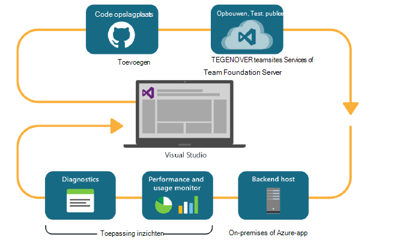
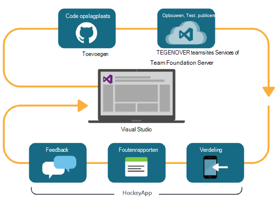

<properties
    pageTitle="Gebruiksanalyses voor ontwikkelaars"
    description="DevOps met Visual Studio, toepassing inzichten en HockeyApp"
    authors="alancameronwills"
    services="application-insights"
    documentationCenter=""
    manager="douge"/>

<tags
    ms.service="application-insights"
    ms.workload="tbd"
    ms.tgt_pltfrm="ibiza"
    ms.devlang="na"
    ms.topic="article" 
    ms.date="05/18/2016"
    ms.author="awills"/>

# Ontwikkelaars analyses met toepassing inzichten en HockeyApp

*Er is een toepassing inzichten in de proefversie.*

Veel projecten werken een snelle [DevOps](https://en.wikipedia.org/wiki/DevOps) cyclus. Ze maken en hun toepassingen verdelen onder feedback vragen over deze en wat gebruikers ermee doen en gebruikt u deze kennis plannen verder productontwikkeling. 

Als u wilt controleren gebruik en de prestaties, is het belangrijk om te laten telemetrielogboek van de configuratietoepassing live, maar ook feedback van de gebruikers zelf. 

Veel systemen uit meerdere onderdelen worden gemaakt: een webservice, backend-processors of gegevens winkels en clientsoftware uitgevoerd in de browser van de gebruiker of als een app in een telefoon of ander apparaat. Het telemetrielogboek van deze verschillende onderdelen heeft om samen te gaan.

Aantal versies van beperkte distributie naar aangewezen testers; zijn er ook ingedeeld flighting (testen van nieuwe functies met beperkte doelgroepen) en A | B testen (parallelle tests van alternatieve interface).

Er is geen eenvoudige zaak onderzoeken te beheren en integratie van de controle over meerdere onderdelen van de client en server. Dit proces is een essentieel onderdeel van de architectuur van de toepassing: we een systeem van dit soort zonder een iteratieve ontwikkelingscyclus en goede hulpprogramma's voor controle niet kunt maken.

In dit artikel bespreken we aan hoe de controle aspecten van de cyclus devOps passend met de andere gedeelten van het proces maken. 

Als u kijken naar een specifieke voorbeeld wilt, ziet [een interessante casestudy](http://aka.ms/mydrivingdocs) die bestaat uit meerdere onderdelen voor clients en servers.

## Een DevOps cyclus

Visual Studio en ontwikkelaars Analytics hulpmiddelen voor dienst een goed geïntegreerd devOps. Hier is bijvoorbeeld een normale cyclus voor een webtoepassing (die mogelijk Java, Node.js of ASP.NET):

* Een ontwikkelaar wordt ingecheckt in de bibliotheek code of samengevoegd met de belangrijkste tak. De bibliotheek cijfer in deze afbeelding is, maar wordt gelijkmatig [Team Foundation-versiebeheer](https://www.visualstudio.com/docs/tfvc/overview).
* De wijzigingen activeren een toets opbouwen en eenheid. De service opbouwen kan in [Visual Studio Team Services of de tegenhanger on-premises implementatie, Team Foundation Server](https://www.visualstudio.com/docs/vsts-tfs-overview)zijn. 
* Een voltooide build en testen van eenheden kunnen [een automatische implementatie trigger](https://www.visualstudio.com/docs/release/author-release-definition/more-release-definition). De host van de web-app kan zijn eigen webserver of Microsoft Azure. 
* Telemetrielogboek vanuit de app live wordt verzonden naar de [Toepassing inzichten](app-insights-overview.md), zowel naar de server en [van clientbrowsers](app-insights-javascript.md). Hiervoor kunt u alleen de prestaties van de app en het gebruik patronen analyseren. Krachtige [Hulpmiddelen voor zoeken](app-insights-analytics.md) help u eventuele problemen onderzoeken. [Waarschuwingen](app-insights-alerts.md) moet u beschikken over een probleem zodra deze zich voordoet. 
* Volgende ontwikkelingscyclus geïnformeerd door uw analyse van de live telemetrielogboek.

### Apparaat en de bureaublad-apps

Apparaten en bureaublad-apps verschilt het deel van de verdeling van de cyclus enigszins, omdat we zojuist worden niet naar een of twee servers uploaden. In plaats daarvan kunnen een voltooide build en testen van eenheden [trigger uploaden naar HockeyApp](https://support.hockeyapp.net/kb/third-party-bug-trackers-services-and-webhooks/how-to-use-hockeyapp-with-visual-studio-team-services-vsts-or-team-foundation-server-tfs). HockeyApp houdt toezicht op verdeling met uw team van testgebruikers (of het publiek, als u liever). 

HockeyApp verzamelt ook prestatie- en gebruiksgegevens, in de vorm van:

* Feedback van Verbatim gebruikers met schermafbeeldingen
* Foutenrapporten
* Aangepaste telemetrielogboek gecodeerde door u.

De cyclus devOps is opnieuw voltooid terwijl u uw toekomstige plannen op grond van het soort feedback ervaring aanbrengt.

## Bij het instellen van ontwikkelaars Analytics

Voor elk onderdeel van uw toepassing - mobiele of het web of de bureaublad - zijn de stappen in principe hetzelfde. Voor veel soorten app kunt Visual Studio automatisch u bepaalde stappen.

1. De juiste SDK toevoegen aan uw app. Apparaat-apps voor deze is HockeyApp, en voor webservices-toepassing inzichten. Elk heeft verschillende varianten voor andere platforms. (Het is ook mogelijk een van beide SDK gebruiken voor de bureaublad-apps, hoewel het is raadzaam HockeyApp te.)
2. Registreer uw app bij de portal-toepassing inzichten of HockeyApp, afhankelijk van de SDK die u hebt gebruikt. Dit is waar u te zien krijgt analytics uit uw live-app. U krijgt een instrumentation toets of -ID die u in uw app zodanig configureren dat de SDK weet waar de telemetrielogboek verzenden.
3. Aangepaste code (indien gewenst) toevoegen als u wilt melden gebeurtenissen of de doelstellingen, om u te helpen met diagnostische gegevens of om te analyseren prestaties- of gebruiksweergave. Er is een groot aantal monitoring ingebouwd, zodat u dit op uw eerste cyclus niet nodig.
3. Voor apps van apparaat:
 * Upload een opbouwen foutopsporing naar HockeyApp. Hier kunt u deze aan een team van testgebruikers distribueren. Wanneer u bestanden uploadt latere genereert, het team krijgt.
 * Bij het instellen van uw continue service maken, maakt u een release-definitie die gebruikmaakt van de invoegtoepassing stap voor het uploaden naar HockeyApp.

### Analyses en exporteren voor HockeyApp telemetrielogboek

U kunt aangepaste HockeyApp onderzoeken en meld u via de analyses en continue exporteren functies van toepassing inzichten door [het instellen van een brug](app-insights-hockeyapp-bridge-app.md)telemetrielogboek.

## Volgende stappen
 
Hier volgen de gedetailleerde instructies voor de verschillende soorten app:

* [ASP.NET-web-app](app-insights-asp-net.md) 
* [Java WebApp](app-insights-java-get-started.md)
* [Node.js WebApp](https://github.com/Microsoft/ApplicationInsights-node.js)
* [iOS-app](https://support.hockeyapp.net/kb/client-integration-ios-mac-os-x-tvos/hockeyapp-for-ios)
* [Mac OS X-app](https://support.hockeyapp.net/kb/client-integration-ios-mac-os-x-tvos/hockeyapp-for-mac-os-x)
* [Android-app](https://support.hockeyapp.net/kb/client-integration-android/hockeyapp-for-android-sdk)
* [Universele Windows-app](https://support.hockeyapp.net/kb/client-integration-windows-and-windows-phone/how-to-create-an-app-for-uwp)
* [Windows Phone 8 en 8.1-app](https://support.hockeyapp.net/kb/client-integration-windows-and-windows-phone/hockeyapp-for-windows-phone-silverlight-apps-80-and-81)
* [Presentatie van Windows Foundation-app](https://support.hockeyapp.net/kb/client-integration-windows-and-windows-phone/hockeyapp-for-windows-wpf-apps)

