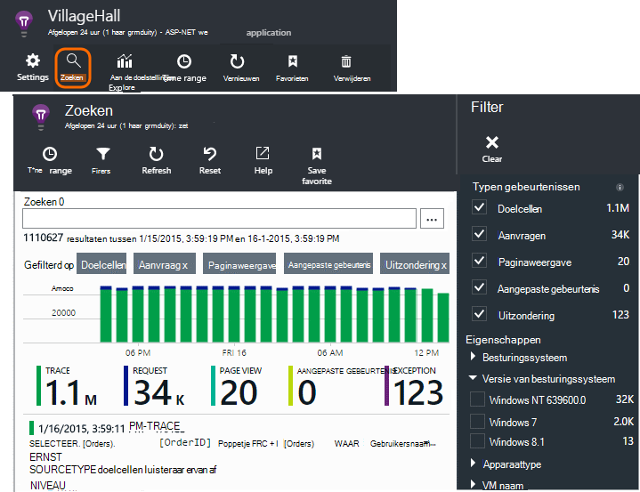
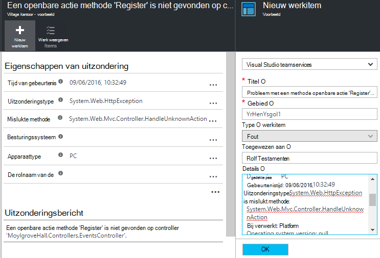

<properties 
    pageTitle="Met diagnostische zoeken | Microsoft Azure" 
    description="Zoeken en filteren van afzonderlijke gebeurtenissen, aanvragen, en meld u sporen." 
    services="application-insights" 
    documentationCenter=""
    authors="alancameronwills" 
    manager="douge"/>

<tags 
    ms.service="application-insights" 
    ms.workload="tbd" 
    ms.tgt_pltfrm="ibiza" 
    ms.devlang="na" 
    ms.topic="article" 
    ms.date="06/09/2016" 
    ms.author="awills"/>
 
# Diagnostische gegevens zoeken in de toepassing inzichten gebruiken

Diagnostische gegevens tijdens het zoeken is een functie van de [Toepassing inzichten] [ start] die u gebruikt om te zoeken en verkennen van afzonderlijke telemetrielogboek items, zoals paginaweergaven, uitzonderingen, of aanvragen met webonderdelen. En u kunt log sporen en gebeurtenissen die u hebt gecodeerd weergeven.

## Waar ziet u diagnostische gegevens zoeken?

### In de portal van Azure

Diagnostische gegevens zoeken kunt u expliciet openen:

Dit wordt ook geopend wanneer u klikt op via sommige diagrammen en raster items. In dit geval zijn de filters vooraf ingesteld kunt richten op het type item dat u hebt geselecteerd. 

Als uw toepassing een webservice is, bevat het blad overzicht bijvoorbeeld een grafiek van het volume van aanvragen. Klikt u erop en u toegang hebt tot een meer gedetailleerde grafiek met een lijst met hoeveel aanvragen voor elke URL zijn aangebracht. Klik op een rij en krijgt u een lijst met de afzonderlijke aanvragen voor die URL:

De hoofdtekst van diagnostische gegevens zoeken is een lijst met telemetrielogboek items - serveraanvragen, pagina weergaven, aangepaste gebeurtenissen die u hebt gecodeerd, enzovoort. Boven aan de lijst wordt een samenvatting grafiek met aantallen gebeurtenissen na verloop van tijd.

Gebeurtenissen meestal weergegeven in zoekresultaten voor diagnostische voordat deze worden weergegeven in metrische explorer. Hoewel het blad met tussenpozen wordt vernieuwd, klik u op vernieuwen als u voor een bepaalde gebeurtenis aan het wachten bent.

### In Visual Studio

Open het venster Zoeken in Visual Studio:

Het venster zoeken heeft dezelfde functies als de webportal:

## Steekproeven

Als uw app een groot aantal telemetrielogboek genereert (en de ASP.NET SDK versie 2.0.0-beta3 dat u gebruikt of hoger), de module Geavanceerde steekproeven automatisch afgetrokken van het volume dat wordt verzonden naar de portal door te sturen van alleen een vertegenwoordiger fractie van gebeurtenissen. Gebeurtenissen die betrekking op één verzoek hebben worden echter worden geselecteerd of uitgeschakeld als een groep, zodat u tussen gerelateerde gebeurtenissen navigeren kunt. 

[Algemene informatie over de steekproeven](app-insights-sampling.md).

## Afzonderlijke items controleren

Selecteer een item telemetrielogboek om sleutelvelden weer te geven en verwante items. Als u zien van de volledige reeks velden wilt, klikt u op '...'. 

Als u de volledige reeks velden zoekt, gebruikt u gewone tekenreeksen (zonder jokertekens). De beschikbare velden, hangt af van het type telemetrielogboek.

## Werkitem maken

U kunt een fout in Visual Studio Team Services maken met de gegevens van een item telemetrielogboek. 

De eerste keer dat u dit doet, wordt u gevraagd om een koppeling naar uw Team Services-account en project te configureren.

(U kunt ook naar het blad configuratie openen Klik op Instellingen > werkitems.)

## Typen gebeurtenissen filteren

Open het blad Filter en kiest u de gebeurtenistypen die u wilt zien. (Als u later herstellen van de filters waarmee u het blad hebt geopend wilt, klikt u op beginwaarden.)

De gebeurtenistypen zijn:

* **Doelcellen** - diagnostische logboeken, met inbegrip van TrackTrace, log4Net NLog en System.Diagnostic.Trace gesprekken.
* **Aanvragen** - HTTP-aanvragen ontvangen door de server-toepassing, inclusief pagina's, scripts, afbeeldingen, bestanden in de stijl en gegevens. Deze gebeurtenissen worden gebruikt voor de vergaderverzoeken en antwoorden overzicht grafieken maken.
* **Paginaweergave** - Telemetrielogboek verzonden door de webclient gebruikt om pagina weergaverapporten te maken. 
* **Aangepaste gebeurtenis** : als u oproepen naar TrackEvent() ingevoegd in volgorde naar [gebruik controleren][track], kunt u deze hier zoeken.
* **Uitzondering** - onbekende uitzonderingen in de server en die u zich aanmeldt met behulp van TrackException().

## Filteren op eigenschapswaarden

U kunt gebeurtenissen op de waarden van hun eigenschappen filteren. De beschikbare eigenschappen, hangt af van de typen gebeurtenissen die u hebt geselecteerd. 

Kies bijvoorbeeld aanvragen met een specifieke antwoordcode.

Kiezen geen waarden van een bepaalde eigenschap heeft hetzelfde resultaat als het kiezen van alle waarden; deze activeert uitschakelen filteren op die eigenschap.

### Zoekopdrachten verfijnen

Zoals u ziet dat de aantallen aan de rechterkant van de filterwaarden hoeveel exemplaren er zijn in de huidige gefilterde groep weergeven. 

In dit voorbeeld is dit wissen die de `Reports/Employees` aanvragen resultaten in de meeste van de 500 fouten ziet:

Als u ook Zie welke andere gebeurtenissen zijn er tijdens deze periode wilt, kunt u bovendien **opnemen gebeurtenissen met ongedefinieerd eigenschappen**controleren.

## Bots en web test-verkeer verwijderen

Gebruik het filter **reële of synthetische verkeer** en **reële**controleren.

U kunt ook filteren op **bron van synthetische-verkeer is toegestaan**.

## Afzonderlijke vermeldingen controleren

De naam van die aanvraag toevoegen aan de set filter en kunt u afzonderlijke exemplaren van die gebeurtenis vervolgens controleren.

De details weergeven voor verzoek gebeurtenissen, uitzonderingen die zijn aangebracht terwijl de aanvraag is verwerkt.

Klik op een uitzondering om de detailgegevens, inclusief de tracering stapel weer te geven.

## Gebeurtenissen met dezelfde eigenschap zoeken

Alle items met dezelfde eigenschapswaarde vinden:

## Zoeken op metrische waarde

Aanvragen antwoord altijd > 5s krijgen.  Tijden worden aangegeven in tikken: 10 000 maatstreepjes = 1ms.

## De gegevens zoeken

U kunt zoeken naar termen in een van de eigenschapswaarden. Dit is vooral handig als u [aangepaste gebeurtenissen] hebt geschreven[ track] met eigenschapswaarden. 

Het is raadzaam een bereik, als zoekopdrachten voor een kortere datumbereik sneller worden tijd in te stellen. 

Zoeken naar termen, niet subreeksen. Termen zijn alfanumerieke tekenreeksen met enkele interpunctie, zoals '.' en '_'. Bijvoorbeeld:

term|*niet* is overeenkomt met de|maar deze komen overeen met
---|---|---
HomeController.About|over Start|h\*over Start\*
IsLocal|lokale is \*lokale|ISL\* islocal i\*l\*
Nieuwe vertraging|w d|Nieuw vertraging n\* en d\*

Hier volgen de zoekexpressies die u kunt gebruiken:

Voorbeeldquery | Effect 
---|---
vertragen|Zoeken naar alle gebeurtenissen in het datumbereik waarvan de velden de term bevatten "vertraagd"
database??|Komt overeen met database01, databaseAB... ? is niet toegestaan aan het begin van een zoekterm.
database * |Komt overeen met de database, database01, databaseNNNN  * is niet toegestaan aan het begin van een zoekterm
Apple en banaan|Zoek de gebeurtenissen die beide termen bevatten. Gebruik kapitaal 'en' niet 'en'.
Apple banaan of-bewerking Apple banaan|Zoek de gebeurtenissen die een van beide termen bevatten. Gebruik 'Of' niet 'of'. < /br/ > korte formulier.
Apple niet banaan Apple-banaan|Zoek de gebeurtenissen die één term, maar niet op de andere bevatten. Korte formulier.
App * en banaan-(grape pear)|Logische operators en haakjes.
"Metrisch": 0 tot en met 500 "Metrisch": 500 aan * | Zoek de gebeurtenissen die de benoemde maateenheden in het waardebereik bevatten.

## Uw zoekopdracht opslaan als

Als u de gewenste filters hebt ingesteld, kunt u de zoekopdracht opslaan als favoriet. Als u in een organisatie-account werkt, kunt u kiezen of u wilt delen met andere teamleden.

Zie de zoekopdracht opnieuw, **gaat u naar het blad Overzicht** en Favorieten openen:

Als u met relatieve tijdsbereik opgeslagen, heeft het opnieuw geopend blad de meest recente gegevens. Als u met Absolute tijdsbereik hebt opgeslagen, ziet u dezelfde gegevens elke keer.

## Meer telemetrielogboek inzicht krijgen in toepassing verzenden

Naast de out-van-het-box-telemetrielogboek verzonden door de toepassing inzichten SDK, kunt u het volgende doen:

* Log traces van uw favoriete logboekregistratie framework in [.NET] vastleggen[ netlogs] of [Java][javalogs]. Dit betekent dat u kunt traces log doorzoeken en deze afstemmen met paginaweergaven, uitzonderingen en andere gebeurtenissen. 
* [Programmacode schrijven] [ track] aangepaste gebeurtenissen, paginaweergaven en uitzonderingen verzenden. 

[Meer informatie over het verzenden van Logboeken en aangepaste telemetrielogboek inzicht krijgen in toepassing][trace].

## Q & A

### Hoeveel gegevens blijven behouden?

Maximaal 500 gebeurtenissen per seconde van elke toepassing. Gebeurtenissen worden gedurende zeven dagen bewaard.

### Hoe kan ik POST-gegevens in mijn serveraanvragen zien?

We niet Meld u aan de POST-gegevens automatisch, maar u kunt [TrackTrace of logboek oproepen][trace]. Plaats de bericht-gegevens in de bericht-parameter. U kunt niet filteren op het bericht de manier waarop die u eigenschappen kunt, maar de groottelimiet overschrijden langer is.

## Volgende stappen

* [Logboeken en aangepaste telemetrielogboek inzicht krijgen in toepassing verzenden][trace]
* [Beschikbaarheid en serverreactie tests instellen][availability]
* [Problemen oplossen][qna]

<!--Link references-->

[availability]: app-insights-monitor-web-app-availability.md
[javalogs]: app-insights-java-trace-logs.md
[netlogs]: app-insights-asp-net-trace-logs.md
[qna]: app-insights-troubleshoot-faq.md
[start]: app-insights-overview.md
[trace]: app-insights-search-diagnostic-logs.md
[track]: app-insights-api-custom-events-metrics.md

 