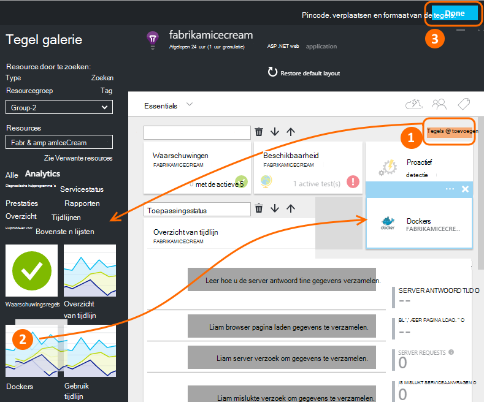
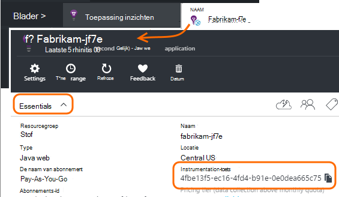
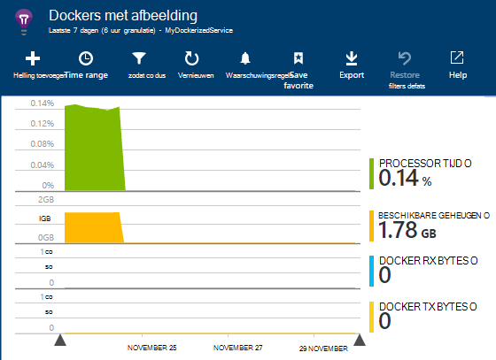
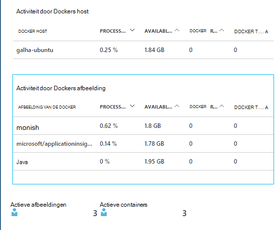
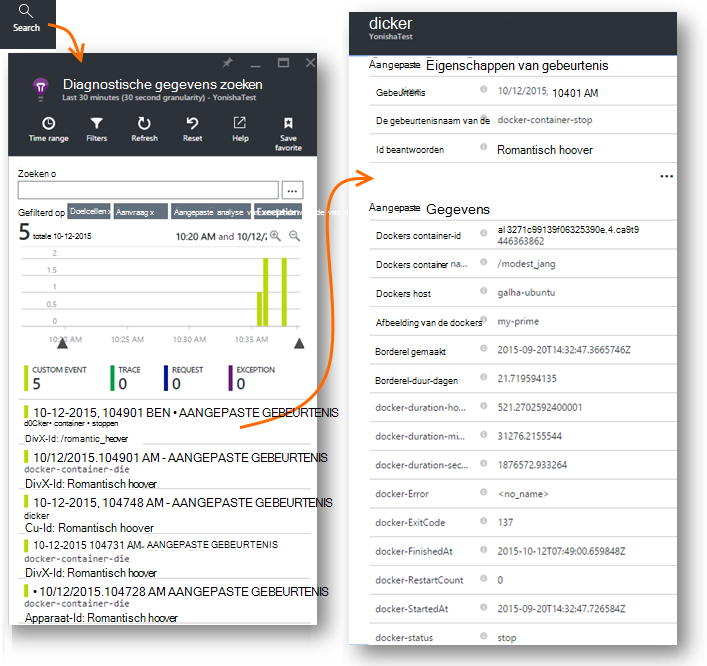
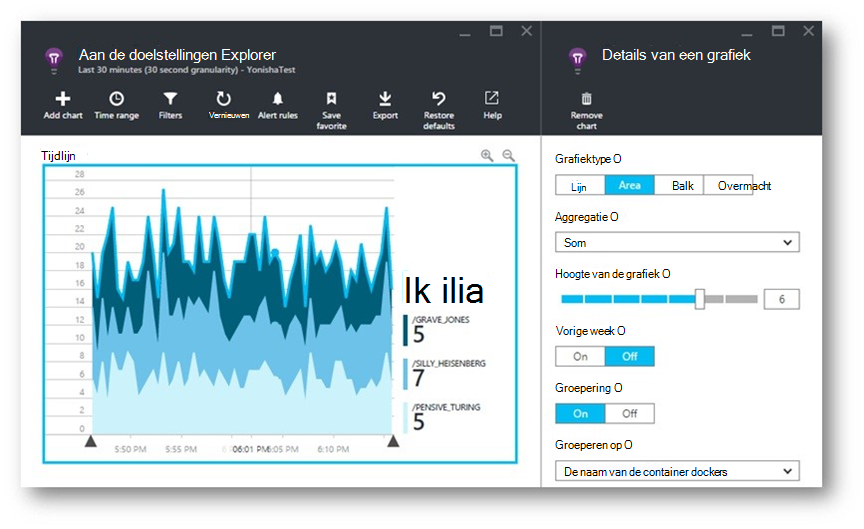
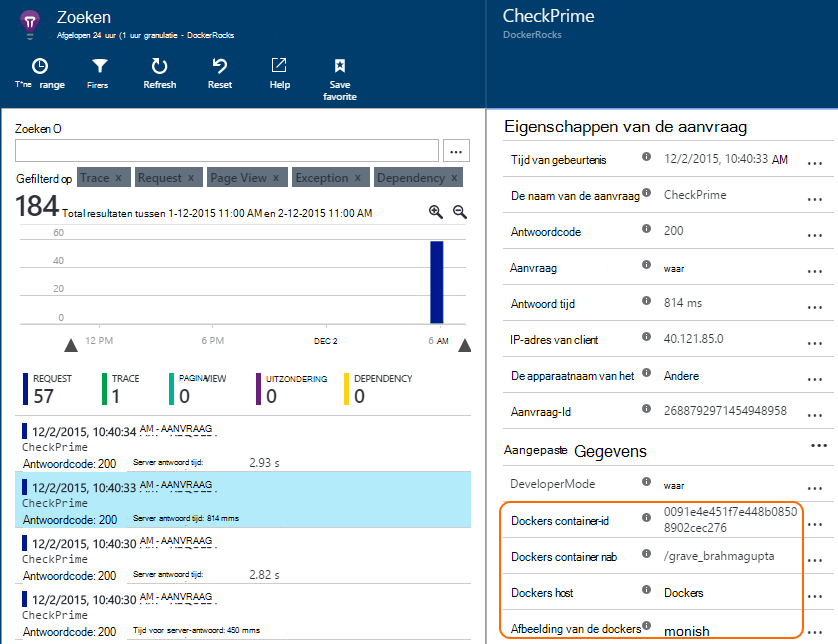
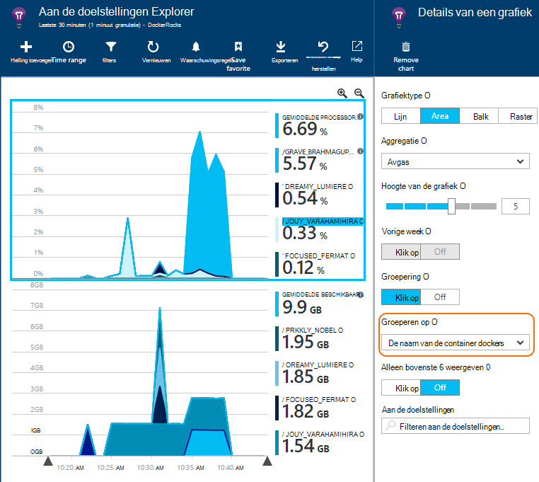

<properties 
    pageTitle="Docker toepassingen in de toepassing inzichten controleren" 
    description="Docker prestatiemeteritems, gebeurtenissen en uitzonderingen kunnen worden weergegeven op de toepassing inzichten, samen met het telemetrielogboek vanuit de beperkte-apps." 
    services="application-insights" 
    documentationCenter=""
    authors="alancameronwills" 
    manager="douge"/>

<tags 
    ms.service="application-insights" 
    ms.workload="tbd" 
    ms.tgt_pltfrm="ibiza" 
    ms.devlang="na" 
    ms.topic="article" 
    ms.date="12/01/2015" 
    ms.author="awills"/>
 
# <a name="monitor-docker-applications-in-application-insights"></a>Docker toepassingen in de toepassing inzichten controleren

Levenscyclus evenementen en van prestatiemeteritems uit [Docker](https://www.docker.com/) containers kunnen worden uitgezet op toepassing inzichten. Installeer de [Toepassing inzichten](app-insights-overview.md) afbeelding in een container in uw host en prestatiemeteritems wordt weergegeven voor de host en de andere afbeeldingen.

Met Docker distribueren kunt u uw apps in lightweight containers compleet met alle afhankelijkheden. Deze wordt uitgevoerd op elke hostcomputer die wordt uitgevoerd als een Docker-Engine.

Wanneer u de [afbeelding van de toepassing inzichten](https://hub.docker.com/r/microsoft/applicationinsights/) op uw Docker-host uitvoert, krijgt u volgende voordelen:

* Levenscyclus telemetrielogboek over alle containers uitgevoerd op de host - starten, stoppen, enzovoort.
* Prestatie-items voor alle containers. CPU, geheugen, netwerkgebruik en meer.
* Als u een [toepassing inzichten SDK hebt geïnstalleerd](app-insights-java-live.md) in de apps die wordt uitgevoerd in de containers, alle telemetrielogboek van deze apps extra eigenschappen de container en host machine identificeren heeft. Dus bijvoorbeeld als er exemplaren van een app uitgevoerd in meer dan één host, kunt u eenvoudig kunnen uw app-telemetrielogboek door host filteren.


## <a name="set-up-your-application-insights-resource"></a>Uw toepassing inzichten resource instellen

1. Meld u aan bij de [Portal van Microsoft Azure](https://azure.com) en opent u de resource van toepassing inzichten voor uw app; of [Maak een nieuwe record](app-insights-create-new-resource.md). 

    *Welke resource moet ik gebruiken?* Als de apps die u op uw host uitvoert zijn ontwikkeld door iemand anders, klikt moet u [een nieuwe resource van toepassing inzichten maakt](app-insights-create-new-resource.md). Dit is waar u weergeven en analyseren van het telemetrielogboek. (Selecteer andere voor het app-type.)

    Maar als u de ontwikkelaar van de apps bent, klikt u vervolgens we hopen dat u aan elk van deze [toepassing inzichten SDK toegevoegd](app-insights-java-live.md) . Als ze alle echt onderdelen van een enkel bedrijfstoepassing, klik u al deze telemetrielogboek versturen naar één resource kunt configureren en u dat dezelfde resources gebruikt om de Docker levenscyclus en prestaties van de gegevens weer te geven. 

    Een derde scenario is dat u de meeste van de apps ontwikkeld, maar u afzonderlijke resources gebruikt om hun telemetrielogboek weer te geven. In dat geval u waarschijnlijk ook wilt maken van een afzonderlijke bron van de gegevens Docker. 

2.  De tegel Docker toevoegen: kies **Tegel toevoegen**, sleept u de tegel Docker vanuit de galerie en klik vervolgens op **Gereed**. 

    


3. Klik op de vervolgkeuzelijst **Essentials** en de toets Instrumentation kopiëren. U gebruikt dit naar de SDK aangeeft waar de telemetrielogboek verzenden.


    

Houd dat browservenster handige, als u wordt keert u terug naar deze binnenkort naar kijkt u naar uw telemetrielogboek.


## <a name="run-the-application-insights-monitor-on-your-host"></a>De toepassing inzichten monitor worden uitgevoerd op uw host
 
Nu dat u ergens om weer te geven van de telemetrielogboek hebt geïmporteerd, kunt u de beperkte app die verzamelen en stuur dit instellen.

1.  Verbinding maken met uw Docker-host. 
2.  Uw sleutel instrumentation in deze opdracht bewerken en vervolgens uit te voeren:
 
    ```

    docker run -v /var/run/docker.sock:/docker.sock -d microsoft/applicationinsights ikey=000000-1111-2222-3333-444444444
    ```

Slechts één toepassing inzichten afbeelding is vereist per Docker host. Als uw toepassing wordt geïmplementeerd op meerdere Docker hosts, herhaalt u de opdracht op elke host.

## <a name="update-your-app"></a>Uw app bijwerken

Als uw toepassing wordt geïmplementeerd met de [Toepassing inzichten SDK for Java](app-insights-java-get-started.md), voeg de volgende regel in het bestand ApplicationInsights.xml in uw project, onder de `<TelemetryInitializers>` element:

```xml

    <Add type="com.microsoft.applicationinsights.extensibility.initializer.docker.DockerContextInitializer"/> 
```

Hiermee wordt Docker toegangsgegevens voor de container en host-id's toegevoegd aan elke telemetrielogboek-item dat is verzonden vanuit uw app.

## <a name="view-your-telemetry"></a>Uw telemetrielogboek weergeven

Ga terug naar uw toepassing inzichten resource in de portal van Azure.

Klik op de tegel Docker.

U ziet kort gegevens binnengekomen vanuit de app Docker, met name als er andere containers waarop uw Docker-engine.


Hier volgen enkele van de weergaven die kunt u deze krijgen.

### <a name="perf-counters-by-host-activity-by-image"></a>Prestatiemeteritems door host activiteit op afbeelding








Klik op de naam van een host of afbeelding voor meer informatie.


Klik op een grafiek, het raster kop, de weergave als volgt aanpassen of grafiek toevoegen. 

[Meer informatie over de doelstellingen explorer](app-insights-metrics-explorer.md).

### <a name="docker-container-events"></a>Docker container gebeurtenissen




Als u wilt onderzoeken afzonderlijke gebeurtenissen, klikt u op [Zoeken](app-insights-diagnostic-search.md). Zoeken en filteren om te de gebeurtenissen die u wilt zoeken. Klik op een willekeurige gebeurtenis als u meer informatie.
 
### <a name="exceptions-by-container-name"></a>Uitzonderingen op de containernaam van de
 



### <a name="docker-context-added-to-app-telemetry"></a>Docker context toegevoegd aan de app-telemetrielogboek

Aanvraag telemetrielogboek verzonden vanuit de toepassing geïmplementeerd met AI SDK, waaraan Docker context:



Processortijd en geheugen prestatiemeteritems, verrijking en gegroepeerd op de naam van de container Docker:





## <a name="q--a"></a>Q & A

*Wat biedt toepassing inzichten ME die ik hoor via Docker?*

* Gedetailleerde uitsplitsing van prestatiemeteritems door de container en afbeelding.
* Integreer gegevens in een dashboard container en app.
* [Telemetrielogboek exporteren](app-insights-export-telemetry.md) voor verdere analyse aan een database, Power BI of andere dashboard.

*Hoe haal ik telemetrielogboek van de app zelf?*

* Installeer de toepassing inzichten SDK in de app. Leer hoe u voor: [Java-WebApps](app-insights-java-get-started.md), [Windows web apps](app-insights-asp-net.md).
