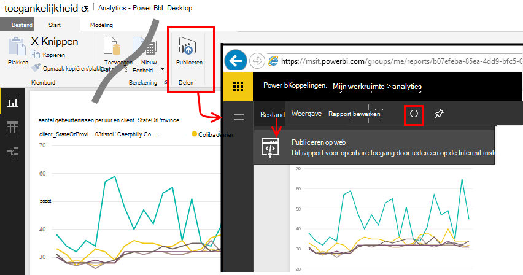

<properties 
    pageTitle="Exporteren naar Power BI vanuit toepassing inzichten | Microsoft Azure" 
    description="Gebruiksanalyses query's kunnen worden weergegeven in de Power BI." 
    services="application-insights" 
    documentationCenter=""
    authors="noamben" 
    manager="douge"/>

<tags 
    ms.service="application-insights" 
    ms.workload="tbd" 
    ms.tgt_pltfrm="ibiza" 
    ms.devlang="na" 
    ms.topic="article" 
    ms.date="10/18/2016" 
    ms.author="awills"/>

# Power BI-feed van toepassing inzichten

[Power BI](http://www.powerbi.com/) is een reeks bedrijven analytics hulpmiddelen waarmee u gegevens analyseren en inzichten te delen. RTF-dashboards zijn beschikbaar op elk apparaat. U kunt gegevens uit veel bronnen, inclusief Analytics-query's vanuit [Visual Studio toepassing inzichten](app-insights-overview.md)combineren.

Er zijn drie aanbevolen methoden van toepassing inzichten gegevens exporteren naar Power BI. U kunt deze afzonderlijk of samen gebruiken.

* [**Power BI-adapter**](#power-pi-adapter) - instellen van een voltooid dashboard van telemetrielogboek uit uw app. De set grafieken vooraf is gedefinieerd, maar u kunt uw eigen query's toevoegen vanaf een andere bronnen.
* [**Query's exporteren Analytics**](#export-analytics-queries) - schrijven van een query die u wilt gebruiken met Analytics en exporteren naar Power BI. U kunt deze query plaatsen op een dashboard samen met andere gegevens.
* [**Continu exporteren en Stream Analytics**](app-insights-export-stream-analytics.md) - hierbij meer werk om in te stellen. Het is handig als u wilt bewaren van uw gegevens voor lange perioden. Anders wordt de andere methoden aanbevolen.

## Power BI-adapter

Deze methode wordt gemaakt van een voltooid dashboard van telemetrielogboek voor u. De eerste gegevensverzameling vooraf is gedefinieerd, maar u kunt meer gegevens toevoegen aan deze.

### De adapter ophalen

1. Meld u aan bij [Power BI](https://app.powerbi.com/).
2. **Gegevens ophalen**, **Services**, **toepassing inzichten** openen

    

3. Geef de details van uw toepassing inzichten resource.

    

4. Wacht een paar minuten of twee voor de gegevens die moeten worden geïmporteerd.

    

U kunt het dashboard, waarbij de toepassing inzichten grafieken met die van andere bronnen, en met gebruiksanalyses query's bewerken. Er is een galerie visualisatie waar u meer grafieken kunt ophalen en elke grafiek heeft een parameters die u kunt instellen.

Na de eerste import het dashboard en de rapporten blijven dagelijks bijwerken. U kunt het schema voor gegevensvernieuwing op de gegevensset bepalen.

## Gebruiksanalyses query's exporteren

Deze manier kunt u er een Analytics-query die u tevreden bent schrijven en die vervolgens exporteren naar een Power BI-dashboard. (U kunt toevoegen aan het dashboard gemaakt door de adapter.)

### Één keer: Power BI Desktop installeren

Als u wilt importeren in uw toepassing inzichten-query, kunt u de bureaubladversie van Power BI gebruiken. Maar klikt u vervolgens kunt u deze publiceren op het web of aan uw Power BI cloud-werkruimte. 

[Power BI Desktop](https://powerbi.microsoft.com/en-us/desktop/)installeren.

### Een query Analytics exporteren

1. [Openen Analytics en uw query schrijven](app-insights-analytics-tour.md).
2. Test en de query totdat u tevreden met de resultaten bent te verfijnen.
3. Kies in het menu **exporteren** **Power BI (M)**. Sla het tekstbestand.

    
4. **Gegevens ophalen, lege Query** selecteren en selecteer vervolgens **Geavanceerde Query-Editor**in de query-editor, onder **weergave** in Power BI Desktop.

    Plak het geëxporteerde M taal script in de geavanceerde Query-Editor.

    

5. Mogelijk moet u uw referenties zodat Power BI voor toegang tot Azure. Gebruik van 'organisatie-account' aan te melden met uw Microsoft-account.

    

6. Kies een visualisatie voor uw query en selecteer de velden voor x-as, y-as en segmenteren dimensie.

    

7. Uw rapport naar uw Power BI cloud-werkruimte publiceren. Hierin kunt u een gesynchroniseerde versie insluiten in een andere webpagina.

    
 
8. Het rapport met tussenpozen handmatig vernieuwen, of een gepland vernieuwen op de optiepagina instellen.

## Over steekproeven

Als uw toepassing een groot aantal gegevens verzendt, kan de functie Geavanceerde steekproeven hanteert en slechts een percentage van uw telemetrielogboek verzenden. Hetzelfde geldt als u handmatig steekproeven hebt ingesteld in de SDK of op de opname. [Meer informatie over steekproeven.](app-insights-sampling.md)
 

## Volgende stappen

* [Power BI - Lees](http://www.powerbi.com/learning/)
* [Zelfstudie Analytics](app-insights-analytics-tour.md)
