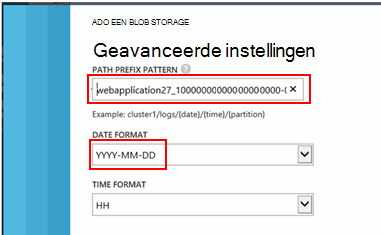

<properties 
    pageTitle="Stream Analytics gebruiken om gegevens die zijn geëxporteerd vanaf toepassing inzichten te verwerken | Microsoft Azure" 
    description="Stream analyses kunt continu transformeren, filteren en doorsturen van de gegevens die u van toepassing inzichten exporteren." 
    services="application-insights" 
    documentationCenter=""
    authors="noamben" 
    manager="douge"/>

<tags 
    ms.service="application-insights" 
    ms.workload="tbd" 
    ms.tgt_pltfrm="ibiza" 
    ms.devlang="na" 
    ms.topic="article" 
    ms.date="10/18/2016" 
    ms.author="awills"/>

# <a name="use-stream-analytics-to-process-exported-data-from-application-insights"></a>Stream Analytics gebruiken om geëxporteerde gegevens uit de toepassing inzichten te verwerken

[Azure Stream Analytics](https://azure.microsoft.com/services/stream-analytics/) is het ideale hulpprogramma voor het verwerken van gegevens [geëxporteerd vanaf toepassing inzichten](app-insights-export-telemetry.md). Stream Analytics kunt gegevens ophalen uit een verscheidenheid aan bronnen. U kunt transformeren en de gegevens filteren en deze vervolgens doorsturen naar allerlei sinks.

In dit voorbeeld maken we een adapter die gegevens uit de toepassing inzichten, naam en verwerkt aantal velden, en deze buizen in Power BI.

> [AZURE.WARNING] Zijn er veel betere en gemakkelijker [aanbevolen manieren om weer te geven van de toepassing inzichten gegevens in Power BI](app-insights-export-power-bi.md). Het pad hier wordt geïllustreerd is slechts een voorbeeld om te laten zien hoe u de geëxporteerde gegevens verwerken.


## <a name="create-storage-in-azure"></a>Opslag in Azure maken

Continue exporteren wordt altijd gegevens aan een Azure Storage-account, dus moet u eerst de opslag maken.

1.  Maak een account 'klassieke' opslag van uw abonnement in de [portal van Azure](https://portal.azure.com).

    

2. Een container maken

    

3. Kopieer de opslagruimte toegangstoets

    U moet deze spoedig voor het instellen van de invoer voor de stream analytics-service.

    

## <a name="start-continuous-export-to-azure-storage"></a>Continue exporteren naar Azure opslag starten

[Doorlopend exporteren](app-insights-export-telemetry.md) , verplaatst gegevens van toepassing inzichten in Azure opslag.

1. Blader naar de bron van de toepassing inzichten die u voor uw toepassing hebt gemaakt in de portal Azure.

    

2. Maak een doorlopend exporteren.

    


    Selecteer het opslag-account dat u eerder hebt gemaakt:

    
    
    Stel de typen gebeurtenissen die u wilt zien:

    

3. Laat sommige gegevens worden verzameld. Gaan zitten terug en laat uw toepassing gebruiken voor een tijdje personen. Telemetrielogboek komen en ziet u statistische grafieken in [metrische explorer](app-insights-metrics-explorer.md) en afzonderlijke gebeurtenissen in [Diagnostische zoeken](app-insights-diagnostic-search.md). 

    En ook de gegevens worden geëxporteerd naar uw opslag. 

4. De geëxporteerde gegevens controleren. Kies in Visual Studio, **weergeven / Cloud Explorer**, en open Azure / opslag. (Als u deze optie niet hebt, moet u de SDK Azure installeren: Open het dialoogvenster Nieuw Project en open Visual C# / Cloud / Microsoft Azure SDK krijgen voor .NET.)

    

    Noteer het algemene deel van de naam van het pad, die wordt afgeleid van de naam en instrumentation toepassingstoets. 

De gebeurtenissen worden naar blob-bestanden in de indeling van JSON geschreven. Elk bestand kan een of meer gebeurtenissen bevatten. Dus willen we lezen van gegevens van de gebeurtenis en de velden die we horen uitfilteren. Er zijn alle typen wat die we met de gegevens doen kan, maar onze abonnement vandaag is het gebruik van de Stream Analytics naar pipe van de gegevens voor Power BI.

## <a name="create-an-azure-stream-analytics-instance"></a>Een exemplaar van de Azure Stream analyses maken

Selecteer de Azure Stream Analytics-service in de [Klassieke Azure-Portal](https://manage.windowsazure.com/)en een nieuwe taak van de Stream analyses maken:


Wanneer u de nieuwe taak maakt, moet u de details uitvouwen:


### <a name="set-blob-location"></a>Locatie van de blob instellen

Instellen dat deze invoer uit uw blob continue exporteren uitvoeren:


U moet nu de primaire sleutel van de toegang van uw Account opslag, die u eerder hebt genoteerd. Stel dit in als de Accountsleutel opslag.


### <a name="set-path-prefix-pattern"></a>Set pad voorvoegselpatroon 




**Zorg ervoor dat de datumnotatie ingesteld op jjjj-MM-DD (met streepjes).**

Het pad voorvoegsel patroon geeft aan waar Stream Analytics geeft als resultaat de invoer bestanden in de opslag. Moet u instellen dat deze overeenkomen met hoe continue exporteren de gegevens zijn opgeslagen. Stel deze als volgt:

    webapplication27_12345678123412341234123456789abcdef0/PageViews/{date}/{time}

In dit voorbeeld is:

* `webapplication27`is de naam van de resource van toepassing inzichten **worden alle kleine letters**.
* `1234...`is de sleutel instrumentation van de resource van toepassing inzichten, **streepjes weglaten**. 
* `PageViews`is het type gegevens dat u wilt analyseren. De beschikbare typen, is afhankelijk van het filter dat u in continue exporteren instellen. De geëxporteerde gegevens om te zien van de andere beschikbare soorten controleren en raadpleegt u de [gegevensmodel exporteren](app-insights-export-data-model.md).
* `/{date}/{time}`een patroon is letterlijk geschreven.

> [AZURE.NOTE] De opslag om ervoor te zorgen dat u direct het pad controleren.

### <a name="finish-initial-setup"></a>De eerste configuratie voltooien

Bevestig de serialisatie-indeling:


De wizard te sluiten en wacht totdat de installatie te voltooien.

> [AZURE.TIP] Gebruik de opdracht steekproef sommige gegevens moeten worden gedownload. Houd het als een steekproef testen op fouten opsporen in uw query.

## <a name="set-the-output"></a>De uitvoer instellen

Nu uw taak te selecteren en stel de uitvoer.


Geef uw **werk- of schoolaccount** als u akkoord gaat Stream Analytics voor toegang tot uw Power BI-bron. Klik tot een naam voor de uitvoer en voor de doeltoepassing Power BI gegevensset en de tabel.


## <a name="set-the-query"></a>De query instellen

De query bepaalt de vertaling van invoer om uit te voeren.


Gebruik de functie testen om te controleren die u de juiste uitvoer downloaden. De voorbeeldgegevens die u hebt gemaakt, op de pagina invoeritems geven. 

### <a name="query-to-display-counts-of-events"></a>Telt de query om weer te geven van gebeurtenissen

Plak deze query:

```SQL

    SELECT
      flat.ArrayValue.name,
      count(*)
    INTO
      [pbi-output]
    FROM
      [export-input] A
    OUTER APPLY GetElements(A.[event]) as flat
    GROUP BY TumblingWindow(minute, 1), flat.ArrayValue.name
```

* exporteren invoer is de alias die we heeft gegeven tot de stream invoer
* pbi-uitvoer is de uitvoeralias die zoals gedefinieerd
* We gebruiken [OUTER toepassen GetElements](https://msdn.microsoft.com/library/azure/dn706229.aspx) omdat de gebeurtenisnaam in een geneste JSON-arrray. De Selecteer hervat vervolgens de naam van de gebeurtenis, samen met een telling van het aantal exemplaren met die naam in de periode. De elementen van de [Group By](https://msdn.microsoft.com/library/azure/dn835023.aspx) -component groepen over perioden van 1 minuut.


### <a name="query-to-display-metric-values"></a>Query metrieke waarden weergeven


```SQL

    SELECT
      A.context.data.eventtime,
      avg(CASE WHEN flat.arrayvalue.myMetric.value IS NULL THEN 0 ELSE  flat.arrayvalue.myMetric.value END) as myValue
    INTO
      [pbi-output]
    FROM
      [export-input] A
    OUTER APPLY GetElements(A.context.custom.metrics) as flat
    GROUP BY TumblingWindow(minute, 1), A.context.data.eventtime

``` 

* Deze query analyse niveau uitgevoerd in het telemetrielogboek aan de doelstellingen voor de tijd van de gebeurtenis en de metrische waarde. De metrische waarden zijn in een matrix, zodat we de buitenste toepassen GetElements patroon gebruiken om te extraheren van de rijen. "myMetric" is de naam van de meetwaarde in dit geval. 

### <a name="query-to-include-values-of-dimension-properties"></a>Query moeten worden opgenomen waarden van dimensie-eigenschappen

```SQL

    WITH flat AS (
    SELECT
      MySource.context.data.eventTime as eventTime,
      InstanceId = MyDimension.ArrayValue.InstanceId.value,
      BusinessUnitId = MyDimension.ArrayValue.BusinessUnitId.value
    FROM MySource
    OUTER APPLY GetArrayElements(MySource.context.custom.dimensions) MyDimension
    )
    SELECT
     eventTime,
     InstanceId,
     BusinessUnitId
    INTO AIOutput
    FROM flat

```

* Deze query bevat de waarden van de eigenschappen dimensie zonder afhankelijk van een bepaalde dimensie wordt op een vaste index in de dimensiematrix.

## <a name="run-the-job"></a>De taak uitvoeren

U kunt een datum selecteren in het verleden om de taak uit te starten. 


Wacht totdat de taak wordt uitgevoerd.

## <a name="see-results-in-power-bi"></a>Resultaten bekijken in Power BI

> [AZURE.WARNING] Zijn er veel betere en gemakkelijker [aanbevolen manieren om weer te geven van de toepassing inzichten gegevens in Power BI](app-insights-export-power-bi.md). Het pad hier wordt geïllustreerd is slechts een voorbeeld om te laten zien hoe u de geëxporteerde gegevens verwerken.

Power BI openen met uw werk of schoolaccount en selecteer de gegevensset en de tabel die u als de uitvoer van de Stream Analytics-taak gedefinieerd.


Nu kunt u deze gegevensset in rapporten en dashboards in [Power BI](https://powerbi.microsoft.com).


## <a name="no-data"></a>Er zijn geen gegevens?

* Controleer dat u [de datumnotatie instellen](#set-path-prefix-pattern) correct op jjjj-MM-DD (met streepjes).


## <a name="video"></a>Video

Noam Ben Zeev ziet hoe u de geëxporteerde gegevens door middel van Stream analyses van proces.

> [AZURE.VIDEO export-to-power-bi-from-application-insights]

## <a name="next-steps"></a>Volgende stappen

* [Continue exporteren](app-insights-export-telemetry.md)
* [Gedetailleerd overzicht van de eigenschaptypen en waarden voor gegevensmodellen.](app-insights-export-data-model.md)
* [Toepassing inzichten](app-insights-overview.md)
* [Meer voorbeelden en scenario 's](app-insights-code-samples.md)
 
