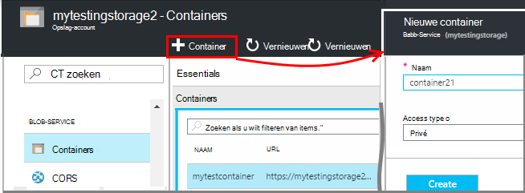
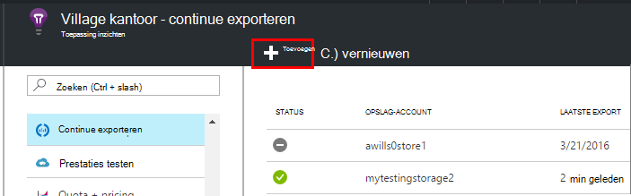
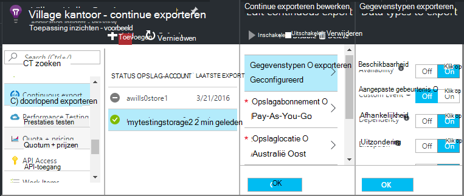
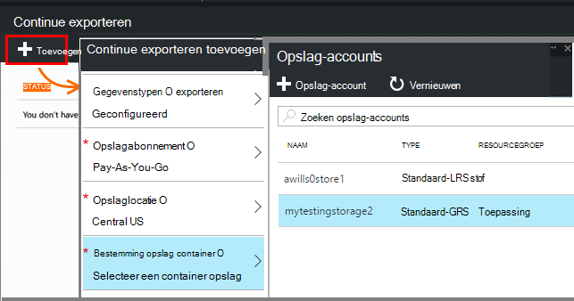
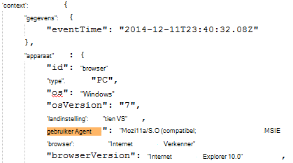
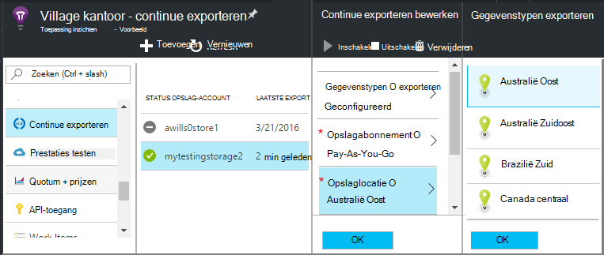

<properties 
    pageTitle="Continue uitvoer van telemetrielogboek van toepassing inzichten | Microsoft Azure" 
    description="Diagnostic en het gebruik van gegevens exporteren naar opslagruimte in Microsoft Azure en deze vanaf hier downloaden." 
    services="application-insights" 
    documentationCenter=""
    authors="alancameronwills" 
    manager="douge"/>

<tags 
    ms.service="application-insights" 
    ms.workload="tbd" 
    ms.tgt_pltfrm="ibiza" 
    ms.devlang="na" 
    ms.topic="article" 
    ms.date="10/18/2016" 
    ms.author="awills"/>
 
# Telemetrielogboek exporteren vanuit toepassingen inzichten

Wilt u uw telemetrielogboek langer dan de standaard bewaarperiode houden? Of in een speciale manier worden verwerkt? Continue exporteren is ideaal voor dit. De gebeurtenissen die u in de portal-toepassing inzichten ziet kunnen worden geëxporteerd naar opslagruimte in Microsoft Azure in JSON-indeling. Hier kunt u uw gegevens downloaden en schrijven wat u code wilt verwerken.  

Continue exporteren is beschikbaar in de gratis proefperiode en klik op de [Standard en Premium prijzen van abonnementen](https://azure.microsoft.com/pricing/details/application-insights/).

Voordat u doorlopend exporteren hebt ingesteld, zijn er enkele alternatieven die u wilt mogelijk u rekening moet houden:

* [Knop het exporteren](app-insights-metrics-explorer.md#export-to-excel) boven aan een blade aan de doelstellingen of in de zoekresultaten, kunt u overbrengen van tabellen en grafieken naar een Excel-werkblad. 
* [Analyses](app-insights-analytics.md) biedt een krachtige querytaal voor telemetrielogboek, en ook resultaten kunt exporteren.
* Als u op zoek bent naar [uw gegevens verkennen in Power BI](http://blogs.msdn.com/b/powerbi/archive/2015/11/04/explore-your-application-insights-data-with-power-bi.aspx), kunt u dit doen zonder continue exporteren.

## Een opslag-account maken

Als u nog geen een 'klassieke' opslag-account hebt, moet u een nu maken.

1. Maak een account opslag van uw abonnement in de [portal van Azure](https://portal.azure.com).

    

2. Een container maken.

    

## Continue exporteren instellen

Open de continue exporteren op van uw toepassing overzicht blade in de portal-toepassing inzichten: 

Voeg een doorlopend export en kiest u de gebeurtenistypen die u wilt exporteren:

Of maak de [opslag van Azure-account](../storage/storage-introduction.md) , waar u de gegevens op te slaan:

Nadat u uw export hebt gemaakt, wordt gestart gaan. (U alleen gegevens ophalen die ontvangen nadat u de export maken.) 

Er zijn een vertraging van ongeveer een uur voordat gegevens worden weergegeven in de blob.

Als u later wijzigen welke van de gebeurtenis wilt, moet u alleen de export bewerken:

Als u wilt stoppen de stream, klik op uitschakelen. Als u opnieuw inschakelen klikt, wordt de start van de stream opnieuw met nieuwe gegevens. U kunt de gegevens die zijn aangekomen in de portal terwijl exporteren werd uitgeschakeld won't ophalen.

Als u wilt de stream permanent stoppen, verwijdert u de export. Dit doet, houdt dat niet uw gegevens verwijdert uit de opslag.

#### Niet toevoegen of wijzigen van een exporteren?

* Als u wilt toevoegen of wijzigen van de uitvoer, moet u eigenaar, Inzender of toepassing inzichten Inzender toegangsrechten. [Meer informatie over rollen][roles].

## Welke gebeurtenissen krijgt u?

De geëxporteerde gegevens is de onbewerkte telemetrielogboek die we van uw toepassing ontvangen, behalve dat we locatiegegevens die we berekenen van het IP-adres van client toevoegen. 

Gegevens die is verwijderd door [middel van steekproeven](app-insights-sampling.md) is niet opgenomen in de geëxporteerde gegevens.

Andere berekende maatstaven zijn niet opgenomen. Bijvoorbeeld: we gemiddelde CPU-gebruik niet exporteren, maar we Exporteer het onbewerkte telemetrielogboek waaruit het gemiddelde wordt berekend.

De gegevens bevat ook de resultaten van een [beschikbaarheid web tests](app-insights-monitor-web-app-availability.md) die u hebt ingesteld. 

> [AZURE.NOTE] **Een steekproef.** Als uw toepassing een groot aantal gegevens stuurt en u de toepassing inzichten SDK voor ASP.NET versie 2.0.0-beta3 of hoger gebruikt, kan de functie Geavanceerde steekproeven werken en slechts een percentage van uw telemetrielogboek verzenden. [Meer informatie over steekproeven.](app-insights-sampling.md)

## De gegevens controleren

U kunt de opslagruimte rechtstreeks in de portal controleren. Klik op **Bladeren**, selecteer uw account voor de opslag en open vervolgens **Containers**.

Als u wilt controleren Azure opslagruimte in Visual Studio, **weergave**, **Cloud Explorer**openen (Als u geen die menuopdracht hebt, moet u de SDK Azure installeren: Open het dialoogvenster **Nieuw Project** , uitvouwen Visual C# / Cloud en kiest u **Microsoft Azure-SDK ophalen voor .NET**.)

Wanneer u uw winkel blob opent, ziet u een container met een reeks blob-bestanden. De URI van elk bestand dat is afgeleid van de naam van uw toepassing inzichten resource, de instrumentation-toets, telemetrielogboek-type/datum/tijd. (De naam van de resource is alle kleine letters, en de toets instrumentation worden als streepjes weggelaten.)

De datum en tijd zijn UTC en wanneer het telemetrielogboek is gedeponeerd in de store - niet op het tijdstip waarop dat deze is gegenereerd. Dus als u code wilt downloaden van de gegevens schrijft, kunt deze verplaatsen lineair door de gegevens.

Dit is de vorm van het pad:

    $"{applicationName}_{instrumentationKey}/{type}/{blobDeliveryTimeUtc:yyyy-MM-dd}/{ blobDeliveryTimeUtc:HH}/{blobId}_{blobCreationTimeUtc:yyyyMMdd_HHmmss}.blob"
  
Waar 

-   `blobCreationTimeUtc`is de tijd waarop blob is gemaakt in de interne tijdelijke opslagruimte
-   `blobDeliveryTimeUtc`de keer wanneer blob wordt gekopieerd naar de opslag van de bestemming exporteren

## Gegevens opmaken

* Elke blob is een tekstbestand met meerdere ' \n'-separated rijen. De presentatie bevat de telemetrielogboek over een periode van ongeveer een halve minuut verwerkt.
* Elke rij vertegenwoordigt een gegevenspunt telemetrielogboek zoals een aanvraag of pagina-weergave.
* Elke rij is een niet-opgemaakte JSON-document. Als u wilt gaan zitten en staart u deze, opent u deze in Visual Studio en kies bewerken, Geavanceerd indelingsbestand:

De tijdsduur van de zijn in tikken, waar 10 000 verschuldigd maatstreepjes = 1ms. Deze waarden wordt bijvoorbeeld een tijd van 1ms naar een aanvraag verzendt vanuit de browser, 3 MS te ontvangen en 1.8s verwerkingstijd van de pagina in de browser weergeven:

    "sendRequest": {"value": 10000.0},
    "receiveRequest": {"value": 30000.0},
    "clientProcess": {"value": 17970000.0}

[Gedetailleerd overzicht van de eigenschaptypen en waarden voor gegevensmodellen.](app-insights-export-data-model.md)

## Verwerking van de gegevens

Op kleine schaal, kunt u sommige code als u wilt trekken dat uw gegevens, lezen in een werkblad, enzovoort. Bijvoorbeeld:

    private IEnumerable<T> DeserializeMany<T>(string folderName)
    {
      var files = Directory.EnumerateFiles(folderName, "*.blob", SearchOption.AllDirectories);
      foreach (var file in files)
      {
         using (var fileReader = File.OpenText(file))
         {
            string fileContent = fileReader.ReadToEnd();
            IEnumerable<string> entities = fileContent.Split('\n').Where(s => !string.IsNullOrWhiteSpace(s));
            foreach (var entity in entities)
            {
                yield return JsonConvert.DeserializeObject<T>(entity);
            }
         }
      }
    }

Zie [werken met een rol werknemer]voor een groter voorbeeld[exportasa].

## Uw oude gegevens verwijderen
Houd er rekening mee dat u verantwoordelijk bent voor het beheren van uw opslagcapaciteit en de oude gegevens te verwijderen, indien nodig. 

## Als u uw sleutel opslag...

Als u de toets uw opslag wijzigt, werken niet meer continue exporteren. U ziet een melding bij uw Azure-account. 

Het blad continue exporteren openen en bewerken van uw exporteren. Bewerken van de bestemming exporteren, maar te laten staan dezelfde opslag geselecteerd. Klik op OK om te bevestigen.

De export doorlopend wordt opnieuw gestart.

## Voorbeelden van exporteren

* [Exporteren naar SQL via een rol werknemer][exportcode]
* [Exporteren naar SQL door middel van Stream analyses][exportasa]
* [Voorbeeld 2 van de stream Analytics](app-insights-export-stream-analytics.md)

Klik op grotere schaal, kunt u [HDInsight](https://azure.microsoft.com/services/hdinsight/) - Hadoop clusters in de cloud. HDInsight biedt een aantal technologieën voor het beheren en analyseren van grote gegevens.

## Q & A

* *Maar ik wil dat is het downloaden van een eenmalige van een grafiek.*  
 
    Ja, u kunt dit doen. Aan de bovenkant van het blad, klikt u op [Gegevens exporteren](app-insights-metrics-explorer.md#export-to-excel).

* *Ik heb een exporteren hebt ingesteld, maar er zijn geen gegevens in de winkel.*

    Heeft toepassing inzichten ontvangen eventuele telemetrielogboek uw app sinds u de export ingesteld? U ontvangt alleen nieuwe gegevens.

* *Ik probeer voor het instellen van een exporteren, maar is toegang geweigerd*

    Als het account is eigendom van uw organisatie, die u moet lid zijn van de groep Eigenaren of inzenders.

* *Kan ik exporteren rechtstreeks naar mijn eigen store on-premises implementatie?* 

    Nee, helaas. Onze exporteren-engine werkt momenteel alleen met Azure opslagruimte op dit moment.  

* *Is er een beperking voor de hoeveelheid gegevens die u hebt opgeslagen in mijn winkel?* 

    Nee. We gaat houden zet nieuwe gegevens totdat u de export verwijderen. We stopt als we de buitenste limieten voor blobopslag raken, maar dat is heel enorme. Is het aan u aangeven hoeveel opslagruimte u gebruikt.  

* *Hoeveel BLOB's moet ik Zie in de opslagruimte?*

 * Voor elk gegevenstype dat u hebt geselecteerd voor het exporteren, een nieuwe blob elke minuut gemaakt (als er gegevens beschikbaar is). 
 * Daarnaast voor toepassingen met hoge verkeer, moet extra partition eenheden zijn toegewezen. In dit geval per eenheid Hiermee maakt u een blob elke minuut.

* *Ik de toets gegenereerd met mijn storage of de naam van de container gewijzigd en nu de export niet werkt.*

    De export bewerken en open het blad van de bestemming exporteren. Laat de dezelfde opslag als voorheen geselecteerd en klik op OK om te bevestigen. Exporteren opnieuw. Als de wijziging in de afgelopen paar dagen is, kunt u gegevens verliest.

* *Kan ik de export onderbreken?*

    Ja. Klik op uitschakelen.

## Voorbeelden van programmacode

* [Parseren van geëxporteerde JSON via een rol werknemer][exportcode]
* [Voorbeeld van de stream-analyses](app-insights-export-stream-analytics.md)
* [Exporteren naar SQL door middel van Stream analyses][exportasa]

* [Gedetailleerd overzicht van de eigenschaptypen en waarden voor gegevensmodellen.](app-insights-export-data-model.md)

<!--Link references-->

[exportcode]: app-insights-code-sample-export-telemetry-sql-database.md
[exportasa]: app-insights-code-sample-export-sql-stream-analytics.md
[roles]: app-insights-resources-roles-access-control.md

 
