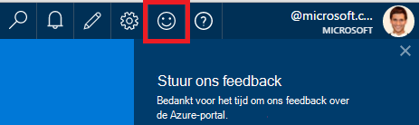
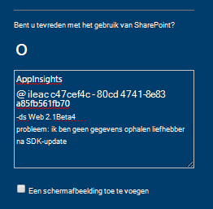
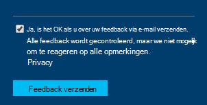

<properties 
    pageTitle="Hoe kom ik aan de technische ondersteuning van toepassing inzichten ontwikkelteam | Microsoft Azure" 
    description="Wanneer u een zaak die is vereist speciale ondersteuning van toepassing inzichten ontwikkelteam hebt, is dit hoe kunt u de details voor ondersteuning verzenden." 
    services="application-insights" 
    documentationCenter=""
    authors="alexbulankou" 
    manager="douge"/>
 
<tags 
    ms.service="application-insights" 
    ms.workload="tbd" 
    ms.tgt_pltfrm="ibiza" 
    ms.devlang="na" 
    ms.topic="article" 
    ms.date="06/01/2016" 
    ms.author="albulank"/>
    
# <a name="how-to-get-technical-support-from-application-insights-development-team"></a>Hoe kom ik aan de technische ondersteuning van toepassing inzichten ontwikkelteam
    
Als er een probleem met de technische met [Visual Studio toepassing inzichten](app-insights-overview.md), zijn dit uw opties voor het Help-informatie opvragen:

## <a name="1-check-the-documents"></a>1. Schakel het selectievakje bestanden

* Ontbrekende gegevens? Selectievakje: [steekproeven](app-insights-sampling.md), [quota en beperken](app-insights-pricing.md).
* Probleemoplossing: [ASP.NET](app-insights-troubleshoot-faq.md) | [Java](app-insights-java-troubleshoot.md)

## <a name="2-search-the-forums"></a>2. de-forums zoeken

* [MSDN-forum](https://social.msdn.microsoft.com/Forums/vstudio/home?forum=ApplicationInsights)
* [StackOverflow](http://stackoverflow.com/questions/tagged/ms-application-insights)

## <a name="3-azure-support-plan"></a>3. ondersteuning voor azure-abonnement?

Er zijn situaties waarin u ontwikkelaars wilt voor uw specifieke hoofdletters/kleine letters onderzoeken. 

Als u een [abonnement met Microsoft Azure ondersteuning hebt](https://azure.microsoft.com/support/plans/) kunt u [een ondersteuningsticket openen](https://portal.azure.com/?#blade/Microsoft_Azure_Support/HelpAndSupportBlade).

## <a name="4-contact-the-application-insights-team"></a>4. contact opnemen met de toepassing inzichten team

Als u een abonnement ondersteuning niet hebt, is onze ontwikkelteam graag aanbevolen hoeveelheid ondersteuning bieden aan toepassing inzichten klanten, zoals we voor de mijlpaal algemene beschikbaarheid voorbereiden. We zijn Kennismaking met **een nieuwe ondersteuningsoptie**: U kunt de zaak om ons te beschrijven door het verzenden van een feedbackformulier op Azure-portal en hebt u een ontwikkelaar op de toepassing inzichten team contact dat u een back-als u wilt uw probleem op te lossen.


1. In de [toepassing inzichten-portal](https://portal.azure.com), klikt u op het lachebekje in de rechterbovenhoek:  

       

2. In het opmerkingenvak Zorg ervoor dat u opgeeft **AppInsights** de eerste regel en klikt u vervolgens de volgende gegevens bevatten:   

    ```

    AppInsights   
    ikey: <instrumentation key>   
    sdk: <SDK that you are using, including name and version>  
    issue: <please describe the problem you are having>

    ```   

       

3. Schakel "Ja, dit is het ok te e-mailen". 

      

Een technicus in de toepassing inzichten team krijgt u contact op met binnenkort. Als deze service we op beste planning op basis bieden, kan geen formele SLA op dit moment worden opgegeven.


