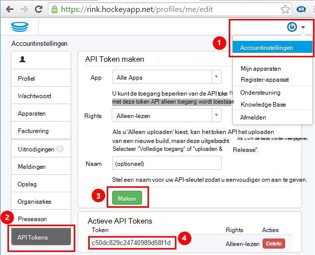
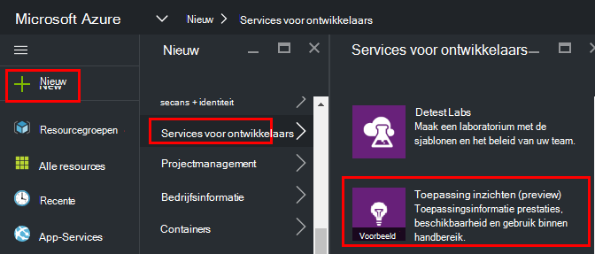
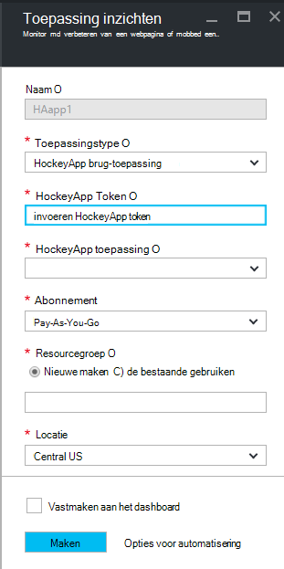
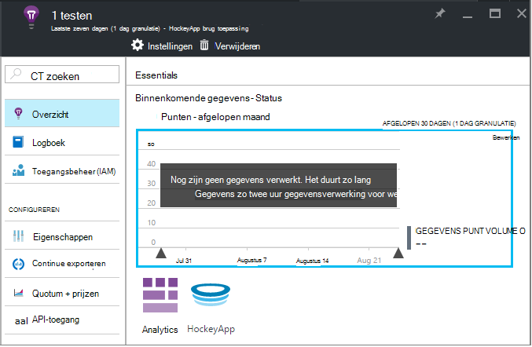
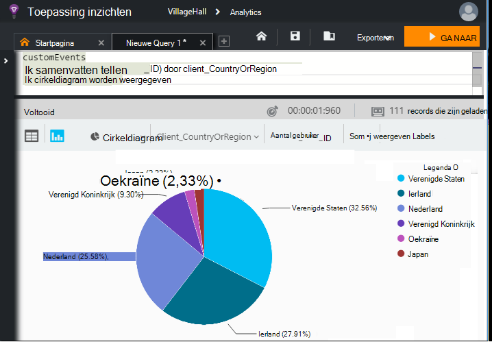

<properties 
    pageTitle="Het verkennen van HockeyApp gegevens in de toepassing inzichten | Microsoft Azure" 
    description="Gebruik en prestaties van uw Azure-app met toepassing inzichten analyseren." 
    services="application-insights" 
    documentationCenter="windows"
    authors="alancameronwills" 
    manager="douge"/>

<tags 
    ms.service="application-insights" 
    ms.workload="tbd" 
    ms.tgt_pltfrm="ibiza" 
    ms.devlang="na" 
    ms.topic="article" 
    ms.date="08/25/2016" 
    ms.author="awills"/>

#  HockeyApp gegevens in de toepassing inzichten te verkennen

[HockeyApp](https://azure.microsoft.com/services/hockeyapp/) is het aanbevolen platform voor het controleren van live desktop en mobiele apps. U kunt vanuit HockeyApp, aangepaste verzenden en traceren telemetrielogboek bewaken gebruik en helpen bij het diagnose (naast het vastlopen gegevens ophalen). Deze stroom van telemetrielogboek kan worden doorzocht met de krachtige [Analytics](app-insights-analytics.md) -functie van [Visual Studio toepassing inzichten](app-insights-overview.md). Bovendien kunt u [de aangepaste exporteren en telemetrielogboek aanwijzen](app-insights-export-telemetry.md). Als u wilt deze functies inschakelen, moet u een brug die de gegevens HockeyApp inzicht krijgen in toepassing doorstuurt instellen.

## De app HockeyApp brug

De HockeyApp brug-App wordt de core-functie waarmee u toegang tot uw gegevens HockeyApp in toepassing inzichten via de analytische gegevens en functies continue exporteren. Gegevens die worden verzameld door HockeyApp na het maken van de HockeyApp brug-App zijn toegankelijk vanaf deze functies. Laten we eens kijken hoe u een van deze Apps brug instelt.

Open in HockeyApp, accountinstellingen, [API Tokens](https://rink.hockeyapp.net/manage/auth_tokens). Maak een nieuwe token of een bestaande opnieuw. De minimale rechten vereist zijn 'alleen-lezen". Een kopie van de API token duren.

Open de portal van Microsoft Azure en het [maken van een toepassing inzichten resource](app-insights-create-new-resource.md). "HockeyApp brug toepassing" toepassingstype instellen:

U niet nodig hebt voor het instellen van een naam: dit automatisch worden ingesteld in de naam HockeyApp.

De velden van de brug HockeyApp worden weergegeven. 

Voer in het HockeyApp token die u eerder hebt genoteerd. Deze actie worden het vervolgkeuzemenu "HockeyApp toepassing" met al uw HockeyApp-toepassingen. Selecteer het account dat u wilt gebruiken en vul de rest van de velden in. 

Open de nieuwe resource. 

Houd er rekening mee dat de gegevens duurt om te beginnen die doorloopt.

Dat is alles. Gegevens die worden verzameld in uw app HockeyApp geïmplementeerd vanaf dit punt is nu ook beschikbaar zijn voor u in de functies analyses en continue exporteren van toepassing inzichten.

Laten we eens kort controleren elk van deze functies nu beschikbaar zijn voor u.

## Analytics

Analytics is een krachtige hulpprogramma voor ad hoc-query's van uw gegevens, zodat u kunt een diagnose stellen bij en uw telemetrielogboek analyseren en snel ontdekken belangrijkste oorzaken en patronen.

* [Meer informatie over Analytics](app-insights-analytics-tour.md)
* [Video Inleiding](https://channel9.msdn.com/events/Build/2016/T666)
* [Geavanceerde concepten video](https://channel9.msdn.com/Events/Build/2016/P591)

## Continue exporteren

Continue exporteren kunt u uw gegevens exporteren naar een container Azure-blobopslag. Dit is handig als u nodig hebt om uw gegevens langer dan de bewaarperiode momenteel wordt aangeboden door toepassing inzichten te houden. U kunt de gegevens in blobopslag houden, verwerken in een SQL-Database of uw voorkeur oplossing voor gegevensopslag.

[Meer informatie over het continue exporteren](app-insights-export-telemetry.md)

## Volgende stappen

* [Analytics toepassen op uw gegevens](app-insights-analytics-tour.md)

