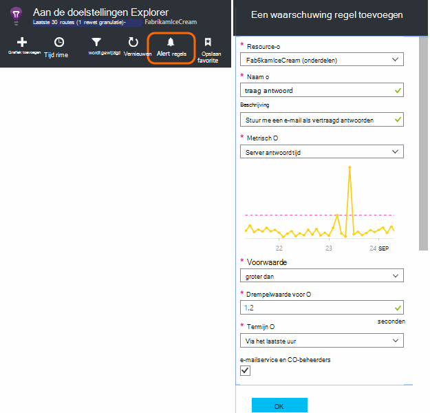
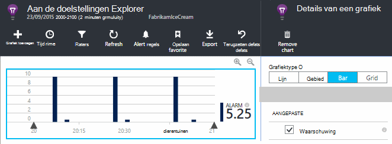
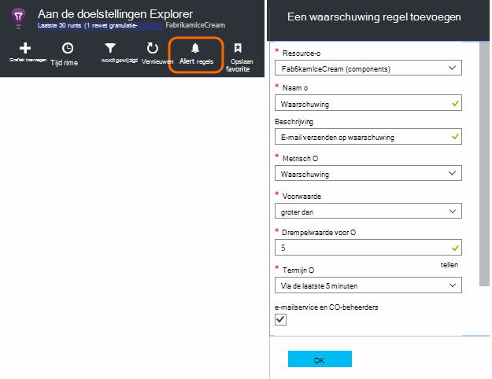
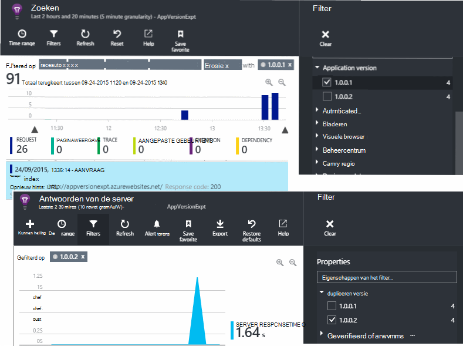
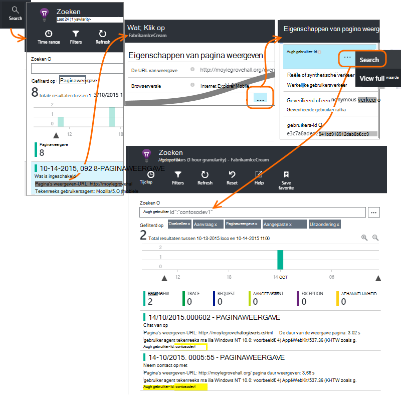
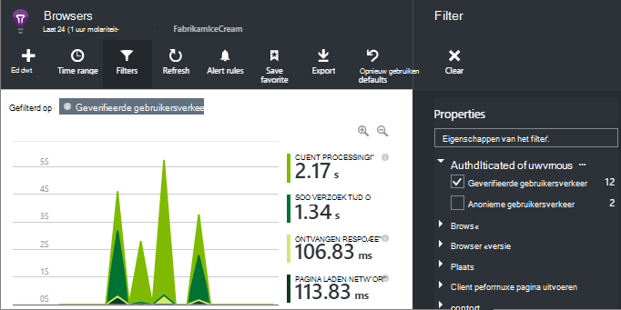
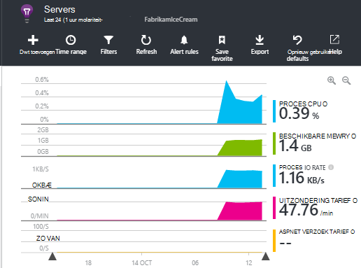

<properties 
    pageTitle="Hoe kan ik... in toepassing inzichten | Microsoft Azure" 
    description="Veelgestelde vragen in de toepassing inzichten." 
    services="application-insights" 
    documentationCenter=""
    authors="alancameronwills" 
    manager="douge"/>

<tags 
    ms.service="application-insights" 
    ms.workload="tbd" 
    ms.tgt_pltfrm="ibiza" 
    ms.devlang="na" 
    ms.topic="article" 
    ms.date="02/05/2016" 
    ms.author="awills"/>

# <a name="how-do-i--in-application-insights"></a>Hoe kan ik... in toepassing inzichten?

## <a name="get-an-email-when-"></a>Een e-mailbericht wanneer...

### <a name="email-if-my-site-goes-down"></a>E-mailbericht als uitvalt voor Mijn site

Stel een [beschikbaarheid web testen](app-insights-monitor-web-app-availability.md).

### <a name="email-if-my-site-is-overloaded"></a>E-als Mijn site is overbelast

Een [Waarschuwing](app-insights-alerts.md) instellen tijdig **antwoord Server**. Een drempelwaarde tussen 1 en 2 seconden moet werken.



Uw app mogelijk vertonen druk ook weergeven door te retourneren mislukt codes. Een waarschuwing instellen voor **mislukt aanvragen**.

Als u een waarschuwing instellen voor de **serveruitzonderingen wilt**, is het wellicht moet u [enkele aanvullende instellingen](app-insights-asp-net-exceptions.md) doen om te zien van gegevens.

### <a name="email-on-exceptions"></a>Uitzonderingen-e

1. [Uitzonderingen voor controle instellen](app-insights-asp-net-exceptions.md)
2. [Een waarschuwing instellen](app-insights-alerts.md) voor de uitzondering tellen meetwaarde


### <a name="email-on-an-event-in-my-app"></a>Een gebeurtenis in mijn app-e

Stel de gewenste zodat u een e-mailbericht wanneer een specifieke gebeurtenis plaatsvindt. Toepassing inzichten rechtstreeks deze functie niet zelf, maar kan het [verzenden van een melding wanneer een meting een drempelwaarde kruist](app-insights-alerts.md). 

Waarschuwingen kunnen worden ingesteld op [aangepast aan de doelstellingen](app-insights-api-custom-events-metrics.md#track-metric), maar niet aangepaste gebeurtenissen. Sommige programmacode als u wilt een meting verhogen als de gebeurtenis schrijven:

    telemetry.TrackMetric("Alarm", 10);

of:

    var measurements = new Dictionary<string,double>();
    measurements ["Alarm"] = 10;
    telemetry.TrackEvent("status", null, measurements);

Omdat waarschuwingen twee weergaven hebben, moet u aan een laag waarde verzenden wanneer u rekening houden met de melding is beëindigd:

    telemetry.TrackMetric("Alarm", 0.5);

Een grafiek maken in [metrische Verkenner](app-insights-metrics-explorer.md) om de waarschuwing weer te geven:



Nu een melding uitgevoerd als de meetwaarde boven een deel waarde voor een korte termijn gaat instellen:




Stel de gemiddelde periode tot het minimum. 

U krijgt e-mailberichten wanneer de meetwaarde boven gaat en onder de drempel.

Enkele punten u rekening moet houden:

* Een waarschuwing heeft twee staten ('melding' en 'goed'). De status alleen geëvalueerd wanneer een meting wordt ontvangen.
* Een e-mailbericht is verzonden alleen wanneer de status wordt gewijzigd. Dit is waarom u moet verzenden beide hoge en lage waarden aan de doelstellingen. 
* Als u wilt evalueren de melding, is het gemiddelde overgenomen van de ontvangen waarden de voorgaande periode. Dit gebeurt telkens wanneer een meting wordt ontvangen, zodat e-mailberichten vaker dan de periode die u instellen dat kunnen worden verzonden.
* Omdat e-mailberichten worden verzonden zowel op 'waarschuwing' en 'goed', is het raadzaam u rekening moet houden opnieuw denkt uw one-shot gebeurtenis als een voorwaarde twee statussen. In plaats van een gebeurtenis 'taak voltooid', bijvoorbeeld een voorwaarde 'taak wordt uitgevoerd', waar u een e-mailberichten worden aan het begin en einde van een taak.

### <a name="set-up-alerts-automatically"></a>Waarschuwingen automatisch instellen

[PowerShell gebruiken om nieuwe waarschuwingen te maken](app-insights-alerts.md#set-alerts-by-using-powershell)

## <a name="use-powershell-to-manage-application-insights"></a>PowerShell gebruiken voor het beheren van toepassing inzichten

* [Maken van nieuwe resources](app-insights-powershell-script-create-resource.md)
* [Nieuwe waarschuwingen maken](app-insights-alerts.md#set-alerts-by-using-powershell)

## <a name="application-versions-and-stamps"></a>Versies van toepassingen en stempelen

### <a name="separate-the-results-from-dev-test-and-prod"></a>De resultaten wilt scheiden van ontwikkelaar, testen en productcatalogus

* Voor verschillende environmnents, stelt u verschillende ikeys
* Voor verschillende stempelen (ontwikkelaar, testen, Prod.) het telemetrielogboek met verschillende eigenschapswaarden markeren

[Meer informatie](app-insights-separate-resources.md)
 

### <a name="filter-on-build-number"></a>Filteren op build-nummer

Wanneer u een nieuwe versie van uw app publiceert, wilt u mogelijk om te scheiden van het telemetrielogboek van verschillende versies.

U kunt de eigenschap versie van de toepassing kunt instellen, zodat u kunt [Zoeken](app-insights-diagnostic-search.md) en [metrische explorer](app-insights-metrics-explorer.md) resultaten filteren. 




Er zijn verschillende methoden van de eigenschap versie van toepassing.

* Rechtstreeks instellen:

    `telemetryClient.Context.Component.Version = typeof(MyProject.MyClass).Assembly.GetName().Version;`

* Deze regel in een [telemetrielogboek initialisatiefunctie](app-insights-api-custom-events-metrics.md#telemetry-initializers) om ervoor te zorgen dat de overal TelemetryClient consistent zijn ingesteld laten teruglopen.

* [ASP.NET] Stel de versie `BuildInfo.config`. De webmodule gewoon door de versie van het knooppunt BuildLabel. Dit bestand opnemen in uw project en vergeet niet dat de eigenschap altijd kopiëren in Solution Explorer instellen.

    ```XML

    <?xml version="1.0" encoding="utf-8"?>
    <DeploymentEvent xmlns:xsi="http://www.w3.org/2001/XMLSchema-instance" xmlns:xsd="http://www.w3.org/2001/XMLSchema" xmlns="http://schemas.microsoft.com/VisualStudio/DeploymentEvent/2013/06">
      <ProjectName>AppVersionExpt</ProjectName>
      <Build type="MSBuild">
        <MSBuild>
          <BuildLabel kind="label">1.0.0.2</BuildLabel>
        </MSBuild>
      </Build>
    </DeploymentEvent>

    ```
* [ASP.NET] Genereer BuildInfo.config automatisch in MSBuild. Klik hiertoe aan uw .csproj-bestand met toevoegen van een paar regels:

    ```XML

    <PropertyGroup>
      <GenerateBuildInfoConfigFile>true</GenerateBuildInfoConfigFile>    <IncludeServerNameInBuildInfo>true</IncludeServerNameInBuildInfo>
    </PropertyGroup> 
    ```

    Hierdoor wordt een bestand met de naam *yourProjectName*gegenereerd. BuildInfo.config. Het proces publiceren wordt de naam van deze BuildInfo.config.

    Het label opbouwen bevat een tijdelijke aanduiding (AutoGen_...) als u met Visual Studio samenstelt. Maar wanneer MSBuild gebouwd, deze wordt gevuld met het juiste versienummer weergegeven.

    Stel de versie zoals wilt toestaan MSBuild te genereren versienummers `1.0.*` in AssemblyReference.cs

## <a name="monitor-backend-servers-and-desktop-apps"></a>Monitor backend-servers en bureaublad-apps

[Gebruik de module Windows Server SDK](app-insights-windows-desktop.md).


## <a name="visualize-data"></a>Gegevens visualiseren

#### <a name="dashboard-with-metrics-from-multiple-apps"></a>Dashboard met aan de doelstellingen van meerdere apps

* Het diagram aanpassen en opslaan als favoriet in [Metrisch Explorer](app-insights-metrics-explorer.md). Vastmaken aan het Azure dashboard.


#### <a name="dashboard-with-data-from-other-sources-and-application-insights"></a>Dashboard met gegevens uit andere bronnen en inzichten van toepassing

* [Telemetrielogboek op Power BI exporteren](app-insights-export-power-bi.md). 

Of

* SharePoint als het dashboard van het weergeven van gegevens in SharePoint-webonderdelen gebruiken. [Continue exporteren en Stream Analytics exporteren naar SQL gebruiken](app-insights-code-sample-export-sql-stream-analytics.md).  Power View gebruiken om te bekijken van de database en het maken van een SharePoint-webonderdeel voor Power View.


<a name="search-specific-users"></a>
### <a name="filter-out-anonymous-or-authenticated-users"></a>Anonieme of geverifieerde gebruikers uitfilteren

Als uw gebruikers zich aanmelden, kunt u instellen de [geverifieerde gebruikers-id](app-insights-api-custom-events-metrics.md#authenticated-users). (Het gebeurt niet automatisch.) 

U kunt vervolgens het volgende doen:

* Zoeken op specifieke gebruikers-id 's



* Filter maatstelsel anonieme of geverifieerde gebruikers



## <a name="modify-property-names-or-values"></a>Eigenschapnamen of waarden wijzigen

Een [filter](app-insights-api-filtering-sampling.md#filtering)maken. Hiermee kunt u wijzigen of hierop wilt filteren telemetrielogboek voordat deze wordt verzonden vanuit uw app inzicht krijgen in toepassing.

## <a name="list-specific-users-and-their-usage"></a>Lijst met specifieke gebruikers en hun gebruik

Als u [Zoeken naar specifieke gebruikers wilt](#search-specific-users), kunt u instellen de [geverifieerde gebruikers-id](app-insights-api-custom-events-metrics.md#authenticated-users).

Als u een lijst met gebruikers met gegevens zoals welke pagina's wilt zien ze er op of hoe vaak ze zich aanmelden, hebt u twee opties:

* [Set geverifieerde gebruikers-id](app-insights-api-custom-events-metrics.md#authenticated-users), [exporteren naar een database](app-insights-code-sample-export-sql-stream-analytics.md) en gebruik geschikt hulpprogramma's er gebruikergegevens te analyseren.
* Als u slechts een klein aantal gebruikers hebt, aangepaste gebeurtenissen of de doelstellingen, met de gegevens van belang als de naam van de metrische waarde of gebeurtenis en het instellen van de gebruikers-id als een eigenschap verzenden. Als u wilt analyseren paginaweergaven, vervangt u de standaard JavaScript trackPageView oproep. Als u wilt analyseren aan de clientzijde telemetrielogboek, gebruik u een initialisatiefunctie telemetrielogboek de gebruikers-id toevoegen aan alle server-telemetrielogboek. Vervolgens kunt u filteren en segment maatstaven en zoekopdrachten op de gebruikers-id.


## <a name="reduce-traffic-from-my-app-to-application-insights"></a>Verkeer van mijn app inzicht krijgen in toepassing verlagen

* Uitschakelen in [ApplicationInsights.config](app-insights-configuration-with-applicationinsights-config.md), alle modules die u niet nodig hebt, zoals de prestatiemeteritem verzamelen.
* Gebruikt u de SDK [steekproeven en filteren](app-insights-api-filtering-sampling.md) .
* Beperk het aantal Ajax-oproepen gerapporteerd voor de weergave van elke pagina in uw webpagina's. In het fragment script na `instrumentationKey:...` , invoegen: `,maxAjaxCallsPerView:3` (of een geschikte getal).
* Als u [TrackMetric](app-insights-api-custom-events-metrics.md#track-metric)gebruikt, berekent u het totaal van batches van metrische waarden voordat u het resultaat verzendt. Er is een grote hoeveelheid TrackMetric() die wordt weergegeven voor die.


Meer informatie over de [prijzen en quota](app-insights-pricing.md).

## <a name="disable-telemetry"></a>Telemetrielogboek uitschakelen

**Dynamisch stoppen en starten** de verzameling en overdracht van telemetrielogboek van de server:

```

    using  Microsoft.ApplicationInsights.Extensibility;

    TelemetryConfiguration.Active.DisableTelemetry = true;
```


Voor het **uitschakelen van geselecteerde standaard voorwerpen voor verzamelingen** - bijvoorbeeld prestatie-items, HTTP-aanvragen of afhankelijkheden - verwijderen of opmerking om de relevante regels in [ApplicationInsights.config](app-insights-api-custom-events-metrics.md). U kunt dit doet, bijvoorbeeld als u wilt uw eigen gegevens TrackRequest verzenden.


## <a name="view-system-performance-counters"></a>Weergave systeem prestatie-items

Tussen de u in de Verkenner de doelstellingen weergeven kunt van de doelstellingen zijn in een reeks systeem prestatie-items. Er is een vooraf gedefinieerde blade getiteld **Servers** waarin meerdere worden weergegeven.



### <a name="if-you-see-no-performance-counter-data"></a>Als er geen prestatiemeteritemgegevens

* **IIS-server** op uw eigen computer of op een VM. [Statuscontrole installeren](app-insights-monitor-performance-live-website-now.md). 
* **Azure website** - wordt prestatiemeteritems nog niet ondersteund. Er zijn verschillende u deze als standaard onderdeel van het Configuratiescherm van Azure website krijgen kunt aan de doelstellingen.
* **UNIX-server** - [collectd installeren](app-insights-java-collectd.md)

### <a name="to-display-more-performance-counters"></a>Van prestatiemeteritems weergeven

* Eerst [een nieuwe grafiek toevoegen](app-insights-metrics-explorer.md) en bekijk de teller is in de basic ingesteld dat we bieden.
* Als dit niet het geval is, wordt [het item met de set die worden verzameld door de prestatiemetermodule-item toevoegen](app-insights-performance-counters.md).


