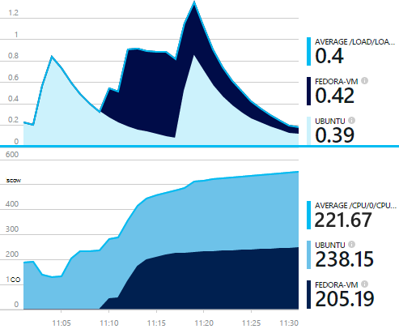
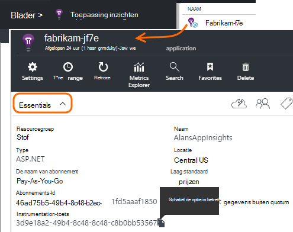
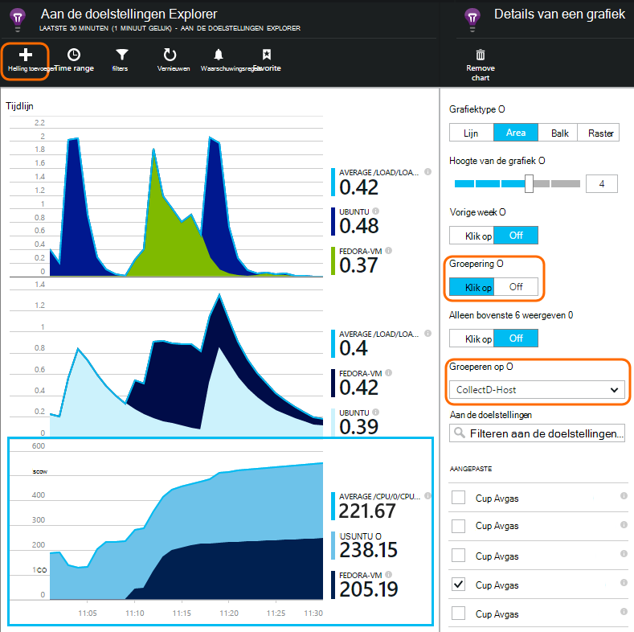

<properties 
    pageTitle="collectd: perf stat voor Java op Unix in toepassing inzichten" 
    description="Uitgebreide controle van uw website Java met de invoegtoepassing CollectD voor toepassing inzichten" 
    services="application-insights" 
    documentationCenter="java"
    authors="alancameronwills" 
    manager="douge"/>

<tags 
    ms.service="application-insights" 
    ms.workload="tbd" 
    ms.tgt_pltfrm="ibiza" 
    ms.devlang="na" 
    ms.topic="article" 
    ms.date="08/24/2016" 
    ms.author="awills"/>
 
# <a name="collectd-unix-performance-metrics-in-application-insights"></a>collectd: Unix-prestatiegegevens in toepassing inzichten

*Er is een toepassing inzichten in de proefversie.*

Als u wilt verkennen Unix systeemprestaties in [Toepassing inzichten](app-insights-overview.md), [collectd](http://collectd.org/), samen met de bijbehorende toepassing inzichten-invoegtoepassing te installeren. Deze oplossing open source worden verschillende systeem- en statistieken verzameld.

Meestal gebruikt u collectd als u al hebt [geïmplementeerd uw Java-webservice met toepassing inzichten][java]. Hebt u meer gegevens kunt verbeteren de prestaties van uw app of problemen. 



## <a name="get-your-instrumentation-key"></a>Uw sleutel instrumentation ophalen

Open de [Toepassing inzichten](app-insights-overview.md) resource waar u de gegevens wilt weergeven in de [portal van Microsoft Azure](https://portal.azure.com). (Of [een nieuwe resource maakt](app-insights-create-new-resource.md)).

Een kopie van de toets instrumentation, waarmee de resource duren.




## <a name="install-collectd-and-the-plug-in"></a>Collectd en de invoegtoepassing installeren

Op de Unix-servers:

1. [Collectd](http://collectd.org/) versie 5.4.0 installeren of hoger.
2. Download de [toepassing inzichten collectd schrijver-invoegtoepassing](https://aka.ms/aijavasdk). Houd rekening met het versienummer weergegeven.
3. De invoegtoepassing voor JAR in kopiëren `/usr/share/collectd/java`.
3. Bewerken `/etc/collectd/collectd.conf`:
 * Zorg ervoor dat [de Java-invoegtoepassing](https://collectd.org/wiki/index.php/Plugin:Java) is ingeschakeld.
 * Werk de JVMArg voor de java.class.path als u wilt opnemen het volgende oppervlak. Het versienummer zodat deze overeenkomen met de sectie die u hebt gedownload bijwerken:
  * `/usr/share/collectd/java/applicationinsights-collectd-1.0.5.jar`
 * In dit fragment, met de toets Instrumentation uit de bron toevoegen:

```

     LoadPlugin "com.microsoft.applicationinsights.collectd.ApplicationInsightsWriter"
     <Plugin ApplicationInsightsWriter>
        InstrumentationKey "Your key"
     </Plugin>
```

Hier maakt deel uit van een steekproef configuratiebestand:

    ...
    # collectd plugins
    LoadPlugin cpu
    LoadPlugin disk
    LoadPlugin load
    ...

    # Enable Java Plugin
    LoadPlugin "java"

    # Configure Java Plugin
    <Plugin "java">
      JVMArg "-verbose:jni"
      JVMArg "-Djava.class.path=/usr/share/collectd/java/applicationinsights-collectd-1.0.5.jar:/usr/share/collectd/java/collectd-api.jar"

      # Enabling Application Insights plugin
      LoadPlugin "com.microsoft.applicationinsights.collectd.ApplicationInsightsWriter"
                
      # Configuring Application Insights plugin
      <Plugin ApplicationInsightsWriter>
        InstrumentationKey "12345678-1234-1234-1234-123456781234"
      </Plugin>

      # Other plugin configurations ...
      ...
    </Plugin>
.   ...

Andere [collectd Plug-ins](https://collectd.org/wiki/index.php/Table_of_Plugins), waarin verschillende gegevens uit verschillende bronnen kunt verzamelen configureren.

Start opnieuw collectd op basis van de [handmatige](https://collectd.org/wiki/index.php/First_steps).

## <a name="view-the-data-in-application-insights"></a>De gegevens in de toepassing inzichten weergeven

Open in uw toepassing inzichten resource, [Explorer aan de doelstellingen en grafieken toevoegen][metrics], de cijfers die u wilt zien in de aangepaste categorie selecteren.



Standaard worden de aan de doelstellingen samengevoegd alle host machines waaruit de aan de doelstellingen zijn verzameld. Als u wilt de statistieken per host, bekijken in het diagram details blad, groeperen inschakelen en kies vervolgens om te groeperen op CollectD-Host.


## <a name="to-exclude-upload-of-specific-statistics"></a>Upload van specifieke statistieken uitsluiten

De invoegtoepassing voor de toepassing inzichten verzendt standaard alle gegevens die worden verzameld door de ingeschakelde collectd lezen Plug-ins. 

Gegevens uitsluiten van specifieke Plug-ins of gegevensbronnen:

* Het configuratiebestand bewerken. 
* In `<Plugin ApplicationInsightsWriter>`, Richtlijn lijnen als volgt toevoegen:

Richtlijn | Effect
---|---
`Exclude disk` | Uitsluiten van alle gegevens die worden verzameld door de `disk` Plug
`Exclude disk:read,write` | Uitsluiten van de bronnen die met de naam `read` en `write` uit de `disk` invoegtoepassing.

Afzonderlijke richtlijnen met een nieuwe regel.


## <a name="problems"></a>Problemen?

*Ik zie geen gegevens in de portal*

* Open [Zoeken] [ diagnostic] om te zien als onbewerkte gebeurtenissen zijn aangekomen. Soms duurt langer moet worden weergegeven in de Verkenner de doelstellingen.
* Moet u mogelijk [de firewalluitzonderingen voor uitgaande gegevens instellen](app-insights-ip-addresses.md)
* Tracering in de toepassing inzichten-invoegtoepassing inschakelen. Deze regel in toevoegen `<Plugin ApplicationInsightsWriter>`:
 *  `SDKLogger true`
* Een terminal openen en beginnen met collectd in de uitgebreide modus, om eventuele problemen meldt weer te geven:
 * `sudo collectd -f`


<!--Link references-->

[api]: app-insights-api-custom-events-metrics.md
[apiexceptions]: app-insights-api-custom-events-metrics.md#track-exception
[availability]: app-insights-monitor-web-app-availability.md
[diagnostic]: app-insights-diagnostic-search.md
[eclipse]: app-insights-java-eclipse.md
[java]: app-insights-java-get-started.md
[javalogs]: app-insights-java-trace-logs.md
[metrics]: app-insights-metrics-explorer.md
[usage]: app-insights-web-track-usage.md

 
