<properties 
    pageTitle="Aan de slag met inzicht in de toepassing met Java in Eclips" 
    description="Gebruik van de invoegtoepassing Eclips prestaties en gebruik monitoring naar uw website Java met toepassing inzichten toevoegen" 
    services="application-insights" 
    documentationCenter="java"
    authors="alancameronwills" 
    manager="douge"/>

<tags 
    ms.service="application-insights" 
    ms.workload="tbd" 
    ms.tgt_pltfrm="ibiza" 
    ms.devlang="na" 
    ms.topic="article" 
    ms.date="03/02/2016" 
    ms.author="awills"/>
 
# Aan de slag met inzicht in de toepassing met Java in Eclips

De toepassing inzichten SDK wordt telemetrielogboek verzonden vanuit uw webtoepassing Java, zodat u kunt gebruik en analyseren. De invoegtoepassing voor de toepassing inzichten Eclips installeert automatisch de SDK in uw project, zodat u eraan het vak telemetrielogboek, plus een API die u kunt gebruiken om te schrijven van aangepaste telemetrielogboek.   

## Vereisten voor

De invoegtoepassing werkt momenteel voor Maven projecten en dynamische webprojecten in Eclips. ([Toepassing inzichten toevoegen aan andere soorten Java project][java].)

U hebt nodig:

* Oracle JRE 1,6 of hoger
* Een abonnement op [Microsoft Azure](https://azure.microsoft.com/). (U kunt starten met de [gratis proefversie](https://azure.microsoft.com/pricing/free-trial/).)
* [Eclips IDE voor Java EE ontwikkelaars](http://www.eclipse.org/downloads/), Indigo of hoger.
* Windows 7 of hoger, of Windows Server 2008 of hoger

## De SDK installeren op Eclips (één keer)

U moet alleen dit één keer per computer uitvoeren. Deze stap een toolkit die vervolgens de SDK aan elk dynamische Web-Project toevoegen kunt is geïnstalleerd.

1. Klik op Help, nieuwe Software installeren in Eclips.

    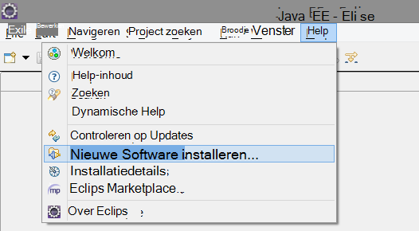

2. De SDK is in http://dl.windowsazure.com/eclipse, onder Azure Toolkit. 
3. Schakel **Neem contact op met alle updatewebsites...**

    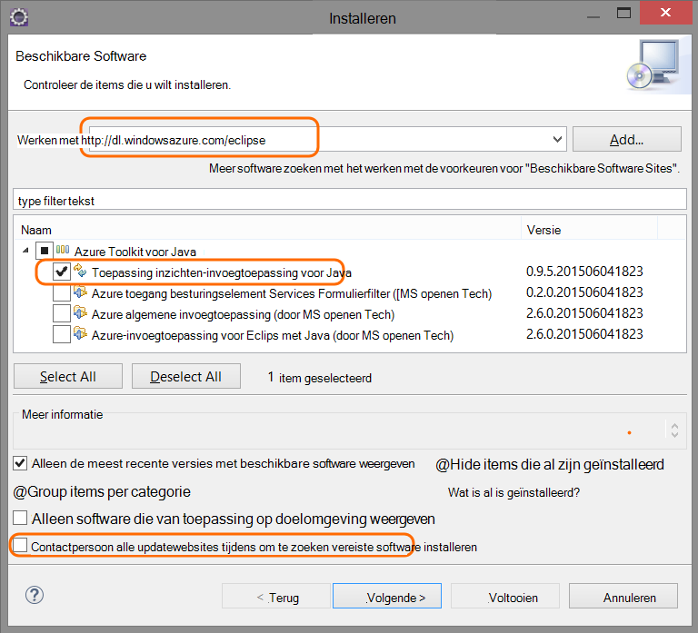

De overige stappen voor elk project Java.

## Maken van een resource van toepassing inzichten in Azure wordt aangegeven

1. Meld u aan bij de [portal van Azure](https://portal.azure.com).
2. Maak een nieuwe resource van toepassing inzichten.  

    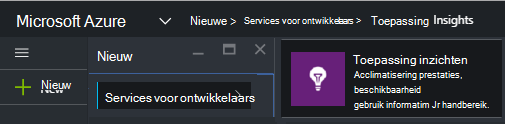  
3. Stel het toepassingstype op Java-webtoepassing.  

    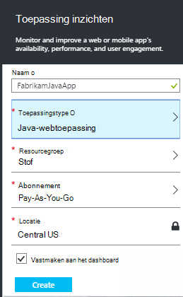  
4. Zoek de instrumentation-toets voor de nieuwe bron. U moet dit binnenkort in uw CodeProject plakken.  

    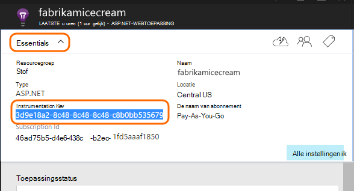  

## Toepassing inzichten toevoegen aan uw project

1. Inzichten die toepassing in het contextmenu van uw Java-web-project toevoegen.

    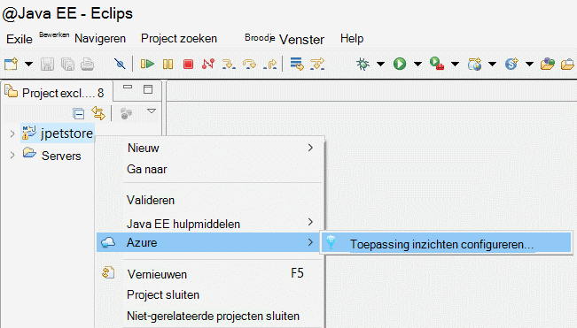

2. Plak de instrumentation opgeven die u hebt ontvangen van de Azure-portal.

    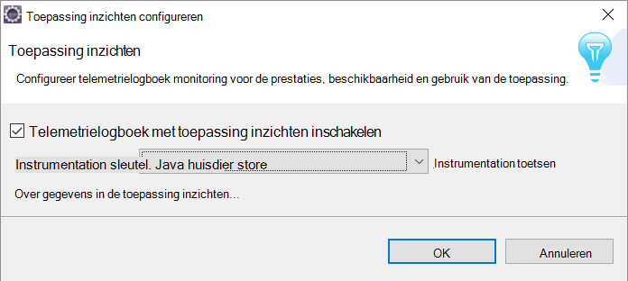

De toets wordt verzonden samen met alle items van telemetrielogboek en inzichten van de toepassing weer te geven in de bron worden vermeld.

## Voer de toepassing en Zie aan de doelstellingen

Voer uw toepassing uit.

Ga terug naar uw bron-toepassing inzichten in Microsoft Azure.

HTTP-aanvragen gegevens wordt weergegeven op het blad Overzicht. (Als deze niet ziet, wacht een paar seconden en klik vervolgens op vernieuwen.)

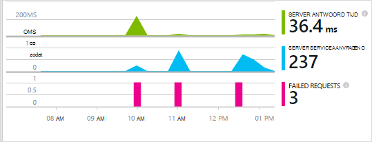
 

Klik op in een grafiek om meer gedetailleerde afmetingen weer te geven. 

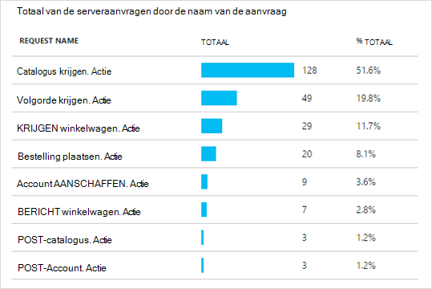

[Meer informatie over de doelstellingen.][metrics]

 

En wanneer u de eigenschappen van een nieuw vergaderverzoek bekijkt, ziet u de telemetrielogboek gebeurtenissen die zijn gekoppeld aan dit zoals aanvragen en uitzonderingen.
 
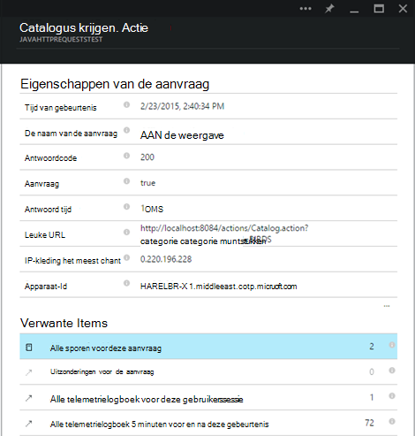

## Aan de clientzijde telemetrielogboek

Klik op Get-code als u wilt controleren van mijn webpagina's van het blad Snelstartgids: 

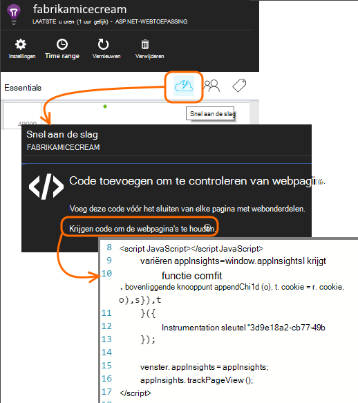

Het codefragment invoegen in de kop van uw HTML-bestanden.

#### De gegevens aan de clientzijde weergeven

Open uw bijgewerkte webpagina's en deze gebruiken. Wacht een paar minuten of twee, en vervolgens terug naar de toepassing inzichten en opent u het blad gebruik. (Het blad overzicht, schuif omlaag en klik op gebruik.)

De doelstellingen van de weergave, gebruiker en sessie van de pagina wordt weergegeven op het blad gebruik:

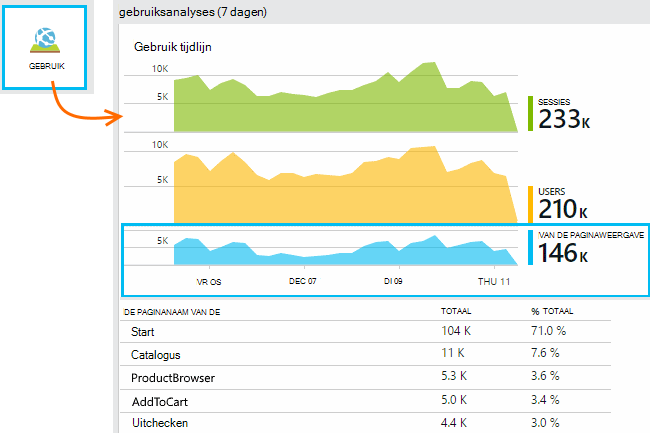

[Meer informatie over het instellen van aan de clientzijde telemetrielogboek.][usage]

## Uw toepassing publiceren

Nu uw app naar de server, laat personen gebruiken, en bekijk de telemetrielogboek worden weergegeven op de portal voor publiceren.

* Controleer of dat uw firewall kan de toepassing telemetrielogboek naar deze poorten verzenden:

 * DC.Services.visualstudio.com:443
 * DC.Services.visualstudio.com:80
 * F5.Services.visualstudio.com:443
 * F5.Services.visualstudio.com:80

* Installeren op Windows-servers:

 * [Microsoft Visual C++ distribueren pakket](http://www.microsoft.com/download/details.aspx?id=40784)

    (Hiermee kunt u prestatiemeteritems.)

## Uitzonderingen en aanvraag fouten

Onverwerkte uitzonderingen zijn automatisch verzameld:

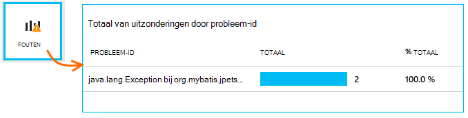

Als u wilt gegevens verzamelen over andere uitzonderingen, hebt u twee opties:

* [Oproepen naar TrackException in code invoegen](app-insights-api-custom-events-metrics.md#track-exception). 
* [De Java-Agent op de server installeren](app-insights-java-agent.md). U de methoden die u wilt bekijken.

## Monitor met een methode oproepen en externe afhankelijkheden

Interne methoden en oproepen via JDBC, met gegevens van de tijdsinstellingen van het [installeren van de Java-Agent](app-insights-java-agent.md) aan te melden worden opgegeven.

## Prestatie-items

Klik op uw bladeserver overzicht, schuif omlaag en klik op de tegel **Servers** . Hier ziet u een bereik van prestatiemeteritems.

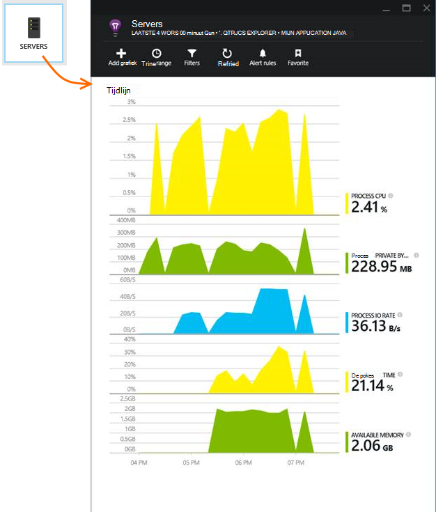

### Prestatiemeteritem siteverzameling aanpassen

Als u wilt uitschakelen verzameling de standaardset prestatie-items, de volgende code onder het knooppunt van de hoofdmap van het bestand ApplicationInsights.xml hebt toegevoegd:

    <PerformanceCounters>
       <UseBuiltIn>False</UseBuiltIn>
    </PerformanceCounters>

### Aanvullende prestatiemeteritems verzamelen

Aanvullende prestatie-items om te worden verzameld, kunt u opgeven.

#### JMX items (die worden aangeboden door de Java Virtual Machine)

    <PerformanceCounters>
      <Jmx>
        <Add objectName="java.lang:type=ClassLoading" attribute="TotalLoadedClassCount" displayName="Loaded Class Count"/>
        <Add objectName="java.lang:type=Memory" attribute="HeapMemoryUsage.used" displayName="Heap Memory Usage-used" type="composite"/>
      </Jmx>
    </PerformanceCounters>

*   `displayName`– De naam die wordt weergegeven in de portal-toepassing inzichten.
*   `objectName`– De naam van het object JMX.
*   `attribute`– Het kenmerk van de naam van het object JMX om op te halen
*   `type`(optioneel) - het type van het object JMX kenmerk:
 *  Standaard: een eenvoudig type zoals int of lang.
 *  `composite`: de prestatiemetergegevens is de notatie 'Attribute.Data'
 *  `tabular`: de prestatiemetergegevens is in de indeling van een tabelrij

#### Windows prestatie-items

Elke [Windows prestatie-item](https://msdn.microsoft.com/library/windows/desktop/aa373083.aspx) is een lid van een categorie (op dezelfde manier dat een veld een lid van een klasse is). Categorieën kunnen zijn globale, of hebt genummerd of met de naam exemplaren.

    <PerformanceCounters>
      <Windows>
        <Add displayName="Process User Time" categoryName="Process" counterName="%User Time" instanceName="__SELF__" />
        <Add displayName="Bytes Printed per Second" categoryName="Print Queue" counterName="Bytes Printed/sec" instanceName="Fax" />
      </Windows>
    </PerformanceCounters>

*   Weergavenaam – de naam weergegeven in de portal-toepassing inzichten.
*   Categorienaam – de prestatiemeteritemcategorie (prestatie-object) waaraan dit prestatiemeteritem gekoppeld is.
*   counterName – de naam van de teller prestaties.
*   Exemplaarnaam – de naam van de Prestatiemeteritem categorie-instantie of een lege tekenreeks (""), als de categorie één exemplaar bevat. Als de categorienaam proces is, en de prestatie-item dat u wilt verzamelen afkomstig is van het huidige JVM-proces op waarin uw app actief is, geeft `"__SELF__"`.

Uw prestatiemeteritems worden weergegeven als aangepast aan de doelstellingen in [Aan de doelstellingen Explorer][metrics].

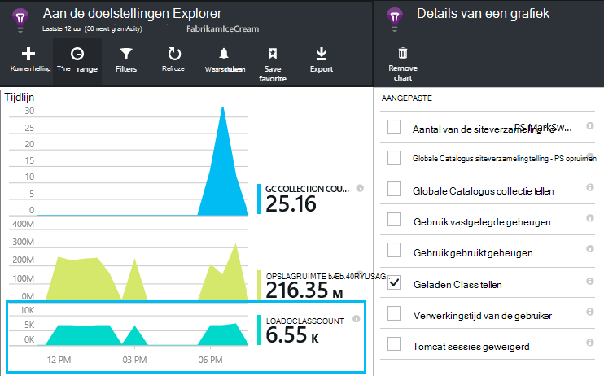

### UNIX prestatiemeteritems

* [Collectd met de toepassing inzichten-invoegtoepassing installeren](app-insights-java-collectd.md) om een groot aantal gegevens systeem en netwerk.

## Beschikbaarheid van web tests

Toepassing inzichten kunnen testen van uw website met regelmatige tussenpozen om te controleren die is en u ook reageert. [Voor het instellen van][availability], schuif omlaag om beschikbaarheid op te klikken.

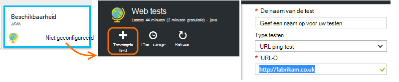

U krijgt grafieken antwoord tijden, plus e-mailmeldingen als uw site uitvalt.

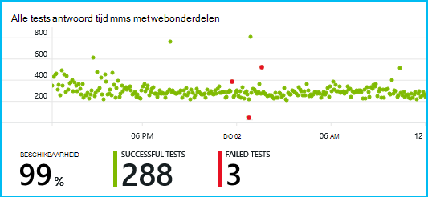

[Meer informatie over de beschikbaarheid van web tests.][availability] 

## Diagnostische logboeken

Als u Logback of Log4J gebruikt (versie 1.2 of v2.0) voor tracering, kunt u beschikken over de logboeken voor het traceren automatisch naar de toepassing inzichten waar u kunt verkennen en zoeken worden verzonden.

[Meer informatie over de diagnostische logboeken][javalogs]

## Aangepaste telemetrielogboek 

Voeg een paar regels met code in uw webtoepassing Java om vast te stellen wat gebruikers ermee doen of om op te sporen problemen. 

U kunt code hebt ingevoegd in webpagina JavaScript zowel in de Java servers.

[Meer informatie over aangepaste telemetrielogboek][track]

## Volgende stappen

#### Problemen ontdekken en analyseren

* [Toevoegen web client telemetrielogboek] [ usage] prestaties telemetrielogboek ophalen van de webclient.
* [Web tests instellen] [ availability] te controleren of uw toepassing blijft, live en heeft gereageerd.
* [Gebeurtenissen en logboeken zoeken] [ diagnostic] om op te sporen van problemen.
* [Log4J of Logback sporen vastleggen][javalogs]

#### Gebruik bijhouden

* [Toevoegen web client telemetrielogboek] [ usage] op monitor paginaweergaven en eenvoudige gebruiker aan de doelstellingen.
* [Aangepaste gebeurtenissen en aan de doelstellingen bijhouden] [ track] voor meer informatie over hoe uw toepassing wordt gebruikt, zowel op de client en de server.

<!--Link references-->

[availability]: app-insights-monitor-web-app-availability.md
[diagnostic]: app-insights-diagnostic-search.md
[java]: app-insights-java-get-started.md
[javalogs]: app-insights-java-trace-logs.md
[metrics]: app-insights-metrics-explorer.md
[track]: app-insights-api-custom-events-metrics.md
[usage]: app-insights-web-track-usage.md

 