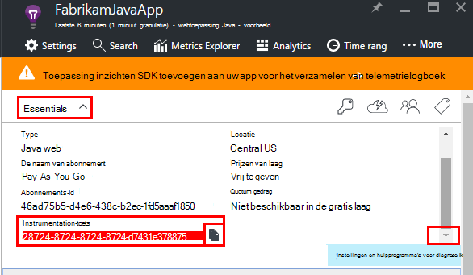

<properties
    pageTitle="Java webanalyse app met toepassing inzichten | Microsoft Azure"
    description="Prestaties en het gebruik van uw website Java met toepassing inzichten bewaken. "
    services="application-insights"
    documentationCenter="java"
    authors="alancameronwills"
    manager="douge"/>

<tags
    ms.service="application-insights"
    ms.workload="tbd"
    ms.tgt_pltfrm="ibiza"
    ms.devlang="na"
    ms.topic="get-started-article"
    ms.date="08/17/2016"
    ms.author="awills"/>

# Aan de slag met de toepassing inzichten in een Java-web-project

*Er is een toepassing inzichten in de proefversie.*

[AZURE.INCLUDE [app-insights-selector-get-started](../../includes/app-insights-selector-get-started.md)]

[Inzichten van toepassing](https://azure.microsoft.com/services/application-insights/) is een extensible analytics-service waarmee u meer informatie over de prestaties en het gebruik van uw live-toepassing. Deze gebruiken om te [ontdekken en analyseren prestatieproblemen en uitzonderingen](app-insights-detect-triage-diagnose.md)en [programmacode schrijven] [ api] om bij te houden wat gebruikers doen met uw app.

Toepassing inzichten ondersteunt Java-apps op Linux, Unix of Windows uitgevoerd.

U nodig hebt:

* Oracle JRE 1,6 of hoger, of Zulu JRE 1,6 of hoger
* Een abonnement op [Microsoft Azure](https://azure.microsoft.com/). (U kunt starten met de [gratis proefversie](https://azure.microsoft.com/pricing/free-trial/).)

*Als u een WebApp die al live hebt, kunt u de alternatieve procedure kunt volgen om toe te [voegen van de SDK gedurende runtime in de webserver](app-insights-java-live.md). Die alternatieve vermijdt opnieuw maken van de code, maar u ontvangt niet de optie code om bij te houden gebruikersactiviteit te schrijven.*

## 1. krijgen een toepassing inzichten instrumentation-sleutel

1. Meld u aan bij de [portal van Microsoft Azure](https://portal.azure.com).
2. Maak een toepassing inzichten resource. Stel het toepassingstype op Java-webtoepassing.

    
4. Zoek de instrumentation-toets voor de nieuwe bron. U moet deze toets binnenkort in uw CodeProject plakken.

    

## 2. de toepassing inzichten SDK for Java toevoegen aan uw project

*Kies de juiste manier voor uw project.*

#### Als u Eclips gebruikt voor het maken van een project Maven of dynamische Web...

Gebruik van de [Toepassing inzichten SDK for Java invoegtoepassing][eclipse].

#### Als u gebruikmaakt van Maven...

Als uw project is al ingesteld voor Maven gebruiken voor opbouwen, samenvoegen als u de volgende code aan uw bestand pom.xml.

Vernieuw de Projectafhankelijkheden om de binaire bestanden gedownload.

    <repositories>
       <repository>
          <id>central</id>
          <name>Central</name>
          <url>http://repo1.maven.org/maven2</url>
       </repository>
    </repositories>

    <dependencies>
      <dependency>
        <groupId>com.microsoft.azure</groupId>
        <artifactId>applicationinsights-web</artifactId>
        <!-- or applicationinsights-core for bare API -->
        <version>[1.0,)</version>
      </dependency>
    </dependencies>

* *Opbouwen of controlesom fouten met gegevensvalidatie?* Probeer met een specifieke versie, zoals: `<version>1.0.n</version>`. U vindt de meest recente versie in de [SDK releaseopmerkingen](https://github.com/Microsoft/ApplicationInsights-Java#release-notes) of in onze [Maven onderdelen](http://search.maven.org/#search%7Cga%7C1%7Capplicationinsights).
* *Bijwerken naar een nieuwe SDK nodig?* Vernieuwen van uw project afhankelijkheden.

#### Als u gebruikmaakt van Gradle...

Als uw project is al ingesteld voor het gebruiken van Gradle voor opbouwen, samenvoegen als u de volgende code aan uw bestand build.gradle.

Vernieuw de Projectafhankelijkheden om de binaire bestanden gedownload.

    repositories {
      mavenCentral()
    }

    dependencies {
      compile group: 'com.microsoft.azure', name: 'applicationinsights-web', version: '1.+'
      // or applicationinsights-core for bare API
    }

* *Opbouwen of controlesom validatie fouten? Probeer met een specifieke versie, zoals:* `version:'1.0.n'`. *In de [SDK releaseopmerkingen](https://github.com/Microsoft/ApplicationInsights-Java#release-notes)vindt u de meest recente versie.*
* *Bijwerken naar een nieuwe SDK*
 * Vernieuwen van uw project afhankelijkheden.

#### Anders...

Voeg de SDK handmatig toe:

1. Download de [toepassing inzichten SDK for Java](https://aka.ms/aijavasdk).
2. De binaire bestanden van het zip-bestand extraheren en deze toevoegen aan uw project.

### Vragen...

* *Wat is de relatie tussen de `-core` en `-web` onderdelen in het zip?*

 * `applicationinsights-core`kunt u de absoluut API. U moet altijd dit onderdeel.
 * `applicationinsights-web`biedt maatstelsel dat HTTP-verzoek telt en reactietijden. Als u niet dat deze telemetrielogboek automatisch die worden verzameld wilt, kunt u dit onderdeel weglaten. Stel dat u wilt schrijven uw eigen.

* *De SDK bijwerken wanneer we wijzigingen publiceert*
 * Download de meest recente [Toepassing inzichten SDK for Java](https://aka.ms/qqkaq6) en vervangen van de oude cijfers.
 * Wijzigingen worden beschreven in de [SDK releaseopmerkingen](https://github.com/Microsoft/ApplicationInsights-Java#release-notes).

## 3. een toepassing inzichten XML-bestand toevoegen

ApplicationInsights.xml toevoegen aan de map bronnen in uw project, of zorg ervoor dat deze wordt toegevoegd aan uw het pad van project implementatie class. Kopieer de volgende XML erin.

Vervangt door de instrumentation opgeven die u hebt ontvangen van de Azure-portal.

    <?xml version="1.0" encoding="utf-8"?>
    <ApplicationInsights xmlns="http://schemas.microsoft.com/ApplicationInsights/2013/Settings" schemaVersion="2014-05-30">

      <!-- The key from the portal: -->

      <InstrumentationKey>** Your instrumentation key **</InstrumentationKey>

      <!-- HTTP request component (not required for bare API) -->

      <TelemetryModules>
        <Add type="com.microsoft.applicationinsights.web.extensibility.modules.WebRequestTrackingTelemetryModule"/>
        <Add type="com.microsoft.applicationinsights.web.extensibility.modules.WebSessionTrackingTelemetryModule"/>
        <Add type="com.microsoft.applicationinsights.web.extensibility.modules.WebUserTrackingTelemetryModule"/>
      </TelemetryModules>

      <!-- Events correlation (not required for bare API) -->
      <!-- These initializers add context data to each event -->

      <TelemetryInitializers>
        <Add   type="com.microsoft.applicationinsights.web.extensibility.initializers.WebOperationIdTelemetryInitializer"/>
        <Add type="com.microsoft.applicationinsights.web.extensibility.initializers.WebOperationNameTelemetryInitializer"/>
        <Add type="com.microsoft.applicationinsights.web.extensibility.initializers.WebSessionTelemetryInitializer"/>
        <Add type="com.microsoft.applicationinsights.web.extensibility.initializers.WebUserTelemetryInitializer"/>
        <Add type="com.microsoft.applicationinsights.web.extensibility.initializers.WebUserAgentTelemetryInitializer"/>

      </TelemetryInitializers>
    </ApplicationInsights>

* De toets instrumentation is verzonden samen met alle items van telemetrielogboek en inzichten van de toepassing weer te geven in de bron worden vermeld.
* Het onderdeel HTTP-aanvraag is optioneel. Automatisch verzendt telemetrielogboek over het aanvragen en tijden antwoord bij de portal.
* Gebeurtenissen correlatie is een aanvulling op de HTTP-verzoek-component. Er wordt een id toegewezen aan elk verzoek om een ontvangen door de server en deze id als een eigenschap aan alle items van telemetrielogboek toegevoegd als de eigenschap 'Operation.Id'. U kunt het telemetrielogboek dat is gekoppeld aan elk verzoek om door te filteren in [Zoeken naar diagnostische gegevens]relateren[diagnostic].
* De toepassing inzichten-toets dynamisch kan worden doorgegeven van de Azure-portal als de systeemeigenschap van een (-DAPPLICATION_INSIGHTS_IKEY = your_ikey). Als er geen eigenschap gedefinieerd, er wordt gecontroleerd voor omgevingsvariabele (APPLICATION_INSIGHTS_IKEY) in de instellingen van de Azure-App. Als u zowel de eigenschappen zijn gedefinieerd, is de standaardwaarde InstrumentationKey uit ApplicationInsights.xml gebruikt. Deze reeks helpt u bij verschillende InstrumentationKeys voor verschillende omgevingen dynamisch beheren.

### Alternatieve manieren de instrumentation sleutels in te stellen

Toepassing inzichten SDK Hiermee wordt gezocht naar de toets in deze volgorde:

1. Systeemeigenschap:-DAPPLICATION_INSIGHTS_IKEY = your_ikey
2. Omgevingsvariabele: APPLICATION_INSIGHTS_IKEY
3. Configuratiebestand: ApplicationInsights.xml

U kunt ook [instellen in code](app-insights-api-custom-events-metrics.md#ikey):

    telemetryClient.InstrumentationKey = "...";

## 4. een HTTP-filter toevoegen

De laatste configuratiestap wordt het onderdeel van de aanvraag HTTP elk aanmelden. (Niet vereist als u alleen de absoluut API wilt).

Zoek en open het bestand web.xml in uw project en samenvoegen van de volgende code onder het knooppunt web-app, waar uw toepassingsfilters zijn geconfigureerd.

Als u de meest nauwkeurige resultaten, moet het filter voor alle andere filters worden toegewezen.

    <filter>
      <filter-name>ApplicationInsightsWebFilter</filter-name>
      <filter-class>
        com.microsoft.applicationinsights.web.internal.WebRequestTrackingFilter
      </filter-class>
    </filter>
    <filter-mapping>
       <filter-name>ApplicationInsightsWebFilter</filter-name>
       <url-pattern>/*</url-pattern>
    </filter-mapping>

#### Als u gebruikmaakt van Lenteachtergrond Web MVC 3.1 of hoger

Deze elementen als u wilt opnemen van de toepassing inzichten-pakket bewerken:

    <context:component-scan base-package=" com.springapp.mvc, com.microsoft.applicationinsights.web.spring"/>

    <mvc:interceptors>
        <mvc:interceptor>
            <mvc:mapping path="/**"/>
            <bean class="com.microsoft.applicationinsights.web.spring.RequestNameHandlerInterceptorAdapter" />
        </mvc:interceptor>
    </mvc:interceptors>

#### Als u gebruikmaakt van Struts 2

Dit item toevoegen aan het gehouden configuratiebestand (meestal struts.xml of gehouden-default.xml genoemd):

     <interceptors>
       <interceptor name="ApplicationInsightsRequestNameInterceptor" class="com.microsoft.applicationinsights.web.struts.RequestNameInterceptor" />
     </interceptors>
     <default-interceptor-ref name="ApplicationInsightsRequestNameInterceptor" />

(Als u gedefinieerd in een stapel standaard interceptors hebt, de interceptor kan eenvoudig worden toegevoegd aan die stapel.)

## 5. Start de toepassing

U kunt uitvoeren in de foutopsporingsmodus voor op uw computer ontwikkeling of op de server publiceren.

## 6. uw telemetrielogboek in toepassing inzichten bekijken

Ga terug naar uw toepassing inzichten resource in [Microsoft Azure-portal](https://portal.azure.com).

HTTP-aanvragen gegevens wordt weergegeven op het blad Overzicht. (Als deze niet ziet, wacht een paar seconden en klik vervolgens op vernieuwen.)

[Meer informatie over de doelstellingen.][metrics]

Klik op in een grafiek om meer gedetailleerde geaggregeerde afmetingen weer te geven.

> Toepassing inzichten wordt ervan uitgegaan dat de opmaak van HTTP-aanvragen voor MVC-toepassingen: `VERB controller/action`. Bijvoorbeeld `GET Home/Product/f9anuh81`, `GET Home/Product/2dffwrf5` en `GET Home/Product/sdf96vws` zijn gegroepeerd in `GET Home/Product`. Deze groepering kunt zinvolle aggregaties van aanvragen, zoals het aantal aanvragen en gemiddelde tijd voor uitvoeren voor aanvragen.

### Exemplaargegevens 

Klik op een specifieke aanvraag met het type om te zien afzonderlijke exemplaren. 

Twee soorten gegevens worden weergegeven in de toepassing inzichten: samengevoegde gegevens, opgeslagen en weergegeven als gemiddelden, aantallen en totalen; en gegevens - afzonderlijke rapporten van HTTP-aanvragen, uitzonderingen, paginaweergaven of aangepaste gebeurtenissen exemplaar.

Wanneer u de eigenschappen van een nieuw vergaderverzoek bekijkt, ziet u de telemetrielogboek gebeurtenissen die zijn gekoppeld aan dit zoals aanvragen en uitzonderingen.

### Analytics: De krachtige querytaal

Als u meer gegevens verzamelen, kunt u query's zowel gegevens aggregeren en afzonderlijke exemplaren zoeken kunt uitvoeren. [Analytics]() is een krachtige hulpprogramma voor beide voor informatie over prestaties en het gebruik en voor diagnose.

## 7. uw app op de server installeren

Nu uw app naar de server, laat personen gebruiken, en bekijk de telemetrielogboek worden weergegeven op de portal voor publiceren.

* Controleer of dat uw firewall kan de toepassing telemetrielogboek naar deze poorten verzenden:

 * DC.Services.visualstudio.com:443
 * F5.Services.visualstudio.com:443

* Installeren op Windows-servers:

 * [Microsoft Visual C++ distribueren pakket](http://www.microsoft.com/download/details.aspx?id=40784)

    (Dit onderdeel kunt prestatiemeteritems).

## Uitzonderingen en aanvraag fouten

Onverwerkte uitzonderingen zijn automatisch verzameld:

Als u wilt gegevens verzamelen over andere uitzonderingen, hebt u twee opties:

* [Oproepen naar trackException() invoegen in uw code][apiexceptions]. 
* [De Java-Agent op de server installeren](app-insights-java-agent.md). U de methoden die u wilt bekijken.

## Monitor met een methode oproepen en externe afhankelijkheden

Interne methoden en oproepen via JDBC, met gegevens van de tijdsinstellingen van het [installeren van de Java-Agent](app-insights-java-agent.md) aan te melden worden opgegeven.

## Prestatie-items

Open **Instellingen**- **Servers**om te zien van een bereik van prestatiemeteritems.

### Prestatiemeteritem siteverzameling aanpassen

Als u wilt uitschakelen verzameling de standaardset prestatie-items, de volgende code onder het knooppunt van de hoofdmap van het bestand ApplicationInsights.xml hebt toegevoegd:

    <PerformanceCounters>
       <UseBuiltIn>False</UseBuiltIn>
    </PerformanceCounters>

### Aanvullende prestatiemeteritems verzamelen

Aanvullende prestatie-items om te worden verzameld, kunt u opgeven.

#### JMX items (die worden aangeboden door de Java Virtual Machine)

    <PerformanceCounters>
      <Jmx>
        <Add objectName="java.lang:type=ClassLoading" attribute="TotalLoadedClassCount" displayName="Loaded Class Count"/>
        <Add objectName="java.lang:type=Memory" attribute="HeapMemoryUsage.used" displayName="Heap Memory Usage-used" type="composite"/>
      </Jmx>
    </PerformanceCounters>

*   `displayName`– De naam die wordt weergegeven in de portal-toepassing inzichten.
*   `objectName`– De naam van het object JMX.
*   `attribute`– Het kenmerk van de naam van het object JMX om op te halen
*   `type`(optioneel) - het type van het object JMX kenmerk:
 *  Standaard: een eenvoudig type zoals int of lang.
 *  `composite`: de prestatiemetergegevens is de notatie 'Attribute.Data'
 *  `tabular`: de prestatiemetergegevens is in de indeling van een tabelrij

#### Windows prestatie-items

Elke [Windows prestatie-item](https://msdn.microsoft.com/library/windows/desktop/aa373083.aspx) is een lid van een categorie (op dezelfde manier dat een veld een lid van een klasse is). Categorieën kunnen zijn globale, of hebt genummerd of met de naam exemplaren.

    <PerformanceCounters>
      <Windows>
        <Add displayName="Process User Time" categoryName="Process" counterName="%User Time" instanceName="__SELF__" />
        <Add displayName="Bytes Printed per Second" categoryName="Print Queue" counterName="Bytes Printed/sec" instanceName="Fax" />
      </Windows>
    </PerformanceCounters>

*   Weergavenaam – de naam weergegeven in de portal-toepassing inzichten.
*   Categorienaam – de prestatiemeteritemcategorie (prestatie-object) waaraan dit prestatiemeteritem gekoppeld is.
*   counterName – de naam van de teller prestaties.
*   Exemplaarnaam – de naam van de Prestatiemeteritem categorie-instantie of een lege tekenreeks (""), als de categorie één exemplaar bevat. Als de categorienaam proces is, en de prestatie-item dat u wilt verzamelen afkomstig is van het huidige JVM-proces op waarin uw app actief is, geeft `"__SELF__"`.

Uw prestatiemeteritems worden weergegeven als aangepast aan de doelstellingen in [Aan de doelstellingen Explorer][metrics].

### UNIX prestatie-items

* [Collectd met de toepassing inzichten-invoegtoepassing installeren](app-insights-java-collectd.md) om een groot aantal gegevens systeem en netwerk.

## Gebruiker en sessie gegevens ophalen

U verzendt, telemetrielogboek van de webserver. Als u de volledige 360 graden-weergave van uw toepassing, kunt u nu toevoegen meer controle:

* [Telemetrielogboek toevoegen aan uw webpagina's] [ usage] paginaweergaven beeldscherm en de doelstellingen van de gebruiker.
* [Web tests instellen] [ availability] te controleren of uw toepassing blijft, live en heeft gereageerd.

## Log sporen vastleggen

U kunt toepassing inzichten Verkoopgegevens organiseren en Logboeken uit Log4J, Logback of andere kaders logboekregistratie. U kunt de logboeken relateren met HTTP-aanvragen en andere telemetrielogboek. [Leer hoe][javalogs].

## Uw eigen telemetrielogboek verzenden

Nu dat u de SDK hebt geïnstalleerd, kunt u de API voor het verzenden van uw eigen telemetrielogboek.

* [Aangepaste gebeurtenissen en aan de doelstellingen bijhouden] [ api] voor meer informatie over wat gebruikers doen met uw toepassing.
* [Gebeurtenissen en logboeken zoeken] [ diagnostic] om op te sporen van problemen.

## Beschikbaarheid van web tests

Toepassing inzichten kunnen testen van uw website met regelmatige tussenpozen om te controleren die is en u ook reageert. [Voor het instellen van][availability], klikt u op Web tests.

U krijgt grafieken antwoord tijden, plus e-mailmeldingen als uw site uitvalt.

[Meer informatie over de beschikbaarheid van web tests.][availability] 

## Vragen? Problemen?

[Java probleemoplossing](app-insights-java-troubleshoot.md)

## Volgende stappen

Zie het [Java Developer Center](/develop/java/)voor meer informatie.

<!--Link references-->

[api]: app-insights-api-custom-events-metrics.md
[apiexceptions]: app-insights-api-custom-events-metrics.md#track-exception
[availability]: app-insights-monitor-web-app-availability.md
[diagnostic]: app-insights-diagnostic-search.md
[eclipse]: app-insights-java-eclipse.md
[javalogs]: app-insights-java-trace-logs.md
[metrics]: app-insights-metrics-explorer.md
[usage]: app-insights-web-track-usage.md
