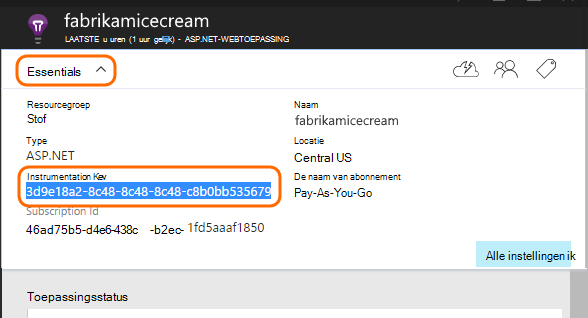

<properties 
    pageTitle="Toepassing inzichten voor Java web-apps die al zijn live" 
    description="Een webtoepassing die al wordt uitgevoerd op de server controle starten" 
    services="application-insights" 
    documentationCenter="java"
    authors="alancameronwills" 
    manager="douge"/>

<tags 
    ms.service="application-insights" 
    ms.workload="tbd" 
    ms.tgt_pltfrm="ibiza" 
    ms.devlang="na" 
    ms.topic="article" 
    ms.date="08/24/2016" 
    ms.author="awills"/>
 
# Toepassing inzichten voor Java web-apps die al zijn live

*Er is een toepassing inzichten in de proefversie.*

Als er een webtoepassing die al op uw J2EE-server wordt uitgevoerd, kunt u beginnen met het bewaken deze met de [Toepassing inzichten](app-insights-overview.md) zonder dat u een codewijzigingen of uw project compileren. Met deze optie krijgt u informatie over HTTP-aanvragen verzonden naar uw server, onverwerkte uitzonderingen en van prestatiemeteritems.

U hebt een abonnement op [Microsoft Azure](https://azure.com)nodig.

> [AZURE.NOTE] De procedure op deze pagina wordt de SDK toegevoegd aan uw web-app gedurende runtime. Deze instrumentation runtime is handig als u niet wilt bijwerken of bouw die tabellen opnieuw uw broncode. Maar indien mogelijk, we raden u [de SDK naar de broncode toevoegen](app-insights-java-get-started.md) in plaats daarvan. Die u hebt meer opties zoals het schrijven van code voor het bijhouden van de gebruikersactiviteit.

## 1. krijgen een toepassing inzichten instrumentation-sleutel

1. Meld u aan bij de [portal van Microsoft Azure](https://portal.azure.com)
2. Een nieuwe resource van toepassing inzichten maakt

    
3. Stel het toepassingstype op Java-webtoepassing.

    
4. Zoek de instrumentation-toets voor de nieuwe bron. U moet deze toets binnenkort in uw CodeProject plakken.

    

## 2. de SDK downloaden

1. Download de [toepassing inzichten SDK for Java](https://aka.ms/aijavasdk). 
2. Klik op de server, pak de SDK-inhoud naar de map waaruit u de binaire project worden geladen. Als u Tomcat gebruikt, zou deze map meestal onder`webapps\<your_app_name>\WEB-INF\lib`

## 3. een toepassing inzichten XML-bestand toevoegen

Maak ApplicationInsights.xml in de map waarin u de SDK hebt toegevoegd. Hierin plaatst u de volgende XML.

Vervangt door de instrumentation opgeven die u hebt ontvangen van de Azure-portal.

    <?xml version="1.0" encoding="utf-8"?>
    <ApplicationInsights xmlns="http://schemas.microsoft.com/ApplicationInsights/2013/Settings" schemaVersion="2014-05-30">

      <!-- The key from the portal: -->

      <InstrumentationKey>** Your instrumentation key **</InstrumentationKey>

      <!-- HTTP request component (not required for bare API) -->

      <TelemetryModules>
        <Add type="com.microsoft.applicationinsights.web.extensibility.modules.WebRequestTrackingTelemetryModule"/>
        <Add type="com.microsoft.applicationinsights.web.extensibility.modules.WebSessionTrackingTelemetryModule"/>
        <Add type="com.microsoft.applicationinsights.web.extensibility.modules.WebUserTrackingTelemetryModule"/>
      </TelemetryModules>

      <!-- Events correlation (not required for bare API) -->
      <!-- These initializers add context data to each event -->

      <TelemetryInitializers>
        <Add   type="com.microsoft.applicationinsights.web.extensibility.initializers.WebOperationIdTelemetryInitializer"/>
        <Add type="com.microsoft.applicationinsights.web.extensibility.initializers.WebOperationNameTelemetryInitializer"/>
        <Add type="com.microsoft.applicationinsights.web.extensibility.initializers.WebSessionTelemetryInitializer"/>
        <Add type="com.microsoft.applicationinsights.web.extensibility.initializers.WebUserTelemetryInitializer"/>
        <Add type="com.microsoft.applicationinsights.web.extensibility.initializers.WebUserAgentTelemetryInitializer"/>

      </TelemetryInitializers>
    </ApplicationInsights>

* De toets instrumentation is verzonden samen met alle items van telemetrielogboek en inzichten van de toepassing weer te geven in de bron worden vermeld.
* Het onderdeel HTTP-aanvraag is optioneel. Automatisch verzendt telemetrielogboek over het aanvragen en tijden antwoord bij de portal.
* Gebeurtenissen correlatie is een aanvulling op de HTTP-verzoek-component. Er wordt een id toegewezen aan elk verzoek om een ontvangen door de server en deze id als een eigenschap aan alle items van telemetrielogboek toegevoegd als de eigenschap 'Operation.Id'. U kunt het telemetrielogboek dat is gekoppeld aan elk verzoek om door te filteren in [Zoeken naar diagnostische gegevens](app-insights-diagnostic-search.md)relateren.

## 4. een HTTP-filter toevoegen

Zoek en open het bestand web.xml in uw project en samenvoegen van de volgende codefragment onder het knooppunt web-app, waar uw toepassingsfilters zijn geconfigureerd.

Als u de meest nauwkeurige resultaten, moet het filter voor alle andere filters worden toegewezen.

    <filter>
      <filter-name>ApplicationInsightsWebFilter</filter-name>
      <filter-class>
        com.microsoft.applicationinsights.web.internal.WebRequestTrackingFilter
      </filter-class>
    </filter>
    <filter-mapping>
       <filter-name>ApplicationInsightsWebFilter</filter-name>
       <url-pattern>/*</url-pattern>
    </filter-mapping>

## 5. firewalluitzonderingen controleren

U moet mogelijk [instellen uitzonderingen uitgaande gegevens te verzenden](app-insights-ip-addresses.md).

## 6. opnieuw uw web-app

## 7. uw telemetrielogboek in toepassing inzichten bekijken

Ga terug naar uw toepassing inzichten resource in [Microsoft Azure-portal](https://portal.azure.com).

Telemetrielogboek over HTTP-aanvragen wordt weergegeven op het blad Overzicht. (Als deze niet ziet, wacht een paar seconden en klik vervolgens op vernieuwen.)

 

Klik op in een grafiek om meer gedetailleerde afmetingen weer te geven. 

 

En wanneer u de eigenschappen van een nieuw vergaderverzoek bekijkt, ziet u de telemetrielogboek gebeurtenissen die zijn gekoppeld aan dit zoals aanvragen en uitzonderingen.
 

[Meer informatie over de doelstellingen.](app-insights-metrics-explorer.md)

## Volgende stappen

* [Telemetrielogboek toevoegen aan uw webpagina's](app-insights-web-track-usage.md) op monitor paginaweergaven en doelstellingen voor gebruiker.
* [Web tests instellen](app-insights-monitor-web-app-availability.md) om ervoor te zorgen dat uw toepassing blijft live en heeft gereageerd.
* [Log sporen vastleggen](app-insights-java-trace-logs.md)
* De [Zoeken-gebeurtenissen en logboeken](app-insights-diagnostic-search.md) te helpen problemen.

 
