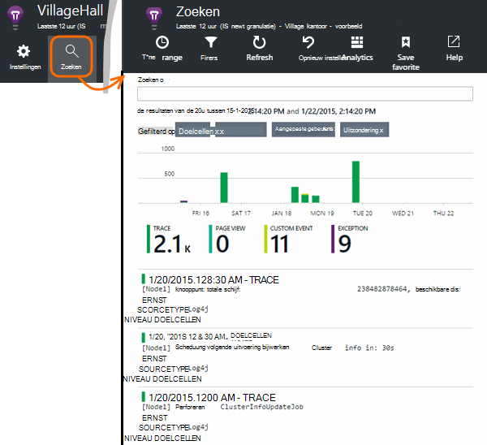

<properties 
    pageTitle="Java doelcellen in toepassing inzichten logboeken te verkennen" 
    description="Zoeken Log4J of Logback sporen in toepassing inzichten" 
    services="application-insights" 
    documentationCenter="java"
    authors="alancameronwills" 
    manager="douge"/>

<tags 
    ms.service="application-insights" 
    ms.workload="tbd" 
    ms.tgt_pltfrm="ibiza" 
    ms.devlang="na" 
    ms.topic="article" 
    ms.date="07/12/2016" 
    ms.author="awills"/>

# Java doelcellen in toepassing inzichten logboeken te verkennen

Als u Logback of Log4J gebruikt (versie 1.2 of v2.0) voor tracering, kunt u beschikken over de logboeken voor het traceren automatisch naar de toepassing inzichten waar u kunt verkennen en zoeken worden verzonden.

Installeren van de [Toepassing inzichten SDK for Java][java], als u dit nog niet hebt gedaan die.

## Logboekregistratie bibliotheken toevoegen aan uw project

*Kies de juiste manier voor uw project.*

#### Als u gebruikmaakt van Maven...

Uw bestand pom.xml als uw project is al ingesteld voor Maven gebruiken voor opbouwen, een van de volgende codefragmenten wilt samenvoegen.

Vernieuw de Projectafhankelijkheden, als u de binaire bestanden gedownload.

*Logback*

    <dependencies>
       <dependency>
          <groupId>com.microsoft.azure</groupId>
          <artifactId>applicationinsights-logging-logback</artifactId>
          <version>[1.0,)</version>
       </dependency>
    </dependencies>

*Log4J v2.0*

    <dependencies>
       <dependency>
          <groupId>com.microsoft.azure</groupId>
          <artifactId>applicationinsights-logging-log4j2</artifactId>
          <version>[1.0,)</version>
       </dependency>
    </dependencies>

*Log4J versie 1.2*

    <dependencies>
       <dependency>
          <groupId>com.microsoft.azure</groupId>
          <artifactId>applicationinsights-logging-log4j1_2</artifactId>
          <version>[1.0,)</version>
       </dependency>
    </dependencies>

#### Als u gebruikmaakt van Gradle...

Als uw project is al ingesteld voor het gebruiken van Gradle voor opbouwen, Voeg een van de volgende regels aan de `dependencies` groeperen in het bestand build.gradle:

Vernieuw de Projectafhankelijkheden, als u de binaire bestanden gedownload.

**Logback**

    compile group: 'com.microsoft.azure', name: 'applicationinsights-logging-logback', version: '1.0.+'

**Log4J v2.0**

    compile group: 'com.microsoft.azure', name: 'applicationinsights-logging-log4j2', version: '1.0.+'

**Log4J versie 1.2**

    compile group: 'com.microsoft.azure', name: 'applicationinsights-logging-log4j1_2', version: '1.0.+'

#### Anders...

Download en extraheren van de juiste appender's en de juiste bibliotheek toevoegen aan uw project:

Logboek | Downloaden | Bibliotheek
----|----|----
Logback|[SDK met Logback appender](https://aka.ms/xt62a4)|applicationinsights-logboekregistratie-logback
Log4J v2.0|[SDK met Log4J v2 appender](https://aka.ms/qypznq)|applicationinsights-logboekregistratie-log4j2 
Log4j versie 1.2|[SDK met Log4J versie 1.2 appender](https://aka.ms/ky9cbo)|applicationinsights-logboekregistratie-log4j1_2 

## De appender toevoegen aan uw logboekregistratie framework

Als u wilt ontvangen sporen, samenvoegen de relevante codefragment naar het configuratiebestand Log4J of Logback: 

*Logback*

    <appender name="aiAppender" 
      class="com.microsoft.applicationinsights.logback.ApplicationInsightsAppender">
    </appender>
    <root level="trace">
      <appender-ref ref="aiAppender" />
    </root>

*Log4J v2.0*

    <Configuration packages="com.microsoft.applicationinsights.Log4j">
      <Appenders>
        <ApplicationInsightsAppender name="aiAppender" />
      </Appenders>
      <Loggers>
        <Root level="trace">
          <AppenderRef ref="aiAppender"/>
        </Root>
      </Loggers>
    </Configuration>

*Log4J versie 1.2*

    <appender name="aiAppender" 
         class="com.microsoft.applicationinsights.log4j.v1_2.ApplicationInsightsAppender">
    </appender>
    <root>
      <priority value ="trace" />
      <appender-ref ref="aiAppender" />
    </root>

De toepassing inzichten appenders kunnen worden verwezen door een geconfigureerde logboek en niet per se door het logboek hoofdsite (zoals weergegeven in de codevoorbeelden hierboven).

## Traces in de portal-toepassing inzichten te verkennen

Nu dat u uw project om te sporen verzenden naar toepassing inzichten hebt geconfigureerd, kunt u bekijken en deze sporen zoeken in de portal-toepassing inzichten in de [zoekresultaten] [ diagnostic] blade.

## Volgende stappen

[Diagnostische gegevens zoeken][diagnostic]

<!--Link references-->

[diagnostic]: app-insights-diagnostic-search.md
[java]: app-insights-java-get-started.md

 
