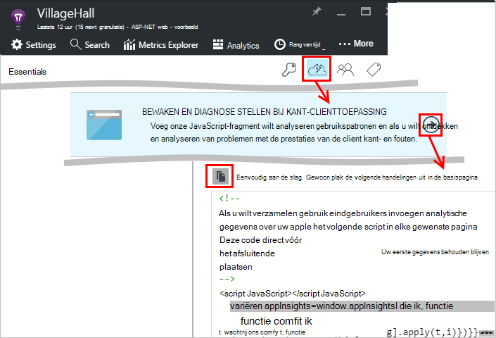
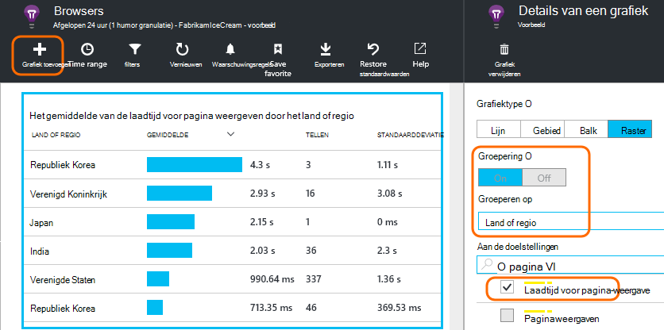

<properties
    pageTitle="Toepassing inzichten voor JavaScript web apps | Microsoft Azure"
    description="Bent u pagina bekijken en sessie telt, gegevens van de client web, en gebruikspatronen bijhouden. Uitzonderingen en prestatieproblemen in JavaScript webpagina's opsporen."
    services="application-insights"
    documentationCenter=""
    authors="alancameronwills"
    manager="douge"/>

<tags
    ms.service="application-insights"
    ms.workload="tbd"
    ms.tgt_pltfrm="ibiza"
    ms.devlang="na"
    ms.topic="get-started-article"
    ms.date="08/15/2016"
    ms.author="awills"/>

# Toepassing inzichten voor webpagina 's

[AZURE.INCLUDE [app-insights-selector-get-started-dotnet](../../includes/app-insights-selector-get-started-dotnet.md)]

Lees meer over de prestaties en het gebruik van uw webpagina of de app. Als u Visual Studio-toepassing inzichten aan uw pagina script toevoegt, krijgt u de tijdsinstellingen van de pagina wordt geladen en AJAX-gesprekken, telt en details van de browser uitzonderingen en AJAX-fouten, evenals gebruikers en sessie telt. Alles dit kunnen worden gesegmenteerd per pagina, client OS en browserversie geografische locatie en andere dimensies. U kunt ook waarschuwingen instellen voor mislukt tellingen of vertragen laden van pagina's.

U kunt de toepassing inzichten gebruiken met webpagina's: u een beknopt stuk JavaScript toe te voegen. Als uw webservice [Java](app-insights-java-get-started.md) of [ASP.NET](app-insights-asp-net.md), kunt u telemetrielogboek vanaf uw server en klanten kunt integreren.

Moet u eerst een abonnement op [Microsoft Azure](https://azure.com). Als uw team een organisatie-abonnement heeft, vraagt u de eigenaar aan uw Microsoft-Account toevoegen. Er is een gratis prijzen laag, dus ontwikkeling en het gebruik van kleine won't kosten.

## Toepassing inzichten instellen voor uw webpagina

Eerst moet u de toepassing inzichten toevoegen aan uw webpagina's? U mogelijk hebt gedaan. Als u ervoor hebt gekozen toepassing inzichten toevoegen aan uw web-app in het dialoogvenster Nieuw Project in Visual Studio, is het script vervolgens toegevoegd. U moet in dat geval niet meer doen.

Anders moet u een codefragment als volgt uw webpagina's toevoegen.

### Open een toepassing inzichten resource

De toepassing inzichten resource is waarop de gegevens over de prestaties en het gebruik van de pagina wordt weergegeven. 

Meld u aan bij [Azure-portal](https://portal.azure.com).

Als u al ingesteld voor de serverkant van de app voor controle, hebt u al een resource:

Als u deze niet hebt, maakt u er:

*Nog vragen?* [Meer informatie over het maken van een resource](app-insights-create-new-resource.md).

### Het script SDK toevoegen aan uw app of webpagina 's

Krijg het script voor webpagina's aan de slag:

Alleen voordat het script invoegen de `</head>` tag van elke pagina die u wilt bijhouden. Als uw website een basispagina heeft, kunt u het script er plaatsen. Bijvoorbeeld:

* In een project ASP.NET MVC zou u deze opnemen`View\Shared\_Layout.cshtml`
* Open in een SharePoint-site op het Configuratiescherm, [Site-instellingen / basispagina](app-insights-sharepoint.md).

Het script bevat de instrumentation-sleutel die wordt u omgeleid de gegevens aan uw toepassing inzichten resource zodat. 

([Grondigere uitleg van het script](http://apmtips.com/blog/2015/03/18/javascript-snippet-explained/))

*(Als u een kader bekende webpagina gebruikt, vindt u rond toepassing inzichten adapters. For example, er is [een module AngularJS](http://ngmodules.org/modules/angular-appinsights).)*

## Gedetailleerde configuratie

Er zijn verschillende [parameters die](https://github.com/Microsoft/ApplicationInsights-JS/blob/master/API-reference.md#config) u kunt instellen, hoewel in de meeste gevallen niet mag u moet. U kunt bijvoorbeeld uitschakelen of Beperk het aantal Ajax-oproepen gerapporteerd per paginaweergave (naar de verkeer beperken). Of u kunt instellen dat foutopsporingsmodus om te laten telemetrielogboek snel door de pijplijn gaan zonder de batch wordt verwerkt.

Als u wilt deze parameters instellen, zoekt u deze regel in het codefragment en meer door komma's gescheiden items daarachter toevoegen:

    })({
      instrumentationKey: "..."
      // Insert here
    });

De [beschikbare parameters](https://github.com/Microsoft/ApplicationInsights-JS/blob/master/API-reference.md#config) omvatten:

    // Send telemetry immediately without batching.
    // Remember to remove this when no longer required, as it
    // can affect browser performance.
    enableDebug: boolean,

    // Don't log browser exceptions.
    disableExceptionTracking: boolean,

    // Don't log ajax calls.
    disableAjaxTracking: boolean,

    // Limit number of Ajax calls logged, to reduce traffic.
    maxAjaxCallsPerView: 10, // default is 500

    // Time page load up to execution of first trackPageView().
    overridePageViewDuration: boolean,

    // Set these dynamically for an authenticated user.
    appUserId: string,
    accountId: string,

## Uw app uitvoeren

Uw web-app wordt uitgevoerd, gebruikt u deze tijd om het telemetrielogboek genereren en wacht een paar seconden. U kunt uitvoeren met de toets **F5** op uw computer ontwikkeling of uw project publiceren en afspelen met deze gebruikers laten.

Als u controleren van de telemetrielogboek dat een WebApp inzicht krijgen in toepassing verzendt wilt, gebruikt u van uw browser hulpprogramma's voor foutopsporing (**F12** in veel browsers). Gegevens wordt verzonden naar dc.services.visualstudio.com.

## Uw browser prestatiegegevens verkennen

Open het blad Browsers om weer te geven prestatiegegevens samenvoegen vanuit uw gebruikers-browsers.

*Nog geen gegevens? Klik op * *vernieuwen* * boven aan de pagina. Nog steeds niets? Zie [problemen met de](app-insights-troubleshoot-faq.md).*

Het blad Browsers is een [aan de doelstellingen Explorer blade](app-insights-metrics-explorer.md) met vooraf ingestelde filters en selecties van de grafiek. U kunt de tijdsbereik, filters en configuratie van de grafiek bewerken als u wilt en het resultaat als favoriet opslaan. Klik op **Standaardinstellingen herstellen** terug te keren naar de oorspronkelijke blade-configuratie.

## Pagina laden prestaties

Aan de bovenkant is een gesegmenteerde grafiek van laadtijden van pagina. De totale hoogte van de grafiek geeft de gemiddelde tijd laden en pagina's van uw app weergeven in uw gebruikers-browsers. De tijd wordt gemeten uit wanneer de browser de eerste HTTP-aanvraag totdat alle synchroon laden gebeurtenissen zijn verwerkt stuurt, met inbegrip van de indeling en uitvoeren van scripts. Deze bevat geen asynchroon taken zoals het laden van webonderdelen uit AJAX-oproepen.

De grafiek segmenten de laadtijd totaal aantal pagina's in de [standaard tijdsinstellingen die zijn gedefinieerd door W3C](http://www.w3.org/TR/navigation-timing/#processing-model). 

Houd er rekening mee dat het *netwerk verbinden* vaak lager dan u verwachten, is zou omdat het een gemiddelde over alle aanvragen vanuit de browser naar de server. Veel afzonderlijke aanvragen hebben een verbinding maken met tijd van 0 omdat er al een actieve verbinding met de server bestaat.

### Vertraagd laden?

Traag pagina laadtijd zijn een belangrijke bron van ontevredenheid voor uw gebruikers. Als de grafiek wordt aangegeven traag pagina wordt geladen, is het gemakkelijk sommige diagnostische onderzoek doen.

Het diagram ziet u het gemiddelde van alle pagina laadtijd in uw app. Als u wilt zien als het probleem is beperkt tot bepaalde pagina's, stukje naar beneden in het blad, waarbij er een raster gesegmenteerd aan de hand pagina URL is:

Kijk naar de weergave totaal aantal pagina's en de standaarddeviatie. Als het aantal pagina's erg laag is, klikt u vervolgens het probleem is niet dat dit gevolgen heeft gebruikers veel. Een hoge (vergelijkbaar met het gemiddelde zelf) standaarddeviatie geeft aan een groot aantal verschillen tussen de afzonderlijke metingen.

**Inzoomen op een URL en de weergave van één pagina.** Klik op de paginanaam om een blad van browser grafieken gefilterd alleen op deze URL; weer te geven en kiest u vervolgens op een exemplaar van de weergave van een pagina.

Klik op `...` voor een volledige lijst met eigenschappen voor die gebeurtenis, of de Ajax oproepen en gerelateerde gebeurtenissen controleren. Traag Ajax-oproepen van invloed op de algehele laadtijd voor pagina als ze synchroon zijn. Gerelateerde gebeurtenissen bevatten serveraanvragen voor dezelfde URL (als u de toepassing inzichten op uw webserver hebt ingesteld).

**De prestaties van de pagina na verloop van tijd.** Wijzig het raster laadtijd voor pagina-weergave in een lijndiagram bevat om te zien of er pieken op bepaalde momenten zijn terug bij het blad Browsers:

**Segmenten door andere dimensies.** Uw pagina's zijn mogelijk trager laden in een bepaalde browser, client OS of locatie van de gebruiker? Voeg een nieuwe grafiek en experimenteren met de dimensie **groeperen op** .

## AJAX-prestaties

Zorg ervoor dat eventuele AJAX-oproepen op uw webpagina's ook uitvoert. Ze worden vaak gebruikt om te delen van uw pagina asynchroon vullen. Hoewel de algehele pagina mogelijk direct hebt geladen, uw gebruikers kunnen worden dele tenietgedaan door beginnen bij lege webonderdelen, wachten op gegevens in deze moet worden weergegeven.

AJAX-oproepen vanuit uw webpagina worden weergegeven op het blad Browsers als afhankelijkheden.

Er zijn samenvatting grafieken in het bovenste gedeelte van het blad:

en gedetailleerde rasters lagere omlaag:

Klik op elke rij voor specifieke details.

> [AZURE.NOTE] Als u het filter Browsers op het blad verwijdert, worden zowel de server en de AJAX afhankelijkheden worden opgenomen in deze grafieken. Klik op standaardinstellingen herstellen als u wilt configureren, het filter.

**Inzoomen op mislukte Ajax-oproepen** Schuif omlaag naar het raster met afhankelijkheid fouten en klik vervolgens op een rij om te zien specifieke exemplaren.

Klik op `...` voor de volledige telemetrielogboek voor een Ajax-oproep.

### Geen Ajax-oproepen gerapporteerd?

AJAX-oproepen bevatten een HTTP-oproepen vanuit het script van uw webpagina. Als u deze gerapporteerd niet ziet, controleert u of het codefragment niet ingesteld de `disableAjaxTracking` of `maxAjaxCallsPerView` [parameters](https://github.com/Microsoft/ApplicationInsights-JS/blob/master/API-reference.md#config).

## Uitzonderingen in browser

Klik op het blad Browsers, moet u er een uitzonderingen samenvatting grafiek te klikken en een raster van uitzondering typen verder omlaag het blad is.

Als u browser uitzonderingen gerapporteerd niet ziet, controleert u of het codefragment niet ingesteld de `disableExceptionTracking` [parameter](https://github.com/Microsoft/ApplicationInsights-JS/blob/master/API-reference.md#config).

## Afzonderlijke pagina weergave gebeurtenissen controleren

Meestal pagina weergave telemetrielogboek wordt geanalyseerd door toepassing inzichten en u ziet alleen cumulatieve rapporten, gemiddeld door alle gebruikers. Maar voor foutopsporing, kunt u ook bekijken gebeurtenissen van afzonderlijke pagina weergeven.

In het blad diagnostische zoeken, kiest u Filters paginaweergave.

Selecteer een willekeurige gebeurtenis om meer details weer te geven. Klik in de detailpagina op '...' om te zien nog meer details.

> [AZURE.NOTE] Als u de [zoekfunctie](app-insights-diagnostic-search.md)gebruiken, zoals u ziet dat u moet heel woord: "Abou" en "bout" komen niet overeen 'Over'.

U kunt ook de krachtige [analyses taal query](app-insights-analytics-tour.md) gebruiken om te zoeken paginaweergaven.

### Eigenschappen van pagina weergeven

* **De duur van de pagina-weergave** 

 * Al dan niet standaard, hoe lang het duurt het laden van de pagina van client verzoek om deel te volledige laden (inclusief aanvullende bestanden maar met uitzondering van asynchrone taken zoals Ajax-oproepen). 
 * Als u `overridePageViewDuration` in de [paginaconfiguratie](#detailed-configuration), het interval tussen de client aanvragen voor het uitvoeren van de eerste `trackPageView`. Als u trackPageView van de gebruikelijke positie na de initialisatie van het script verplaatst, worden deze een andere waarde doorgevoerd.
 * Als `overridePageViewDuration` en duur van een argument is opgegeven in de `trackPageView()` bellen, wordt de argumentwaarde van de in plaats daarvan gebruikt. 

## Aangepaste pagina-tellingen komen

Standaard is een aantal pagina's vindt plaats telkens wanneer die een nieuwe pagina wordt geladen in de browser.  Maar wilt u mogelijk extra paginaweergaven tellen. Bijvoorbeeld een pagina kan de inhoud op tabbladen worden weergegeven en u wilt tellen van een pagina wanneer de gebruiker tabbladen. Of JavaScript-code op de pagina nieuwe inhoud mogelijk laden zonder te wijzigen van de URL van de browser.

Een oproep JavaScript strekking invoegen op het gewenste punt in uw clientcode:

    appInsights.trackPageView(myPageName);

Naam van de pagina kan bevatten dezelfde tekens als URL, maar willekeurig na '#' of '? ', wordt die genegeerd.

## Gebruik bijhouden

Wilt u weten wat uw gebruikers met uw app doen?

* [Meer informatie over het gebruik bijhouden](app-insights-web-track-usage.md)
* [Algemene informatie over aangepaste gebeurtenissen en API aan de doelstellingen](app-insights-api-custom-events-metrics.md).

#### Video: Gebruik bijhouden

> [AZURE.VIDEO tracking-usage-with-application-insights]

## Volgende stappen

* [Gebruik bijhouden](app-insights-web-track-usage.md)
* [Aangepaste gebeurtenissen en aan de doelstellingen](app-insights-api-custom-events-metrics.md)
* [Informatie over opbouwen-eenheid](app-insights-overview-usage.md)

