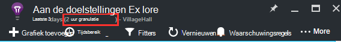

<properties 
    pageTitle="Aan de doelstellingen in toepassing inzichten te verkennen | Microsoft Azure" 
    description="Het interpreteren van grafieken in metrische explorer en het aanpassen van metrische explorer bladen." 
    services="application-insights" 
    documentationCenter=""
    authors="alancameronwills" 
    manager="douge"/>

<tags 
    ms.service="application-insights" 
    ms.workload="tbd" 
    ms.tgt_pltfrm="ibiza" 
    ms.devlang="na" 
    ms.topic="article" 
    ms.date="10/15/2016" 
    ms.author="awills"/>
 
# Aan de doelstellingen in toepassing inzichten te verkennen

Aan de doelstellingen in [Toepassing inzichten] [ start] worden gemeten waarden en aantallen gebeurtenissen die in het telemetrielogboek wordt verzonden vanuit uw toepassing. Ze helpen u prestatieproblemen opsporen en bekijken van trends in hoe uw toepassing wordt gebruikt. Er is een groot aantal standaard aan de doelstellingen en u kunt ook uw eigen aangepaste maatstaven en gebeurtenissen maken.

Aan de doelstellingen en event aantallen worden weergegeven in grafieken met geaggregeerde waarden zoals totalen, gemiddelden of telt.

Hier volgt een voorbeeldgrafiek:

Sommige grafieken worden gesplitst: de totale hoogte van de grafiek op elk gewenst moment is de som van de doelstellingen weergegeven. De legenda al dan niet standaard ziet u de grootste hoeveelheden.

Stippellijnen wordt de waarde van de meetwaarde van eerder één week weergeven.

## Tijdsbereik

U kunt het tijdsbereik waarvoor grafieken of rasters op elke blade wijzigen.

Als u sommige gegevens die nog niet is weergegeven verwacht, klikt u op vernieuwen. Grafieken zelf met tussenpozen vernieuwen, maar de intervallen langer voor grotere tijdsbereik zijn. In de release-modus, kan dit een tijdje duren voordat gegevens worden via de pijplijn analyse naar een diagram duren.

Als u wilt inzoomen op een deel van een grafiek, sleept u eroverheen:

Klik op de knop ongedaan maken in-en uitzoomen om te herstellen.

## Granulatie en punt-waarden

Houd de muisaanwijzer boven de grafiek om de waarden van de doelstellingen op dat moment weer te geven.

De waarde van de meetwaarde op een bepaald moment wordt voor de voorgaande steekproeven interval samengevoegd. 

De controle-interval of 'granulatie' wordt weergegeven aan de bovenkant van het blad. 

U kunt de granulatie in het tijd bereik blad aanpassen:

De beschikbare granulaties, hangt af van de periode die u hebt geselecteerd. De expliciete granulaties zijn alternatieven voor de 'automatisch' granulatie voor het tijdsbereik. 

## Aan de doelstellingen Explorer

Klik op in een grafiek op het blad Overzicht om een meer gedetailleerde reeks verwante grafieken en rasters weer te geven. U kunt deze grafieken en rasters kunt richten op de details waarin u geïnteresseerd bent bewerken.

Of u kunt klikken op de knop aan de doelstellingen Explorer in de kop van het blad Overzicht.

Bijvoorbeeld, klikt u op via de web-app mislukte aanvragen grafiek:

## Wat betekenen de cijfers?

De legenda aan de zijkant al dan niet standaard worden meestal de statistische waarde over de periode van de grafiek. Als u de muisaanwijzer boven de grafiek, wordt de waarde op dat moment.

Elk gegevenspunt in de grafiek is een totaal van de gegevenswaarden ontvangen in de voorgaande steekproeven interval of 'granulatie'. De granulatie wordt weergegeven aan de bovenkant van het blad, en is afhankelijk van de algehele tijdschaal van de grafiek.

Aan de doelstellingen kunnen worden samengevoegd op verschillende manieren: 

 * **Som** is de som van de waarden van alle gegevenspunten ontvangen via de controle-interval of de periode van de grafiek.
 * **Gemiddelde** is, wordt de som door het aantal gegevenspunten ontvangen via het interval.
 * **Unieke** aantallen worden gebruikt voor aantallen gebruikers en -accounts. Via het interval steekproeven, of de periode van de grafiek ziet de afbeelding u het aantal verschillende gebruikers weergegeven in deze periode.

U kunt de aggregatiemethode wijzigen:

De standaardmethode voor elke metrisch wordt weergegeven wanneer u een nieuwe grafiek maakt of wanneer alle doelstellingen zijn uitgeschakeld:

## Grafieken en rasters bewerken

Een nieuwe grafiek toevoegen aan het blad:

Selecteer **bewerken** op een bestaande of nieuwe grafiek bewerken wat wordt weergegeven:

Hoewel er zijn beperkingen over de combinaties die bij elkaar kunnen worden weergegeven, kunt u meer dan één meetwaarde weergeven in een grafiek. Zodra u één meetwaarde kiest, worden enkele van de andere uitgeschakeld. 

Als u [aangepaste aan de doelstellingen] gecodeerde[ track] in uw app (oproepen naar TrackMetric en TrackEvent) ze, worden hier vermeld.

## Uw gegevens in segmenten

U kunt bijvoorbeeld een meting door eigenschap - splitsen te vergelijken paginaweergaven op clients met verschillende besturingssystemen. 

Selecteer een grafiek of raster, schakelen over groeperen en kiest u een eigenschap groeperen op:

> [AZURE.NOTE] Als u groepering gebruikt, vindt u de typen vlakdiagram en gestapeld staafdiagram een gestapeld weergeven. Dit is geschikt waar de methode aggregatie som is. Maar waarbij het aggregatietype gemiddelde is, kiest u de lijn of een analytisch raster weergeven typen. 

Als u [aangepaste aan de doelstellingen] gecodeerde[ track] in uw app en omvatten eigenschapswaarden, u kunt wel de eigenschap in de lijst selecteren.

Is de grafiek te klein voor gesegmenteerde gegevens? De hoogte aanpassen:

## Gegevens filteren

Alleen de doelstellingen voor een geselecteerde reeks eigenschapswaarden bekijken:

Als u alle waarden voor een bepaalde eigenschap niet selecteert, is hetzelfde als ze allemaal selecteren: Er is geen filter op die eigenschap.

Zoals u ziet de aantallen gebeurtenissen naast elke waarde onroerend goed. Wanneer u waarden van één eigenschap selecteert, wordt de telt samen met andere eigenschapswaarden worden aangepast.

Filters toepassen op alle grafieken in een blade. Desgewenst kunt u verschillende filters zijn toegepast op verschillende grafieken maken en opslaan van de doelstellingen van de andere bladen. Als u wilt, kunt u grafieken vanuit andere bladen aan het dashboard, vastmaken zodat u ze naast elkaar kunt zien.

### Bots en web test-verkeer verwijderen

Gebruik het filter **reële of synthetische verkeer** en **reële**controleren.

U kunt ook filteren op **bron van synthetische-verkeer is toegestaan**.

### Eigenschappen toevoegen aan de filterlijst

Wilt u telemetrielogboek op een categorie van uw eigen keuze filteren? Bijvoorbeeld wellicht verdeelt u gebruikers in verschillende categorieën en u wilt dat uw gegevens in segmenten door deze categorieën.

[Uw eigen eigenschap maken](app-insights-api-custom-events-metrics.md#properties). Stel deze in een [Telemetrielogboek initialisatiefunctie](app-insights-api-custom-events-metrics.md#telemetry-initializers) zodat deze worden weergegeven in alle telemetrielogboek - met inbegrip van de standaard telemetrielogboek verzonden door verschillende SDK modules.

## Het grafiektype bewerken

U ziet dat u tussen rasters en grafieken schakelen kunt:

## Sla uw blade aan de doelstellingen

Wanneer u bepaalde grafieken hebt gemaakt, kunt u deze als favoriet opslaan. Of u wilt delen met andere teamleden, kunt u kiezen als u een organisatie-account gebruikt.

Zie het blad opnieuw, **gaat u naar het blad Overzicht** en Favorieten openen:

Als u ervoor relatieve tijdsbereik kiest wanneer u hebt opgeslagen, wordt het blad worden bijgewerkt met de meest recente aan de doelstellingen. Als u Absolute tijdsbereik kiest, wordt dit elke keer dezelfde gegevens weergegeven.

## Opnieuw instellen van het blad

Als u een blade bewerken, maar klik u wilt terugkeren naar de oorspronkelijke opgeslagen instellen, klikt u opnieuw op.

## Live aan de doelstellingen gegevensstroom: direct aan de doelstellingen voor het controleren van sluiten

Live aan de doelstellingen gegevensstroom ziet u de doelstellingen van uw toepassing rechts op dit moment helemaal, met een dichtbijzijnd realtime latentie van 1 seconde. Dit is bijzonder nuttig wanneer u een nieuwe build vrijgeven bent en u wilt om ervoor te zorgen dat alles werkt zoals verwacht of wordt onderzocht een incident in realtime is.

In tegenstelling tot aan de doelstellingen Explorer verschijnt Live aan de doelstellingen gegevensstroom een vaste overzicht van de doelstellingen. De gegevens zich blijft voordoen alleen voor zo lang maken als dit in het diagram is, en vervolgens wordt verwijderd. 

Live aan de doelstellingen gegevensstroom is beschikbaar met toepassing inzichten SDK voor ASP.NET, versie 2.1.0 of hoger.

## Waarschuwingen instellen

Als u wilt worden gewaarschuwd per e-mail van ongebruikelijke waarden van een meting, moet u een waarschuwing toevoegen. U kunt u ofwel het e-mailbericht verzenden naar de account-beheerders, of aan specifieke e-mailadressen.

[Meer informatie over meldingen][alerts].

## Exporteren naar Excel

U kunt metrische gegevens exporteren die wordt weergegeven in de Verkenner metrisch aan een Excel-bestand. De geëxporteerde gegevens bevat gegevens uit alle grafieken en tabellen zoals gezien in de portal. 

De gegevens voor elke grafiek of tabel is geëxporteerd naar een apart werkblad staat in het Excel-bestand.

Wat u te zien wat er wordt geëxporteerd is. De tijdsbereik of filters wijzigen als u wilt wijzigen van het bereik van gegevens die zijn geëxporteerd. Klik voor tabellen als de opdracht **meer laden** wordt weergegeven, kunt u deze voordat u op exporteren, als u meer gegevens geëxporteerd.

*Exporteer werkt alleen voor Internet Explorer en Chrome op dit moment. We werken aan het toevoegen van ondersteuning voor andere browsers.*

## Continue exporteren

Als u gegevens voortdurend geëxporteerd zodat u kunt deze extern verwerken wilt, kunt u overwegen [doorlopend exporteren](app-insights-export-telemetry.md).

### Power BI

Als u zelfs rijkere weergaven van uw gegevens wilt, kunt u [exporteren naar Power BI](http://blogs.msdn.com/b/powerbi/archive/2015/11/04/explore-your-application-insights-data-with-power-bi.aspx).

## Analytics

[Analytics](app-insights-analytics.md) is een flexibeler manier om uw telemetrielogboek met een krachtige querytaal analyseren. Gebruiken als u wilt combineren of de resultaten van de doelstellingen berekenen of in deph verkennen van recente prestaties van uw app uitvoeren. Aan de andere kant, aan de doelstellingen Explorer gebruiken als u automatisch vernieuwen, grafieken op het dashboard, en waarschuwingen.

## Problemen oplossen

*Ik zie niet alle gegevens in de grafiek.*

* Filters toepassen op alle grafieken op het blad. Zorg dat u een filter waarbij alle gegevens op een andere worden niet instellen terwijl u op één grafiek richten zich. 

    Als u wilt verschillende filters instellen voor verschillende grafieken, berekende velden maakt in andere bladen, deze opslaan als afzonderlijke Favorieten. Als u wilt, kunt u ze vastmaken aan het dashboard zodat u ze naast elkaar kunt zien.

* Als u een grafiek met een eigenschap die is gedefinieerd op de meetwaarde groeperen, wordt er niets in het diagram. Probeer wissen 'groeperen op' of kiest u een eigenschap verschillende groeperen.
* Prestatiegegevens (CPU, IO rente, enzovoort) is beschikbaar voor Java-webservices, Windows-bureaublad-apps [IIS web apps en services als u statuscontrole installeert](app-insights-monitor-performance-live-website-now.md)en [Azure-Cloudservices](app-insights-azure.md). Het is niet beschikbaar voor Azure websites.

## Volgende stappen

* [Gebruik met de toepassing inzichten controleren](app-insights-overview-usage.md)
* [Met de diagnostische zoekfunctie](app-insights-diagnostic-search.md)

<!--Link references-->

[alerts]: app-insights-alerts.md
[start]: app-insights-overview.md
[track]: app-insights-api-custom-events-metrics.md

 