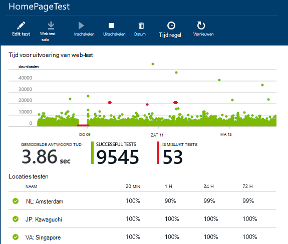
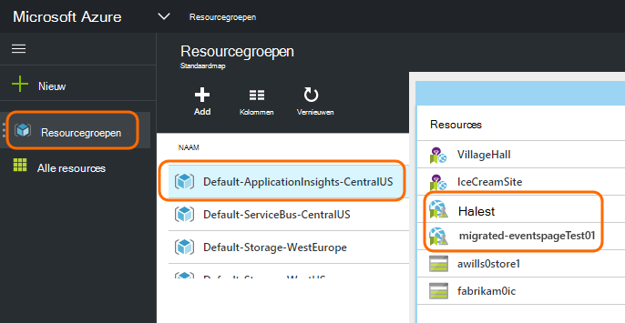

<properties 
    pageTitle="Azure eindpunt migreren naar toepassing inzichten beschikbaarheid Tests" 
    description="Klassieke Azure eindpunt Monitoring tests migreren naar toepassing inzichten test beschikbaarheid met 31 oktober 2016."
    services="application-insights" 
    documentationCenter=""
    authors="soubhagyadash" 
    manager="douge"/>

<tags 
    ms.service="application-insights" 
    ms.workload="tbd" 
    ms.tgt_pltfrm="ibiza" 
    ms.devlang="na" 
    ms.topic="article" 
    ms.date="07/25/2016" 
    ms.author="awills"/>
 
# Overstappen van Azure eindpunt cmdlets voor controle op toepassing inzichten beschikbaarheid Tests

Gebruikt u [eindpunt monitoring](https://blogs.msdn.microsoft.com/mast/2013/03/03/windows-azure-portal-update-configure-web-endpoint-status-monitoring-preview/) voor uw Azure-apps? *31 oktober 2016*Vervang we deze door de nieuwe en krachtiger [beschikbaarheid tests](app-insights-monitor-web-app-availability.md). We hebt al gemaakt enkele van de nieuwe tests, hoewel deze tot en met 31 oktober 2016 hebt uitgeschakeld. 

U kunt de nieuwe tests bewerken en de schakeloptie zelf doen als u wilt. U vindt deze [Azure-portal](https://portal.azure.com) in de standaard-ApplicationInsights-CentralUS resourcegroep.

## Wat zijn de beschikbaarheid van de tests?

Beschikbaarheid testen, is een functie van Azure die continu controleert of een website of de service omhoog is en uitgevoerd door HTTP-aanvragen hiernaar te sturen (één ping-tests of Visual Studio web tests) van maximaal 16 locaties overal ter wereld. 

Klik in de [klassieke Azure-portal](https://manage.windowsazure.com)zijn deze tests genoemd eindpunt bewaken. Ze zijn meer beperkt als bereik. De nieuwe beschikbaarheid tests zijn een aanzienlijke verbeteringen:

* Maximaal 10 Visual Studio web tests of ping-tests per resource van toepassing inzichten. 
* Maximaal 16 locaties overal ter wereld te testen aanvragen verzenden naar uw web-app. Betere controle test success criteria. 
* Een website of de service - niet alleen Azure-WebApps testen.
* Nieuwe pogingen testen: verkleinen van de fout-positieve waarschuwingen vanwege tijdelijke netwerkproblemen. 
* Webhooks kunt HTTP POST-meldingen voor de meldingen ontvangen.

Meer informatie over de [beschikbaarheid van de tests hier](app-insights-monitor-web-app-availability.md).

Beschikbaarheid van de tests maken deel uit van [Visual Studio toepassing inzichten](app-insights-overview.md), namelijk een extensible analytics-service voor een webtoepassing.

## Dus wat gebeurt er met mijn eindpunt getest?

* We hebt uw eindpunt monitoring tests naar de nieuwe toepassing inzichten beschikbaarheid tests gekopieerd.
* De nieuwe beschikbaarheid tests zijn momenteel uitgeschakeld en de oude eindpunt tests nog steeds worden uitgevoerd.
* De waarschuwingen regels *niet* zijn gemigreerd. De nieuwe tests zijn in eerste instantie ingesteld met een standaardregel:
 * Triggers wanneer meer dan 1 locatie fouten in 5 minuten rapporten.
 * Verzonden e-mail voor het abonnement-beheerders.

Klik in de [portal van Azure](https://portal.azure.com)vindt u de gemigreerde tests in de resourcegroep "Standaard-ApplicationInsights-CentralUS". De test-namen worden voorafgegaan "Migrated-". 

## Wat moet ik doen?

* Als we op uw tests migreren gemist, zijn de nieuwe beschikbaarheid tests [gemakkelijk te installeren](app-insights-monitor-web-app-availability.md).

### Optie A: Ga niets. Laat ons.

**Klik op 31 oktober 2016,** zal we het volgende doen:

* De oude eindpunt tests uitschakelen.
* De gemigreerde beschikbaarheid tests inschakelen.

### Optie B: u beheren en/of de nieuwe tests inschakelen.

* Bekijken en bewerken van de nieuwe beschikbaarheid tests in de nieuwe [Azure-portal](https://portal.azure.com). 
 * Criteria van de trigger controleren
 * Controleer de e-mailgeadresseerden
* De nieuwe tests inschakelen
* Het oude eindpunt tests op 31 oktober 2016 cmdlets voor controle wordt uitgeschakeld 

### Optie C: Opt out

Als u niet dat beschikbaarheid tests gebruiken wilt, kunt u deze verwijderen in [Azure-portal](https://portal.azure.com). Er is ook een koppeling voor afmelden onder aan het e-mailberichten.

We nog steeds verwijderd de oude eindpunt tests op 31 oktober 2016. 

## Hoe kan ik de nieuwe tests bewerken?

Meld u aan bij de [portal van Azure](https://portal.azure.com) en de tests 'Migrated-' web zoeken: 

Bewerken en/of de test inschakelen:

## Waarom wordt dit foutbericht gegeven?

Betere service. De oude eindpunt-service is veel smaller. Slechts twee URL's kunt u opgeven voor eenvoudige ping-tests uit 3 geografische locaties op een Azure VM of web-app. De nieuwe tests meerdere stappen web tests uit maximaal 16 locaties kunnen worden uitgevoerd en u kunt maximaal 10 tests voor één toepassing opgeven. U kunt een URL testen: dit hoeft te worden van een Azure-site.

De nieuwe tests worden afzonderlijk geconfigureerd vanaf het WebApp of VM die u wilt testen. 

We migreert de tests om ervoor te zorgen dat u gaat u verder met de controle over deze bij het gebruik van de nieuwe portal hebt. 

## Wat is een toepassing inzichten?

De nieuwe beschikbaarheid tests maken deel uit van [Visual Studio toepassing inzichten](app-insights-overview.md). Hier ziet u een [video van 2 minuten](http://go.microsoft.com/fwlink/?LinkID=733921).

## Heb ik betalen voor de nieuwe tests?

De gemigreerde tests zijn ingesteld in de bron van een toepassing inzicht krijgen in de standaard gratis abonnement. Hiermee kan maximaal 5 miljoen gegevenspunten. Die de het gegevensvolume van die de tests momenteel wordt gebruikt voor het gemakkelijk behandelt. 

Natuurlijk als u tevreden bent toepassing inzichten en meer beschikbaarheid tests maken, of bij het gebruik van meer prestatiecontroles uit en diagnostische functies, klikt u vervolgens genereert u meer gegevenspunten.  Het resultaat is echter alleen dat u het quotum voor de gratis abonnement mogelijk bereikt. U ontvangt geen een factuur tenzij u aangeeft dat u voor de standaard- of Premium-abonnementen. 

[Meer informatie over de toepassing inzichten prijzen en quotum voor controle](app-insights-pricing.md). 

## Wat is en is niet gemigreerd?

Behouden van uw oude eindpunt tests:

* De URL van het eindpunt te testen.
* Geografische locaties van waaruit de aanvragen worden verzonden.
* Test frequentie blijft 5 minuten.
* Test time-out blijft 30 seconden. 

Niet gemigreerd:

* Signaal regel. De regel die we triggers instellen hebben wanneer 1 locatie fouten in 5 minuten rapporten.
* Ontvangers. E-mailberichten verzonden naar het abonnement eigenaren en mede-eigenaars. 

## Hoe vind ik de nieuwe tests?

U kunt een van de nieuwe tests nu bewerken als u wilt. Meld u aan bij de [portal van Azure](https://portal.azure.com), **Resourcegroepen** openen en selecteer **Standaard-ApplicationInsights-CentralUS**. In die groep vindt u de nieuwe web tests. [Algemene informatie over de nieuwe beschikbaarheid tests](app-insights-monitor-web-app-availability.md).

Houd er rekening mee dat de nieuwe waarschuwing e-mailberichten worden verzonden vanaf dit adres: App inzichten waarschuwingen(ai-noreply@microsoft.com)

## Wat gebeurt er als ik niets doen?

Optie A wordt toegepast. We de gemigreerde tests inschakelen en instellen van de standaard-waarschuwingsregels bovengenoemde. U moet een aangepaste waarschuwingsregels, ontvangers als hierboven genoemde toevoegen. Het oude eindpunt tests cmdlets voor controle wordt uitgeschakeld. 

## Waar kan ik feedback geven over dit? 

Waarderen we uw feedback. Stuur [een e-mail sturen](mailto:vsai@microsoft.com). 

