<properties
    pageTitle="Een diagnose stellen bij prestatieproblemen op een actieve IIS-website | Microsoft Azure"
    description="Van een website prestaties controleren zonder deze opnieuw te implementeren. Zelfstandige gebruiken of met de toepassing inzichten SDK om afhankelijkheid telemetrielogboek."
    services="application-insights"
    documentationCenter=".net"
    authors="alancameronwills"
    manager="douge"/>

<tags
    ms.service="application-insights"
    ms.workload="tbd"
    ms.tgt_pltfrm="ibiza"
    ms.devlang="na"
    ms.topic="get-started-article"
    ms.date="10/24/2016"
    ms.author="awills"/>

# Instrument WebApps tijdens runtime met de toepassing inzichten

*Er is een toepassing inzichten in de proefversie.*

U kunt een live WebApp met inzicht in de Visual Studio-toepassing instrument zonder te wijzigen of implementeer deze opnieuw uw code. In uw apps worden gehost door een on-premises implementatie IIS-server, installeert u statuscontrole; of als ze Azure-WebApps bent of die worden uitgevoerd in een VM Azure, kunt u de toepassing inzichten extensie installeren. (Er zijn ook afzonderlijk artikelen over het implementeren van [live J2EE WebApps](app-insights-java-live.md) en [Azure-Cloudservices](app-insights-cloudservices.md).)

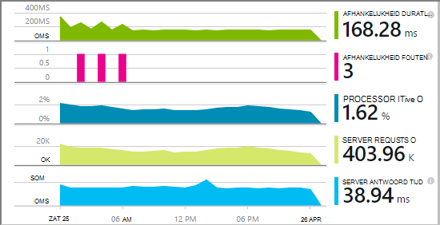

Hebt u een keuze van drie routes toepassing inzichten toepassen op uw .NET-webtoepassingen:

* **Tijd gemaakt:** [De toepassing inzichten SDK toevoegen] [greenbrown] aan uw web app-code. 
* **Runtime:** Instrument uw web-app op de server, zoals hieronder, zonder PowerPoint opnieuw moet maken en opnieuw te distribueren de code beschreven.
* **Beide:** De SDK maken in uw web app-code en de runtime-extensies ook van toepassing. Profiteer van het beste van beide opties. 

Hier volgt een overzicht van wat u door elke route openen:

||Tijd gemaakt|Runtime|
|---|---|---|
|Aanvragen en uitzonderingen|Ja|Ja|
|[Meer gedetailleerde uitzonderingen](app-insights-asp-net-exceptions.md)||Ja|
|[Afhankelijkheid diagnostische gegevens](app-insights-asp-net-dependencies.md)|Klik op .NET 4.6 +|Ja|
|[Systeem prestatie-items](app-insights-performance-counters.md)||IIS of Azure cloudservice binnenkomt, niet Azure WebApp|
|[API voor aangepaste telemetrielogboek][api]|Ja||
|[Doelcellen log-integratie](app-insights-asp-net-trace-logs.md)|Ja||
|[Paginagegevens gebruiker & weergeven](app-insights-javascript.md)|Ja||
|Niet nodig om code opnieuw te maken|Nee||

## Uw web-app instrument tijdens runtime

Moet u een [Microsoft Azure](http://azure.com) -abonnement.

### Als uw app een Azure WebApp of Service van de Cloud is

* Selecteer toepassing inzichten in het Configuratiescherm van de app in Azure wordt aangegeven. 

    [Meer informatie](app-insights-azure.md).

### Als uw app wordt gehost op uw IIS-server

1. Klik op de IIS-web-server, meld u aan met beheerdersreferenties.
2. Download en voert u het [installatieprogramma van de statuscontrole](http://go.microsoft.com/fwlink/?LinkId=506648).
4. In de installatiewizard, moet u zich aanmelden bij Microsoft Azure.

    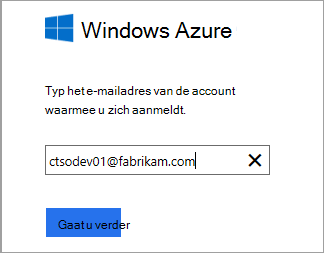

    *Fouten? Zie [problemen met](#troubleshooting).*

5. Kies de geïnstalleerde webtoepassing of website die u wilt controleren, moet u de resource die u wilt de resultaten bekijken in de portal-toepassing inzichten configureren.

    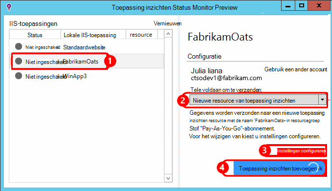

    Normaal gesproken vergt u kiest voor het configureren van een nieuwe resource en [resourcegroep][roles].

    Een bestaande bron anders gebruiken als u al ingesteld [web getest] [ availability] voor uw site of [WebClient monitoring][client].

6. IIS opnieuw starten.

    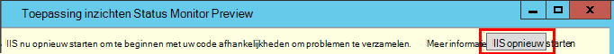

    Uw webservice wordt even worden onderbroken.

6. Zoals u ziet dat ApplicationInsights.config is ingevoegd in de web-apps die u wilt controleren.

    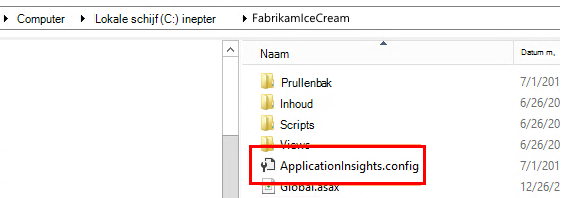

   Er zijn ook enkele wijzigingen in het web.config.

#### Wilt u configureren later (opnieuw)?

Nadat u de wizard hebt voltooid, kunt u de agent opnieuw configureren wanneer u maar wilt. U kunt dit ook gebruiken als u de agent hebt geïnstalleerd, maar er sommige problemen met de eerste configuratie is.

## Weergave prestaties telemetrielogboek

Meld u aan bij [de portal van Azure](https://portal.azure.com), blader toepassing inzichten en opent u de resource die u hebt gemaakt.

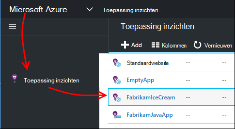

Open het blad prestaties als u wilt zien van de aanvraag, antwoord tijd, afhankelijkheid en andere gegevens.

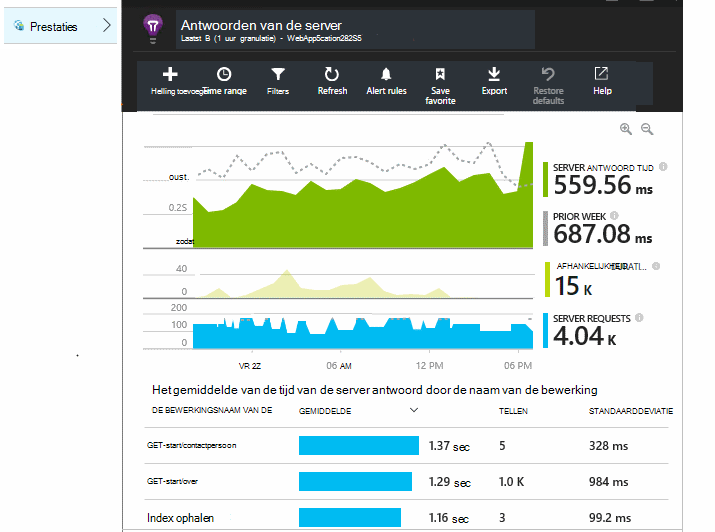

Klik op een grafiek om een gedetailleerde weergave te openen.

U kunt [bewerken, rangschikken, opslaan](app-insights-metrics-explorer.md), en dit vastmaken grafieken of het hele blad aan een [dashboard](app-insights-dashboards.md).

## Afhankelijkheden

De grafiek afhankelijkheid duur wordt de tijd weergegeven die u hebt gemaakt door het aanroepen van uw app externe onderdelen zoals databases, REST API's of Azure-blobopslag.

De grafiek door oproepen naar verschillende afhankelijkheden segmenten: de grafiek bewerken, inschakelen groeperen en vervolgens groeperen op afhankelijkheid, afhankelijkheidstype of afhankelijkheid prestaties.

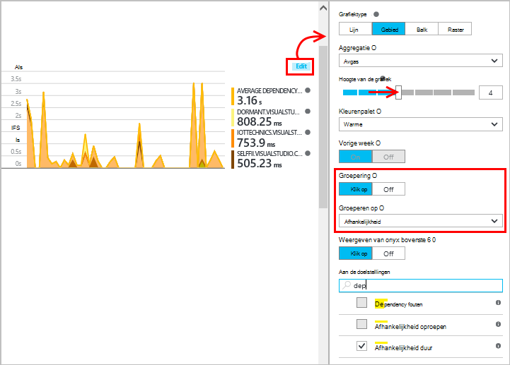

## Prestatie-items 

(Niet voor Azure Webapps.) Klik op Servers op het blad Overzicht om grafieken van server prestatiemeteritems zoals CPU-gebruik voor welke en geheugen weer te geven.

Als u meerdere exemplaren van de server hebt, wilt u mogelijk de grafieken om te groeperen op rol exemplaar bewerken.

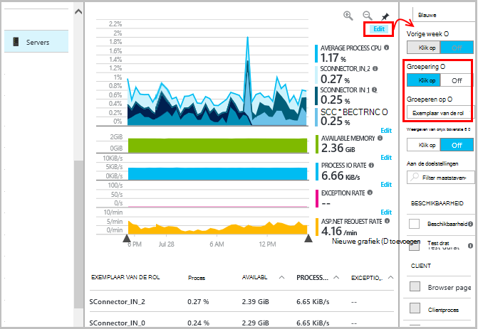

U kunt ook [de set prestatiemeteritems die door de SDK worden gemeld wijzigen](app-insights-configuration-with-applicationinsights-config.md#nuget-package-3). 

## Uitzonderingen

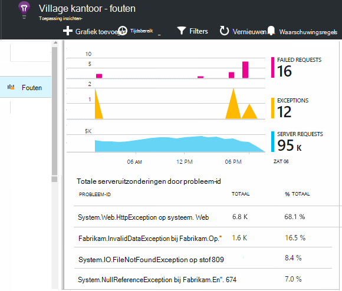

U kunt inzoomen op specifieke uitzonderingen (vanuit de afgelopen zeven dagen) en u stapel sporen en contextgegevens.

## Steekproeven

Als uw toepassing een groot aantal gegevens stuurt en u de toepassing inzichten SDK voor ASP.NET versie 2.0.0-beta3 of hoger gebruikt, kan de functie Geavanceerde steekproeven werken en slechts een percentage van uw telemetrielogboek verzenden. [Meer informatie over steekproeven.](app-insights-sampling.md)

## Problemen oplossen

### Fouten

U moet [enkele uitgaande poorten](app-insights-ip-addresses.md#outgoing-ports) openen in de firewall van de server toe te staan dat statuscontrole om te werken.

### Geen telemetrielogboek?

  * Gebruik uw site om bepaalde gegevens te genereren.
  * Wacht enkele minuten als u wilt dat de gegevens binnenkomen en klik vervolgens op **vernieuwen**.
  * Open diagnostische gegevens zoeken (de zoeken-tegel) om afzonderlijke gebeurtenissen weer te geven. Gebeurtenissen zijn vaak zichtbaar in de diagnostische zoeken voordat statistische gegevens worden weergegeven in de grafieken.
  * Statuscontrole openen en selecteer uw toepassing in het linkerdeelvenster. Controleer of er nog een diagnostisch hulpprogramma berichten van deze toepassing in de sectie 'Configuratie meldingen':

  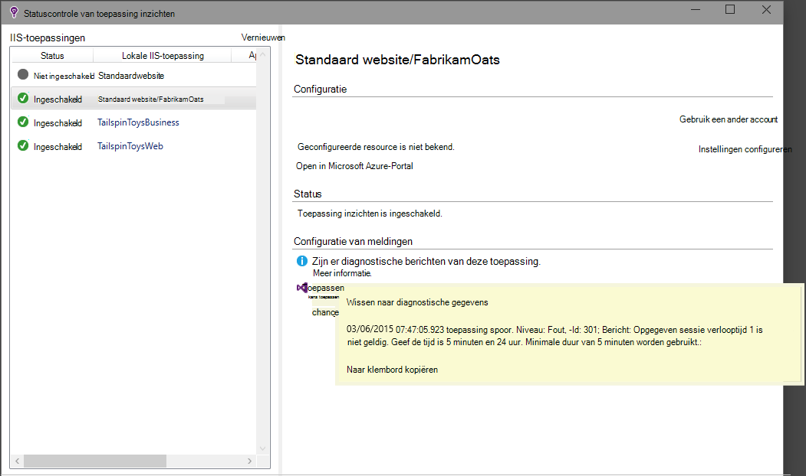

  * Controleer of dat uw server-firewall uitgaand verkeer op de bovenstaande poorten toestaat.
  * Klik op de server als u een bericht over 'onvoldoende machtigingen' ziet, probeert u het volgende:
    * Selecteer uw groep van toepassingen in IIS-beheer, open **Geavanceerde instellingen**en onder **Process Model** ziet u de identiteit.
    * In het Configuratiescherm van de Computer management toevoegen deze identiteit aan de groep gebruikers van prestaties bewaken.
  * Als er MMA/SCOM geïnstalleerd op uw server, kunnen sommige versies conflicteren. Verwijder zowel SCOM als statuscontrole en opnieuw installeren van de meest recente versies.
  * Zie [problemen met de][qna].

## Systeemvereisten

Ondersteuning voor OS voor toepassing inzichten statuscontrole op Server:

- Windows Server 2008
- Windows Server 2008 R2
- Windows Server 2012
- Windows server 2012 R2

met de meest recente SP en .NET Framework 4.0 en 4.5

Aan de clientzijde Windows 7, 8 en 8.1, opnieuw met .NET Framework 4.0 en 4.5

IIS-ondersteuning is: IIS 7: 7.5 hebt, 8, 8,5 (IIS is vereist)

## Automatisering met PowerShell

U kunt starten en stoppen met het bewaken via PowerShell op uw IIS-server.

Eerst de module toepassing inzichten te importeren:

`Import-Module 'C:\Program Files\Microsoft Application Insights\Status Monitor\PowerShell\Microsoft.Diagnostics.Agent.StatusMonitor.PowerShell.dll'`

Ontdek welke apps zijn wordt gecontroleerd:

`Get-ApplicationInsightsMonitoringStatus [-Name appName]`

* `-Name`(Optioneel) De naam van een web-app.
* Toont de toepassing inzichten controle status voor elke web-app (of de benoemde app) in deze IIS-server.

* Geeft als resultaat `ApplicationInsightsApplication` voor elke app:
 * `SdkState==EnabledAfterDeployment`:-App moet worden gecontroleerd en is geïmplementeerd tijdens runtime, door het hulpprogramma statuscontrole, of door `Start-ApplicationInsightsMonitoring`.
 * `SdkState==Disabled`: De app is niet geïmplementeerd voor inzichten van toepassing. Dit is nooit geïmplementeerd of runtime-cmdlets voor controle is uitgeschakeld met het hulpmiddel statuscontrole of met `Stop-ApplicationInsightsMonitoring`.
 * `SdkState==EnabledByCodeInstrumentation`: De app is geïmplementeerd door de SDK toe te voegen aan de broncode. De SDK kan niet worden bijgewerkt of gestopt.
 * `SdkVersion`ziet u de versie wordt gebruikt voor het controleren van deze app.
 * `LatestAvailableSdkVersion`ziet u de versie die momenteel beschikbaar in de galerie NuGet. Voor informatie over het upgraden van de app in deze versie gebruiken `Update-ApplicationInsightsMonitoring`.

`Start-ApplicationInsightsMonitoring -Name appName -InstrumentationKey 00000000-000-000-000-0000000`

* `-Name`De naam van de app in IIS
* `-InstrumentationKey`De ikey van de toepassing inzichten resource waar u de resultaten moet worden weergegeven.

* Deze cmdlet geldt alleen voor apps die worden niet al geïmplementeerd - dat wil zeggen SdkState == NotInstrumented.

    De cmdlet heeft geen invloed op een app die al is geïmplementeerd, tegelijk opbouwen door de SDK toe te voegen aan de code of tijdens het uitvoeren van een vorige gebruik van deze cmdlet.

    De SDK-versie waarmee de app instrument is de versie die onlangs met deze server is gedownload.

    Als u wilt downloaden van de meest recente versie, gebruikt u de Update-ApplicationInsightsVersion.

* Geeft als resultaat `ApplicationInsightsApplication` op succes. Als dit mislukt, aanmelding een spoor stderr.

    
          Name                      : Default Web Site/WebApp1
          InstrumentationKey        : 00000000-0000-0000-0000-000000000000
          ProfilerState             : ApplicationInsights
          SdkState                  : EnabledAfterDeployment
          SdkVersion                : 1.2.1
          LatestAvailableSdkVersion : 1.2.3

`Stop-ApplicationInsightsMonitoring [-Name appName | -All]`

* `-Name`De naam van een IIS-app
* `-All`Kleurovergangsbeëindigingen alle apps in deze IIS-server waarvoor bewaken`SdkState==EnabledAfterDeployment`

* Controle van de opgegeven apps stopt en instrumentation verwijderd. Deze functie werkt alleen voor apps die hebt is geïmplementeerd tijdens runtime met het gereedschap Status controleren of de begin-ApplicationInsightsApplication. (`SdkState==EnabledAfterDeployment`)

* Geeft als resultaat ApplicationInsightsApplication.

`Update-ApplicationInsightsMonitoring -Name appName [-InstrumentationKey "0000000-0000-000-000-0000"`]

* `-Name`: De naam van een web-app in IIS.
* `-InstrumentationKey`(Optioneel). Gebruik deze opdracht om te wijzigen van de resource waaraan van de app-telemetrielogboek wordt verzonden.
* Deze cmdlet:
 * Upgrades de benoemde app naar de versie van de SDK gedownload meest recent op deze computer. (Werkt alleen als `SdkState==EnabledAfterDeployment`)
 * Als u een sleutel instrumentation opgeeft, wordt de benoemde app geconfigureerd om het telemetrielogboek verzenden aan de resource met die toets. (Werkt als `SdkState != Disabled`)

`Update-ApplicationInsightsVersion`

* De meest recente toepassing inzichten SDK is gedownload naar de server.

## Volgende stappen

* [Maken van web tests] [ availability] om ervoor te zorgen dat uw site live blijft.
* [Gebeurtenissen en logboeken zoeken] [ diagnostic] om op te sporen van problemen.
* [Toevoegen web client telemetrielogboek] [ usage] uitzonderingen van webpagina-code en kunt u doelcellen oproepen invoegen.
* [Toepassing inzichten SDK toevoegen aan uw web-servicecode] [ greenbrown] zodat u de doelcellen invoegen kunt en log u in de code belt.

<!--Link references-->

[api]: app-insights-api-custom-events-metrics.md
[availability]: app-insights-monitor-web-app-availability.md
[client]: app-insights-javascript.md
[diagnostic]: app-insights-diagnostic-search.md
[greenbrown]: app-insights-asp-net.md
[qna]: app-insights-troubleshoot-faq.md
[roles]: app-insights-resources-roles-access-control.md
[usage]: app-insights-web-track-usage.md
