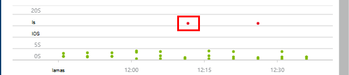

<properties
    pageTitle="De beschikbaarheid en serverreactie van een website monitoren | Microsoft Azure"
    description="Web tests in de toepassing inzichten instellen. Meldingen ontvangen als een website niet meer beschikbaar of traag reageert."
    services="application-insights"
    documentationCenter=""
    authors="alancameronwills"
    manager="douge"/>

<tags
    ms.service="application-insights"
    ms.workload="tbd"
    ms.tgt_pltfrm="ibiza"
    ms.devlang="na"
    ms.topic="get-started-article"
    ms.date="09/07/2016"
    ms.author="awills"/>

# Beschikbaarheid van de monitor en serverreactie van een website

Nadat u hebt uw WebApp of een website geïmplementeerd op een server, kunt u web tests instellen om de beschikbaarheid en de serverreactie te bewaken. [Visual Studio toepassing inzichten](app-insights-overview.md) verzendt webaanvragen in uw toepassing met regelmatige tussenpozen van punten overal ter wereld. Wordt u gewaarschuwd als uw toepassing niet reageert of traag reageert.

U kunt web tests voor HTTP of HTTPS-eindpunt die toegankelijk is vanuit de openbare internet instellen.

Er zijn twee soorten web testen:

* [URL ping testen](#create): een eenvoudige test die u in de portal van Azure maken kunt.
* [Meerdere stappen web testen](#multi-step-web-tests): die u maakt in Visual Studio Ultimate of Visual Studio Enterprise en uploaden naar de portal.

U kunt maximaal 10 web tests per resource van toepassing op te maken.

## 1. een resource voor uw testrapporten maken

Deze stap overslaan als u al [een resource van toepassing inzichten instellen hebt] [ start] voor deze toepassing, en dat u wilt zien van de beschikbaarheid van rapporten op dezelfde plaats.

Aanmelden voor [Microsoft Azure](http://azure.com), gaat u naar de [Azure-portal](https://portal.azure.com)en maken van een toepassing inzichten resource.

Klik op **alle resources** om te openen van het blad Overzicht voor de nieuwe resource.

## 2. een URL ping-test maken

In uw toepassing inzichten resource, zoekt u de beschikbaarheid van de tegel. Klikt u erop om te openen van het blad Web tests voor uw toepassing en toevoegen van een web-toets.

- **De URL** moet zichtbaar van openbare internet. Kan bevatten een queryreeks & #151; zo is, bijvoorbeeld: u kunt zich op uw database iets. Als de URL worden omgezet in een omleiding, volgen we dit maximaal 10 omleidingen.
- **Parseren van afhankelijke aanvragen**: afbeeldingen, scripts, bestanden in de stijl en andere resources aan de pagina wordt gevraagd als onderdeel van de test en de tijd opgenomen antwoord bevat deze tijden. De test mislukt als u al deze bronnen kunnen niet worden gedownload binnen de time-out voor de hele test.
- **Nieuwe pogingen inschakelen**: wanneer de test niet slaagt, wordt opnieuw geprobeerd na een korte interval. Een fout wordt vermeld, mits de drie opeenvolgende pogingen mislukt. Volgende tests worden klikt u vervolgens op de gebruikelijke frequentie uitgevoerd. Opnieuw is tijdelijk geschorst tot de volgende al dan niet geslaagde. Deze regel wordt onafhankelijk toegepast op elke testlocatie. (Raadzaam deze instelling. Gemiddeld verdwijnen ongeveer 80% van fouten bij een nieuwe poging.)
- **Frequentie testen**: Hiermee stelt u hoe vaak de test wordt uitgevoerd vanaf elke testlocatie. Met een frequentie van vijf minuten en vijf test locaties, is uw site getest gemiddeld elke minuut.
- **Test locaties** zijn de locaties vanaf waar onze servers webaanvragen verzenden naar de URL. Kies meer dan één zodat u de problemen in uw website van netwerkproblemen onderscheiden kunt. U kunt maximaal 16 locaties selecteren.

- **Criteria voor succes**:

    **Test time-out**: deze waarde om te worden gewaarschuwd over traag antwoorden verkleinen. De test wordt geteld als een fout als de antwoorden van uw site niet binnen deze periode zijn ontvangen. Als u hebt geselecteerd **parseren afhankelijke aanvragen**, klikt u vervolgens alle afbeeldingen, bestanden in de stijl, moeten scripts en andere afhankelijke resources zijn ontvangen binnen deze periode.

    **HTTP-antwoord**: de geretourneerde statuscode die als een gunstige uitkomst wordt geteld. 200 is de code die wordt aangegeven dat een normale pagina met webonderdelen is geretourneerd.

    **Inhoud overeenkomen**: een tekenreeks, zoals "Welkom!" We testen dat het zich daadwerkelijk in elke reactie voordoet. Dit moet een gewone tekenreeks, zonder jokertekens. Vergeet niet dat uit als de pagina inhoud wijzigingen u hebt deze bij te werken.

- **Waarschuwingen** zijn standaard naar u heeft verzonden als er fouten op drie locaties meer dan vijf minuten. Er is een fout op één locatie waarschijnlijk een netwerkprobleem en niet een probleem met uw site. Maar u de drempelwaarde voor als u wilt meer of minder gevoelige wijzigen en u ook wijzigen wie het e-mailberichten kunt kunt naar moeten worden verzonden.

    U kunt een [webhook](../monitoring-and-diagnostics/insights-webhooks-alerts.md) die wordt aangeroepen wanneer een melding wordt verheven instellen. (Maar houd er rekening mee dat op dit moment, queryparameters niet via als eigenschappen doorgegeven worden).

### Test meer URL 's

Meer tests toevoegen. Voor voorbeeld, evenals testen van uw startpagina worden weergegeven, kunt u ervoor zorgen dat uw database wordt uitgevoerd door te testen van de URL voor een zoekopdracht.

## 3. Zie uw web testresultaten

Na 1-2 minuten resultaten worden weergegeven in het blad Web Test.

Klik op een balk in het overzicht diagram voor een gedetailleerde weergave van de periode.

Deze grafieken combineren resultaten voor de web-tests van deze toepassing.

## Als u fouten ziet

Klik op een rode stip.

Of, schuif omlaag en klik op een toets waarin u ziet op die kleiner is dan 100% voltooid.

De resultaten van die test openen.

De test uit verschillende locaties indienen & #151 wordt uitgevoerd, kies een waar de resultaten zijn minder dan 100%.

Schuif omlaag naar **is mislukt tests** en kies een resultaat.

Klik op het resultaat als u wilt evalueren ervan in de portal en Zie waarom dit is mislukt.

U kunt ook het resultatenbestand downloaden en deze in Visual Studio controleren.

*Hiermee wordt gezocht OK maar gerapporteerd als een fout?* Schakel alle afbeeldingen, scripts, opmaakmodellen en andere bestanden op de pagina wordt geladen. Als een van deze mislukt, wordt de test gemeld is mislukt, zelfs als de belangrijkste html-pagina wordt geladen OK.

## Meerdere stappen web tests

U kunt een scenario waarbij een opeenvolging van URL's controleren. Bijvoorbeeld als u een verkoop website controleren wilt, kunt u testen dat toe te voegen items naar de winkelen correct werkt winkelwagen.

Als u wilt maken van een test met meerdere stappen, kunt u het scenario opnemen met behulp van Visual Studio, en uploadt de opname inzicht krijgen in toepassing. Toepassing inzichten opnieuw het scenario tijdsintervallen weergegeven en wordt gecontroleerd met de antwoorden.

Opmerking die u niet gebruiken gecodeerde functies in uw tests: de stappen scenario als een script in het bestand .webtest moeten worden opgenomen.

#### 1. record een scenario

Gebruik Visual Studio Enterprise of Ultimate een websessie opnemen.

1. Maak een project web prestaties testen.

    

2. Open het bestand .webtest en opname starten.

    

3. Voer de gebruikersacties die u in de test wilt simuleren: uw website te gaan, een product toevoegen aan het winkelwagentje, enzovoort. Stop daarna de test.

    

    Maak een lange scenario niet. Er is een limiet van 100 stappen en 2 minuten.

4. De test om te bewerken:
 - Validatie als u wilt controleren van de ontvangen tekst en reactie codes toevoegen.
 - Verwijder eventuele overbodige interacties. Afhankelijke aanvragen voor afbeeldingen of naar ad of voor het bijhouden van sites, kunt u ook verwijderen.

    Vergeet niet dat u alleen de testscript bewerken kunt: u geen aangepaste code toevoegen of andere tests web bellen. Geen lussen invoegen in de test. U kunt gebruiken standaard web test-invoegtoepassingen.

5. De test worden uitgevoerd in Visual Studio om ervoor te zorgen dat werkt.

    De web test deelnemer een webbrowser geopend en herhaalt de acties die u hebt opgenomen. Zorg ervoor dat het werkt zoals u zou verwachten.

    

#### 2. de web-test uploaden naar toepassing inzichten

1. Maak een nieuwe web-toets in de toepassing inzichten-portal.

    

2. Selecteer meerdere stappen test en upload het bestand .webtest.

    

    Stel de test locaties, frequentie en waarschuwingen parameters op dezelfde manier als voor ping-tests.

Uw testresultaten en eventuele fouten op dezelfde manier als voor één-url tests weergeven.

Een algemene reden voor mislukt is dat de test te lang wordt uitgevoerd. Het kan niet meer dan twee minuten uitgevoerd.

Vergeet niet dat alle bronnen van een pagina moeten worden geladen correct voor de test te kunnen uitvoeren, inclusief scripts, opmaakmodellen, afbeeldingen, enzovoort.

Houd er rekening mee dat de web-test geheel moet worden opgenomen in het bestand .webtest: u kunt geen gecodeerde functies gebruiken in de test.

### Tijd en willekeurige getallen aan te sluiten op de toets met meerdere stappen

Stel dat u bent een hulpmiddel waarvoor u tijd-afhankelijke gegevens zoals bestanden uit een externe feed testen. Als u uw web-test opneemt, u moet bepaalde tijden gebruiken, maar u deze instelt als parameters van de test, begintijd en eindtijd.

Wanneer u de test uitvoert, gewenste eindtijd altijd moeten de huidige tijd en starttijd moet worden 15 minuten geleden.

Web Test Plug-ins bieden de manier om te keren worden voorzien.

1. Een toets web invoegtoepassing voor elke variabele parameterwaarde die u wilt toevoegen. Kies in de werkbalk web test **Web testen-invoegtoepassing toevoegen**.

    

    In dit voorbeeld gebruiken we twee instanties van de invoegtoepassing voor datum-tijd. Een exemplaar is bedoeld voor 'geleden 15 minuten' en een andere 'voorlopig'.

2. Open de eigenschappen van elke invoegtoepassing. Een naam en stel deze gebruik van de huidige tijd. = -15 voor een van deze, ingestelde toevoegen minuten.

    

3. In het web testen parameters, {{invoegtoepassing naam}} gebruiken om te verwijzen naar de naam van een invoegtoepassing.

    

Upload uw test nu bij de portal. De dynamische waarden wordt gebruikt op elke uitvoeren van de test.

## Omgaan met aanmelden

Als uw gebruikers zich bij uw app aanmelden, hebt u verschillende opties voor simuleren aanmelden, zodat u kunt pagina's achter de aanmeldingsproblemen testen. De methode die u gebruikt, is afhankelijk van het type beveiliging van de app.

In alle gevallen moet u een account maken in uw toepassing net te kunnen testen. Beperk de machtigingen van dit testaccount indien mogelijk zodat er geen mogelijkheid van de web-tests dat dit gevolgen heeft echte gebruikers.

### Eenvoudige gebruikersnaam en wachtwoord

Een web-toets opnemen in de gebruikelijke manier. Verwijder eerst cookies.

### Op SAML-verificatie

Gebruik de SAML-invoegtoepassing voor die beschikbaar is voor web tests.

### Geheim client

Als uw app een route aanmeldingsproblemen waarvoor een geheim client heeft, gebruikt u die route. Azure Active Directory (AAD) is een voorbeeld van een service waarmee met een client geheime aanmelden. In AAD is het geheim client de App-sleutel.

Hier volgt een voorbeeld-web-test van een Azure web-app met een app-sleutel:

1. Krijgen token van AAD met geheim client (AppKey).
2. Dragertoken ophalen uit antwoord.
3. API-dragertoken gebruiken in de koptekst autorisatie belt.

Zorg dat de web-test een werkelijke klant is-dat wil zeggen, een eigen app AAD heeft - en gebruikt u de clientId + appkey. Uw service onder test heeft ook een eigen app in AAD: de toepassings-id URI van deze app is doorgevoerd in de web-test in het veld 'resource'.

### Open verificatie

Een voorbeeld van open verificatie is aanmelden met uw Microsoft- of Google-account. Veel apps die gebruikmaken van OAuth bieden de client geheime alternatief, zodat uw eerste tactiek moet deze mogelijkheid onderzoeken.

Als uw test moet Meld u aan met OAuth, wordt de algemene benadering is:

 * Een hulpmiddel zoals Fiddler gebruiken om te onderzoeken welke gevolgen het verkeer tussen uw webbrowser, de verificatiesite en uw app.
 * Twee of meer aanmeldingen met verschillende computers of browsers uitvoeren of lange tijdsintervallen (voor tokens verloopt).
 * Door het vergelijken van verschillende sessies, bepalen het token doorgegeven weer van de verificatie-site, die vervolgens aan uw app-server nadat u zich aangemeld doorgegeven wordt.
 * Een web-toets gebruik van Visual Studio-record.
 * Voorzien de tokens, als u de parameter wanneer het token wordt geretourneerd door de verificator en deze gebruiken in de query naar de site.
 (Visual Studio probeert om te voorzien van de test, maar de tokens correct niet wordt voorzien.)

## Bewerken of een toets uitschakelen

Open een afzonderlijke testen om te bewerken of uit te schakelen.

Het is raadzaam web tests uitschakelen tijdens het uitvoeren van onderhoud van uw service.

## Prestatietests

U kunt een toets laden uitvoeren op uw website. Als de test beschikbaarheid, kunt u eenvoudige aanvragen of meerdere stappen aanvragen van onze punten overal ter wereld verzenden. In tegenstelling tot een toets beschikbaarheid worden veel aanvragen verzonden, wordt simuleren van meerdere gebruikers tegelijk.

Open **Instellingen** **Prestatietests**in het blad Overzicht. Wanneer u een toets maakt, kunt u wordt uitgenodigd deel te verbinden met een Visual Studio Team Services-account maken.

Als de test voltooid is, kunt u antwoord tijden en success tarieven worden weergegeven.

## Automatisering

* [Gebruik PowerShell-scripts voor het instellen van een web-toets](https://azure.microsoft.com/blog/creating-a-web-test-alert-programmatically-with-application-insights/) automatisch.
* Het instellen van een [webhook](../monitoring-and-diagnostics/insights-webhooks-alerts.md) die wordt aangeroepen wanneer een melding wordt verheven.

## Vragen? Problemen?

* *Kan ik code bellen vanuit mijn test web?*

    Nee. De stappen van de test moeten zich in het bestand .webtest. En u geen andere tests web bellen of lussen gebruiken. Maar er zijn verschillende invoegtoepassingen die u wellicht nuttig vindt.

* *Wordt HTTPS ondersteund?*

    Ondersteunen we TLS 1.1 en TLS 1.2.

* *Is er een verschil tussen "web tests" en 'beschikbaarheid tests'?*

    We de twee voorwaarden door elkaar gebruiken.

* *Ik wil graag beschikbaarheid tests op onze interne server die wordt uitgevoerd achter een firewall te gebruiken.*

    Uw firewall toestaan aanvragen van het [IP-adressen van web testen gebruikersagenten](app-insights-ip-addresses.md#availability)configureren.

* *Een test met meerdere stappen web uploaden mislukt*

    Er is een maximale grootte van 300 K.

    Lussen worden niet ondersteund.

    Verwijzingen naar andere web tests worden niet ondersteund.

    Gegevensbronnen worden niet ondersteund.

* *Mijn test met meerdere stappen voltooien niet*

    Er is een limiet van 100 aanvragen per test.

    De test is gestopt als deze wordt uitgevoerd langer dan twee minuten.

* *Hoe kan ik een test uitvoeren met een clientcertificaat?*

    Wordt niet ondersteund die, geïnstalleerd.

## Video

> [AZURE.VIDEO monitoring-availability-with-application-insights]

## Volgende stappen

[Diagnostische logboeken zoeken][diagnostic]

[Problemen oplossen][qna]

[IP-adressen van web agenten testen](app-insights-ip-addresses.md)

<!--Link references-->

[azure-availability]: ../insights-create-web-tests.md
[diagnostic]: app-insights-diagnostic-search.md
[qna]: app-insights-troubleshoot-faq.md
[start]: app-insights-overview.md
