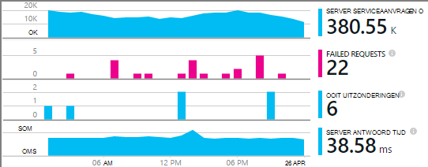
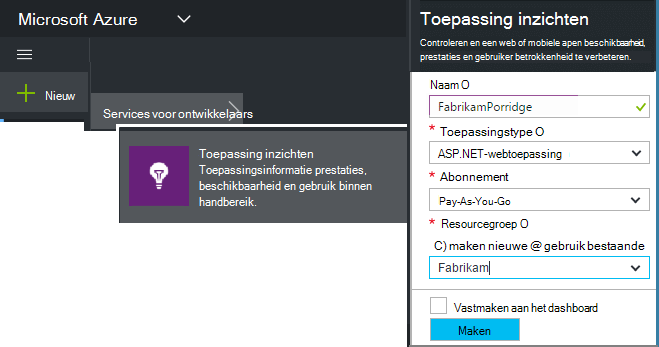
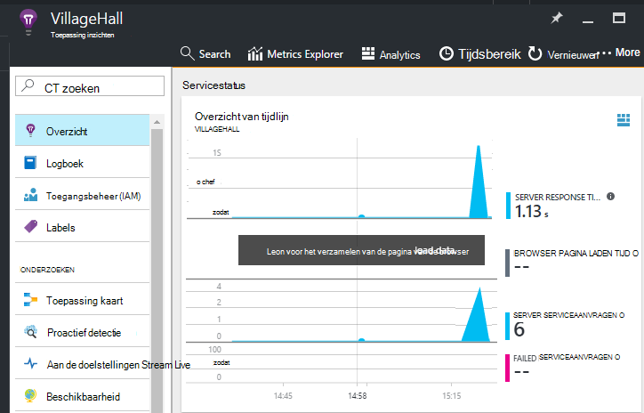

<properties
    pageTitle="Toepassing inzichten SDK als u wilt controleren van uw app Node.js toevoegen | Microsoft Azure"
    description="Gebruik, beschikbaarheid en prestaties van uw on-premises implementatie of Microsoft Azure-webtoepassing met toepassing inzichten analyseren."
    services="application-insights"
    documentationCenter=""
    authors="alancameronwills"
    manager="douge"/>

<tags
    ms.service="application-insights"
    ms.workload="tbd"
    ms.tgt_pltfrm="ibiza"
    ms.devlang="na"
    ms.topic="get-started-article"
    ms.date="08/30/2016"
    ms.author="awills"/>


# <a name="add-application-insights-sdk-to-monitor-your-nodejs-app"></a>Toepassing inzichten SDK als u wilt controleren van uw app Node.js toevoegen

*Er is een toepassing inzichten in de proefversie.*

[Visual Studio toepassing inzichten](app-insights-overview.md) bewaakt uw live-toepassing kunt [opsporen en onderzoeken prestatieproblemen en uitzonderingen,](app-insights-detect-triage-diagnose.md)en [Ontdek hoe uw app wordt gebruikt](app-insights-overview-usage.md). Dit werkt voor apps die worden gehost op uw eigen on-premises implementatie IIS-servers of op Azure VMs, evenals Azure-Webapps.


De SDK biedt automatische verzameling binnenkomende HTTP-verzoek tarieven en antwoorden, prestatie-items (CPU, geheugen, RPS) en onverwerkte uitzonderingen. Bovendien kunt u aangepaste oproepen naar het bijhouden van afhankelijkheden, aan de doelstellingen of andere gebeurtenissen toevoegen.




#### <a name="before-you-start"></a>Voordat u begint

U nodig hebt:

* Visual Studio 2013 of hoger. Later is het beter.
* Een abonnement op [Microsoft Azure](http://azure.com). Als uw team of uw organisatie een Azure-abonnement heeft, kunt de eigenaar u aan toevoegen, met uw [Microsoft-account](http://live.com).

## <a name="add"></a>Maak een toepassing inzichten-bron

Meld u aan bij de [portal van Azure][portal], en een nieuwe resource van toepassing inzichten te maken. Een [resource] [ roles] is een exemplaar van een service in Azure wordt aangegeven. Deze resource is waarop telemetrielogboek uit uw app worden geanalyseerd en aangegeven dat u.



Kies anders als het toepassingstype. De keuze van toepassingstype Hiermee, stelt u de Standaardinhoud van de bladen van de resource en de eigenschappen zichtbaar in [De Verkenner de doelstellingen][metrics].

#### <a name="copy-the-instrumentation-key"></a>Kopieer de Instrumentation-toets

De toets geeft de bron en installeert u deze snel in de SDK om te sturen van gegevens naar de bron.


## <a name="sdk"></a>Een installatiefout met de SDK in uw toepassing

```
npm install applicationinsights --save
```

## <a name="usage"></a>Gebruik

Hiermee schakelt u aanvragen controleren, onverwerkte uitzondering bijhouden en systeemprestaties wilt verbeteren monitoring (CPU/geheugen/RPS).

```javascript

var appInsights = require("applicationinsights");
appInsights.setup("<instrumentation_key>").start();
```

De toets instrumentation kan ook worden ingesteld in de omgevingsvariabele APPINSIGHTS_INSTRUMENTATIONKEY. Als dit wordt uitgevoerd, geen argument is vereist bij het aanroepen van `appInsights.setup()` of `appInsights.getClient()`.

U kunt de SDK zonder te verzenden telemetrielogboek: de sleutel instrumentation instellen op niet-lege tekenreeks.


## <a name="run"></a>Uw project uitvoeren

Voer uw toepassing en probeer het zelf: verschillende pagina's om te genereren sommige telemetrielogboek openen.


## <a name="monitor"></a>Uw telemetrielogboek weergeven

Ga terug naar de [Azure-portal](https://portal.azure.com) en bladert u naar uw toepassing inzichten resource.


Zoeken naar gegevens in de overzichtspagina. Aanvankelijk ziet alleen u een of twee punten. Bijvoorbeeld:



Klik op in een grafiek om meer gedetailleerde afmetingen weer te geven. [Meer informatie over de doelstellingen.][perf]

#### <a name="no-data"></a>Er zijn geen gegevens?

* Gebruikt u de toepassing, verschillende pagina's te openen zodat sommige telemetrielogboek wordt gegenereerd.
* Open de tegel [Zoeken](app-insights-diagnostic-search.md) als u wilt zien van afzonderlijke gebeurtenissen. Soms duurt gebeurtenissen iets terwijl langer ophalen via de pijplijn aan de doelstellingen.
* Wacht een paar seconden en klikt u op **vernieuwen**. Grafieken regelmatig zelf vernieuwen, maar u kunt handmatig vernieuwen als u aan het wachten bent voor sommige gegevens moet verschijnen.
* Zie [problemen met de][qna].

## <a name="publish-your-app"></a>Uw app publiceren

Nu uw toepassing implementeren naar IIS of Azure en bekijk de gegevens worden verzameld.


#### <a name="no-data-after-you-publish-to-your-server"></a>Er zijn geen gegevens nadat u op de server publiceren?

Deze poorten voor uitgaand verkeer openen in de firewall van de server:

+ `dc.services.visualstudio.com:443`
+ `f5.services.visualstudio.com:443`


#### <a name="trouble-on-your-build-server"></a>Problemen bij het op de server opbouwen?

Zie [dit artikel voor probleemoplossing](app-insights-asp-net-troubleshoot-no-data.md#NuGetBuild).


## <a name="customized-usage"></a>Aangepaste gebruik 

### <a name="disabling-auto-collection"></a>Het uitschakelen van automatisch-siteverzameling

```javascript
import appInsights = require("applicationinsights");
appInsights.setup("<instrumentation_key>")
    .setAutoCollectRequests(false)
    .setAutoCollectPerformance(false)
    .setAutoCollectExceptions(false)
    // no telemetry will be sent until .start() is called
    .start();
```

### <a name="custom-monitoring"></a>Aangepaste cmdlets voor controle

```javascript
import appInsights = require("applicationinsights");
var client = appInsights.getClient();

client.trackEvent("custom event", {customProperty: "custom property value"});
client.trackException(new Error("handled exceptions can be logged with this method"));
client.trackMetric("custom metric", 3);
client.trackTrace("trace message");
```

[Meer informatie over het telemetrielogboek API](app-insights-api-custom-events-metrics.md).

### <a name="using-multiple-instrumentation-keys"></a>Meerdere instrumentation te gebruiken

```javascript
import appInsights = require("applicationinsights");

// configure auto-collection with one instrumentation key
appInsights.setup("<instrumentation_key>").start();

// get a client for another instrumentation key
var otherClient = appInsights.getClient("<other_instrumentation_key>");
otherClient.trackEvent("custom event");
```

## <a name="examples"></a>Voorbeelden

### <a name="tracking-dependency"></a>Afhankelijkheid bijhouden

```javascript
import appInsights = require("applicationinsights");
var client = appInsights.getClient();

var startTime = Date.now();
// execute dependency call
var endTime = Date.now();

var elapsedTime = endTime - startTime;
var success = true;
client.trackDependency("dependency name", "command name", elapsedTime, success);
```


### <a name="manual-request-tracking-of-all-get-requests"></a>Handmatige aanvraag traceren van alle 'Krijgt' aanvragen

```javascript
var http = require("http");
var appInsights = require("applicationinsights");
appInsights.setup("<instrumentation_key>")
    .setAutoCollectRequests(false) // disable auto-collection of requests for this example
    .start();

// assign common properties to all telemetry sent from the default client
appInsights.client.commonProperties = {
    environment: process.env.SOME_ENV_VARIABLE
};

// track a system startup event
appInsights.client.trackEvent("server start");

// create server
var port = process.env.port || 1337
var server = http.createServer(function (req, res) {
    // track all "GET" requests
    if(req.method === "GET") {
        appInsights.client.trackRequest(req, res);
    }

    res.writeHead(200, { "Content-Type": "text/plain" });
    res.end("Hello World\n");
}).listen(port);

// track startup time of the server as a custom metric
var start = +new Date;
server.on("listening", () => {
    var end = +new Date;
    var duration = end - start;
    appInsights.client.trackMetric("StartupTime", duration);
});
```

## <a name="next-steps"></a>Volgende stappen

* [Bewaak uw telemetrielogboek in de portal](app-insights-dashboards.md)
* [Gebruiksanalyses query's via uw telemetrielogboek schrijven](app-insights-analytics-tour.md)


<!--Link references-->

[knowUsers]: app-insights-overview-usage.md
[metrics]: app-insights-metrics-explorer.md
[perf]: app-insights-web-monitor-performance.md
[portal]: http://portal.azure.com/
[qna]: app-insights-troubleshoot-faq.md
[roles]: app-insights-resources-roles-access-control.md
