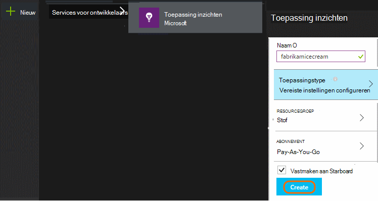
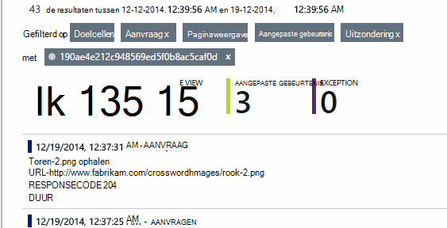

<properties
    pageTitle="Gebruiksanalyse met toepassing inzichten"
    description="Overzicht van gebruiksanalyse met toepassing inzichten"
    services="application-insights"
    documentationCenter=""
    authors="alancameronwills"
    manager="douge"/>

<tags
    ms.service="application-insights"
    ms.workload="tbd"
    ms.tgt_pltfrm="ibiza"
    ms.devlang="multiple"
    ms.topic="article" 
    ms.date="04/08/2016"
    ms.author="awills"/>

# Gebruiksanalyse met toepassing inzichten

Als u weet hoe mensen gebruiken voor uw toepassing, kunt u uw ontwikkelingswerk richten op de scenario's die ze het belangrijkst zijn en inzicht in de doelstellingen die ze vinden makkelijker of moeilijker om te bereiken krijgen.

Toepassing inzichten bieden een duidelijk beeld van het gebruik van de toepassing, zodat u kunt uw gebruikers te verbeteren, en voldoen aan de bedrijfsdoelstellingen.

Toepassing inzichten werkt voor zowel zelfstandige-apps (op iOS, Android en Windows) en voor web-apps (die worden gehost op .NET of J2EE). 

## Toepassing inzichten toevoegen aan uw project

Als u wilt beginnen, krijgt u een gratis met [Microsoft Azure](https://azure.com)-account. (Nadat de proefperiode, kunt u doorgaan met de gratis laag van de service.)

Klik in de [portal van Azure](https://portal.azure.com)een resource van toepassing inzichten te maken. Dit is waar ziet u gebruiks-en prestaties over uw app.

**Als uw app een apparaat-app is,** moet u de toepassing inzichten SDK toevoegen aan uw project. De exacte procedure varieert afhankelijk van uw [IDE en platform](app-insights-platforms.md). Voor Windows-apps, net met de rechtermuisknop op het project in Visual Studio en kies "Toevoegen toepassing inzichten."

**Als dit een WebApp is,** opent u het blad snel starten en de codefragment toevoegen aan uw webpagina's ophalen. Publiceer deze opnieuw met deze fragment.

U kunt ook toepassing inzichten toevoegen aan uw [ASP.NET](app-insights-asp-net.md) of [J2EE](app-insights-java-get-started.md) server-code te combineren telemetrielogboek uit client en server.

### Uw project uitvoeren en eerste resultaten weer te geven

Uw project uitvoeren in de foutopsporingsmodus voor voor een paar minuten en Ga naar de [Azure-portal](https://portal.azure.com) en blader naar de projectbron van uw in de toepassing inzichten.

Publiceer uw app om meer telemetrielogboek, en ontdek wat uw gebruikers met uw app doen.

## Analytics afmelden bij het vak

Klik op de tegel paginaweergaven om gebruik details te bekijken.

Plaats de muisaanwijzer in het lege deel boven een grafiek om de aantallen op een bepaald punt weer te geven. De getallen weergeven anders wordt de waarde die is samengevoegd in de periode te geven, zoals een gemiddelde, een totaal of een telling van verschillende gebruikers in de periode te geven.

Webtoepassingen, gebruikers, worden geteld met behulp van cookies. Een persoon die gebruikmaakt van verschillende browsers, cookies opheffen of de PRIVACYFUNCTIE is gebruikt worden enkele malen geteld.

Een websessie wordt geteld na 30 minuten inactiviteit. Een sessie op een telefoon of ander apparaat wordt geteld als de app is geschorst voor meer dan een paar seconden.

Klik op in een grafiek om meer details weer te geven. Bijvoorbeeld:

(In dit voorbeeld is van een website, maar de grafieken aangepaste gegevens er ongeveer voor apps die worden uitgevoerd voor apparaten.)

Vergelijken met de vorige week om te zien als dingen wilt wijzigen:

Twee maatstaven, bijvoorbeeld gebruikers en nieuwe gebruikers vergelijken:

De groepsgegevens (segment) op een eigenschap, zoals de Browser, besturingssysteem of plaats:

## Gebruik van de pagina

Klik op de paginaweergaven tegel als u een een overzicht van de populairste pagina's:

Het bovenstaande voorbeeld is van een website spellen. Hieruit kan we direct zien:

* Gebruik niet is verbeterd in de laatste week. Wellicht moet we Zoekmachineoptimalisatie nadenken?
* Veel minder mensen Zie spellen pagina's dan de startpagina. Waarom wordt niet de introductiepagina kan worden afgespeeld spellen trekken?
* 'Crossword' is het meest populaire spel. We moet prioriteit om nieuwe ideeën en er verbeteringen te geven.

## Aangepaste bijhouden

Stel dat we in plaats van elk spel implementeren in een afzonderlijke webpagina, u wilt ze refactoring alles in de app dezelfde één pagina met de meeste van de functionaliteit voor gecodeerd als Javascript in de pagina met webonderdelen. Hiermee kan de gebruiker snel schakelen tussen één spel en een andere, of zelfs hebben verschillende spellen op één pagina.

Maar nog steeds de gewenste inzichten van de toepassing het aantal keren aanmelden elk spel wordt geopend, op precies dezelfde manier als wanneer ze zich op afzonderlijke webpagina's. Dat is gemakkelijk: alleen een oproep naar de module telemetrielogboek invoegen in uw JavaScript waar u wilt opnemen die een nieuwe pagina heeft geopend:

    telemetryClient.trackPageView(game.Name);

## Aangepaste gebeurtenissen

U kunt telemetrielogboek op tal van manieren kunnen begrijpen hoe uw toepassing wordt gebruikt. Maar u niet altijd wilt de berichten verwisselt met paginaweergaven. Aangepaste gebeurtenissen in plaats daarvan, gebruiken. U kunt ze vanuit apparaat apps, webpagina's of een webserver verzenden:

(JavaScript)

    telemetryClient.trackEvent("GameEnd");

(C#)

    var tc = new Microsoft.ApplicationInsights.TelemetryClient();
    tc.TrackEvent("GameEnd");

(VB)

    Dim tc = New Microsoft.ApplicationInsights.TelemetryClient()
    tc.TrackEvent("GameEnd")

De meest voorkomende aangepaste gebeurtenissen worden weergegeven op het blad Overzicht.

Klik op de kop van de tabel totale aantal gebeurtenissen. U kunt de grafiek segmenteren door verschillende kenmerken zoals de naam van de gebeurtenis:

De met name handig functie van tijdlijnen is dat u wijzigingen met andere aan de doelstellingen en gebeurtenissen relateren kan. Soms wanneer meer spellen worden afgespeeld, kunt u zou bijvoorbeeld voor verwachten om een stijging van de opgegeven spellen ook weer te geven. Maar de toename van de opgegeven spellen is niet in verhouding staan, u wilt weten of de hoge belasting wordt veroorzaakt door problemen die gebruikers niet acceptabel vinden.

## Zoom in op specifieke gebeurtenissen

Als u een beter begrip van hoe een typisch sessie hoort, is het raadzaam om u te richten op een specifieke gebruiker-sessie met een bepaald type gebeurtenis.

In dit voorbeeld gecodeerd we een aangepaste gebeurtenis "NoGame" dat wordt aangeroepen als de gebruiker zich afmelden zonder daadwerkelijk een spel wordt gestart. Waarom een gebruiker dat zou u doen? Wellicht als we enkele specifieke exemplaren inzoomen, krijgt we een aanwijzing.

De aangepaste gebeurtenissen hebt ontvangen van de app worden met hun naam weergeven op het blad Overzicht vermeld:

Klik op de gebeurtenis belangrijke en selecteert u een recente specifieke exemplaar:

Bekijk alle telemetrielogboek in voor de sessie waar die NoGame gebeurtenis heeft plaatsgevonden.

Er zijn geen uitzonderingen, zodat de gebruiker is niet verhinderd door enkele storing wordt afgespeeld.

We kunnen alle typen telemetrielogboek behalve paginaweergaven uitfilteren voor deze sessie:

En nu kunnen we zien dat deze gebruiker geregistreerd in overzichtelijk wilt controleren van de meest recente scores. We overwegen wellicht ontwikkeling van een gebruiker artikel die gemakkelijker kunt doen. (En we een aangepaste gebeurtenis aan rapport te implementeren als dit artikel bepaalde plaatsvindt.)

## Filteren, zoeken en segmenteren van uw gegevens met eigenschappen
U kunt willekeurige labels en numerieke waarden toevoegen aan gebeurtenissen.

JavaScript op client

    appInsights.trackEvent("WinGame",
        // String properties:
        {Game: currentGame.name, Difficulty: currentGame.difficulty},
        // Numeric measurements:
        {Score: currentGame.score, Opponents: currentGame.opponentCount}
    );

C# op server

    // Set up some properties:
    var properties = new Dictionary <string, string>
        {{"game", currentGame.Name}, {"difficulty", currentGame.Difficulty}};
    var measurements = new Dictionary <string, double>
        {{"Score", currentGame.Score}, {"Opponents", currentGame.OpponentCount}};

    // Send the event:
    telemetry.TrackEvent("WinGame", properties, measurements);

VB op server

    ' Set up some properties:
    Dim properties = New Dictionary (Of String, String)
    properties.Add("game", currentGame.Name)
    properties.Add("difficulty", currentGame.Difficulty)

    Dim measurements = New Dictionary (Of String, Double)
    measurements.Add("Score", currentGame.Score)
    measurements.Add("Opponents", currentGame.OpponentCount)

    ' Send the event:
    telemetry.TrackEvent("WinGame", properties, measurements)

Eigenschappen koppelen aan de paginaweergaven op dezelfde manier:

JavaScript op client

    appInsights.trackPageView("Win",
        {Game: currentGame.Name},
        {Score: currentGame.Score});

In diagnostische zoeken, moet u de eigenschappen weergeven door te klikken via een afzonderlijke exemplaar van een gebeurtenis.

Gebruik het zoekveld om gebeurtenissen die hebben plaatsgevonden met de waarde van een bepaald onroerend goed weer te geven.

## A | B testen

Als u niet welke variant van een functie worden prettig weet, laat u beide, waardoor elke toegankelijk zijn voor andere gebruikers. Het succes van elk meten en klikt u vervolgens verplaatsen naar een geïntegreerd versie.

Voor deze techniek, kunt u afzonderlijke labels toevoegen aan alle telemetrielogboek die is verzonden door elke versie van uw app. U kunt dit doen door het definiëren van eigenschappen in het actieve TelemetryContext. Deze standaardeigenschappen worden toegevoegd aan elke telemetrielogboek bericht dat de toepassing wordt verzonden - niet alleen uw aangepaste berichten, maar als u ook het standaard telemetrielogboek.

Klik in de portal-toepassing inzichten u kunt vervolgens wel filteren en groeperen (segment) uw gegevens van de labels, kunnen de verschillende versies vergelijken.

C# op server

    using Microsoft.ApplicationInsights.DataContracts;

    var context = new TelemetryContext();
    context.Properties["Game"] = currentGame.Name;
    var telemetry = new TelemetryClient(context);
    // Now all telemetry will automatically be sent with the context property:
    telemetry.TrackEvent("WinGame");

VB op server

    Dim context = New TelemetryContext
    context.Properties("Game") = currentGame.Name
    Dim telemetry = New TelemetryClient(context)
    ' Now all telemetry will automatically be sent with the context property:
    telemetry.TrackEvent("WinGame")

Afzonderlijke telemetrielogboek kunt overschreven door de standaardwaarden.

U kunt een universele initialisatiefunctie zo instellen dat alle nieuwe TelemetryClients automatisch uw context gebruiken.

    // Telemetry initializer class
    public class MyTelemetryInitializer : ITelemetryInitializer
    {
        public void Initialize (ITelemetry telemetry)
        {
            telemetry.Properties["AppVersion"] = "v2.1";
        }
    }

In de app-initialisatiefunctie zoals Global.asax.cs:

    protected void Application_Start()
    {
        // ...
        TelemetryConfiguration.Active.TelemetryInitializers
        .Add(new MyTelemetryInitializer());
    }

## Opbouwen - eenheid - informatie over

Wanneer u analytics gebruikt, wordt een geïntegreerde onderdeel ontwikkelingscyclus - niet alleen iets u denkt dat ongeveer bij het oplossen van problemen. Hier volgen enkele tips:

* Hiermee bepaalt u de belangrijkste meetwaarde van uw toepassing. Wilt u zo veel gebruikers mogelijk of wilt u liever een kleine groep tevreden gebruikers? Wilt u bezoeken of sales maximaliseren?
* Plan voor het meten van elk artikel. Wanneer u een nieuwe gebruiker verhaal schetsen of functie, of een abonnement bij een nieuwe database, altijd Denk na over hoe u het succes van de wijziging wordt meten. Voordat u begint kleurcodering, stel een vraag 'welk effect dit heeft op onze aan de doelstellingen, als dit werkt? Moeten we bijhouden alle nieuwe gebeurtenissen?"
En natuurlijk als de functie live is, Controleer of u kijkt u naar de analytische gegevens en op de resultaten te volgen.
* Andere metrische gegevens koppelen aan de belangrijkste meetwaarde. Bijvoorbeeld als u een functie 'Favorieten' toevoegt, u graag weten hoe vaak gebruikers Favorieten toevoegen. Maar het is waarschijnlijk meer interessant om te weten hoe vaak ze keert u terug naar hun Favorieten. En, belangrijker, klanten die gebruikmaken van Favorieten uiteindelijk koop meer van uw product?
* Canarische testen. Het instellen van een functie schakeloptie waarmee u een nieuwe functie alleen zichtbaar voor bepaalde gebruikers te maken. Toepassing inzichten gebruik om te zien of de nieuwe functie wordt gebruikt in de manier waarop die u beoogde. Wijzigingen aanbrengen, en vervolgens deze voor een groter publiek uitgebracht.
* Neem contact op met uw gebruikers! Analytics is niet genoeg op eigen, maar de bijbehorende voor het behoud van een goede klant-relatie.

## Meer informatie

* [Ontdekken, te sorteren en te analyseren loopt en prestatieproblemen in uw app](app-insights-detect-triage-diagnose.md)
* [Aan de slag met inzichten van toepassing op verschillende platformen](app-insights-detect-triage-diagnose.md)

## Video

> [AZURE.VIDEO usage-monitoring-application-insights]

 
