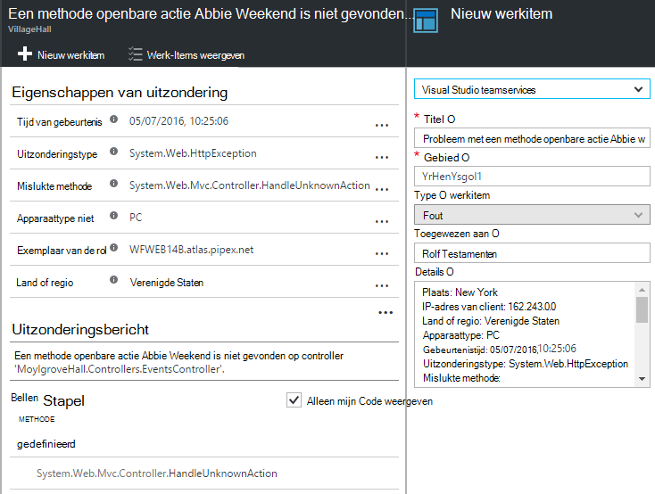

<properties 
    pageTitle="Toepassing inzichten zelfstudie | Microsoft Azure" 
    description="Gebruik en prestaties van uw live webtoepassing bijhouden.  Sorteren problemen opsporen en onderzoeken. Continu bewaken en success verbeteren met uw gebruikers." 
    services="application-insights" 
    documentationCenter=""
    authors="alancameronwills" 
    manager="douge"/>

<tags 
    ms.service="application-insights" 
    ms.workload="tbd" 
    ms.tgt_pltfrm="ibiza" 
    ms.devlang="na" 
    ms.topic="article" 
    ms.date="10/15/2016" 
    ms.author="awills"/>
 
# Toepassing inzichten - Inleiding

Visual Studio-toepassing inzichten is een extensible analytics-service die uw live webtoepassing bewaakt. Met deze kunt u detecteren en diagnose stellen bij prestatieproblemen en begrijpen wat gebruikers werkelijk uitvoeren met de app. Dit bedoeld voor ontwikkelaars, waarmee u prestaties en bruikbaarheid continu te verbeteren. Dit werkt voor apps op een groot aantal verschillende platforms inclusief .NET, Node.js en J2EE, die worden gehost on-premises implementatie of in de cloud. 

[Bekijk de inleiding animatie](https://www.youtube.com/watch?v=fX2NtGrh-Y0).

## Hoe werkt dit?

U een kleine instrumentation-pakket in uw toepassing installeren en instellen van een resource toepassing inzicht krijgen in de portal van Microsoft Azure. De apparatuur uw app bewaakt en stuurt telemetriegegevens bij de portal. De portal ziet u de statistische grafieken en beschikt over krachtige zoekhulpmiddelen waarmee u eventuele problemen opsporen.

Toepassing inzichten heeft verschillende [standaard instrumentation modules](app-insights-configuration-with-applicationinsights-config.md) die verschillende soorten telemetrielogboek zoals verzoek antwoord tijden, uitzonderingen en afhankelijkheid oproepen verzamelen. U kunt ook [programmacode als u wilt verzenden, aangepaste telemetrielogboek schrijven](app-insights-api-custom-events-metrics.md) bij de portal.

### Wat is de realiseren?

De invloed op de prestaties van uw app is erg klein. Bijhouden oproepen zijn worden niet-blokkeren, batch verwerkt en verzonden in een afzonderlijke thread. 

## Wat doet dit?

Inzichten van toepassing is gericht op het ontwikkelteam, kunt u meer informatie over hoe uw app wordt uitgevoerd en hoe deze wordt gebruikt. Het bevat:

Telemetrielogboek typen:

* HTTP-verzoek tarieven, antwoord tijden, success tarieven.
* Afhankelijkheid (HTTP & SQL) belt u tarieven, antwoord tijden, success tarieven.
* Uitzondering traces van zowel de server en de client.
* Diagnostische logboeken sporen.
* Paginaweergave telt, aantallen gebruikers en sessie, laadtijden van de browser, uitzonderingen.
* AJAX-oproep tarieven, antwoord tijden en success tarieven.
* Server prestatiemeteritems.
* Aangepaste clients en servers telemetrielogboek.
* Segmentatie door de locatie van de client, browserversie, versie van het besturingssysteem, server-instantie, aangepaste afmetingen en meer.
* Beschikbaarheid van de tests

Hulpmiddelen voor diagnostische en analytische:

* Slim en handmatige waarschuwingen van mislukt tarieven en andere statistieken en beschikbaarheid.
* Grafieken na verloop van tijd geaggregeerde parameters.
* Diagnostische gegevens zoeken op exemplaren van aanvragen, uitzonderingen, aangepaste gebeurtenissen, log sporen, paginaweergaven, afhankelijkheid en AJAX oproepen. 
* Analytics - een krachtige querytaal via uw telemetrielogboek
* Dashboards - opstellen de grafieken die u nodig hebt om de alle onderdelen van uw app te houden.

## Hoe gebruik ik dit?

### Monitor

Een installatiefout met toepassing inzichten in uw web-app, beschikbaarheid web tests, instellen en:

* Het instellen van een dashboard voor de chatruimte team om gaten op laden, serverreactie en de prestaties van uw afhankelijkheden, pagina wordt geladen en AJAX oproepen te houden. 
* Ontdek welke de laagst mogelijke zijn en de meeste mislukte aanvragen.
* Bekijk Live gegevensstroom wanneer u een nieuwe versie, onmiddellijk weten over een verslechtering van implementeert.

### Een diagnose stellen bij

Als u een melding ontvangt of kennismaken met een probleem:

* Fouten met uitzonderingen, afhankelijkheid oproepen en sporen relateren.
* Controleer stackdumps en logboeken voor het traceren.

### Beoordeel

Meet de effectiviteit van elke nieuwe functie die u implementeert.

* Plan meten hoe klanten nieuwe UX of voorzieningen gebruiken.
* Schrijf aangepaste telemetrielogboek in uw code aan te melden gebruik.
* Elke ontwikkelingscyclus baseren harde bewijs van telemetrielogboek.

## Aan de slag

Inzichten van toepassing is een van de vele services in Microsoft Azure en telemetrielogboek er voor analyse en de presentatie is verzonden. Dus voordat u iets anders doet, u een abonnement op [Microsoft Azure moet](http://azure.com). Gratis registreren en kunt u de gratis [laag prijzen](https://azure.microsoft.com/pricing/details/application-insights/) van toepassing inzichten. Als uw organisatie al een abonnement heeft, kunnen ze aan uw Microsoft-account toevoegen. 

Er zijn verschillende manieren aan de slag. Beginnen met afhankelijk van wat het meest geschikt is voor u. U kunt de anderen later toevoegen.

* **AT runtime: instrument uw web-app op de server.** Een update van de code voorkomt. Moet u beheerderstoegang uw server.
 * [**IIS on-premises implementatie of op een VM**](app-insights-monitor-performance-live-website-now.md)
 * [**Azure WebApp of VM**](app-insights-monitor-performance-live-website-now.md#if-your-app-runs-as-an-azure-web-app)
 * [**J2EE**](app-insights-java-live.md)
* **Ontwikkeling tegelijk: toepassing inzichten toevoegen aan uw code.** Kunt u aangepaste telemetrielogboek schrijven en instrument back-enddatabase en bureaublad-apps.
 * [Visual Studio](app-insights-asp-net.md) 2013 update 2 of hoger.
 * Java in [Eclips](app-insights-java-eclipse.md) of [andere hulpprogramma 's](app-insights-java-get-started.md)
 * [Node.js](app-insights-nodejs.md)
 * [Andere platforms](app-insights-platforms.md)
* **[Uw webpagina's instrument](app-insights-javascript.md)** voor paginaweergave, AJAX en andere telemetrielogboek aan de clientzijde.
* **[Beschikbaarheid van de tests](app-insights-monitor-web-app-availability.md)** - ping van uw website regelmatig van onze servers.

> [AZURE.NOTE]  Nu wellicht u alleen ophalen op en experimenteren. Maar lees verder als u zien wat toepassing inzichten kunt doen wilt...

## Aan de doelstellingen verkennen

Uw app - hetzij in de foutopsporingsmodus voor op uw computer ontwikkeling, of door deze te implementeren naar een server - uitvoeren en deze gebruiken voor de tijd. Meld u aan bij de [portal van Azure](https://portal.azure.com).

Ga naar van uw app-toepassing inzichten overzicht blade:

Het overzicht kunt u direct bekijken hoe uw app wordt uitgevoerd. U kunt laden (wat de frequentie van aanvragen) vergelijken met de tijd uw app ook als u wilt reageren op de aanvragen. Als er een buiten verhouding stijging antwoord tijd wanneer de belasting toeneemt, wilt u misschien meer resources toewijzen aan uw app. Als u meer mislukte antwoorden rechts worden weergegeven nadat u een nieuwe build geïmplementeerd, klikt u mogelijk wilt terugdraaien.

#### Meer informatie

Klik op in een grafiek om een meer gedetailleerde set grafieken te krijgen. Bijvoorbeeld leidt de grafiek Server antwoord tijd tot grafieken die weergeven verzoek tarieven, antwoord tijden en tijden antwoord van afhankelijkheden (dat wil zeggen, services die u uw app belt).  

De grafiek afhankelijkheden is handig omdat dit u zien kunt of de databases en de REST API's die uw app wordt gebruikt dat ook zijn reageert of vertragingen veroorzaken.

#### Een grafiek aanpassen

Probeer een van deze grafieken bewerken. Als uw web-app op een verzameling exemplaren van de server wordt uitgevoerd, kunt u bijvoorbeeld de tijden antwoord op de andere server-exemplaren vergelijken:

1. Plaats de muisaanwijzer op de grafiek en klik op bewerken.
2. Kies een meting. Meerdere aan de doelstellingen kunnen worden weergegeven in één grafiek, maar alleen in bepaalde combinaties: u moet mogelijk tot één meetwaarde deselecteren voordat u de gewenste selecteren.
3. Gebruik Group By segmenten van een meting door een eigenschap. In dit voorbeeld weergeven we aparte regels voor verschillende antwoord momenten. 

    Houd er rekening mee dat u moet een geldige eigenschap voor de meetwaarde selecteren of de grafiek worden alle gegevens niet weergegeven.
4. Selecteer een grafiektype. Vlakdiagrammen en staafdiagrammen weergeven gestapelde beeldscherm geschikt wanneer het aggregatietype kan worden 'Sum'.

[Meer informatie over het verkennen van de doelstellingen](app-insights-metrics-explorer.md).

## Gegevens van de exemplaar zoeken

Als u wilt onderzoeken een probleem, is het handig voor het controleren van specifieke gebeurtenis exemplaren.

Klik op een metrische grafiek exemplaargegevens wilt doorzoeken met relevante filters en tijdsbereik. Bijvoorbeeld, klikt u op tot en met de server verzoek telt om afzonderlijke verzoek om rapporten te zien. 

Of u kunt rechtstreeks exemplaargegevens ophalen van zoekresultaten op de overzichtspagina:

Filters gebruiken om de focus op bepaalde typen gebeurtenis en klik op de door u gekozen eigenschapswaarden:

Klik op '...' om te zien van een volledige lijst met eigenschappen of andere gebeurtenissen die zijn gekoppeld aan één verzoek te openen. In dit voorbeeld heeft de mislukte verzoek om een rapport bijbehorende uitzondering:

Een gebeurtenis - in dit voorbeeld de gerelateerde uitzondering - openen en u kunt een werkitem maken (als u Visual Studio Team Services gebruikt voor het bijhouden van taken). 
 

## Analytics

[Analytics](app-insights-analytics.md) is een nog krachtigere zoeken en analyse functie, waarin u SQL-achtige query's via uw telemetriegegevens, hetzij schrijven kunt om te zoeken naar specifieke problemen of om statistische informatie te verzamelen.

Open het venster zelfstudie om te zien en voorbeelden van query's uitvoeren via uw gegevens of lezen van het langere [Zelfstudievideo Stapsgewijze instructies](app-insights-analytics-tour.md). IntelliSense gevraagd of u met de query's die u kunt gebruiken, en er is een [volledige Naslaggids](app-insights-analytics-reference.md). 

Query's wordt meestal beginnen met de naam van een stream telemetrielogboek zoals aanvragen, uitzonderingen of afhankelijkheden. Pop de schema-balk aan de linkerkant voor een overzicht van de beschikbare telemetrielogboek stromen openen. De query is een pijplijn van [querybewerkingen](app-insights-analytics-reference.md#queries-and-operators) zoals `where` - een Booleaanse filter - of `project` -waarin nieuwe eigenschappen van expressie wordt berekend. `summarize`[aggregaties exemplaren](app-insights-analytics-tour.md#aggregate-groups-of-rows), groepeert ze door functies die u definieert en vervolgens aggregatiefuncties toe te passen op de gegroepeerde gegevens.

Resultaten kunnen worden [weergegeven in de tabellen of verschillende soorten grafiek](app-insights-analytics-tour.md#charting-the-results).

## Aangepaste telemetrielogboek

De ingebouwde telemetrielogboek die u zojuist door te installeren toepassing inzichten kunt u telt, success tarieven, analyseren en reactie tijden beide voor webaanvragen aan uw gesprekken app en afhankelijkheden - dat wil zeggen, uit uw app naar SQL, REST API's. U ook uitzondering sporen, openen en (met statuscontrole op de server) systeem prestatie-items. Als u het codefragment van de client aan uw webpagina's toevoegt, krijgt u de pagina weergave telt en worden geladen, client uitzonderingen en AJAX success en reactie tarieven bellen. 

Alle dit telemetrielogboek analyseren kan u vertellen veel over de prestaties en het gebruik van uw app. Maar soms die niet voldoende. Wilt u mogelijk de lengte van een wachtrij controleren, zodat u afstemmen kunt; of verkoop tellen en segmenteren ze door locatie; of, aan de clientzijde, bekijk hoe vaak gebruikt een bepaalde knop klikt, zodat u de gebruikerservaring kunt afstemmen.

De [Toepassing inzichten API](app-insights-api-custom-events-metrics.md) biedt oproepen `TrackEvent(name)` en `TrackMetric(name, value)` zodat u uw eigen aangepaste gebeurtenissen en aan de doelstellingen kunt verzenden. Zijn er equivalente oproepen voor de client.

Als uw webpagina een spel-app van één pagina is, kunt u bijvoorbeeld een lijnen invoegen op de juiste locaties aan te melden als de gebruiker WINS- of een spel verliest:

    
    appInsights.trackEvent("WinGame");
    ...
    appInsights.trackEvent("LoseGame");

Vervolgens we kunt weergeven in een grafiek aangepaste gebeurtenis telt, segmenteren deze door de gebeurtenisnaam van de:

### Log sporen

Voor diagnose, er is een aangepaste gebeurtenis `TrackTrace(message)` die u kunt gebruiken voor de uitvoering sporen. In de functies VIND.spec en analyses, kunt u zoeken op de inhoud van het bericht kan niet langer zijn dan de gebeurtenisnaam van een. 

Als u al een kader logboekregistratie zoals Log4Net, NLog, Log4J of System.Diagnostic.Trace gebruikt, klikt u vervolgens deze aanroepen doelcellen kunnen worden vastgelegd door toepassing inzichten en samen met de andere telemetrielogboek wordt weergegeven. De Visual Studio tools wordt automatisch de juiste SDK module toevoegen.

## Dashboards

Veel toepassingen bestaan uit meerdere onderdelen zoals een webservice en een of meer terug processors beëindigen. Elk onderdeel wordt gecontroleerd door een afzonderlijke toepassing inzichten resource. Als uw systeem op Azure wordt uitgevoerd, wellicht worden met de parameter - en -services zoals gebeurtenis hubs en machine learning-ook - controleren. 

U kunt voor het controleren van uw hele systeem, selecteert u het meest interessant grafieken van andere apps en de notities vastzetten aan een Azure [dashboard](app-insights-dashboards.md), zodat u kunt de gaten houden het hele systeem voortdurend. 

Ja, kunt u meerdere dashboards maken - bijvoorbeeld een team ruimte-dashboard voor het controleren van de algemene systeemstatus; een dashboard ontwerpen die bevat informatie over het gebruik van de verschillende functies; een afzonderlijk dashboard voor onderdelen onder test; enzovoort.  

Teamleden kunnen dashboards, zoals resources, worden gedeeld.

## Ontwikkelen in Visual Studio

Als u Visual Studio ontwikkelen van uw app gebruikt, vindt u verschillende toepassing inzichten hulpmiddelen ingebouwd in. 

### Diagnostische gegevens zoeken

Het venster zoeken bevat gebeurtenissen die zijn geregistreerd. (Als u aangemeld bij Azure bij het instellen van toepassing inzichten, u zult kunnen doorzoeken dezelfde gebeurtenissen in de portal.)

De zoekopdracht vrije tekst werkt op alle velden in de gebeurtenissen. Deel van de URL van een pagina; bijvoorbeeld zoeken of de waarde van een eigenschap zoals client plaats; of specifieke woorden in een logboek doelcellen.

Klik op een willekeurige gebeurtenis als u wilt zien van de uitgebreide eigenschappen.

U kunt ook het tabblad verwante Items om u te helpen bij het vaststellen van mislukte aanvragen of uitzonderingen openen.

### Diagnostisch hulpprogramma hub

De Hub diagnostische gegevens (in Visual Studio-2015 of later) ziet u de toepassing inzichten server telemetrielogboek zoals deze wordt gegenereerd. Dit werkt zelfs wanneer u niet alleen als u wilt de SDK, zonder deze verbinding maakt met een bron in de portal van Azure installeren.

### Uitzonderingen

Als u [ingesteld uitzondering monitoring hebt](app-insights-asp-net-exceptions.md), worden uitzondering rapporten worden weergegeven in het venster zoeken. 

Klik op een uitzondering als u een stacktrace. Als de code van de app geopend in Visual Studio is, kunt u via uit de stacktrace naar de betreffende regel van de code.

Bovendien op de regel Code Lens boven elke methode ziet u een telling van de uitzonderingen die door de toepassing inzichten is vastgelegd in de afgelopen 24 uur.

### Lokale bewaken

(Van Visual Studio 2015 Update 2) Als u dit nog niet hebt geconfigureerd voor de SDK telemetrielogboek om naar te verzenden de toepassing inzichten-portal (zodat er geen toets instrumentation in ApplicationInsights.config) wordt het venster diagnostisch hulpprogramma telemetrielogboek uit de sessie voor de meest recente foutopsporing weergegeven. 

Dit is wenselijk als u een eerdere versie van uw app al hebt gepubliceerd. U wilt niet dat de telemetrielogboek bij uw foutopsporing sessies naar omhoog worden gecombineerd met de telemetrielogboek op de portal-toepassing inzichten vanuit de gepubliceerde app.

Het is ook handig als er bepaalde [aangepaste telemetrielogboek](app-insights-api-custom-events-metrics.md) waarin u opsporen wilt alvorens telemetrielogboek bij de portal.

* *Volledig geconfigureerd ik aanvankelijk inzichten van toepassing als u wilt verzenden telemetrielogboek bij de portal. Maar nu ik wilt zien van het telemetrielogboek alleen in Visual Studio.*

 * In het venster Zoeken-instellingen is er een optie voor het zoeken van lokale diagnostische hulpprogramma's, zelfs als uw app telemetrielogboek bij de portal stuurt.
 * Opmerking Als u wilt stoppen telemetrielogboek dat wordt verzonden naar de portal, de regel `<instrumentationkey>...` uit ApplicationInsights.config. Wanneer u bent klaar telemetrielogboek bij de portal om opnieuw te verzenden, verwijder de opmerkingen bij deze.

## Trends

Een hulpmiddel in Visual Studio trends is voor het visualiseren van de werking van uw app na verloop van tijd. 

Kies **Verkennen Telemetrielogboek Trends** in de toepassing inzichten werkbalkknop of toepassing inzichten zoekvenster. Kies een van de vijf algemene query's aan de slag. U kunt verschillende gegevenssets op basis van telemetrielogboek typen, tijdsbereik en andere eigenschappen kunt analyseren. 

Als u wilt zoeken afwijkingen in uw gegevens, kiest u een van de afwijking opties onder de vervolgkeuzelijst "Weergavetype". De filteropties onderaan in het venster kunnen eenvoudig specificeren specifieke deelverzamelingen uw telemetrielogboek.

## Een nieuwe build vrijgeven

### Aan de doelstellingen Stream Live

Live aan de doelstellingen gegevensstroom ziet u de doelstellingen van uw toepassing rechts op dit moment helemaal, met een dichtbijzijnd realtime latentie van 1 seconde. Dit is bijzonder nuttig wanneer u een nieuwe build vrijgeven bent en u wilt om ervoor te zorgen dat alles werkt zoals verwacht of wordt onderzocht een incident in realtime is.

In tegenstelling tot aan de doelstellingen Explorer verschijnt Live aan de doelstellingen gegevensstroom een vaste overzicht van de doelstellingen. De gegevens zich blijft voordoen alleen voor zo lang maken als dit in het diagram is, en vervolgens wordt verwijderd. 

### Aantekeningen

[Release aantekeningen](app-insights-annotations.md) op de doelstellingen grafieken weergeven waarin u een nieuwe build geïmplementeerd. Ze kunnen u eenvoudig om te zien of de wijzigingen geen invloed op de prestaties van de toepassing hadden. Ze automatisch kunnen worden gemaakt met [Visual Studio Team Services systeem maken](https://www.visualstudio.com/en-us/get-started/build/build-your-app-vs)en u kunt ook [deze PowerShell maken](#create-annotations-from-powershell).

Release aantekeningen zijn van een functie van de build cloudgebaseerde en de toets los-service van de Visual Studio Team Services. 

## Waarschuwingen

Als er iets mis met uw app gaat, wilt u moet weten over deze direct. 

Toepassing inzichten biedt drie soorten waarschuwing, die per e-mail worden bezorgd.

### Proactief diagnostische gegevens 

[Proactief diagnostische gegevens](app-insights-proactive-failure-diagnostics.md) automatisch worden ingesteld: u niet hoeft te configureren. Uw site bevat voldoende verkeer, krijgt u een e-mailbericht als er een stijging van mislukte aanvragen die voor de tijd van de dag of verzoek tarief ongebruikelijke is. De melding bevat diagnostische informatie. 

Hier ziet u een melding voor een steekproef. 

Een tweede soort proactief detectie ontdekt correlatie tussen fouten en factoren zoals locatie, client OS of browsertype.

### Metrische waarschuwingen

U kunt configureren [metrische waarschuwingen](app-insights-alerts.md) om te zien wanneer een meetwaarde de drempelwaarde voor sommige periode - zoals mislukt telt, geheugen of paginaweergaven kruist.

### Beschikbaarheid

[Beschikbaarheid van web tests](app-insights-monitor-web-app-availability.md) verzenden aanvragen naar uw site van onze servers op verschillende locaties overal ter wereld. Ze zien wanneer uw site is niet beschikbaar op internet of reageert langzaam af. 

## Exporteren

Er zijn verschillende manieren om uw telemetriegegevens afmelden bij de portal-toepassing inzichten:

* [Continue exporteren](app-insights-export-telemetry.md) is ideaal als u wilt bewaren van grote delen van uw telemetrielogboek langer dan de standaard bewaarperiode.
* [Aan de doelstellingen](app-insights-metrics-explorer.md#export-to-excel) tabellen, zoekresultaten en [analyses](app-insights-analytics.md) resultaten kunnen alle worden geëxporteerd naar een Excel-spreadsheet. 
* De Data Access REST API kan worden gebruikt om te zoeken naar en extraheren van gegevens, inclusief Analytics-query's uitvoeren. De API is momenteel in de proefversie van privé. [Algemene informatie over het deelnemen aan de Preview-versie](https://visualstudio.uservoice.com/forums/357324-application-insights/suggestions/4999529-make-data-accessible-via-apis-for-custom-processin).
* U kunt exporteren [gebruiksanalyses query's voor Power BI](app-insights-export-power-bi.md) -dashboards en de resultaten bekijken in Power BI-visualisaties, die automatisch kunnen worden vernieuwd.

 
## Gegevensbeheer

Er zijn beperkingen op uw gebruik van de toepassing inzichten, die afhankelijk zijn tot op zekere hoogte van de prijzen kleurenschema dat u kiest. De belangrijkste beperkingen zijn op:

* Telemetrielogboek tarieven per minuut
* Gegevenspunt tellen per maand
* Bewaarperiode voor gegevens

[Meting](app-insights-sampling.md) is een methode voor het verkleinen van de kosten en vermijden beperken. Het wordt een deel van uw telemetrielogboek, behouden van een steekproef verwijderd. Gekoppelde items (zoals uitzonderingen en de aanvragen die ze hebben veroorzaakt) worden bewaard of elkaar gehaald. Voor ASP.NET-toepassingen, steekproeven automatisch bijgehouden en worden toegepast in de app; anders kunt u instellen om te worden toegepast op opname bij de portal.

## Volgende stappen

Aan de slag tijdens runtime met:

* [IIS-server](app-insights-monitor-performance-live-website-now.md)
* [J2EE-server](app-insights-java-live.md)

Aan de slag op tijd met:

* [ASP.NET](app-insights-asp-net.md)
* [Java](app-insights-java-get-started.md)
* [Node.js](app-insights-nodejs.md)

## Ondersteuning en feedback

* Vragen en problemen:
 * [Problemen oplossen][qna]
 * [MSDN-Forum](https://social.msdn.microsoft.com/Forums/vstudio/home?forum=ApplicationInsights)
 * [StackOverflow](http://stackoverflow.com/questions/tagged/ms-application-insights)
 * [Ondersteuning voor ontwikkelaars](app-insights-get-dev-support.md)
* Uw suggesties:
 * [UserVoice](https://visualstudio.uservoice.com/forums/357324)
* Blog:
 * [Toepassing inzichten blog](https://azure.microsoft.com/blog/tag/application-insights)

## Video 's

> [AZURE.VIDEO 218]

> [AZURE.VIDEO usage-monitoring-application-insights]

> [AZURE.VIDEO performance-monitoring-application-insights]

> [Inleidende animatie](https://www.youtube.com/watch?v=fX2NtGrh-Y0)

<!--Link references-->

[android]: https://github.com/Microsoft/ApplicationInsights-Android
[azure]: ../insights-perf-analytics.md
[client]: app-insights-javascript.md
[desktop]: app-insights-windows-desktop.md
[detect]: app-insights-detect-triage-diagnose.md
[greenbrown]: app-insights-asp-net.md
[ios]: https://github.com/Microsoft/ApplicationInsights-iOS
[java]: app-insights-java-get-started.md
[knowUsers]: app-insights-overview-usage.md
[platforms]: app-insights-platforms.md
[portal]: http://portal.azure.com/
[qna]: app-insights-troubleshoot-faq.md
[redfield]: app-insights-monitor-performance-live-website-now.md

 