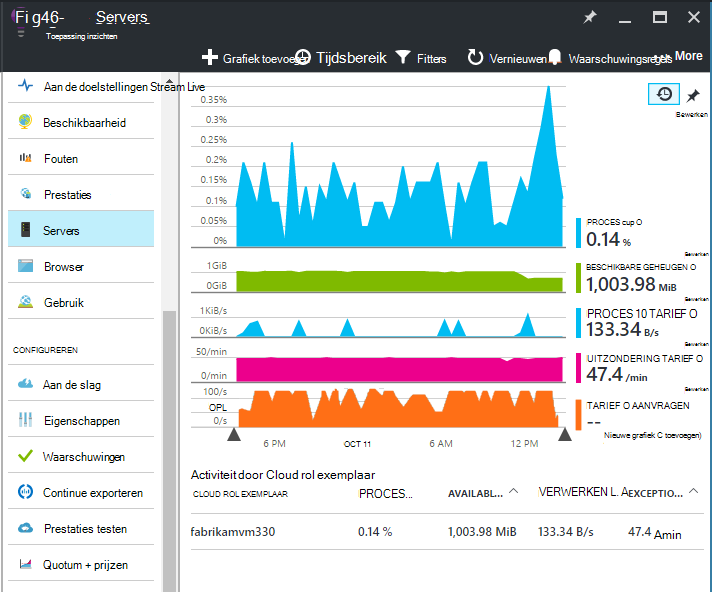
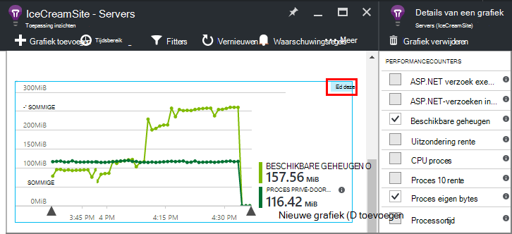
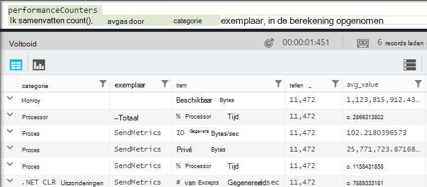
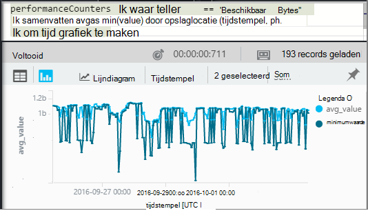
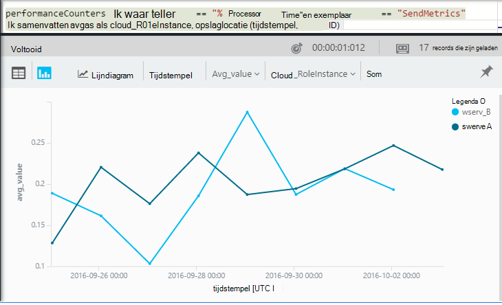

<properties 
    pageTitle="Van prestatiemeteritems in de toepassing inzichten | Microsoft Azure" 
    description="Systeem en aangepaste .NET prestatie-items in de toepassing inzichten bewaken." 
    services="application-insights" 
    documentationCenter=""
    authors="alancameronwills" 
    manager="douge"/>

<tags 
    ms.service="application-insights" 
    ms.workload="tbd" 
    ms.tgt_pltfrm="ibiza" 
    ms.devlang="na" 
    ms.topic="article" 
    ms.date="10/11/2016" 
    ms.author="awills"/>
 
# <a name="system-performance-counters-in-application-insights"></a>Systeem prestatiemeteritems in de toepassing inzichten


Windows biedt een groot aantal [items](http://www.codeproject.com/Articles/8590/An-Introduction-To-Performance-Counters) zoals CPU welke, geheugen, schijf en netwerkgebruik. U kunt ook uw eigen links definiëren. [Toepassing inzicht krijgen](app-insights-overview.md) kunt deze prestatiemeteritems weergeven als uw toepassing IIS wordt uitgevoerd op een on-premises implementatie-host of VM waartoe u beheerderstoegang hebt. De grafieken geven van de bronnen die beschikbaar zijn voor uw live-toepassing en kunnen helpen om aan te geven ongebalanceerde laden tussen exemplaren van de server.

Prestatiemeteritems worden weergegeven in het blad Servers, waaronder een tabel die segmenten door server-instantie.



(Prestatiemeteritems zijn niet beschikbaar voor Azure Web Apps. Maar u kunt [verzenden diagnostisch hulpprogramma Azure toepassing inzicht](app-insights-azure-diagnostics.md).)

## <a name="configure"></a>Configureren

Als toepassing inzichten statuscontrole nog niet is geïnstalleerd op de servers, moet u erop om prestatiemeteritems weer te installeren.

Download en [Statuscontrole installer](http://go.microsoft.com/fwlink/?LinkId=506648) worden uitgevoerd op elk serverexemplaar. Als dit al geïnstalleerd, moet u niet opnieuw installeren.

* *Ik [de toepassing inzichten SDK in mijn app hebt geïnstalleerd](app-insights-asp-net.md) tijdens de ontwikkeling. Moet ik nog steeds de statuscontrole?*

    Ja, statuscontrole is vereist voor het verzamelen van prestatie-items voor ASP.NET-Webapps. Zoals u al weet misschien, kan statuscontrole ook worden gebruikt in [web-apps controleren die al zijn live](app-insights-monitor-performance-live-website-now.md)zonder installatie van de SDK tijdens de ontwikkeling.


## <a name="view-counters"></a>Items weergeven

Het blad Servers ziet u een standaardset met prestatie-items. 

Als u wilt zien van andere items, de grafieken op het blad Servers, bewerken of open een nieuwe [Aan de doelstellingen Explorer](app-insights-metrics-explorer.md) blade en nieuwe grafieken toevoegen. 

De beschikbare items worden weergegeven als de doelstellingen wanneer u een grafiek bewerken.



Zie uw nuttigste grafieken op één plaats, een [dashboard](app-insights-dashboards.md) maken en notities vastzetten aan.

## <a name="add-counters"></a>Items toevoegen

Als het prestatiemeteritem dat u wilt niet wordt weergegeven in de lijst met aan de doelstellingen, komt dit doordat de toepassing inzichten SDK is niet worden verzamelen in uw webserver. U kunt configureren om te doen.

1. Ontdek welke items beschikbaar in uw server zijn met behulp van deze PowerShell-opdracht op de server:

    `Get-Counter -ListSet *`

    (See [`Get-Counter`](https://technet.microsoft.com/library/hh849685.aspx).)

1. Open ApplicationInsights.config.

 * Als u inzicht krijgen in toepassing toegevoegd aan uw app tijdens de ontwikkeling, ApplicationInsights.config Bewerk in uw project en klik vervolgens opnieuw het dashboard implementeren naar uw servers.
 * Als u een web-app gedurende runtime instrument statuscontrole gebruikt, kunt u ApplicationInsights.config vinden in de hoofdmap van de app in IIS. Deze er in elke server-instantie bijwerkt.

2. De prestaties verzamelen richtlijn bewerken:

 ```XML

    <Add Type="Microsoft.ApplicationInsights.Extensibility.PerfCounterCollector.PerformanceCollectorModule, Microsoft.AI.PerfCounterCollector">
      <Counters>
        <Add PerformanceCounter="\Objects\Processes"/>
        <Add PerformanceCounter="\Sales(photo)\# Items Sold" ReportAs="Photo sales"/>
      </Counters>
    </Add>

```

U kunt zowel standaard items als die dat u zelf hebt geïmplementeerd vastleggen. `\Objects\Processes`is een voorbeeld van een standaard item beschikbaar zijn op alle Windows-systemen. `\Sales(photo)\# Items Sold`is een voorbeeld van een aangepaste item die mogelijk zijn geïmplementeerd in een webservice. 

De indeling is `\Category(instance)\Counter"`, of gewoon voor categorieën waarvoor geen exemplaren, `\Category\Counter`.

`ReportAs`is vereist voor itemnamen die niet overeenkomen met `[a-zA-Z()/-_ \.]+` -dat wil zeggen ze tekens bevatten die niet zijn opgenomen in de volgende logicaverzamelingen: letters, ronde haken, schuine streep, afbreekstreepje, onderstrepingsteken, spatie, punten.

Als u een exemplaar opgeeft, worden deze als een dimensie "CounterInstanceName" van de gerapporteerde meetwaarde verzameld.

### <a name="collecting-performance-counters-in-code"></a>Van prestatiemeteritems in code verzamelen

Als u wilt verzamelen systeem prestatie-items en stuurt u inzicht krijgen in toepassing, kunt u de onderstaande stukje aanpassen:

    var perfCollectorModule = new PerformanceCollectorModule();
    perfCollectorModule.Counters.Add(new PerformanceCounterCollectionRequest(
      @"\.NET CLR Memory([replace-with-application-process-name])\# GC Handles", "GC Handles")));
    perfCollectorModule.Initialize(TelemetryConfiguration.Active);

Of u hetzelfde met aangepaste parameters die u hebt gemaakt kunt doen:

    var perfCollectorModule = new PerformanceCollectorModule();
    perfCollectorModule.Counters.Add(new PerformanceCounterCollectionRequest(
      @"\Sales(photo)\# Items Sold", "Photo sales"));
    perfCollectorModule.Initialize(TelemetryConfiguration.Active);

## <a name="performance-counters-in-analytics"></a>Van prestatiemeteritems in Analytics

U kunt zoeken en prestatiemeteritem rapporten weergeven in [Analytics](app-insights-analytics.md).


Het schema **performanceCounters** beschrijft de `category`, `counter` naam, en `instance` naam van elk prestatiemeteritem.  Klik in het telemetrielogboek voor elke toepassing ziet u alleen de items voor de toepassing. Bijvoorbeeld zijn om te zien welke items zijn beschikbaar: 



('Instantie' Hier verwijst naar de prestaties van item-instantie, niet de rol of server machine exemplaar. De naam van het exemplaar meestal segmenten items zoals processortijd door de naam van het proces of een toepassing.)

Een grafiek van beschikbare geheugen opvragen over de afgelopen periode: 




Als andere telemetrielogboek, **performanceCounters** , heeft ook een kolom `cloud_RoleInstance` die aangeeft dat de identiteit van de host server-instantie waarop uw app wordt uitgevoerd. Als u bijvoorbeeld de prestaties van uw app op de verschillende computers vergelijken: 




## <a name="aspnet-and-application-insights-counts"></a>ASP.NET- en -toepassing inzichten aantallen

*Wat is het verschil tussen de uitzondering rente en uitzonderingen aan de doelstellingen?*

* *Uitzondering rente gelijk* is aan een item van de prestaties systeem. De CLR telt alle verwerkte en onverwerkte uitzonderingen die zijn gegenereerd, en het totaal in een interval steekproeven gedeeld door de lengte van het interval. De toepassing inzichten SDK dit resultaat verzameld en verzonden naar de portal.
* *Uitzonderingen* is een telling van de rapporten TrackException is ontvangen door de portal in het interval steekproeven van de grafiek. Het bevat alleen de verwerkte uitzonderingen waarop u hebt geschreven TrackException belt in code, en niet alle [onverwerkte uitzonderingen](app-insights-asp-net-exceptions.md)bevat. 

## <a name="alerts"></a>Waarschuwingen

Als andere aan de doelstellingen kunt u [een melding instellen](app-insights-alerts.md) om u te waarschuwen als een prestatie-item hoort buiten de limiet die u opgeeft. Open het blad waarschuwingen en klikt u op waarschuwing toevoegen.


## <a name="next"></a>Volgende stappen

* [Afhankelijkheid bijhouden](app-insights-asp-net-dependencies.md)
* [Uitzondering bijhouden](app-insights-asp-net-exceptions.md)