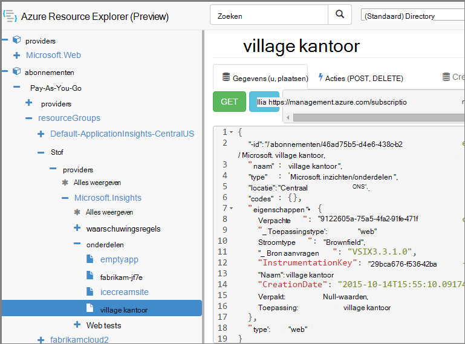

<properties 
    pageTitle="Toepassing inzichten resources via PowerShell maken" 
    description="Maak via programmacode toepassing inzichten resources als onderdeel van uw opbouwen." 
    services="application-insights" 
    documentationCenter=""
    authors="alancameronwills" 
    manager="douge"/>

<tags 
    ms.service="application-insights" 
    ms.workload="tbd" 
    ms.tgt_pltfrm="ibiza" 
    ms.devlang="na" 
    ms.topic="article" 
    ms.date="03/02/2016" 
    ms.author="awills"/>
 
# <a name="create-application-insights-resources-using-powershell"></a>Toepassing inzichten resources via PowerShell maken

In dit artikel leest u hoe u een resource van [Toepassing inzichten](app-insights-overview.md) maakt in Azure. Eventueel, bijvoorbeeld te doen als onderdeel van een proces opbouwen. U kunt samen met de eenvoudige toepassing inzichten resource, [beschikbaarheid web tests](app-insights-monitor-web-app-availability.md), [waarschuwingen instellen](app-insights-alerts.md), maken en andere resources Azure maken.

De sleutel voor het maken van deze resources is JSON-sjablonen voor [Azure bronbeheer](../powershell-azure-resource-manager.md). Kortom, de procedure geldt: de JSON-definities van bestaande resources; downloaden voorzien van bepaalde waarden zoals namen; en voer vervolgens de sjabloon als u wilt een nieuwe resource maakt. Kunt u verschillende bronnen samen pakket, maken alles in één Ga - bijvoorbeeld een beeldscherm app met beschikbaarheid tests, waarschuwingen en opslag voor doorlopende exporteren. Er zijn enkele individuele deel van de parameteriseringen, kunnen hier wordt uitgelegd.

## <a name="one-time-setup"></a>Eenmalige instelling

Als u PowerShell met uw Azure abonnement voordat u dit nog niet hebt gebruikt:

Installeer de Azure Powershell-module op de computer waarop de scripts worden uitgevoerd:

1. Installeer [Microsoft Web Platform Installer (v5 of hoger)](http://www.microsoft.com/web/downloads/platform.aspx).
2. Gebruik deze voor het installeren van Microsoft Azure Powershell.

## <a name="copy-the-json-for-existing-resources"></a>Kopieer de JSON voor bestaande resources

1. Instellen van [Toepassing inzichten](app-insights-overview.md) voor een project vergelijkbaar met de kleuren die u wilt genereren automatisch. Web tests en waarschuwingen toevoegen als u wilt dat ze.
2. Een nieuw .json-bestand maken: we Roep deze `template1.json` in dit voorbeeld. Kopieer deze inhoud erin.


    ```JSON

        {
          "$schema": "https://schema.management.azure.com/schemas/2015-01-01/deploymentTemplate.json#",
          "contentVersion": "1.0.0.0",
          "parameters": {
            "appName": { "type": "string" },
            "webTestName": { "type": "string" },
            "url": { "type": "string" },
            "text": { "type" : "string" }
          },
          "variables": {
            "testName": "[concat(parameters('webTestName'), 
               '-', toLower(parameters('appName')))]"
            "alertRuleName": "[concat(parameters('webTestName'), 
               '-', toLower(parameters('appName')), 
               '-', subscription().subscriptionId)]"
          },
          "resources": [
            {
              // component JSON file contents
            },
            {
              //web test JSON file contents
            },
            {
              //alert rule JSON file contents
            }
 
            // Any other resources go here
          ]
        }
    
    ```

    Deze sjabloon wordt de beschikbaarheid van één toets naast de belangrijkste resource instellen.


2. Open [Azure resourcemanager](https://resources.azure.com/). Navigeren naar beneden `subscriptions/resourceGroups/<your resource group>/providers/Microsoft.Insights/components`, aan de resource van toepassing. 

    

    *Onderdelen* zijn de eenvoudige toepassing inzichten bronnen voor het weergeven van toepassingen. Er zijn verschillende bronnen voor de bijbehorende waarschuwingsregels en de beschikbaarheid van web tests.

3. Kopieer de JSON van het onderdeel naar de juiste plaats in `template1.json`.
6. Deze eigenschappen verwijderen:
  * `id`
  * `InstrumentationKey`
  * `CreationDate`
4. Open de secties webtests en alertrules en kopieer de JSON voor individuele items naar uw sjabloon. (Niet kopiëren uit de knooppunten webtests of alertrules: Ga naar de items eronder.)

    Elke web-test is een bijbehorende waarschuwing regel, zodat u hoeft te kopiëren van deze.

    De web-test moet terechtkomen voordat u de huidige regel.

5. Om te voldoen aan het schema, voegt u deze regel in elke resource:

    `"apiVersion": "2014-04-01",`

    (Het schema klacht ook over het hoofdlettergebruik van het type Resourcenamen `Microsoft.Insights/*` -- maar deze *niet* wijzigen.)


## <a name="parameterize-the-template"></a>De sjabloon voorzien

U moet nu de specifieke namen vervangen door de parameters. Om te [voorzien van een sjabloon](../resource-group-authoring-templates.md), kunt u expressies met een [set Help-functies](../resource-group-template-functions.md)schrijven. 

U geen voorzien slechts een deel van een tekenreeks, dus gebruiken `concat()` tekenreeksen maken.

Hier ziet voorbeelden van de die u wilt maken. Er zijn verschillende exemplaren van elke vervangen. Mogelijk moet u anderen in uw sjabloon. Deze voorbeelden wordt de parameters en variabelen die zoals gedefinieerd boven aan de sjabloon gebruikt.

zoeken | vervangen
---|---
`"hidden-link:/subscriptions/.../components/MyAppName"`| `"[concat('hidden-link:',`<br/>` resourceId('microsoft.insights/components',` <br/> ` parameters('appName')))]"`
`"/subscriptions/.../alertrules/myAlertName-myAppName-subsId",` | `"[resourceId('Microsoft.Insights/alertrules', variables('alertRuleName'))]",`
`"/subscriptions/.../webtests/myTestName-myAppName",` | `"[resourceId('Microsoft.Insights/webtests', parameters('webTestName'))]",`
`"myWebTest-myAppName"` | `"[variables(testName)]"'`
`"myTestName-myAppName-subsId"` | `"[variables('alertRuleName')]"`
`"myAppName"` | `"[parameters('appName')]"`
`"myappname"`(kleine letters) | `"[toLower(parameters('appName'))]"`
`"<WebTest Name=\"myWebTest\" ...`<br/>` Url=\"http://fabrikam.com/home\" ...>"`|`[concat('<WebTest Name=\"',` <br/> `parameters('webTestName'),` <br/> `'\" ... Url=\"', parameters('Url'),` <br/> `'\"...>')]" `


## <a name="set-dependencies-between-the-resources"></a>Afhankelijkheden tussen de bronnen instellen

Azure moet instellen met de resources in strikte volgorde. Om ervoor te zorgen dat één setup is voltooid voordat de volgende begint, moet u afhankelijkheidslijnen toevoegen:

* Test de resource in het web:

    `"dependsOn": ["[resourceId('Microsoft.Insights/components', parameters('appName'))]"],`

* In de waarschuwing resource:

    `"dependsOn": ["[resourceId('Microsoft.Insights/webtests', variables('testName'))]"],`

## <a name="create-application-insights-resources"></a>Toepassing inzichten resources maken

1. In PowerShell, moet u zich aanmelden bij Azure

    `Login-AzureRmAccount`

2. Voer een opdracht als volgt uit:

    ```PS

        New-AzureRmResourceGroupDeployment -ResourceGroupName Fabrikam `
               -templateFile .\template1.json `
               -appName myNewApp `
               -webTestName aWebTest `
               -Url http://myapp.com `
               -text "Welcome!"
               -siteName "MyAzureSite"

    ``` 

    * -ResourceGroupName is de groep waarin u wilt maken van de nieuwe bronnen.
    * het jaar - sjabloonbestand voordat u de aangepaste parameters.
    * -Toepassingsnaam de naam van de resource kan maken.
    * -webTestName de naam van de web-toets om te maken.
    * -Url de url van uw web-app.
    * -tekst een tekenreeks die wordt weergegeven in uw webpagina.
    * -Sitenaam - gebruikt als dit een Azure-website


## <a name="define-metric-alerts"></a>Metrische waarschuwingen definiëren

Er is een [PowerShell-methode van het instellen van waarschuwingen](app-insights-alerts.md#set-alerts-by-using-powershell).


## <a name="an-example"></a>Een voorbeeld

Hier volgt het volledige onderdeel, web test en web waarschuwing sjabloon testen dat ik heb gemaakt:

``` JSON

{
  "$schema": "https://schema.management.azure.com/schemas/2015-01-01/deploymentTemplate.json#",
  "contentVersion": "1.0.0.0",
  "parameters": {
    "webTestName": { "type": "string" },
    "appName": { "type": "string" },
    "URL": { "type": "string" },
    "text": { "type" : "string" }
  },
  "variables": {
    "alertRuleName": "[concat(parameters('webTestName'), '-', toLower(parameters('appName')), '-', subscription().subscriptionId)]",
    "testName": "[concat(parameters('webTestName'), '-', toLower(parameters('appName')))]"
  },
  "resources": [
    {
      //"id": "[resourceId('Microsoft.Insights/components', parameters('appName'))]",
      "apiVersion": "2014-04-01",
      "kind": "web",
      "location": "Central US",
      "name": "[parameters('appName')]",
      "properties": {
        "TenantId": "9122605a-471fc50f8438",
        "Application_Type": "web",
        "Flow_Type": "Brownfield",
        "Request_Source": "VSIX3.3.1.0",
        "Name": "[parameters('appName')]",
        //"CreationDate": "2015-10-14T15:55:10.0917441+00:00",
        "PackageId": null,
        "ApplicationId": "[parameters('appName')]"
      },
      "tags": { },
      "type": "microsoft.insights/components"
    },
    {
      //"id": "[resourceId('Microsoft.Insights/webtests', variables('testName'))]",
      "name": "[variables('testName')]",
      "apiVersion": "2014-04-01",
      "type": "microsoft.insights/webtests",
      "location": "Central US",
      "tags": {
        "[concat('hidden-link:', resourceId('microsoft.insights/components', parameters('appName')))]": "Resource"
      },
      "properties": {
        "provisioningState": "Succeeded",
        "Name": "[parameters('webTestName')]",
        "Description": "",
        "Enabled": true,
        "Frequency": 900,
        "Timeout": 120,
        "Kind": "ping",
        "RetryEnabled": true,
        "Locations": [
          {
            "Id": "us-va-ash-azr"
          },
          {
            "Id": "emea-nl-ams-azr"
          },
          {
            "Id": "emea-gb-db3-azr"
          }
        ],
        "Configuration": {
          "WebTest": "[concat(
             '<WebTest   Name=\"', 
                parameters('webTestName'), 
              '\"  Id=\"32cfc791-aaad-4b50-9c8d-993c21beb218\"   Enabled=\"True\"         CssProjectStructure=\"\"    CssIteration=\"\"  Timeout=\"120\"  WorkItemIds=\"\"         xmlns=\"http://microsoft.com/schemas/VisualStudio/TeamTest/2010\"         Description=\"\"  CredentialUserName=\"\"  CredentialPassword=\"\"         PreAuthenticate=\"True\"  Proxy=\"default\"  StopOnError=\"False\"         RecordedResultFile=\"\"  ResultsLocale=\"\">  <Items>  <Request Method=\"GET\"         Guid=\"a6f2c90b-61bf-b28hh06gg969\"  Version=\"1.1\"  Url=\"', 
              parameters('Url'), 
              '\" ThinkTime=\"0\"  Timeout=\"300\" ParseDependentRequests=\"True\"         FollowRedirects=\"True\" RecordResult=\"True\" Cache=\"False\"         ResponseTimeGoal=\"0\"  Encoding=\"utf-8\"  ExpectedHttpStatusCode=\"200\"         ExpectedResponseUrl=\"\" ReportingName=\"\" IgnoreHttpStatusCode=\"False\" />        </Items>  <ValidationRules> <ValidationRule  Classname=\"Microsoft.VisualStudio.TestTools.WebTesting.Rules.ValidationRuleFindText, Microsoft.VisualStudio.QualityTools.WebTestFramework, Version=10.0.0.0, Culture=neutral, PublicKeyToken=b03f5f7f11d50a3a\" DisplayName=\"Find Text\"         Description=\"Verifies the existence of the specified text in the response.\"         Level=\"High\"  ExectuionOrder=\"BeforeDependents\">  <RuleParameters>        <RuleParameter Name=\"FindText\" Value=\"', 
              parameters('text'), 
              '\" />  <RuleParameter Name=\"IgnoreCase\" Value=\"False\" />  <RuleParameter Name=\"UseRegularExpression\" Value=\"False\" />  <RuleParameter Name=\"PassIfTextFound\" Value=\"True\" />  </RuleParameters> </ValidationRule>  </ValidationRules>  </WebTest>')]"
        },
        "SyntheticMonitorId": "[variables('testName')]"
      }
    },
    {
      //"id": "[resourceId('Microsoft.Insights/alertrules', variables('alertRuleName'))]",
      "name": "[variables('alertRuleName')]",
      "apiVersion": "2014-04-01",
      "type": "microsoft.insights/alertrules",
      "location": "East US",
      "dependsOn": [
        "[resourceId('Microsoft.Insights/components', parameters('appName'))]",
        "[resourceId('Microsoft.Insights/webtests', variables('testName'))]"
      ],
      "tags": {
        "[concat('hidden-link:', resourceId('Microsoft.Insights/components', parameters('appName')))]": "Resource",
        "[concat('hidden-link:', resourceId('Microsoft.Insights/webtests', variables('testName')))]": "Resource"
      },
      "properties": {
        "name": "[variables('alertRuleName')]",
        "description": "",
        "isEnabled": true,
        "condition": {
          "$type": "Microsoft.WindowsAzure.Management.Monitoring.Alerts.Models.LocationThresholdRuleCondition, Microsoft.WindowsAzure.Management.Mon.Client",
          "odata.type": "Microsoft.Azure.Management.Insights.Models.LocationThresholdRuleCondition",
          "dataSource": {
            "$type": "Microsoft.WindowsAzure.Management.Monitoring.Alerts.Models.RuleMetricDataSource, Microsoft.WindowsAzure.Management.Mon.Client",
            "odata.type": "Microsoft.Azure.Management.Insights.Models.RuleMetricDataSource",
            "resourceUri": "[resourceId('microsoft.insights/webtests', variables('testName'))]",
            "metricName": "GSMT_AvRaW"
          },
          "windowSize": "PT15M",
          "failedLocationCount": 2
        },
        "action": {
          "$type": "Microsoft.WindowsAzure.Management.Monitoring.Alerts.Models.RuleEmailAction, Microsoft.WindowsAzure.Management.Mon.Client",
          "odata.type": "Microsoft.Azure.Management.Insights.Models.RuleEmailAction",
          "sendToServiceOwners": true,
          "customEmails": [ ]
        },
        "provisioningState": "Succeeded",
        "actions": [ ]
      }

    }
  ]
}

```

## <a name="see-also"></a>Zie ook

Andere artikelen automatisering:

* [Maken, een resource van toepassing inzichten](app-insights-powershell-script-create-resource.md) - snelle methode zonder een sjabloon te gebruiken.
* [Waarschuwingen instellen](app-insights-powershell-alerts.md)
* [Web tests maken](https://azure.microsoft.com/blog/creating-a-web-test-alert-programmatically-with-application-insights/)
* [Azure diagnostisch hulpprogramma verzenden naar toepassing inzichten](app-insights-powershell-azure-diagnostics.md)
* [Release aantekeningen maken](https://github.com/Microsoft/ApplicationInsights-Home/blob/master/API/CreateReleaseAnnotation.ps1)
