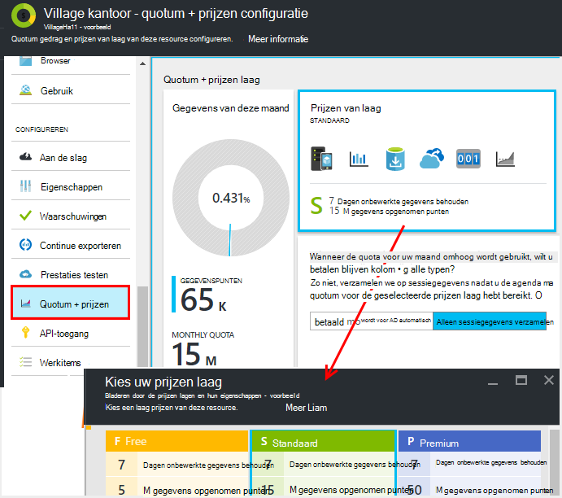
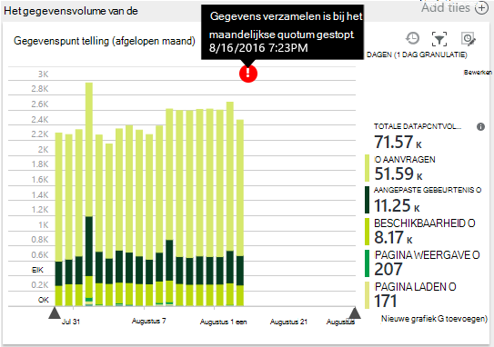
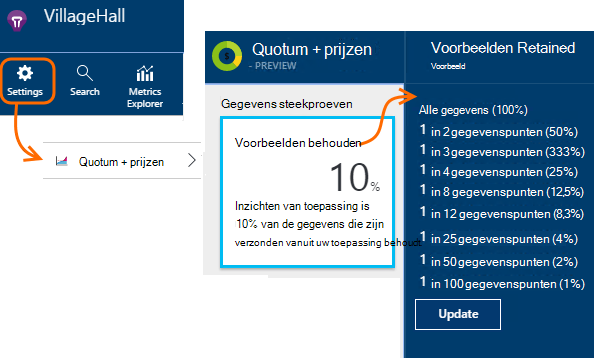
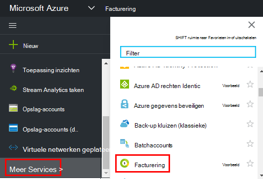

<properties 
    pageTitle="Quota en prijzen voor toepassing inzichten beheren | Microsoft Azure" 
    description="Kies de prijs-abonnement dat u nodig hebt, telemetrielogboek volumes beheren" 
    services="application-insights" 
    documentationCenter=""
    authors="alancameronwills" 
    manager="douge"/>

<tags 
    ms.service="application-insights" 
    ms.workload="tbd" 
    ms.tgt_pltfrm="ibiza" 
    ms.devlang="na" 
    ms.topic="article" 
    ms.date="10/13/2016" 
    ms.author="awills"/>

# Quota en prijzen voor inzichten-toepassing beheren

*Er is een toepassing inzichten in de proefversie.*

[Prijzen] [ pricing] voor [Visual Studio toepassing inzichten] [ start] is gebaseerd op het gegevensvolume van de per toepassing. Er is een aanzienlijke gratis laag waarin u de meeste functies met enkele beperkingen.

Elke toepassing inzichten resource in rekening wordt gebracht als een afzonderlijke service en draagt bij aan de factuur voor uw abonnement op Azure.

[Zie de prijzen kleurenschema][pricing].

## Quota en prijs planning voor de resource van toepassing inzichten bekijken

U kunt het quotum + prijzen blade uit uw toepassing broninstellingen openen.

Uw keuze van het kleurenschema prijzen van invloed is op:

* [Maandelijkse quotum](#monthly-quota) - de hoeveelheid telemetrielogboek die kunt u elke maand analyseren.
* [Gegevens rente](#data-rate) - de maximumsnelheid waarin gegevens uit uw app kan worden verwerkt.
* [Doorlopend exporteren](#continuous-export) - of kunt u gegevens exporteren naar andere hulpprogramma's en -services.

Deze limieten worden afzonderlijk ingesteld voor elke resource van toepassing inzichten.

### Gratis proefversie voor Premium

Wanneer u eerst een nieuwe toepassing inzichten resource maakt, begint u in de gratis laag.

U kunt op elk moment overschakelen naar de gratis Premium-proefabonnement van 30 dagen. Hiermee kunt u de voordelen van de Premium-laag. Na 30 dagen wordt automatisch overgeschakeld wat u trapsgewijs zijn vóór -, tenzij u een andere laag expliciet kiezen. U selecteert de laag die u op elk gewenst moment tijdens de proefperiode dat wilt, maar krijgt u nog steeds de gratis proefversie tot het einde van de periode van 30 dagen.

## Maandelijkse quotum

* Uw toepassing kunt in elke kalendermaand omhoog verzenden naar een bepaalde hoeveelheid telemetrielogboek inzicht krijgen in toepassing. Het quotum voor de gratis prijzen laag is momenteel 5 miljoen gegevenspunten per maand en aanzienlijk meer voor de andere's; u kunt meer kopen als u het quotum heeft bereikt.  Zie de [prijzen kleurenschema] [ pricing] voor de werkelijke getallen. 
* Het quotum is afhankelijk van de prijzen laag die u hebt gekozen.
* Het quotum wordt van middernacht UTC op de eerste dag van elke maand geteld.
* De grafiek wordt verwezen ziet u hoeveel van de quota voor uw van deze maand is gebruikt.
* Het quotum is gemeten in *gegevenspunten.* Één gegevenspunt is een gesprek op een van de methoden bijhouden, ongeacht of expliciet wordt genoemd in code, of door een van de standaard telemetrielogboek modules. Er kan meerdere gekoppelde eigenschappen en aan de doelstellingen.
* Gegevenspunten zijn gegenereerd door:
 * [SDK modules](app-insights-configuration-with-applicationinsights-config.md) die automatisch gegevens verzamelen, bijvoorbeeld om een verzoek of vastloopt, of om prestaties te meten.
 * [API](app-insights-api-custom-events-metrics.md) `Track...` oproepen die u hebt geschreven, zoals `TrackEvent` of `trackPageView`.
 * [Beschikbaarheid van web tests](app-insights-monitor-web-app-availability.md) die u hebt ingesteld.
* Terwijl u bent foutopsporing, kunt u zien dat wordt verzonden vanuit uw app in het uitvoervenster Visual Studio gegevenspunten. Clientgebeurtenissen kunnen worden bekeken door het openen van het tabblad netwerk in uw browser bevindt zich voor foutopsporing in deelvenster (meestal F12).
* *Gegevens van de sessie* wordt niet in het quotum berekend. Dit geldt ook voor aantallen gebruikers, sessies, -omgeving en apparaatgegevens.
* Als u tellen controle van gegevenspunten wilt, kunt u ze kunt vinden op verschillende plaatsen:
 * Elk item ziet u in [Diagnostische zoeken](app-insights-diagnostic-search.md), waaronder HTTP-aanvragen, uitzonderingen log sporen, paginaweergaven, afhankelijkheid gebeurtenissen en aangepaste gebeurtenissen.
 * Elke onbewerkte maateenheden van een [Metrisch](app-insights-metrics-explorer.md) zoals een prestatie-item. (De punten die u op de grafieken ziet zijn meestal aggregaties van meerdere onbewerkte gegevenspunten.)
 * Elk opsommingsteken in een diagram van de beschikbaarheid van web is ook een aggregatie verschillende gegevenspunten.
* U kunt afzonderlijke gegevenspunten op bron ook controleren tijdens de foutopsporing:
 * Als u de app in de foutopsporingsmodus voor in Visual Studio uitvoert, worden de gegevenspunten worden vastgelegd in het uitvoervenster. 
 * Als u wilt zien client gegevenspunten, van uw browser foutopsporing deelvenster (meestal F12) openen en open het tabblad netwerk.
* De snelheid (standaard) afnemen door [middel van geavanceerde steekproeven](app-insights-sampling.md). Dit betekent dat, als het gebruik van de toename van uw app, het tarief weer dat telemetrielogboek vergroten Won't zoveel u zou verwachten.

### Overdosering

Als uw toepassing meer dan het quotum voor maandelijkse stuurt, kunt u het volgende doen:

* Betalen voor aanvullende gegevens. Zie de [prijzen kleurenschema] [ pricing] voor meer informatie. U kunt deze optie tevoren. Deze optie is niet beschikbaar in de gratis prijzen van laag.
* Upgrade van uw prijzen laag.
* Hoeft niets te doen. Sessiegegevens nog steeds worden opgenomen, maar andere gegevens wordt niet weergegeven in de diagnostische zoeken of in de Verkenner de doelstellingen.

## Hoeveel gegevens ben ik verzenden?

De grafiek onderaan in de prijzen blade ziet van de toepassing gegevens punt volume, gegroepeerd op punt gegevenstype. (U kunt ook deze grafiek maken in Verkenner metrisch.)

Klik op de grafiek voor meer details, of sleep over deze en klik op (+) voor de details van een tijdsbereik.

De grafiek bevat het volume van de gegevens die op de service-toepassing inzichten na [steekproeven binnenkomt](app-insights-sampling.md).

Als het gegevensvolume uw maandelijkse quotum bereikt, wordt een aantekening weergegeven in het diagram.

## Tarief van gegevens

Naast het quotum voor de maandelijkse, moet u er bandbreedteregeling limieten zijn op het tarief weer dat gegevens. Voor de gratis [prijzen van laag] [ pricing] de limiet is 200 gegevens punten/tweede gemiddeld meer dan 5 minuten en voor de betaalde deze lagen is 500/s worden gemiddeld meer dan 1 minuut. 

Er zijn drie gerangschikte verzamelingen worden apart geteld:

* [TrackTrace oproepen](app-insights-api-custom-events-metrics.md#track-trace) en [Logboeken vastgelegd](app-insights-asp-net-trace-logs.md)
* [Uitzonderingen](app-insights-api-custom-events-metrics.md#track-exception), beperkt tot 50 punten/s.
* Alle andere telemetrielogboek (paginaweergaven, sessies, aanvragen, afhankelijkheden, maateenheden, aangepaste gebeurtenissen, web testresultaten).

*Wat gebeurt er als mijn app groter is dan de per seconde?*

* Het volume van de gegevens die uw app stuurt, wordt elke minuut beoordeeld. Als deze groter is dan de per seconde gemiddeld door de minuut, wordt door de server bepaalde aanvragen weigert. De SDK buffers van de gegevens en vervolgens probeert te verzenden, een stijging van spreiden over enkele minuten. Als uw app consistente gegevens bij boven het tarief weer dat bandbreedteregeling verzendt, worden sommige gegevens worden verwijderd. (De ASP.NET, Java en JavaScript SDK's probeer het opnieuw verzenden van op deze manier; andere SDK's mogelijk gewoon decoratieve vertraagd gegevens).

Als beperken plaatsvindt, ziet u een melding waarschuwing dat dit is gebeurd.

*Hoe weet ik hoeveel gegevenspunten het verzenden van mijn app?*

* Open instellingen/Quota en prijzen om te zien van de grafiek gegevensvolume.
* Of in de doelstellingen Explorer, een nieuwe grafiek toevoegen en selecteer **gegevenspunt volume** als de meetwaarde. Schakel op groeperen en groeperen op **gegevenstype**.

## De snelheid van de verkleinen

Als u de bandbreedteregeling limieten, volgen hier enkele dingen die u kunt doen:

* Gebruik [steekproeven](app-insights-sampling.md). Deze technologie verkleint gegevens tarief zonder scheeftrekken uw doelstellingen en zonder storend voor de mogelijkheid om te navigeren tussen verwante items in zoeken.
* [Het aantal Ajax-oproepen die kan worden gerapporteerd beperken](app-insights-javascript.md#detailed-configuration) in elke paginaweergave of schakeloptie uitschakelen Ajax rapportage.
* Siteverzameling modules, u niet door te [bewerken ApplicationInsights.config hoeft](app-insights-configuration-with-applicationinsights-config.md)uitschakelen. Bijvoorbeeld mogelijk u besluit dat de prestatie-items of afhankelijkheid gegevens inessential zijn.
* Vooraf aggregeren aan de doelstellingen. Als u oproepen naar TrackMetric in uw app hebt opgeslagen, kunt u verkeer met behulp van de overbelasting waarin de berekening van het gemiddelde en de standaarddeviatie van een reeks afmetingen verkleinen. Of u kunt een [vooraf verzamelen-pakket](https://www.myget.org/gallery/applicationinsights-sdk-labs). 

## Steekproeven

[Meting](app-insights-sampling.md) is een methode van het verkleinen van de snelheid waarmee telemetrielogboek worden verzonden naar uw app, terwijl u nog steeds behoudt de mogelijkheid om te zoeken naar gerelateerde gebeurtenissen tijdens diagnostische zoekopdrachten behoudt juiste gebeurtenis worden geteld. 

Steekproeven is een efficiënte manier om te beperken kosten en binnen de quota voor uw maandelijkse blijven. De algoritme van de steekproeven behoudt gerelateerde items van telemetrielogboek, zodat wanneer u zoeken gebruikt, kunt u bijvoorbeeld de aanvraag die betrekking hebben op een bepaalde uitzondering vinden. De algoritme van de behoudt ook juiste aantallen, zodat u de juiste waarden in de Verkenner metrisch verzoek tarieven, uitzondering tarieven en andere tellingen komen te zien.

Er zijn verschillende vormen van steekproeven.

* [Geavanceerde steekproeven](app-insights-sampling.md) is de standaardinstelling voor de ASP.NET-SDK, die automatisch wordt aangepast aan het volume van telemetrielogboek die uw app verzendt. Werkt het automatisch in de SDK in uw web-app, zodat het verkeer telemetrielogboek op het netwerk is beperkt. 
* *Opname steekproeven* is een alternatief die wordt toegepast op het punt waar de service-toepassing inzichten in telemetrielogboek uit uw app tevoorschijn komt. Deze heeft geen invloed op het volume van telemetrielogboek verzonden vanuit uw app, maar deze Hiermee reduceert u het volume bewaard door de service. U kunt het verkleinen van het quotum voor omhoog door telemetrielogboek uit browsers en andere SDK's gebruikt.

Instellen om in te stellen opname steekproeven, het besturingselement in de quota + prijzen blade:

> [AZURE.WARNING] De waarde die wordt weergegeven op de tegel voorbeelden bewaard geeft alleen de waarde die u hebt ingesteld voor opname steekproeven. Deze niet wordt de steekproeven rente die is gestart op de SDK in uw app weergegeven. 
> 
> Als de binnenkomende telemetrielogboek heeft al is dat bij de SDK, wordt niet opname steekproeven toegepast.
 
Als u wilt ontdekken het tarief weer dat werkelijke steekproeven ongeacht waar deze is toegepast, gebruikt u een [query Analytics](app-insights-analytics.md) zoals dit:

    requests | where timestamp > ago(1d)
  	| summarize 100/avg(itemCount) by bin(timestamp, 1h) 
  	| render areachart 

Behouden in elke record `itemCount` geeft het aantal oorspronkelijke records die erdoor, gelijk is aan 1 + het aantal vorige verwijderde records. 

## Bekijk de factuur voor uw abonnement op Azure

Inzichten gesprekskosten zijn van toepassing zijn toegevoegd aan uw Azure factuur. Hier ziet u details van uw Azure factureren in de sectie die facturering van de Azure portal of in de [Portal van Azure facturering](https://account.windowsazure.com/Subscriptions). 

## Naam-limieten

1.  Maximaal 200 unieke metrische namen en de namen van 200 unieke eigenschappen voor uw toepassing. Aan de doelstellingen gegevens die zijn verzonden via TrackMetric, evenals de afmetingen op andere gegevenstypen zoals gebeurtenissen bevatten.  [Namen van de doelstellingen en eigenschap] [ api] zijn globale per instrumentation-toets.
2.  [Eigenschappen] [ apiproperties] kan worden gebruikt voor het filteren en groeperen-op alleen terwijl ze minder dan 100 unieke waarden voor elke eigenschap hebben. Nadat het aantal unieke waarden groter is dan 100, kunt u nog steeds zoeken van de eigenschap, maar niet meer gebruiken voor filters of groeperen op.
3.  Standaardeigenschappen zoals naam aanvragen en de URL voor de aanmeldingspagina zijn beperkt tot 1000 unieke waarden per week. Na 1000 unieke waarden, worden extra waarden gemarkeerd als "Andere waarden." De oorspronkelijke waarden kunnen nog steeds worden gebruikt voor het volledige tekst zoeken en filteren.

Als u vinden in dat uw toepassing is deze limieten overschrijden, kunt u uw gegevens tussen verschillende instrumentation toetsen - dat wil zeggen [maken van nieuwe inzichten toepassing resources](app-insights-create-new-resource.md) worden opgesplitst en sommige gegevens verzenden naar de nieuwe instrumentation sleutels. U vindt u mogelijk dat het resultaat beter is gestructureerd. U kunt [dashboards](app-insights-dashboards.md#dashboards) gebruiken om over te brengen van de doelstellingen van de verschillende naar het scherm dezelfde, zodat deze methode de mogelijkheid om te vergelijken op diverse manieren worden niet beperken. 

## Overzicht van de limieten

[AZURE.INCLUDE [application-insights-limits](../../includes/application-insights-limits.md)]

<!--Link references-->

[api]: app-insights-api-custom-events-metrics.md
[apiproperties]: app-insights-api-custom-events-metrics.md#properties
[start]: app-insights-overview.md
[pricing]: http://azure.microsoft.com/pricing/details/application-insights/

 