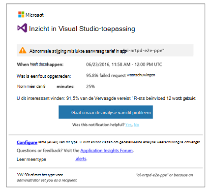
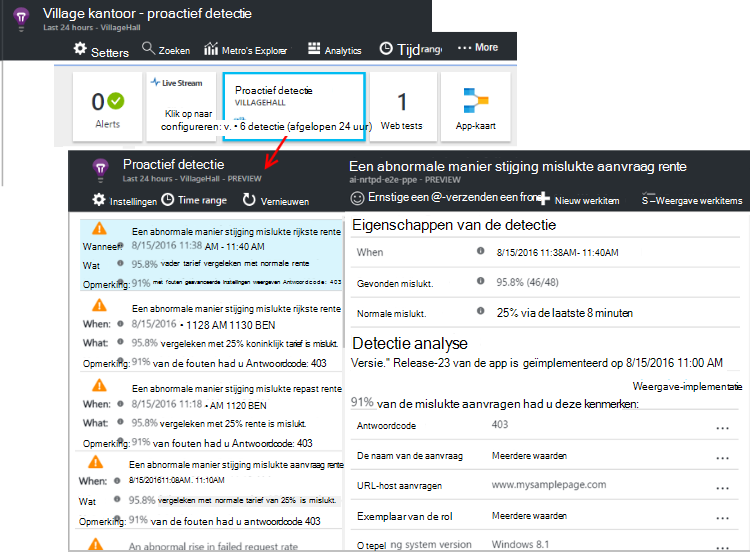

<properties 
    pageTitle="Proactief diagnostische gegevens in de toepassing inzichten | Microsoft Azure" 
    description="Toepassing inzichten voert automatische uitgebreide analyse van uw app-telemetrielogboek en waarschuwt u met potentiële problemen." 
    services="application-insights" 
    documentationCenter="windows"
    authors="rakefetj" 
    manager="douge"/>

<tags 
    ms.service="application-insights" 
    ms.workload="tbd" 
    ms.tgt_pltfrm="ibiza" 
    ms.devlang="na" 
    ms.topic="article" 
    ms.date="08/15/2016" 
    ms.author="awills"/>

#  Proactief diagnostische gegevens in de toepassing inzichten

 Proactief diagnostische gegevens automatisch wordt u gewaarschuwd van potentiële prestatieproblemen in uw webtoepassing. Slim analyse van de telemetrielogboek die uw app wordt verzonden naar [Visual Studio toepassing inzichten](app-insights-overview.md)uitvoeren. Als er een plotselinge stijging mislukt tarieven of abnormale patronen client of server prestaties, krijgt u een waarschuwing. Deze functie moet geen te configureren. Als uw toepassing voldoende telemetrielogboek verzendt werkt.

U kunt proactief detectie waarschuwingen openen vanuit zowel het e-mailberichten ontvangt u, als het blad proactief detectie.

## Controleer uw proactief detectie

U kunt ontdekken detectie op twee manieren:

* **U ontvangt een e-mail** van toepassing inzichten. Hier volgt een typisch voorbeeld:

    

    Klik op de grote knop als u wilt meer details in de portal te openen.

* **Het proactief detectie tegel** op van uw app overzicht blade bevat een aantal recente meldingen. Klik op de tegel om een lijst met recente meldingen.

Selecteer een melding in om de details weer te geven.

## Welke problemen zijn gevonden?

Er zijn drie soorten detectie:

* [Tarief diagnostische hulpprogramma's proactief is mislukt](app-insights-proactive-failure-diagnostics.md). We gebruiken machine learning-om in te stellen van de verwachte frequentie van mislukte aanvragen voor uw app correleren met laden en andere factoren. Als het tarief weer dat is mislukt buiten de verwachte envelop gaat, wordt een melding krijgt.
* [Diagnostische hulpprogramma's proactief prestaties](app-insights-proactive-performance-diagnostics.md). We zoeken naar afwijkende patronen in antwoord tijden en tarieven van fout bij elke dag. We relateren deze problemen met eigenschappen zoals locatie, browser, client OS, server-instantie en tijd van de dag.
* [Azure Cloud Services](https://azure.microsoft.com/blog/proactive-notifications-on-cloud-service-issues-with-azure-diagnostics-and-application-insights/). U kunt meldingen ontvangen als uw app wordt gehost in Azure-Cloudservices en een exemplaar van de rol heeft opstarten fouten, veelgebruikte hergebruik of runtime loopt.

(Het help-koppelingen van elk bericht gaat u naar de relevante artikelen.)

## Volgende stappen

Deze diagnostische hulpprogramma's kunnen u het telemetrielogboek uit uw app controleren:

* [Metrische explorer](app-insights-metrics-explorer.md)
* [Zoeken explorer](app-insights-diagnostic-search.md)
* [Analytics - krachtige querytaal](app-insights-analytics-tour.md)

Proactief diagnostische gegevens zijn volledig automatisch. Maar u wilt wellicht enkele meer waarschuwingen instellen?

* [Handmatig geconfigureerde metrische waarschuwingen](app-insights-alerts.md)
* [Beschikbaarheid van web tests](app-insights-monitor-web-app-availability.md) 

