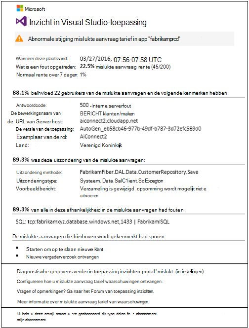
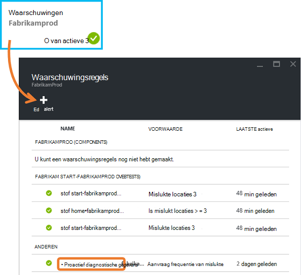
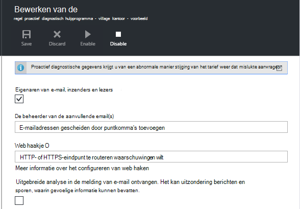
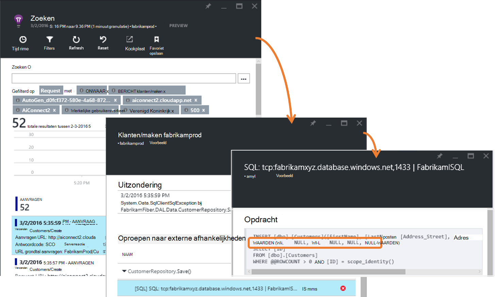
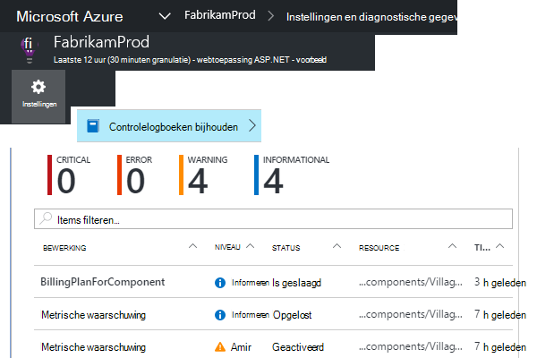
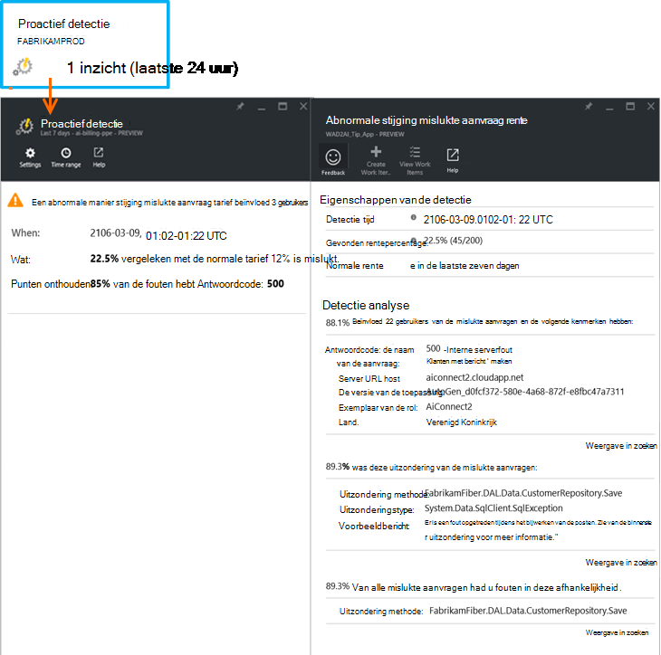

<properties 
    pageTitle="Proactief mislukt tarief diagnostische gegevens in de toepassing inzichten | Microsoft Azure" 
    description="Ongebruikelijke wijzigingen in de frequentie van mislukte aanvragen naar uw web-app wordt u gewaarschuwd en diagnostische analyse bevat. Geen configuratie is vereist." 
    services="application-insights" 
    documentationCenter=""
    authors="yorac" 
    manager="douge"/>

<tags 
    ms.service="application-insights" 
    ms.workload="tbd" 
    ms.tgt_pltfrm="ibiza" 
    ms.devlang="na" 
    ms.topic="article" 
    ms.date="10/12/2016" 
    ms.author="awills"/>
 
# Proactief mislukt tarief diagnostische gegevens

[Visual Studio toepassing inzichten](app-insights-overview.md) krijgt automatisch u nabije realtime als uw web-app een abnormale manier stijging van het percentage mislukte ervaringen. Er wordt gedetecteerd een ongebruikelijke toename van de frequentie van HTTP-aanvragen gemeld is mislukt. Dit zijn meestal mensen met antwoord codes in de 400 - en 500-bereiken. Een analyse van de kenmerken van mislukte aanvragen en gerelateerde telemetrielogboek is om te sorteren en problemen, beschikbaar in de melding. Er zijn ook koppelingen naar de portal-toepassing inzichten voor verdere diagnose. De functie moet geen plaatsen of de configuratie, zoals deze machine learning algoritmen gebruikt om te voorspellen het tarief weer dat normaal is mislukt.

Deze functie werkt Java en ASP.NET web-apps voor gehost in de cloud of op uw eigen servers. Deze werkt ook voor een app die wordt gegenereerd verzoek telemetrielogboek - bijvoorbeeld als u de rol van een werknemer hebt dat u belt [TrackRequest()](app-insights-api-custom-events-metrics.md#track-request). 

Als u na het instellen van [Toepassing inzichten voor uw project](app-insights-overview.md)en verstrekt uw app genereert een bepaalde minimale hoeveelheid telemetrielogboek, proactief mislukt diagnostisch hulpprogramma duurt 24 uur meer informatie over het normale gedrag van de app, voordat deze is ingeschakeld en waarschuwingen kunt verzenden.

Hier ziet u een melding voor een steekproef. 

> [AZURE.NOTE] Standaard krijgt u een kortere indeling e-mail dan in dit voorbeeld. Maar u kunt [overschakelen naar deze gedetailleerde indeling](#configure-alerts).

U ziet dat u leest:

* Het tarief weer dat is mislukt in vergelijking met normale app gedrag.
* Hoeveel gebruikers worden beïnvloed – zodat u hoeveel weet zorgen te maken.
* Een kenmerkende patroon dat is gekoppeld aan de fouten. In dit voorbeeld wordt een bepaald antwoordcode, de naam van de aanvraag (bewerking) en de app-versie. Die ziet direct u waar te bekijken in uw code. Andere mogelijkheden mogelijk een specifiek besturingssysteem browser of -client.
* De uitzondering, log sporen en afhankelijkheid mislukt (databases of andere externe onderdelen) die lijken te zijn gekoppeld aan de wordt gekenmerkt mislukte aanvragen.
* Koppelingen naar relevante zoekopdrachten in het telemetrielogboek in toepassing inzichten rechtstreeks.

## Voordelen van het proactief waarschuwingen

Gewone [metrische waarschuwingen](app-insights-alerts.md) ziet u mogelijk is er een probleem. Maar proactief mislukt diagnostisch hulpprogramma begint het diagnostische werk voor u uitvoeren van een groot aantal de analyse zou u anders moeten zelf. Krijgt u de resultaten netjes worden geleverd, zodat u kunt snel naar de hoofdmap van het probleem.

## Werkwijze

In de buurt van realtime proactief diagnostische monitoren ontvangen het telemetrielogboek uit uw app, en met name het tarief weer dat mislukte aanvragen. Deze metrisch telt het aantal aanvragen waarvoor de `Successful request` eigenschap ONWAAR is. Standaard `Successful request== (resultCode < 400)` (tenzij u aangepaste code hebt geschreven om [te filteren](app-insights-api-filtering-sampling.md#filtering) of uw eigen oproepen [TrackRequest](app-insights-api-custom-events-metrics.md#track-request) genereren). 

Prestaties van uw app heeft een typisch patroon gedrag. Bepaalde aanvragen worden meer vatbaar voor mislukt dan andere; en de snelheid van mislukt mogelijk omhoog gaan als laden toeneemt. Proactief mislukt diagnostische hulpprogramma's gebruikt machine learning-deze afwijkingen zoeken. 

Zoals telemetrielogboek in de toepassing inzichten vanuit uw web-app komt, worden het huidige gedrag in proactief mislukt diagnostisch hulpprogramma vergeleken met de patronen zichtbaar voor de afgelopen paar dagen. Als een abnormale manier stijging mislukt rente wordt waargenomen ten opzichte van eerdere prestaties, wordt een analyse geactiveerd.

Wanneer een analyse wordt geactiveerd, kunt u met de service een analyseren cluster op de mislukte verzoek om te proberen om aan te geven van een patroon met waarden waardoor de fouten wordt gekenmerkt. In het bovenstaande voorbeeld heeft de analyse ontdekt dat de meeste fouten over een bepaald resultaatcode, de naam van de aanvraag, URL van Server host en exemplaar van de rol zijn. De analyse heeft daarentegen ontdekt dat de eigenschap van het besturingssysteem client zijn verdeeld over meerdere waarden en zodat deze niet wordt vermeld.

Wanneer uw service wordt geïmplementeerd met deze telemetrielogboek, vindt u de analyse van een uitzondering en een afhankelijkheidsfout die zijn gekoppeld aan aanvragen in het cluster dat deze geconstateerd, samen met een voorbeeld van een logboeken voor het traceren die is gekoppeld aan deze aanvragen.

De resulterende analyse wordt verzonden naar u als melding, tenzij u deze niet naar hebt geconfigureerd.

Zoals de [meldingen die u handmatig instellen](app-insights-alerts.md), kunt u de status van de waarschuwing controleren en configureert u deze in het blad waarschuwingen van uw toepassing inzichten resource. Maar in tegenstelling tot andere meldingen, hoeft u te geven of te configureren proactief mislukt diagnostische gegevens. Als u wilt, kunt u deze uitschakelt of de doel-e-mailadressen wijzigen.

## Waarschuwingen configureren 

U kunt proactief diagnostische hulpprogramma's uitschakelen, wijzigen van de geadresseerden, een webhook maken of meer gedetailleerde waarschuwingsberichten deelnemen.

Open de pagina waarschuwingen. Proactief diagnostische gegevens is opgenomen samen met alle waarschuwingen die u handmatig hebt ingesteld en u kunt zien of het momenteel in de waarschuwing staat is.

Klik op de melding om deze te configureren.

Melding dat u kunt de proactief diagnostische hulpprogramma's uitschakelen, maar u kunt deze niet verwijderen (of een ander postvakbeleid maken).

#### Gedetailleerde waarschuwingen

Als u selecteert "Ontvangen gedetailleerde analyse" wordt het e-mailbericht meer diagnostische gegevens bevatten. Soms kunt u wel een diagnose stellen bij het probleem net van de gegevens in het e-mailbericht. 

Er is een lichte risico dat de melding voor een gedetailleerde kan gevoelige informatie bevatten, omdat deze uitzondering en doelcellen berichten bevat. Dit zou echter alleen gebeuren als uw code vertrouwelijke informatie in deze berichten kan leiden. 

## Gesorteerd en diagnose van een waarschuwing

Een waarschuwing geeft aan dat een abnormale manier stijging van het tarief weer dat mislukte aanvraag is gevonden. Is het mogelijk dat er een probleem met de app of de omgeving is.

Het percentage van aanvragen en het aantal gebruikers die worden beïnvloed, kunt u bepalen hoe dringende het probleem is. In het bovenstaande voorbeeld percentage van 22.5% wordt vergeleken met een normale tarief van 1%, geeft aan dat een probleem aan de hand is. Aan de andere kant, zijn alleen 11 gebruikers beïnvloed. Als uw app, kunt u zou kunnen beoordelen hoe groot die is.

In veel gevallen is mogelijk het probleem snel van de naam van de aanvraag, uitzondering, afhankelijkheid is mislukt en doelcellen gegevens analyseren. 

Zijn er enkele andere aanwijzingen. Bijvoorbeeld is het tarief weer dat is mislukt afhankelijkheid in dit voorbeeld hetzelfde als het tarief weer dat uitzondering (89,3%). Dit geeft aan dat de uitzondering rechtstreeks vanuit de afhankelijkheid mislukt ontstaat-zodat u een goed beeld van de locatie waar te bekijken in uw code.

U kunt verder onderzoeken door gaat de koppelingen in elke sectie u rechtstreeks naar een [pagina met zoekresultaten](app-insights-diagnostic-search.md) gefilterd op de relevante aanvragen, uitzondering, afhankelijkheid of sporen. Of u kunt de [Azure-portal](https://portal.azure.com)openen, navigeer naar de resource van toepassing inzichten voor de app en opent u het blad fouten.

In dit voorbeeld toepassing inzichten zoeken blade op de SQL-instructie te klikken op de koppeling 'Afhankelijkheid fouten details weergeven' geopend met de onderliggende oorzaak: nulwaarden waar aan verplichte velden gegeven en niet gevalideerd tijdens het opslaan worden kan bewerking.

## Recente meldingen controleren

Als u wilt bekijken waarschuwingen in de portal, open **controlelogboeken-instellingen**.

Klik op een waarschuwing als u wilt zien van de volledige details.

Of klik op **proactief detectie** om rechtstreeks naar de meest recente melding:

## Wat is het verschil...

Proactief mislukt tarief diagnostische hulpprogramma's is een andere soortgelijke aanvulling op maar unieke functies van toepassing inzichten. 

* [Metrisch waarschuwingen](app-insights-alerts.md) door u zijn geconfigureerd en een breed scala van de doelstellingen zoals CPU welke, verzoek tarieven laadtijden van pagina en dergelijke kunt controleren. U kunt ze gebruiken om u te waarschuwen, bijvoorbeeld als u wilt meer resources toevoegen. Daarentegen proactief mislukt diagnostische gegevens betrekking hebben op een klein aantal kritieke doelstellingen (momenteel alleen mislukte aanvraag rente), ontworpen voor u in bijna realtime wijze zodra uw web-app is mislukt aanvragen tarief wordt verhoogd aanzienlijk vergeleken met de normale gedrag WebApp een melding.

    Proactief mislukt tarief diagnostische gegevens worden automatisch de drempelwaarde in antwoord op geldende voorwaarden aangepast.

    Proactief mislukt tarief diagnostische gegevens starten de diagnostische werk voor u. 
* Machine intelligence in [proactief prestaties diagnostische hulpprogramma's](app-insights-proactive-performance-diagnostics.md) ook worden gebruikt om te ongebruikelijke patronen ontdekken in uw doelstellingen en geen configuratie door u is vereist. Maar in tegenstelling tot proactief mislukt tarief diagnostische hulpprogramma's, het doel van proactief prestaties diagnostisch hulpprogramma segmenten van uw gebruik verzamelbuis die mogelijk onjuist worden dienden - bijvoorbeeld door een specifieke pagina's op een bepaalde soort browser zoeken. De analyse dagelijks wordt uitgevoerd en als een van de resultaten wordt gevonden, is het waarschijnlijk veel minder dringende dan een melding. Daarentegen de analyse voor proactief mislukt diagnostische gegevens continu op binnenkomende telemetrielogboek wordt uitgevoerd en u binnen enkele minuten worden gewaarschuwd als de server is mislukt tarieven zijn groter dan verwacht.

## Als u een melding proactief mislukt tarief diagnostische gegevens ontvangt

*Waarom heb ik deze waarschuwing ontvangen?*

*   We een abnormale manier stijging mislukte aanvragen tarief vergeleken met de normale basislijn van de voorgaande periode gedetecteerd. Na een analyse van de fouten en de bijbehorende telemetrielogboek, wordt u ons dat er een probleem dat u moet bekijken is in. 

*De melding betekent dat ik groeiende heb een probleem?*

*   We wil Waarschuw op app-onderbreking of verslechtering van, maar alleen u de semantiek en de invloed op de app of de gebruikers begrijpen kunt.

*Zo is, bekijkt u die mijn gegevens?*

*   Nee. De service is geheel automatisch. U krijgt alleen de meldingen. Uw gegevens is [privé](app-insights-data-retention-privacy.md).

*Moet ik me abonneren op dit bericht?* 

*   Nee. Elke toepassing verzendende verzoek telemetrielogboek heeft deze waarschuwing regel.

*Kan ik afmelden of de meldingen ontvangen in plaats daarvan verzonden naar Mijn collega's?*

*   Ja, In waarschuwingsregels, klikt u op proactief diagnostisch hulpprogramma regel om deze te configureren. U kunt de melding uitschakelen of wijzigen van de geadresseerden voor de melding. 

*Ik weet het e-mailbericht. Waar vind ik de meldingen die in de portal?*

*   In de controlelogboeken bijhouden. Klik op instellingen, controlelogboeken bijhouden, een waarschuwing als u wilt zien van de exemplaar, maar met beperkte gedetailleerde weergave.

*Aantal waarschuwingen met bekende problemen zijn en ik niet wil ontvangen.*

*   Zijn er waarschuwingen onderdrukken op onze achterstallig werk.

## Volgende stappen

Deze diagnostische hulpprogramma's kunnen u het telemetrielogboek uit uw app controleren:

* [Metrische explorer](app-insights-metrics-explorer.md)
* [Zoeken explorer](app-insights-diagnostic-search.md)
* [Analytics - krachtige querytaal](app-insights-analytics-tour.md)

Proactief detectie zijn volledig automatisch. Maar u wilt wellicht enkele meer waarschuwingen instellen?

* [Handmatig geconfigureerde metrische waarschuwingen](app-insights-alerts.md)
* [Beschikbaarheid van web tests](app-insights-monitor-web-app-availability.md) 

