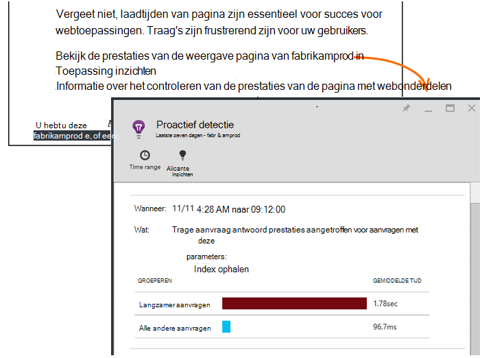

<properties 
    pageTitle="Toepassing inzichten: Diagnostische hulpprogramma's proactief prestaties | Microsoft Azure" 
    description="Toepassing inzichten voert uitgebreide analyse van uw app-telemetrielogboek en waarschuwt u met potentiële problemen." 
    services="application-insights" 
    documentationCenter="windows"
    authors="antonfrMSFT" 
    manager="douge"/>

<tags 
    ms.service="application-insights" 
    ms.workload="tbd" 
    ms.tgt_pltfrm="ibiza" 
    ms.devlang="na" 
    ms.topic="article" 
    ms.date="08/31/2016" 
    ms.author="awills"/>

#  Diagnostische hulpprogramma's proactief prestaties

*Er is een toepassing inzichten in de proefversie.*

[Visual Studio toepassing inzichten](app-insights-overview.md) voert uitgebreide analyse van uw app-telemetrielogboek en kunt u gewaarschuwd over mogelijke problemen met de prestaties. U bent waarschijnlijk lezen omdat u een van onze proactief waarschuwingen per e-mail ontvangen. 

Deze functie is vereist geen-instelling en automatisch actief is terwijl uw app voldoende telemetrielogboek genereert.

## Wat zijn proactief prestaties diagnostische gegevens?

Diagnostische hulpprogramma's proactief prestaties ontdekt ongebruikelijke patronen van prestaties in uw app door het telemetrielogboek die uw app wordt verzonden naar toepassing inzichten analyseren. 

Met name vindt prestatieproblemen die alleen invloed zijn op sommige van de gebruikers of alleen van invloed op gebruikers in sommige gevallen.

Dit kunt u bijvoorbeeld melden als uw app-pagina's laden veel langzamer op een bepaald type van browser dan andere, of als aanvragen langzamer verzonden vanuit een bepaalde server. Deze kan ook problemen met combinaties van eigenschappen, detecteren zoals traag pagina wordt geladen in een geografische gebied op bepaalde momenten van dag.

Afwijkingen zoals deze zijn zeer moeilijk te detecteren NET door te controleren van de gegevens, maar zijn komt vaker dan u denkt. Vaak ze alleen surface wanneer klacht van uw klanten. Door deze periode, te laat is: de betreffende gebruikers zijn al overschakelen naar uw concurrenten!

Momenteel, kijkt u onze algoritmen naar laadtijden van pagina, verzoek antwoord tijden op de server en afhankelijkheid antwoord tijden.  

U hoeft niet te eventuele drempelwaarden of regels configureren. Machine learning en datamining-algoritmen worden gebruikt om te bepalen abnormale patronen. 

We zeer graag uw feedback hebt. Laat ons weten hoe u kunt, hoe wij proactief detectie kunnen verbeteren en welke extra mogelijkheden u dat wij om toe te voegen. U kunt feedback geven via verzenden glimlach/frons in de portal of e-wij AppInsightsML@microsoft.com. 

## Over de proactief waarschuwing

* *Waarom heb ik deze e-mailbericht ontvangen?*
 * Proactief detectie geanalyseerd het telemetrielogboek uw toepassing naar toepassing inzichten worden verzonden en een prestatieprobleem leiden in uw toepassing gedetecteerd. 
* *De melding betekent dat ik groeiende heb een probleem?*
 * Nee. Het is eenvoudig een suggestie over iets dat mogelijk wilt u meer nauw bekijken. 
* *Wat moet ik doen?*
 * [Bekijk de gegevens](#responding-to-an-alert). Aan de doelstellingen Explorer gebruiken om te controleren van de prestaties na verloop van tijd en Zoom op extra statistieken. Met zoeken naar specifieke gebeurtenissen die u helpen uitfilteren Identificeer de onderliggende oorzaak. 
* *Zo is, bekijkt u die mijn gegevens?*
 * Nee. De service is geheel automatisch. U krijgt alleen de meldingen. Uw gegevens is [privé](app-insights-data-retention-privacy.md).

## Het detectieproces

* *Welke soorten afwijkingen van de prestaties zijn gevonden?*
 * Patronen die u wilt vinden om te controleren tijdrovende voor uzelf. Bijvoorbeeld slechte prestaties in een specifieke combinatie van locatie, het tijdstip van de dag en de platform.
* *U alle gegevens die worden verzameld door de toepassing inzichten analyseren?*
 * Niet op dit moment. We analyseren op dit moment verzoek laadtijd antwoord tijd, de afhankelijkheid antwoord tijd en de pagina. Analyse van extra statistieken is binnenkort beschikbaar. 
* *Kan ik mijn eigen afwijking detectie regels maken?*
 * Nog niet. Maar u kunt:
 * [Waarschuwingen instellen](app-insights-alerts.md) waarmee u wordt verteld wanneer een meting een drempelwaarde kruist.)
 * [Telemetrielogboek exporteren](app-insights-export-telemetry.md) naar een [database](app-insights-code-sample-export-sql-stream-analytics.md) of [naar PowerBI](app-insights-export-power-bi.md) of [andere](app-insights-code-sample-export-telemetry-sql-database.md) tools, waar u kunt deze analyseren zelf.
* *Hoe vaak wordt de analyse uitgevoerd?*
 * We de analyse dagelijks uitgevoerd op de telemetrielogboek van de vorige dag.
* * Dus vervangt dit [metrische waarschuwingen](app-insights-alerts.md)?
 * Nee.  We doorvoeren niet om op te sporen elke gedrag dat u abnormale manier overwegen.

## Hoe u deze problemen verheven onderzoeken

Open het diagnostische rapport via het e-mailbericht of in de lijst afwijkingen.

* **Wanneer** ziet u de tijd die het probleem is gedetecteerd.
* **Wat** wordt beschreven
 * Het probleem dat is gevonden.
 * De kenmerken van de set gebeurtenissen die gevonden weergegeven het gedrag van het probleem.
* De tabel worden de prestaties slecht set met het gemiddelde gedrag van alle andere gebeurtenissen vergeleken.

Klik op de koppelingen als u wilt openen metrisch Verkenner en zoek op de relevante rapporten, gefilterd op de tijd en de eigenschappen van het traag uitvoeren instellen.

De tijdsbereik en met behulp van filters verkennen het telemetrielogboek wijzigen.

## Hoe kan ik de prestaties verbeteren?

Traag en mislukte antwoorden zijn een van de grootste frustraties voor gebruikers van de website, zoals u uit uw eigen ervaring weet. Het is dus belangrijk naar de problemen op te lossen.

### Mailsortering

Eerst maakt het uit? Als een pagina wordt altijd langzaam geladen, maar alleen 1% van de gebruikers van uw site ooit hebt om deze te bekijken, misschien hebt u meer belangrijke dingen die u ter overweging. Aan de andere kant, als er slechts 1% van gebruikers opent, maar deze uitzonderingen elke keer genereert, die wellicht een goed idee wordt onderzocht.

De impact-instructie in het e-mailbericht als een algemene gids gebruiken, maar houd er rekening mee dat dit niet het hele verhaal. Verzamel andere bewijs om te bevestigen.

Houd rekening met de parameters van het probleem. Als deze Geografie taalafhankelijk is, stelt u [beschikbaarheid tests](app-insights-monitor-web-app-availability.md) , met inbegrip van die regio: er gewoon mogelijk netwerkproblemen in dit gebied. 

### Een diagnose stellen bij traag pagina wordt geladen 

Waar vind ik het probleem? De server reageren traag is, is de pagina erg lang of de browser hoeft te doen een groot aantal werk weer te geven?

Open het Browsers metrische blad. De [gesegmenteerde weergave van de browser pagina laadtijd](app-insights-javascript.md#explore-your-data) ziet u waar de tijd naartoe gaat. 

* Als **Verzenden verzoek tijd** hoog is, de server reageert langzaam af of de aanvraag is een bericht met een groot aantal gegevens. Bekijk de [prestatiegegevens](app-insights-web-monitor-performance.md#metrics) antwoord tijden onderzoeken. 
* Stel [afhankelijkheid bijhouden](app-insights-dependencies.md) om te zien of de logge vanwege externe services of uw database is.
* Als **Antwoord ontvangen** belangrijkste is, zijn de pagina en de afhankelijke onderdelen - JavaScript CSS, afbeeldingen, enzovoort (maar niet asynchroon geladen gegevens) lang. Instellen van een [beschikbaarheid testen](app-insights-monitor-web-app-availability.md)en zorg ervoor dat u de optie voor het laden van afhankelijke onderdelen instellen. Wanneer u sommige resultaten krijgt, opent u de details van een resultaat en uitvouwen om te zien of de laadtijden van verschillende bestanden.
* Hoge **Client verwerkingstijd** stelt scripts langzaam worden uitgevoerd. Als de reden niet duidelijk, kunt u sommige tijdsinstellingen-code toe te voegen en de tijden in trackMetric oproepen verzenden.

### Langzame pagina's verbeteren

Er is een web vol advies over het verbeteren van uw server antwoorden en laadtijden van pagina, zodat we won't wil alle hier wilt herhalen. Hier volgen enkele tips die u waarschijnlijk al kent, zodat u denkt aan:

* Traag laden vanwege grote bestanden: de scripts en andere onderdelen asynchroon laden. Gebruik script bundeling. Splits de hoofdpagina in widgets die hun gegevens apart laden. Alleen oude HTML voor lange tabellen niet verzenden: gebruik van een script aanvragen van de gegevens als JSON of andere compacte indeling en klik vervolgens doorvoeren in de tabel op hun plaats staan. Er zijn een uitstekende kaders om u te helpen met dit alles. (Zij ook inhouden groot scripts, natuurlijk.)
* Server afhankelijkheden vertraagd: Houd rekening met de geografische locaties van uw onderdelen. Als u Azure gebruikt, controleert u er bijvoorbeeld of dat de webserver en de database zich bevinden in dezelfde regio. Krijg query's terug voor meer informatie dan zij nodig hebben? Zou caching of help batchen?
* Capaciteit problemen: Bekijk de doelstellingen van de server antwoord vaak en aanvraag worden geteld. Als antwoord tijden niet goed met pieken in verzoek-tellingen komen pieksnelheden, is deze waarschijnlijk dat uw servers worden uitgerekt. 

## E-mailberichten

* *Moet ik me abonneren op deze service meldingen ontvangen?*
 * Nee. Onze bots regelmatig de gegevens van alle gebruikers van de toepassing inzichten enquêtes en gestuurd als er problemen worden gedetecteerd.
* *Kan ik afmelden of de meldingen ontvangen in plaats daarvan verzonden naar Mijn collega's?*
 * Klik op de koppeling voor afmelden in de melding of e-mailbericht. 
 
    Momenteel ze worden verzonden naar mensen die [schrijftoegang voor de resource van toepassing inzichten](app-insights-resources-roles-access-control.md)hebben.

    U kunt ook de lijst met geadresseerden instellingen in het blad proactief detectie bewerken.
* *Ik wil niet worden overspoeld met deze berichten.*
 * Ze zijn beperkt tot één per dag met een probleem met de meest relevante we nog niet hebt gerapporteerd over. U won't wordt herhaald van elk bericht krijgen.
* *Als ik niets doet, krijg ik een herinnering?*
 * Nee, krijgt u een bericht over elke probleem slechts één keer. 
* *Ik weet het e-mailbericht. Waar vind ik de meldingen die in de portal?*
 * Klik in het overzicht van de toepassing inzichten van uw app op de tegel **Proactief detectie** . Er kunt u wel vindt u alle meldingen naar 7 dagen achtergrond.

## Volgende stappen

Deze diagnostische hulpprogramma's kunnen u het telemetrielogboek uit uw app controleren:

* [Metrische explorer](app-insights-metrics-explorer.md)
* [Zoeken explorer](app-insights-diagnostic-search.md)
* [Analytics - krachtige querytaal](app-insights-analytics-tour.md)

Proactief detectie zijn volledig automatisch. Maar u wilt wellicht enkele meer waarschuwingen instellen?

* [Handmatig geconfigureerde metrische waarschuwingen](app-insights-alerts.md)
* [Beschikbaarheid van web tests](app-insights-monitor-web-app-availability.md) 

