<properties
    pageTitle="Releaseopmerkingen voor Visual Studio-extensie voor ontwikkelaars Analytics"
    description="De meest recente updates voor Visual Studio tools voor ontwikkelaars Analytics."
    services="application-insights"
    documentationCenter=""
    authors="acearun"
    manager="douge"/>
<tags
    ms.service="application-insights"
    ms.workload="tbd"
    ms.tgt_pltfrm="ibiza"
    ms.devlang="na"
    ms.topic="article"
    ms.date="06/09/2016"
    ms.author="acearun"/>

# Releaseopmerkingen voor Analytics speciale tools voor ontwikkelaars
Wat is er nieuw: toepassing inzichten en HockeyApp analytics in Visual Studio.
## Versie 7.0
### Visual Studio-toepassing inzichten Trends
Visual Studio-toepassing inzichten is een nieuw hulpmiddel in Visual Studio die u gebruiken kunt om te analyseren de werking van uw app na verloop van tijd. Kies **Verkennen Telemetrielogboek Trends**om te beginnen op de werkbalkknop **Toepassing inzichten** of in het venster toepassing inzichten zoeken. Of, in het menu **Beeld** op **Andere Windows**en klik vervolgens op **Toepassing inzichten Trends**. Kies een van de vijf algemene query's aan de slag. U kunt verschillende gegevenssets op basis van telemetrielogboek typen, tijdsbereik en andere eigenschappen kunt analyseren. Als u wilt zoeken afwijkingen in uw gegevens, kiest u een van de opties voor de afwijking in de vervolgkeuzelijst **Weergavetype** . De filteropties onderaan in het venster kunnen eenvoudig specificeren specifieke deelverzamelingen uw telemetrielogboek.

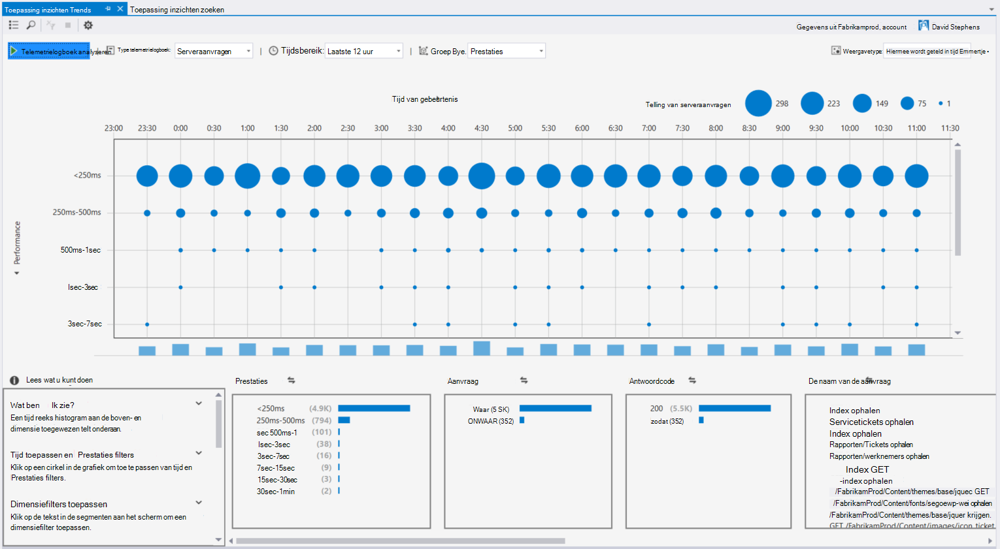

### Uitzonderingen in CodeLens
Uitzondering telemetrielogboek wordt nu weergegeven in CodeLens. Als u uw project hebt verbonden met de service-toepassing inzichten, ziet u het aantal uitzonderingen die zijn opgetreden in elke methode in productie in de afgelopen 24 uur. Vanuit CodeLens, kunt u gaan om te zoeken of Trends de uitzonderingen uitgebreider onderzoeken.

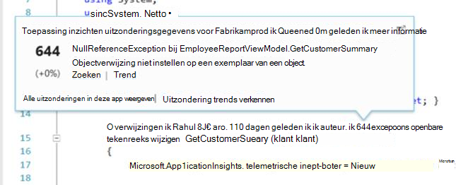

### ASP.NET-Core-ondersteuning
Toepassing inzichten ondersteunt nu ASP.NET Core RC2 projecten in Visual Studio. U kunt toepassing inzichten toevoegen aan nieuwe ASP.NET Core RC2 projecten in het dialoogvenster **Nieuw Project** , zoals in de volgende schermafbeelding. Of u kunt dit toevoegen aan een bestaand project, met de rechtermuisknop op het project in Solution Explorer en klik vervolgens op **Toepassing inzichten-Telemetrielogboek toevoegen**.

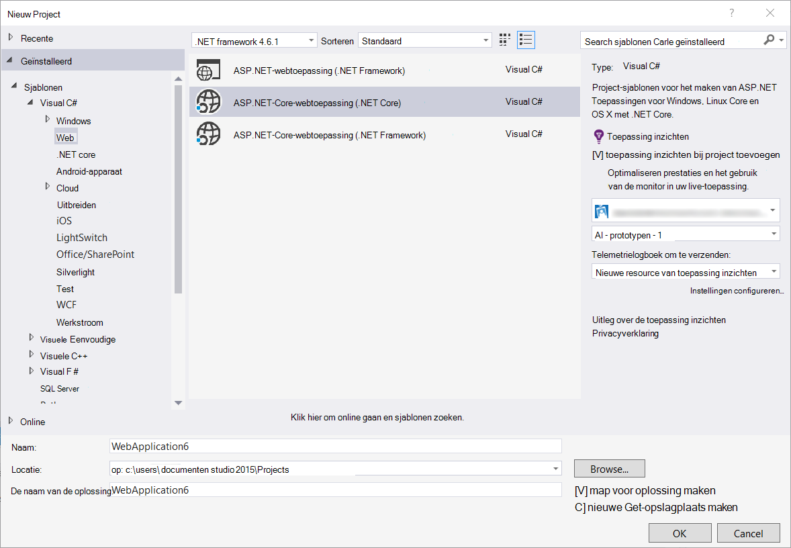

ASP.NET 5 RC1 en ASP.NET Core RC2 projecten hebt ook nieuwe-ondersteuning in het venster diagnostische hulpprogramma's. U ziet toepassing inzichten gebeurtenissen zoals vergaderverzoeken en uitzonderingen uit uw ASP.NET-app terwijl u fouten opsporen in lokaal op uw PC. Elke gebeurtenis, klikt u op **Zoeken** naar inzoomen voor meer informatie.

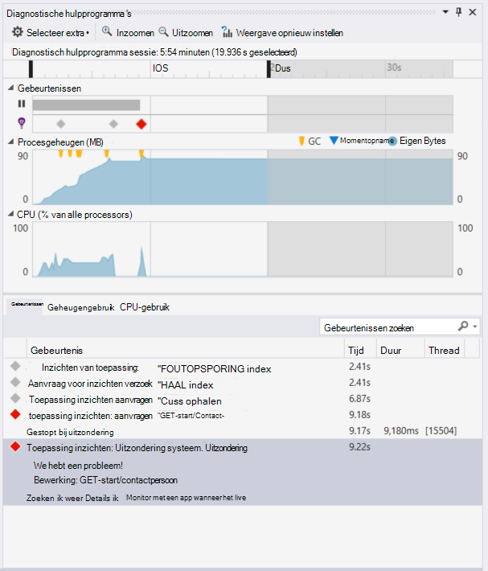

### HockeyApp voor universele Windows-apps
Naast de bèta-verdeling en gebruiker feedback biedt HockeyApp symbolicated vastlopen voor rapportage voor uw universele Windows-apps. We de gegevens hebt deze nog eenvoudiger om toe te voegen van de HockeyApp SDK: met de rechtermuisknop op uw project universele Windows, en klik vervolgens op **Hockey-App - vastlopen Analytics inschakelen**. Dit de SDK is geïnstalleerd, ingesteld vastlopen siteverzameling en een resource HockeyApp in de cloud, zonder uw app uploaden naar de service HockeyApp bepalingen.

Andere nieuwe functies:

* We hebt de zoekervaring van toepassing inzichten sneller en meer intuïtieve aangebracht. Nu worden tijd bereiken volgens meerdere detail filters automatisch toegepast u ze selecteren.
* Ook in zoekresultaten voor een inzichten is er nu een optie om te gaan naar de code rechtstreeks vanuit de aanvraag-telemetrielogboek.
* We hebt verbeteringen in de aanmeldervaring HockeyApp aangebracht.
* In de diagnostische hulpprogramma's, wordt telemetrielogboek van productinformatie over uitzonderingen weergegeven.

## Versie 5,2
We zijn tevreden zijn de volgende HockeyApp scenario's beschreven in Visual Studio. De eerste integratie is in de bèta-verdeling van universele Windows-apps en formulieren voor Windows-apps van Visual Studio.

Met de bètaverdeling gebruikt uploaden u eerdere versies van uw apps naar HockeyApp voor distributie naar een geselecteerde subset van klanten of testers. Bètaverdeling gebruikt, in combinatie met HockeyApp vastlopen verzamelen en gebruiker feedback functies, kunt u voorzien waardevolle informatie over uw app voordat u een algemene release. U kunt deze gegevens om problemen te verhelpen gebruiken met uw app zodat u kunt voorkomen of toekomstige problemen, zoals lage app classificaties, negatieve feedback, enzovoort minimaliseren.

Lees hoe eenvoudig het is om te uploaden genereert voor bèta-verdeling van Visual Studio.
### Universele Windows-apps
Het contextmenu voor een universele Windows-app projectknooppunt bevat nu een optie voor het uploaden van uw opbouwen naar HockeyApp.

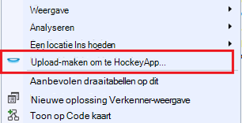

Kies het item en de HockeyApp upload dialoogvenster wordt geopend. Moet u een account HockeyApp voor het uploaden van uw opbouwen. Als u een nieuwe gebruiker bent, geen probleem. Een account maakt, wordt een eenvoudig proces.

Wanneer u verbonden bent, ziet u het formulier upload in het dialoogvenster.

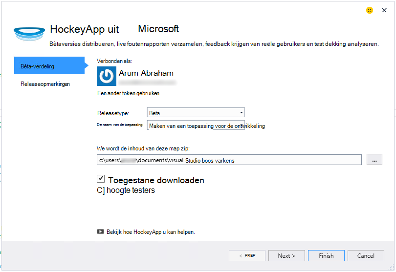

Selecteer de inhoud te uploaden (een .appxbundle of .appx-bestand) en kiest u vervolgens release opties in de wizard. U kunt desgewenst releaseopmerkingen toevoegen op de volgende pagina. Kies **Voltooien** om terug te beginnen met het uploaden.

Wanneer de upload voltooid is, wordt er een melding HockeyApp met bevestiging en een koppeling naar de app in de portal HockeyApp weergegeven.

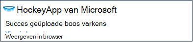

Dat is alles. U hebt zojuist een opbouwen voor bèta-verdeling met een paar muisklikken geüpload.

U kunt uw toepassing op verschillende manieren in de portal HockeyApp beheren. Dit geldt ook voor gebruikers weergeven foutenrapporten nodigen en feedback, wijzigen details, enzovoort.

Zie de [HockeyApp Knowledge Base](http://support.hockeyapp.net/kb/app-management-2) voor meer informatie over de app management.

### Windows Forms apps
Het contextmenu voor een project-knooppunt van Windows-formulier bevat nu een optie voor het uploaden van uw opbouwen naar HockeyApp.

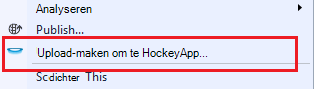

Hiermee wordt het dialoogvenster voor het uploaden van HockeyApp, die vergelijkbaar met een in een universele Windows-app is geopend.

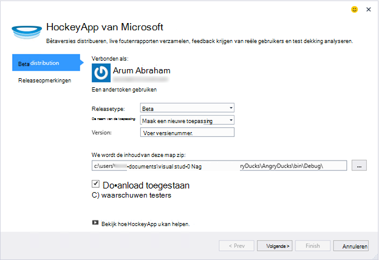

Opmerking een nieuw veld in de wizard voor het opgeven van de versie van de app. Universele Windows-apps voor wordt de informatie opgehaald uit het manifest. Apps voor Windows-formulieren, helaas geen equivalent voor deze functie. U moet deze handmatig opgeven.

De rest van de stroom is vergelijkbaar met universele Windows apps: Kies opbouwen en los opties, release toevoegen notities, uploaden en beheren in de portal HockeyApp.

Het is zo eenvoudig. Zelf proberen en laat het ons weten wat u ervan vindt.
## Versie 4.3
### Zoeken telemetrielogboek uit lokale foutopsporing sessies
In deze versie, kunt u nu zoeken voor de toepassing inzichten telemetrielogboek gegenereerd in de Visual Studio-sessie voor foutopsporing. Voordat u kunt u zoeken alleen als u uw app bij toepassing inzichten geregistreerd. Nu moet uw app alleen hebben de toepassing inzichten SDK geïnstalleerd als u wilt zoeken voor lokale telemetrielogboek.

Als u een ASP.NET-toepassing met de toepassing inzichten SDK, voert u de volgende stappen uit als u wilt zoeken gebruiken.

1. Fouten opsporen in uw toepassing.
2. Open de toepassing inzichten zoeken in een van de volgende manieren:
    - Klik in het menu **Beeld** op **Andere Windows**en klik vervolgens op **Toepassing inzichten zoeken**.
    - Klik op de werkbalkknop **Toepassing inzichten** .
    - Vouw **ApplicationInsights.config**in Solution Explorer en klik vervolgens op **Zoeken foutopsporing sessie telemetrielogboek**.
3. Als u dit nog niet hebt geregistreerd met toepassing inzichten, wordt het venster zoeken wordt geopend in de modus voor foutopsporing sessie telemetrielogboek.
4. Klik op het pictogram **Zoeken** als u wilt zien van uw lokale telemetrielogboek.

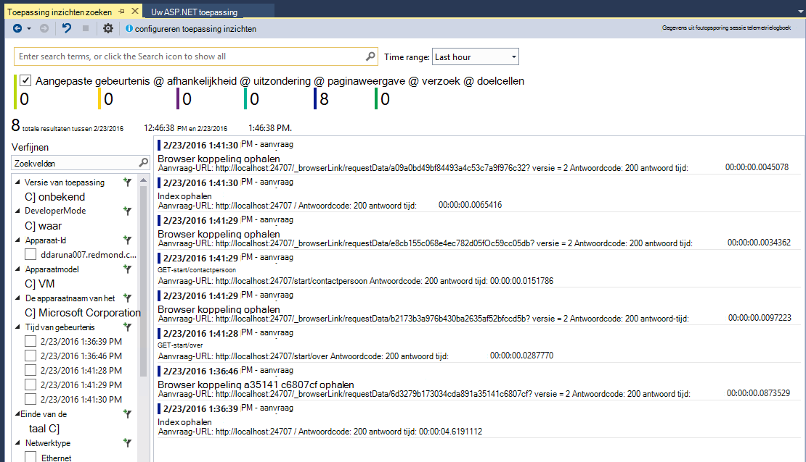

## Versie 4.2
In deze release, we functies om te zoeken naar gegevens gemakkelijker in de context van gebeurtenissen, met de mogelijkheid om te gaan naar de code uit meer Gegevensgebeurtenissen en een probleemloze ervaring voor uw gegevens logboekregistratie te verzenden naar toepassing inzichten toegevoegd. Dit toestel wordt maandelijks bijgewerkt. Als u feedback verzamelen of verzoeken om hebt, stuurt u erop om deze aidevtools@microsoft.com.
### Geen terwijl u klikt op logboekregistratie-ervaring
Als u al NLog, log4net of System.Diagnostics.Tracing gebruikt, hebt u geen zorgen over het verplaatsen van alle traces inzicht krijgen in toepassing te maken. In deze release, hebben we de toepassing inzichten logboekregistratie adapters geïntegreerd met de normale configuratie-ervaring.
Als u al een van deze kaders logboekregistratie is geconfigureerd, heeft de volgende sectie wordt beschreven hoe u deze ophalen.
**Als u de toepassing inzichten al hebt toegevoegd:**
1. Met de rechtermuisknop op het projectknooppunt en klik vervolgens op **Toepassing inzichten**en klik vervolgens op **Toepassing inzichten configureren**. Zorg ervoor dat u de optie ziet voor het toevoegen van de juiste adapter in het Configuratievenster.
2. U kunt ook als u de oplossing samenstelt, houd rekening met het pop-upvenster dat wordt weergegeven op de bovenkant van het scherm en klik op **configureren**.

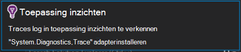

Wanneer u de logboekregistratie-adapter geïnstalleerd hebt, Voer uw toepassing en zorg ervoor dat u ziet dat de gegevens in het tabblad Diagnostische hulpprogramma's als volgt:

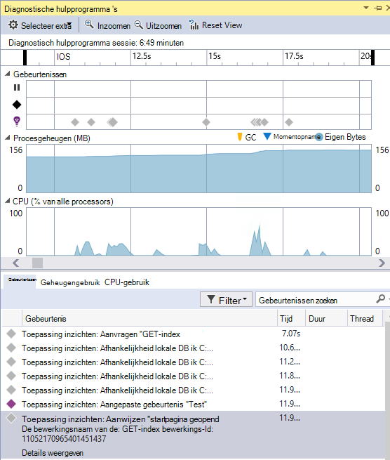

### Ga naar of zoek de code waar de gebeurteniseigenschap telemetrielogboek wordt gegenereerd
Met de nieuwe versie gebruiker kan klikken op een waarde in het logboek details en Hiermee wordt gezocht naar overeenkomende tekst in de huidige geopende oplossing. Resultaten worden weergegeven in Visual Studio 'Resultaten vinden' lijst zoals hieronder wordt weergegeven:

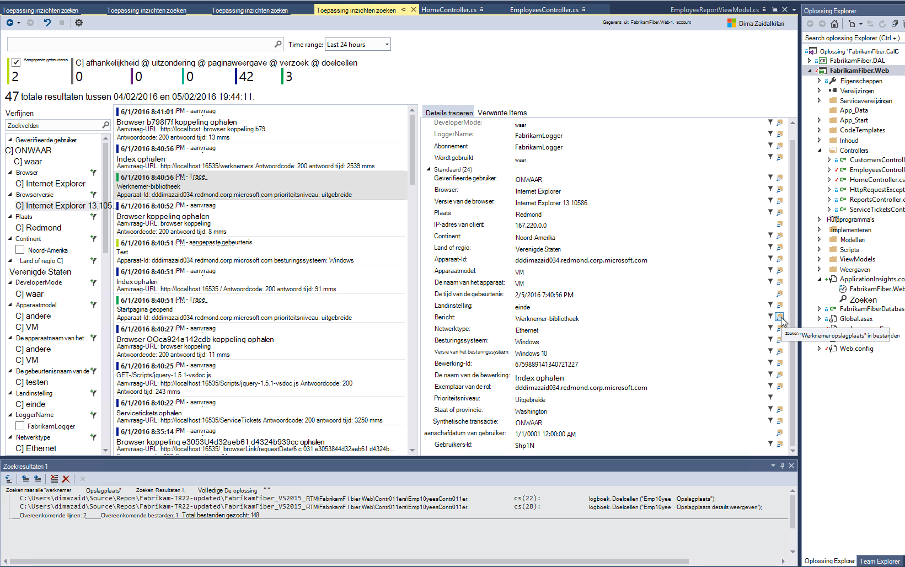

### Nieuwe zoekvenster voor wanneer u niet bent aangemeld
We hebt het uiterlijk van het venster toepassing inzichten zoeken kunt u uw gegevens te zoeken, terwijl uw app in productie is verbeterd.

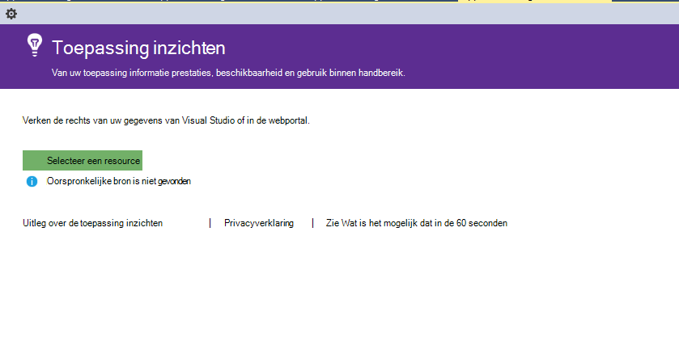

### Zie alle telemetrielogboek gebeurtenissen die zijn gekoppeld aan de gebeurtenis
Er is een nieuw tabblad met vooraf gedefinieerde query's voor alle gegevens die zijn gerelateerd aan de gebeurtenis telemetrielogboek dat de gebruiker wordt weergeven, klikt u naast het tabblad voor de details van een gebeurtenis toegevoegd. Een aanvraag bevat bijvoorbeeld een veld met de naam van de **Bewerkings-ID**. Elke gebeurtenis die is gekoppeld aan dit verzoek heeft hetzelfde resultaat voor de **Bewerkings-ID**. Als een uitzondering optreedt terwijl de bewerking de aanvraag wordt verwerkt, krijgt de uitzondering dezelfde bewerking ID als het verzoek om gemakkelijker om te zoeken. Als u een verzoek om bekijkt, klikt u op **alle telemetrielogboek voor deze bewerking** om een nieuw tabblad waarin u kunt de nieuwe lijst met zoekresultaten te openen.

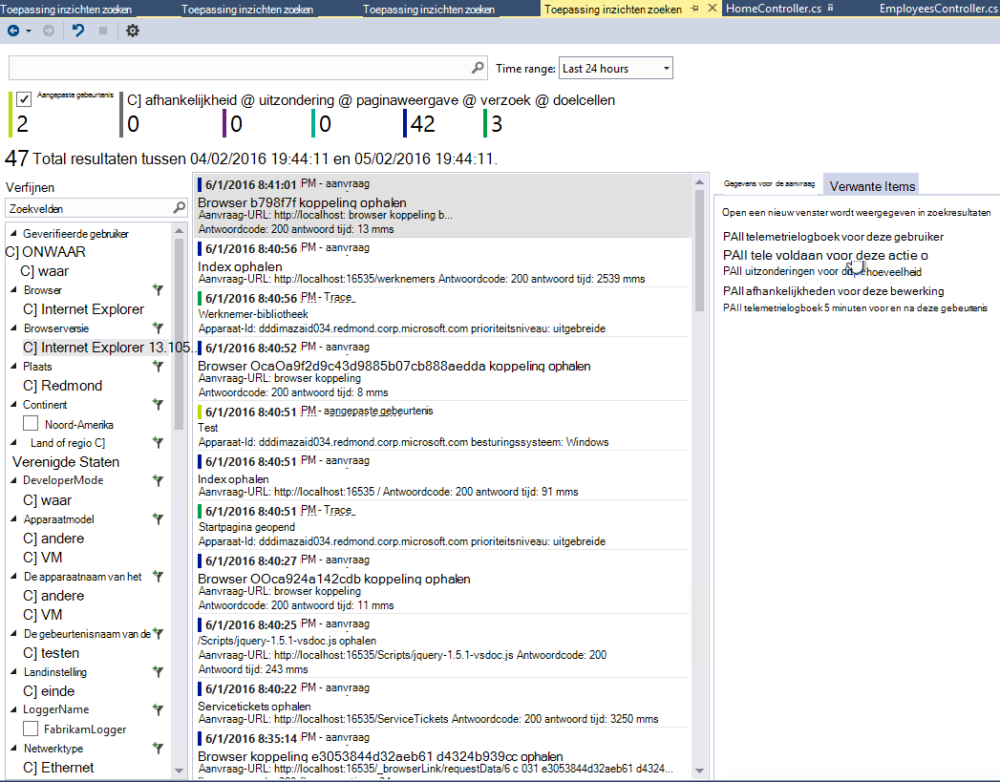

### Doorsturen en Back-geschiedenis in zoeken
U kunt nu heen en weer tussen zoekresultaten.

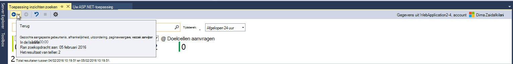

## Versie 4.1
Deze release wordt geleverd met een aantal nieuwe functies en updates. Moet u beschikken over Update 1 geïnstalleerd om deze versie te installeren.

### Van een uitzondering naar methode in broncode gaan
Nu, als u uitzonderingen vanuit uw app productie in het zoekvenster van toepassing inzichten weergeeft, u kunt gaan met de methode in code waar de uitzondering zich voordoet. Alleen moet u beschikken over de juiste project geladen en toepassing inzichten zorgt voor de rest! (Zie de releaseopmerkingen voor versie 4.0 in de volgende secties voor meer informatie over het zoekvenster van de toepassing inzichten,.)

Hoe werkt dit? U kunt toepassingen inzichten zoeken kunt gebruiken, zelfs wanneer een oplossing niet geopend is. Het gebied van de trace stapel een informatiebericht wordt weergegeven en veel van de items in de trace stapel zijn niet beschikbaar.

Als bestandsinformatie beschikbaar is, wordt sommige items mogelijk koppelingen, maar wordt het item van de informatie oplossing nog steeds niet zichtbaar.

Als u op de hyperlink, gaat u naar de locatie van de geselecteerde methode gaan in uw code. Is er mogelijk een verschil in het versienummer weergegeven, maar de functie, om te gaan naar de juiste versie van de code, komen in toekomstige versies.

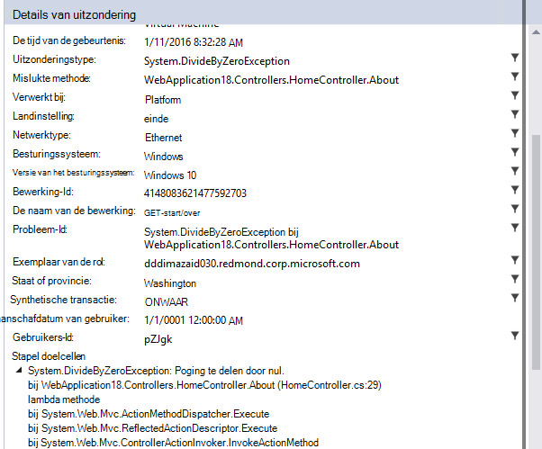

### Nieuwe vermelding verwijst naar de zoeken-ervaring in Solution Explorer
Nu kunt u zoeken via oplossing Explorer openen.

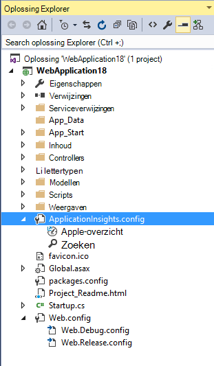

### Een melding weergegeven wanneer publiceert is voltooid
Een pop-dialoogvenster wordt weergegeven wanneer het project is gepubliceerd, online, zodat u kunt de gegevens van uw toepassing inzichten in productie weergeven.

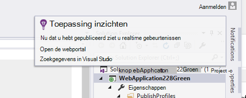

## Versie 4.0

### Gegevens van de toepassing inzichten van binnen Visual Studio zoeken
Als u de zoekfunctie in de toepassing inzichten portal nu in Visual Studio kunt u filteren en zoeken op het gebeurtenistypen, eigenschapswaarden en tekst en vervolgens controleren afzonderlijke gebeurtenissen.

### Zie gegevens die afkomstig zijn uit uw lokale computer in diagnostische hulpprogramma 's

U kunt uw telemetrielogboek, naast andere foutopsporing gegevens weergeven op de pagina Visual Studio diagnostische hulpprogramma's. Alleen ASP.NET 4.5 wordt ondersteund.

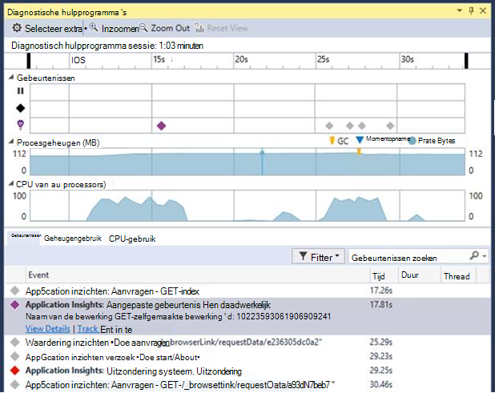

### De SDK toevoegen aan uw project zonder het aanmelden bij Azure

U hebt niet meer aanmelden bij Azure-toepassing inzichten-pakketten toevoegen aan uw project, hetzij via het dialoogvenster **Nieuw Project** of in het contextmenu van het project. Als u aanmeldt wel, wordt de SDK geïnstalleerd en geconfigureerd voor het telemetrielogboek bij de portal als voordat u verzenden. Als u zich niet aanmelden, de SDK, worden toegevoegd aan uw project en telemetrielogboek voor de diagnostische hub wordt gegenereerd. U kunt deze later configureren als u wilt.

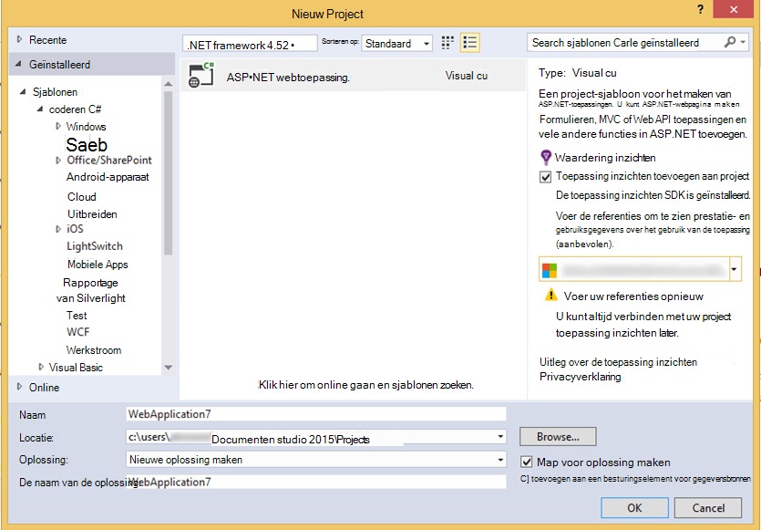

### Ondersteuning voor apparaten

Bij *Connect ();* 2015 verlengt, wordt [aangekondigd](https://azure.microsoft.com/blog/deep-diagnostics-for-web-apps-with-application-insights/) dat onze mobiele ontwikkelaars-ervaring voor apparaten HockeyApp is. HockeyApp helpt u bèta-versies naar uw testers distribueren, verzamelen en alle loopt uit uw app analyseren en verzamelen van feedback rechtstreeks vanuit uw klanten.
HockeyApp ondersteunt uw app op ongeacht platform die u maken, wilt of die iOS-, Android- of Windows- of een oplossing platforms zoals Xamarin, Cordova of eenheid zijn.

In toekomstige versies van de extensie toepassing inzichten, wordt stellen we een beter geïntegreerde ervaring tussen HockeyApp en Visual Studio. Nu kunt u beginnen met HockeyApp door eenvoudig de verwijzing NuGet te voegen. Zie de [documentatie](http://support.hockeyapp.net/kb/client-integration-windows-and-windows-phone) voor meer informatie.
