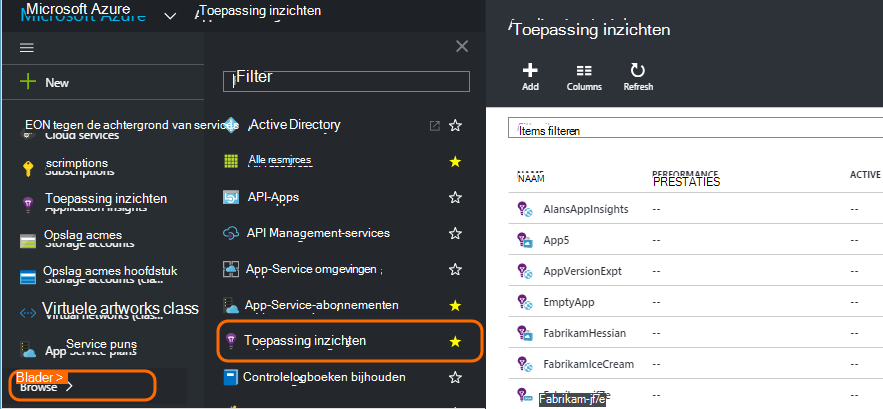
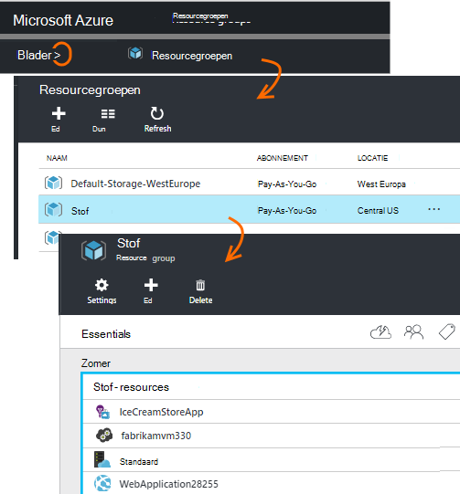
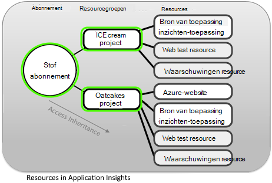
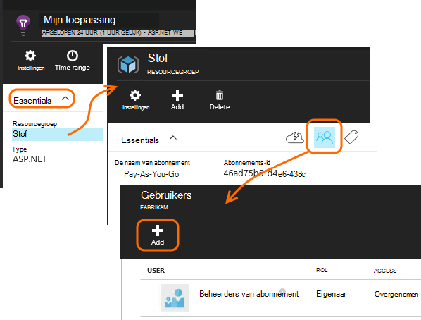
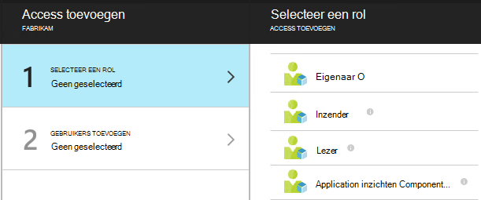
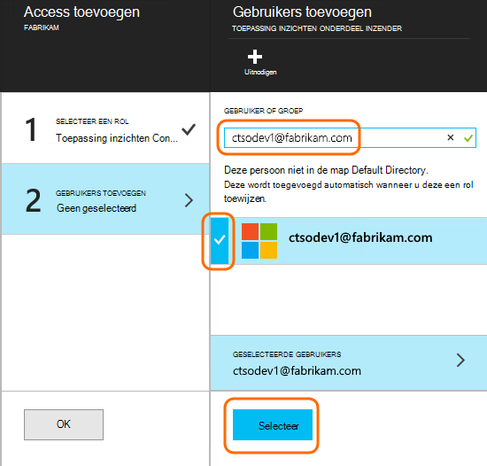

<properties
    pageTitle="Resources, rollen en toegangsbeheer in de toepassing inzichten"
    description="Eigenaren, medewerkers en lezers van inzichten van uw organisatie."
    services="application-insights"
    documentationCenter=""
    authors="alancameronwills"
    manager="douge"/>

<tags
    ms.service="application-insights"
    ms.workload="tbd"
    ms.tgt_pltfrm="ibiza"
    ms.devlang="na"
    ms.topic="article"
    ms.date="05/07/2016"
    ms.author="awills"/>

# Resources, rollen en toegangsbeheer in de toepassing inzichten

U kunt bepalen wie heeft lezen en bijwerken van toegang tot uw gegevens in Visual Studio- [Toepassing inzichten][start], met behulp van [Rolgebaseerd toegangsbeheer in Microsoft Azure](../active-directory/role-based-access-control-configure.md).

> [AZURE.IMPORTANT] Access toewijzen aan gebruikers in de **resourcegroep of abonnement** waartoe uw toepassing resource behoort - niet in de resource zelf. De **toepassing inzichten onderdeel Inzender** rol toewijzen. Dit zorgt ervoor dat uniform toegangsbeheer voor web tests en waarschuwingen samen met de bron van de toepassing. [Meer informatie](#access).

## Resources, groepen en abonnementen

Eerst enkele definities:

* **Resource** - een exemplaar van een Microsoft Azure-service. Uw bron-toepassing inzichten verzameld, worden geanalyseerd en de telemetriegegevens verzonden vanuit uw toepassing weergegeven.  Andere soorten Azure resources zijn WebApps, databases en VMs.

    Als u wilt zien van alle uw resources, gaat u naar de [Portal van Azure][portal], meld u aan en klik op Bladeren.

    

* [**Resourcegroep** ] [ group] -één groep elke resource behoort. Een groep is een handige manier voor het beheren van verwante resources, met name voor toegangsbeheer. Bijvoorbeeld, in één resourcegroep veelvoudvisualisaties kunt u plaatsen een Web-App, een resource van toepassing inzichten om te controleren van de app en een resource opslag als geëxporteerde gegevens wilt behouden.

    

* [**Abonnement**](https://manage.windowsazure.com) - toepassing inzichten of andere Azure resources, gebruik u zich aanmeldt bij een Azure-abonnement. Elke resourcegroep behoort Azure-abonnementen, waar u kiest uw prijs-pakket en, als dit een organisatie-abonnement is, kiest u de leden en hun machtigingen.
* [**Microsoft-account** ] [ account] -de gebruikersnaam en het wachtwoord waarmee u zich aanmelden bij Microsoft Azure-abonnementen, XBox Live Outlook.com en andere Microsoft-services.

## Toegangsbeheer in de resourcegroep

Het is belangrijk om te begrijpen dat naast de bron die u voor uw toepassing hebt gemaakt, zijn er ook afzonderlijk verborgen bronnen voor waarschuwingen en web tests. Ze zijn gekoppeld aan dezelfde [resourcegroep](#resource-group) als uw toepassing. Mogelijk hebt u andere Azure services er, zoals websites of opslag ook plaatsen.

Toegang tot deze resources die daarom het raadzaam om te beheren:

* Toegangsbeheer op het niveau van de **resourcegroep of abonnement** .
* De rol **Inzender Application inzichten Component** toewijzen aan gebruikers. Hierdoor kunnen ze web tests, waarschuwingen en toepassing inzichten resources, zonder toegang hiertoe te eventuele andere services in de groep bewerken.

## Voor toegang tot een andere gebruiker

U moet eigenaar machtigen voor het abonnement of de resourcegroep.

De gebruiker moet een [Microsoft-Account]hebben[account], of toegang tot hun [Organisatie Microsoft-Account](..\active-directory\sign-up-organization.md). U kunt toegang geven aan personen, en ook in gebruikersgroepen die zijn gedefinieerd in Azure Active Directory.

#### Navigeer naar de resourcegroep

De gebruiker er toevoegen.

Of kunt u de hoofdmap en de gebruiker toevoegen aan het abonnement.

#### Selecteer een rol

Rol | In de resourcegroep
---|---
Eigenaar | Alles, waaronder de toegang van gebruikers kunt wijzigen
Inzender | Alles, waaronder alle resources kunt bewerken
Toepassing inzichten onderdeel Inzender | Bewerkbare toepassing inzichten resources, web tests en waarschuwingen
Lezer | Kunnen bekijken maar geen wijzigingen aanbrengen

'Bewerken' bevat maken, verwijderen en bijwerken:

* Resources
* Web tests
* Waarschuwingen
* Continue exporteren

#### Selecteer de gebruiker

Als de gebruiker die u wilt dat niet in de adreslijst, kunt u iedereen met een Microsoft-account uitnodigen.
(Als ze services zoals Outlook.com, OneDrive, Windows Phone of XBox Live gebruikt, beschikken over een Microsoft-account.)

## Gebruikers en rollen

* [Rolgebaseerd toegangsbeheer in Azure wordt aangegeven](../active-directory/role-based-access-control-configure.md)

<!--Link references-->

[account]: https://account.microsoft.com
[group]: ../resource-group-overview.md
[portal]: https://portal.azure.com/
[start]: app-insights-overview.md
