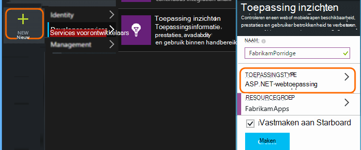
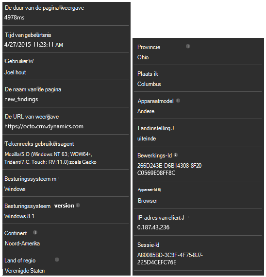

<properties 
    pageTitle="Demonstratie: Microsoft Dynamics CRM met toepassing inzichten controleren" 
    description="Telemetrielogboek ophalen uit Microsoft Dynamics CRM Online toepassing inzichten gebruik. Stapsgewijze instructies voor installatie aan gegevens, visualisatie en exporteren." 
    services="application-insights" 
    documentationCenter=""
    authors="mazharmicrosoft" 
    manager="douge"/>

<tags 
    ms.service="application-insights" 
    ms.workload="tbd" 
    ms.tgt_pltfrm="ibiza" 
    ms.devlang="na" 
    ms.topic="article" 
    ms.date="11/17/2015" 
    ms.author="awills"/>
 
# Demonstratie: Telemetrielogboek inschakelen voor Microsoft Dynamics CRM Online toepassing inzichten gebruik

Dit artikel leest u hoe u het telemetrielogboek gegevens ophalen uit [Microsoft Dynamics CRM Online](https://www.dynamics.com/) [Visual Studio toepassing inzichten](https://azure.microsoft.com/services/application-insights/)gebruik. We wordt begeleiden bij het voltooien van de toepassing inzichten script toevoegen aan uw toepassing, gegevens en gegevens vastleggen.

>[AZURE.NOTE] [Bladeren in de steekproef-oplossing](https://dynamicsandappinsights.codeplex.com/).

## Toepassing inzichten aan nieuwe of bestaande CRM Online exemplaar toevoegen 

Als u wilt controleren van uw toepassing, kunt u een toepassing inzichten SDK toevoegen aan uw toepassing. De SDK verzendt telemetrielogboek naar de [toepassing inzichten-portal](https://portal.azure.com), kunt u onze krachtige analyses en diagnostische hulpprogramma's, of de gegevens exporteren naar opslag.

### Maken van een resource van toepassing inzichten in Azure wordt aangegeven

1. [Een account in Microsoft Azure](http://azure.com/pricing)aanvragen. 
2. Meld u aan bij de [portal van Azure](https://portal.azure.com) en een nieuwe resource van toepassing inzichten toevoegen. Dit is waar uw gegevens worden verwerkt en wordt weergegeven.

    

    Kies ASP.NET als het toepassingstype.

3. Open het tabblad Quick Start en open het script code.

    

**De codetabel geopend houden** terwijl u de volgende stap in een ander browservenster. U moet de code binnenkort. 

### Een resource JavaScript-web maken in Microsoft Dynamics CRM

1. Open uw exemplaar van CRM Online en u aanmelden met beheerdersbevoegdheden.
2. Open Microsoft Dynamics CRM-instellingen aanpassingen, past u het systeem

    
    
    

    

3. Maak een JavaScript-resource.

    

    Een naam geven, selecteert u **Script (JScript)** en open de teksteditor.

    
    
4. Kopieer de code uit de toepassing inzichten. Zorg dat u script-tags negeren tijdens het kopiëren. Raadpleeg onder schermafbeelding:

    

    De code bevat de instrumentation-sleutel die de bron van uw toepassing inzichten aangeeft.

5. Opslaan en publiceren.

    

### Instrument formulieren

1. Open het accountformulier in Microsoft CRM Online

    

2. Open het formulier Eigenschappen

    

3. De JavaScript-web-resource die u hebt gemaakt toevoegen

    

    

4. Opslaan en publiceren van uw aanpassingen formulier.

## Aan de doelstellingen vastgelegd

U hebt nu telemetrielogboek-opname voor het formulier instellen. Wanneer deze wordt gebruikt, worden de gegevens worden verzonden naar uw toepassing inzichten resource.

Hier vindt u voorbeelden van de gegevens die u te zien krijgt.

#### Toepassingsstatus

Browser uitzonderingen:

Klik op de grafiek als u meer informatie:

#### Gebruik

#### Browsers

#### Geolocatie

#### Aanvraag voor Inside pagina weergeven

## Voorbeeld van een code

[Bladeren in de steekproef-code](https://dynamicsandappinsights.codeplex.com/).

## Power BI

U kunt zelfs grondigere analyse kunt doen als u [de gegevens exporteren naar Microsoft Power BI](app-insights-export-power-bi.md).

## Voorbeeld van Microsoft Dynamics CRM-oplossing

[Als volgt de voorbeeld-oplossing geïmplementeerd in Microsoft Dynamics CRM] (https://dynamicsandappinsights.codeplex.com/).

## Meer informatie

* [Wat is een toepassing inzichten?](app-insights-overview.md)
* [Toepassing inzichten voor webpagina 's](app-insights-javascript.md)
* [Meer voorbeelden en scenario 's](app-insights-code-samples.md)

 
