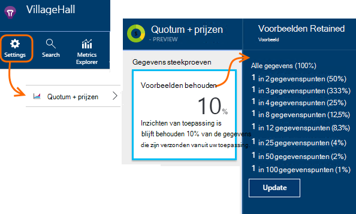

<properties 
    pageTitle="Telemetrielogboek steekproeven in toepassing inzichten | Microsoft Azure" 
    description="Hoe u het volume van telemetrielogboek onder controle te houden." 
    services="application-insights" 
    documentationCenter="windows"
    authors="vgorbenko" 
    manager="douge"/>

<tags 
    ms.service="application-insights" 
    ms.workload="tbd" 
    ms.tgt_pltfrm="ibiza" 
    ms.devlang="na" 
    ms.topic="article" 
    ms.date="08/30/2016" 
    ms.author="awills"/>

#  <a name="sampling-in-application-insights"></a>Steekproeven in toepassing inzichten

*Er is een toepassing inzichten in de proefversie.*


Steekproeven is een functie in [Visual Studio toepassing inzichten](app-insights-overview.md) de aanbevolen wijze telemetrielogboek verkeer en opslagruimte behoud van een statistisch correcte analyse van toepassingsgegevens verkleinen. Het filter selecteert items die betrekking hebben zodat u tussen items navigeren kunt wanneer u mee bezig zijn diagnostische onderzoeken.
Wanneer metrische tellingen komen bij u in de portal worden aangebracht, worden ze renormalized rekening te houden met de steekproeven, om te minimaliseren geen invloed op de statistieken.

Steekproeven Hiermee reduceert u verkeer, kunt u behouden in maandelijkse gegevens quota en kunt u voorkomen beperken.

## <a name="in-brief"></a>Klik in het kort:

* Steekproeven behoudt 1 in *n* records en de rest verwijdert. Dit kan bijvoorbeeld 1: 5 gebeurtenissen, een tarief steekproeven van 20% behouden. 
* Steekproeven gebeurt automatisch als uw toepassing een groot aantal telemetrielogboek, in ASP.NET-WebApps server verzendt.
* U kunt ook instellen handmatig steekproef in de portal op de pagina prijzen. of in de ASP.NET-SDK in het, ook het netwerkverkeer te beperken.
* Als u aangepaste gebeurtenissen en u wilt om ervoor te zorgen dat een reeks gebeurtenissen wordt bewaard of samen verwijderd, zorg ervoor dat ze dezelfde bewerkingsnummer waarde hebben.
* De deler steekproeven *n* wordt gemeld in elke record in de eigenschap `itemCount`, die in zoeken wordt weergegeven onder het beschrijvende naam 'verzoek count"of"gebeurtenis count". Wanneer steekproeven niet betrekking heeft is, `itemCount==1`.
* Als u gebruiksanalyses query's schrijft, moet u [rekening houden met steekproeven](app-insights-analytics-tour.md#counting-sampled-data). Met name in plaats van de records te tellen, moet u `summarize sum(itemCount)`.


## <a name="types-of-sampling"></a>Soorten steekproeven


Er zijn drie alternatieve steekproeven methoden:

* **Geavanceerde steekproeven** volume automatisch het van telemetrielogboek verzonden vanuit de SDK in uw ASP.NET-app. Standaard van SDK v 2.0.0-beta3. Momenteel beschikbaar voor alleen ASP.NET serverzijde-telemetrielogboek. 
* **Vaste tarieven steekproeven** Hiermee reduceert u het volume van telemetrielogboek die tussen beide uw ASP.NET-server en uw gebruikers browsers verzonden. U instellen het tarief weer dat. De client en server worden gesynchroniseerd hun steekproeven zodat deze, zoeken in die u tussen gerelateerde paginaweergaven en aanvragen navigeren kunt.
* **Opname steekproeven** Hiermee reduceert u het volume van telemetrielogboek bewaard door de service-toepassing inzichten, klikt u op een tarief dat u hebt ingesteld. Het telemetrielogboek verkeer niet verkleinen, maar u kunt houden binnen de quota voor uw maandelijkse. 

Als aangepast of vaste rente steekproeven betrekking heeft, is opname steekproeven uitgeschakeld.

## <a name="ingestion-sampling"></a>Opname steekproeven

Dit formulier van steekproeven werkt op het punt waar het eindpunt van de service-toepassing inzichten in het telemetrielogboek uit de webserver, browsers en apparaten worden bereikt. Hoewel het niet het telemetrielogboek verkeer verzonden vanuit uw app verkleinen, deze minder verwerkt en behouden (en betalen voor) door de toepassing inzichten.

Gebruik dit type steekproeven als uw app vaak gewijd aan de maandelijkse quota en u de optie hoeft van het gebruik van de typen SDK gebaseerde steekproeven. 

De frequentie steekproeven in de quota en prijzen blade instellen:



Net als andere soorten steekproeven behoudt de algoritme van de gerelateerde telemetrielogboek items. Bijvoorbeeld wanneer u de telemetrielogboek in zoeken inspecteren bent, moet u kunnen vinden van de aanvraag die betrekking hebben op een bepaalde uitzondering. Metrisch telt zoals tarief van de aanvraag en uitzondering tarief correct blijven behouden.

Gegevenspunten die zijn verwijderd door steekproeven zijn niet beschikbaar in een functie van de toepassing inzichten zoals [Doorlopend exporteren](app-insights-export-telemetry.md).

Opname steekproeven werken niet terwijl SDK gebaseerde geavanceerde of vaste rente steekproeven betrekking heeft is. Als de steekproeven snelheid de SDK is kleiner dan 100%, wordt de opname steekproeven rentabiliteit dat u hebt ingesteld genegeerd.

> [AZURE.WARNING] De waarde die wordt weergegeven op de tegel geeft de waarde die u voor opname steekproeven hebt ingesteld. Dit geven niet het tarief weer dat werkelijke steekproeven als SDK steekproeven betrekking heeft is.


## <a name="adaptive-sampling-at-your-web-server"></a>Geavanceerde steekproeven bij de webserver

Geavanceerde steekproeven is beschikbaar voor de toepassing inzichten SDK voor ASP.NET v 2.0.0-beta3 en hoger en is standaard ingeschakeld. 


Geavanceerde steekproeven van invloed is op het volume van telemetrielogboek van uw web-app-server naar de service-toepassing inzichten verzonden. Het volume wordt automatisch aangepast als u wilt behouden in een opgegeven maximumsnelheid verkeer.

Deze niet werken met lage hoeveelheden telemetrielogboek, zodat een app in foutopsporing of een website met lage gebruik, worden niet beïnvloed.

Als u wilt bereiken het doelvolume van het, enkele van de telemetrielogboek gegenereerd verwijderd. Maar net als andere soorten steekproeven, behoudt de algoritme van de gerelateerde telemetrielogboek items. Bijvoorbeeld wanneer u de telemetrielogboek in zoeken inspecteren bent, moet u kunnen vinden van de aanvraag die betrekking hebben op een bepaalde uitzondering. 

Metrisch telt zoals tarief van de aanvraag en uitzondering tarief zijn aangepast dit voor de rente steekproeven, zodat ze ongeveer juiste waarden worden weergegeven in de Verkenner metrisch.

**Bijwerken van uw project NuGet** -pakketten naar de nieuwste versie van de *voorlopige versie* van de toepassing inzichten: met de rechtermuisknop op het project in Solution Explorer, kiest u NuGet-pakketten beheren, schakelt u **voorlopige versie opnemen** en zoek naar Microsoft.ApplicationInsights.Web. 

In [ApplicationInsights.config](app-insights-configuration-with-applicationinsights-config.md), kunt u verschillende parameters in aanpassen de `AdaptiveSamplingTelemetryProcessor` knooppunt. De cijfers zijn de standaardwaarden:

* `<MaxTelemetryItemsPerSecond>5</MaxTelemetryItemsPerSecond>`

    De snelheid van het type doeltoepassing waarmee u de geavanceerde algoritme voor **op elke serverhost**. Als uw web-app op veel hosts wordt uitgevoerd, verkleinen u deze waarde om binnen de snelheid van de doelsite verkeer bij de portal-toepassing inzichten blijven.

* `<EvaluationInterval>00:00:15</EvaluationInterval>` 

    Het interval waarvoor het huidige tarief van telemetrielogboek opnieuw wordt geëvalueerd is. Evaluatie wordt uitgevoerd als een zwevend gemiddelde. U kunt dit interval verkorten als uw telemetrielogboek onderhevig aan plotselinge bursts is.

* `<SamplingPercentageDecreaseTimeout>00:02:00</SamplingPercentageDecreaseTimeout>`

    Als steekproef percentage waarde is gewijzigd, hoe snel na we mogen Verlaag steekproeven percentage opnieuw om vast te leggen minder gegevens.

* `<SamplingPercentageIncreaseTimeout>00:15:00</SamplingPercentageIncreaseTimeout>`

    Als steekproef percentage waarde is gewijzigd, hoe snel na we mogen steekproeven percentage om meer gegevens vastleggen weer te verhogen.

* `<MinSamplingPercentage>0.1</MinSamplingPercentage>`

    Als steekproef percentage varieert, is wat de minimumwaarde die we hiervoor toestemming hebt ingesteld.

* `<MaxSamplingPercentage>100.0</MaxSamplingPercentage>`

    Als steekproef percentage varieert, is wat de maximumwaarde die we hiervoor toestemming hebt ingesteld.

* `<MovingAverageRatio>0.25</MovingAverageRatio>` 

    In de berekening van het zwevend gemiddelde, wordt het gewicht toegewezen aan de meest recente waarde. Gebruik een waarde gelijk is aan of kleiner is dan 1. Kleinere waarden wordt de algoritme van minder reactieve naar plotselinge wijzigingen aanbrengen.

* `<InitialSamplingPercentage>100</InitialSamplingPercentage>`

    De waarde die wordt toegewezen wanneer de app is overgeschakeld. Niet beperken Hiermee terwijl u foutopsporing. 

### <a name="alternative-configure-adaptive-sampling-in-code"></a>Alternatief: geavanceerde steekproeven configureren in code

In plaats van steekproeven in het aanpassen, kunt u code. Hiermee kunt u om op te geven van een functie voor terugbellen die wordt aangeroepen wanneer het tarief weer dat steekproeven opnieuw wordt geëvalueerd is. U kunt dit, bijvoorbeeld om vast te stellen welke frequentie steekproeven wordt gebruikt.

Verwijder de `AdaptiveSamplingTelemetryProcessor` knooppunt uit het .config-bestand.


*C#*

```C#

    using Microsoft.ApplicationInsights;
    using Microsoft.ApplicationInsights.Extensibility;
    using Microsoft.ApplicationInsights.WindowsServer.Channel.Implementation;
    using Microsoft.ApplicationInsights.WindowsServer.TelemetryChannel;
    ...

    var adaptiveSamplingSettings = new SamplingPercentageEstimatorSettings();

    // Optional: here you can adjust the settings from their defaults.

    var builder = TelemetryConfiguration.Active.TelemetryProcessorChainBuilder;
    
    builder.UseAdaptiveSampling(
         adaptiveSamplingSettings,

        // Callback on rate re-evaluation:
        (double afterSamplingTelemetryItemRatePerSecond,
         double currentSamplingPercentage,
         double newSamplingPercentage,
         bool isSamplingPercentageChanged,
         SamplingPercentageEstimatorSettings s
        ) =>
        {
          if (isSamplingPercentageChanged)
          {
             // Report the sampling rate.
             telemetryClient.TrackMetric("samplingPercentage", newSamplingPercentage);
          }
      });

    // If you have other telemetry processors:
    builder.Use((next) => new AnotherProcessor(next));

    builder.Build();

```

([Algemene informatie over de telemetrielogboek-processors](app-insights-api-filtering-sampling.md#filtering).)


<a name="other-web-pages"></a>
## <a name="sampling-for-web-pages-with-javascript"></a>Steekproeven voor webpagina's met JavaScript

U kunt webpagina's voor vaste rente steekproeven van een server configureren. 

Wanneer u [de webpagina's voor de toepassing inzichten te configureren](app-insights-javascript.md), het fragment dat u van de portal-toepassing inzichten krijgen te wijzigen. (In ASP.NET-apps, het fragment meestal vindt u in _Layout.cshtml.)  Een regel zoals invoegen `samplingPercentage: 10,` voordat u de toets instrumentation:

    <script>
    var appInsights= ... 
    }({ 


    // Value must be 100/N where N is an integer.
    // Valid examples: 50, 25, 20, 10, 5, 1, 0.1, ...
    samplingPercentage: 10, 

    instrumentationKey:...
    }); 
    
    window.appInsights=appInsights; 
    appInsights.trackPageView(); 
    </script> 

Voor het percentage steekproeven, kiest u een percentage die lijkt op 100/N waarbij N een geheel getal is.  Momenteel steekproef biedt geen ondersteuning andere waarden.

Als u ook de steekproeven vaste rente op de server inschakelt, worden de clients en de server worden gesynchroniseerd zodat deze, zoeken in die u tussen gerelateerde paginaweergaven en aanvragen navigeren kunt.


## <a name="fixed-rate-sampling-for-aspnet-web-sites"></a>Vaste rente steekproeven voor ASP.NET-websites

Vaste rente steekproeven Hiermee reduceert u het verkeer verzonden vanaf uw webserver en webbrowsers. In tegenstelling tot geavanceerde steekproeven vermindert telemetrielogboek met een vaste snelheid waartoe u. Het ook synchroniseren van de client en server steekproeven zodat verwante items worden bewaard - bijvoorbeeld zodat als u de weergave van een pagina in zoeken bekijkt, kunt u gerelateerde verzoek vinden.

De algoritme van de steekproeven behoudt verwante items. Voor elke HTTP-aanvraag gebeurtenis, deze en de gerelateerde gebeurtenissen worden verwijderd of verzonden gegevens. 

In de doelstellingen Explorer zijn tarieven zoals vergaderverzoeken en uitzondering telt vermenigvuldigd met een factor ter voor de rente steekproeven, zodat ze ongeveer juist zijn.

1. **Bijwerken van uw project NuGet-pakketten** naar de nieuwste versie van de *voorlopige versie* van de toepassing inzichten. Met de rechtermuisknop op het project in Solution Explorer, NuGet-pakketten beheren kiezen, schakelt u **voorlopige versie opnemen** en zoek naar Microsoft.ApplicationInsights.Web. 

2. **Geavanceerde steekproeven uitschakelen**: In [ApplicationInsights.config](app-insights-configuration-with-applicationinsights-config.md), verwijderen of aan de `AdaptiveSamplingTelemetryProcessor` knooppunt.

    ```xml

    <TelemetryProcessors>
    <!-- Disabled adaptive sampling:
      <Add Type="Microsoft.ApplicationInsights.WindowsServer.TelemetryChannel.AdaptiveSamplingTelemetryProcessor, Microsoft.AI.ServerTelemetryChannel">
        <MaxTelemetryItemsPerSecond>5</MaxTelemetryItemsPerSecond>
      </Add>
    -->
    

    ```

2. **De module vaste rente steekproeven inschakelen.** Het codefragment van deze toevoegen aan [ApplicationInsights.config](app-insights-configuration-with-applicationinsights-config.md):

    ```XML

    <TelemetryProcessors>
     <Add  Type="Microsoft.ApplicationInsights.WindowsServer.TelemetryChannel.SamplingTelemetryProcessor, Microsoft.AI.ServerTelemetryChannel">

      <!-- Set a percentage close to 100/N where N is an integer. -->
     <!-- E.g. 50 (=100/2), 33.33 (=100/3), 25 (=100/4), 20, 1 (=100/100), 0.1 (=100/1000) -->
      <SamplingPercentage>10</SamplingPercentage>
      </Add>
    </TelemetryProcessors>

    ```

> [AZURE.NOTE] Voor het percentage steekproeven, kiest u een percentage die lijkt op 100/N waarbij N een geheel getal is.  Momenteel steekproef biedt geen ondersteuning andere waarden.


### <a name="alternative-enable-fixed-rate-sampling-in-your-server-code"></a>Alternatief: vaste rente steekproeven in uw servercode inschakelen


In plaats van de parameter steekproeven instellen in het, kunt u code. 

*C#*

```C#

    using Microsoft.ApplicationInsights.Extensibility;
    using Microsoft.ApplicationInsights.WindowsServer.TelemetryChannel;
    ...

    var builder = TelemetryConfiguration.Active.GetTelemetryProcessorChainBuilder();
    builder.UseSampling(10.0); // percentage

    // If you have other telemetry processors:
    builder.Use((next) => new AnotherProcessor(next));

    builder.Build();

```

([Algemene informatie over de telemetrielogboek-processors](app-insights-api-filtering-sampling.md#filtering).)


## <a name="when-to-use-sampling"></a>Wanneer gebruikt u steekproeven?

Geavanceerde steekproeven is automatisch ingeschakeld als u de ASP.NET SDK versie 2.0.0-beta3 gebruikt of hoger. Ongeacht welke SDK versie u gebruikt, kunt u de opname steekproeven gebruiken (bij onze server).

U hoeft geen steekproeven voor de meeste toepassingen voor kleine en middelgrote grootte. De meest waardevolle diagnostische gegevens en de meest nauwkeurige statistieken worden door het verzamelen van gegevens op alle activiteiten van uw gebruikers verkregen. 

 
De belangrijkste voordelen van steekproeven zijn:

* Toepassing inzichten service Val ("throttles") gegevenspunten wanneer uw app stuurt een zeer hoog tarief van telemetrielogboek in korte tijd interval. 
* Om te houden binnen het [Quotum](app-insights-pricing.md) gegevenspunten voor uw prijzen laag. 
* Netwerkverkeer beperken uit de verzameling telemetrielogboek. 

### <a name="which-type-of-sampling-should-i-use"></a>Welk type steekproeven moet ik gebruiken?


**Gebruik de opname meting als:**

* U doorlopen uw maandelijkse quotum van telemetrielogboek vaak.
* U gebruikt een versie van de SDK waarmee steekproeven - bijvoorbeeld niet worden ondersteund, de Java SDK of ASP.NET-versies eerder dan 2.
* U krijgt een groot aantal telemetrielogboek van uw gebruikers webbrowsers.

**Gebruik vaste rente meting als:**

* U gebruikt de toepassing inzichten SDK voor ASP.NET web services versie 2.0.0 of hoger, en
* U kunt gesynchroniseerde meting tussen client en server, zodat wanneer u bent wordt onderzocht gebeurtenissen in [Zoeken](app-insights-diagnostic-search.md), u tussen gerelateerde gebeurtenissen op de client en server, zoals paginaweergaven en HTTP-aanvragen navigeren kunt.
* U bent er zeker van het percentage juiste steekproeven voor de app. Dit komt hoog genoeg is om nauwkeurig aan de doelstellingen, maar onder het tarief weer dat groter is dan de quota voor uw prijzen en de bandbreedteregeling limieten. 


**Gebruik geavanceerde steekproeven:**

Anders wordt aangeraden geavanceerde steekproeven. Dit is standaard ingeschakeld in de ASP.NET-server SDK, versie 2.0.0-beta3 of hoger. Deze beperken niet verkeer tot een bepaalde minimale rente, zodat dit geen invloed op een site intensief wordt gebruikt.


## <a name="how-do-i-know-whether-sampling-is-in-operation"></a>Hoe weet ik of steekproeven betrekking heeft is?

Als u wilt ontdekken het tarief weer dat werkelijke steekproeven ongeacht waar deze is toegepast, gebruikt u een [query Analytics](app-insights-analytics.md) zoals dit:

    requests | where timestamp > ago(1d)
  	| summarize 100/avg(itemCount) by bin(timestamp, 1h) 
  	| render areachart 

Behouden in elke record `itemCount` geeft het aantal oorspronkelijke records die erdoor, gelijk is aan 1 + het aantal vorige verwijderde records. 


## <a name="how-does-sampling-work"></a>Hoe werkt steekproeven?

Vaste rente en geavanceerde steekproeven zijn een functie van de SDK in ASP.NET-versies van 2.0.0 hoger. Opname steekproeven is een functie van de service-toepassing inzichten en betrekking heeft kan zijn als de SDK wordt niet uitgevoerd steekproeven. 

De algoritme van de steekproeven wordt bepaald welke items telemetrielogboek weghalen en welke u wilt behouden (of u nu in de SDK of in de toepassing inzichten-service). De beschikking steekproeven is gebaseerd op meerdere regels die zijn bedoeld om u te behouden alle onderling gerelateerde gegevenspunten intact, een diagnostische-ervaring in toepassing inzichten die is sneller en betrouwbare ook niet met een verminderde gegevensverzameling onderhouden. Bijvoorbeeld, als voor een mislukte aanvraag verzendt uw app extra telemetrielogboek items (zoals uitzondering en sporen aangemeld deze aanvraag), steekproeven niet gesplitst dit verzoek en andere telemetrielogboek. Deze behouden of worden deze allemaal tegelijk. Wanneer u de details van de aanvraag in toepassing inzichten bekijkt, kunt u daardoor altijd het verzoek samen met de bijbehorende telemetrielogboek items zien. 

Voor toepassingen die "gebruiker" definiëren (dat wil zeggen meestgebruikte webtoepassingen), het besluit steekproeven is gebaseerd op de hash van de gebruikers-id, dat wil zeggen dat alle telemetrielogboek voor een bepaalde gebruiker wordt behouden of verwijderd. De beschikking steekproeven is voor de typen toepassingen die gebruikers (zoals webservices) niet definiëren op basis van de bewerkings-id van de aanvraag kunt invullen. Ten slotte voor het telemetrielogboek-items die niet gebruiker noch bewerking-id instellen (voor voorbeeld telemetrielogboek artikelen van asynchrone threads met geen context http hebt) steekproeven gewoon wordt vastgelegd een percentage van telemetrielogboek items van elk type. 

Wanneer aan u een presentatie geeft telemetrielogboek, past de service-toepassing inzichten de aan de doelstellingen hetzelfde steekproeven percentage die is gebruikt op het moment van de siteverzameling, de ontbrekende gegevenspunten. Wanneer het telemetrielogboek in toepassing inzichten bekijkt, zijn de gebruikers daarom statistisch correcte benaderingen die zeer dicht bij de reële getallen zijn ziet.

De nauwkeurigheid van de aanpassing is grotendeels afhankelijk van het percentage geconfigureerde steekproeven. Bovendien de nauwkeurigheid Hiermee verhoogt u voor toepassingen die een grote hoeveelheid doorgaans vergelijkbare aanvragen van een groot aantal gebruikers verwerken. Aan de andere kant voor toepassingen die niet met een aanzienlijke belasting werken, is steekproeven niet nodig terwijl deze toepassingen kunnen gewoonlijk is met het verzenden van alle hun telemetrielogboek terwijl blijven binnen het quotum, zonder dat gegevens kwijtraken van beperken. 

Houd er rekening mee dat toepassing inzichten wordt niet aan de doelstellingen en sessies telemetrielogboek typen sinds voorbeeld voor deze typen, wilt verkleinen in de precisie ten zeerste ongewenste kan zijn. 

### <a name="adaptive-sampling"></a>Geavanceerde steekproeven

Geavanceerde steekproeven voegt een onderdeel dat de huidige frequentie van overdracht uit de SDK bewaakt en wordt het percentage steekproeven om te proberen te blijven binnen de doel-maximumsnelheid aangepast. De correctie wordt opnieuw berekend met regelmatige tussenpozen en is gebaseerd op een zwevend gemiddelde van de uitgaande overdracht rentabiliteit.

## <a name="sampling-and-the-javascript-sdk"></a>Steekproeven en de JavaScript-SDK

De aan de clientzijde (JavaScript) SDK deelneemt aan de steekproeven vaste rente in combinatie met de servers SDK. De providers's stuurt alleen aan de clientzijde telemetrielogboek uit dezelfde gebruikers waarvoor de servers die zijn aangebracht haar beslissing "voorbeeld in". Deze logica is bedoeld om de integriteit van gebruikerssessie voor het behoud van over client - en server-zijden. Hierdoor op een bepaald telemetrielogboek item in de toepassing inzichten kunt u alle andere telemetrielogboek items voor deze gebruiker of sessie vinden. 

*Mijn clients en servers telemetrielogboek weergeven geen gecoördineerde voorbeelden zoals u hierboven beschreven.*

* Controleer of u vaste rente steekproeven zowel op server en client ingeschakeld.
* Zorg ervoor dat de SDK versie 2.0 of hoger.
* Controleer of u hetzelfde steekproeven percentage in zowel de client en server hebt ingesteld.


## <a name="frequently-asked-questions"></a>Veelgestelde vragen 

*Waarom is niet steekproef een eenvoudige "verzamelen X percentage van elk type telemetrielogboek'?*

 *  Terwijl deze methode steekproeven van een zeer hoog precisie in metrische benaderingen voorzien wilt, zou deze mogelijkheid om te relateren diagnostische gegevens per gebruiker, sessie en aanvraag, dat wil kritieke voor diagnostische gegevens zeggen verbreken. Steekproef werkt daarom beter met "alle telemetrielogboek items verzamelen voor X procent van de app-gebruikers" of "verzamelen alle telemetrielogboek voor X percentage app aanvragen" logica. Voor de telemetrielogboek items niet zijn gekoppeld aan de aanvragen (zoals asynchrone achtergrondverwerking), de herfst terug is "verzamelen X percentage van alle items voor elk type telemetrielogboek." 

*Kan het percentage steekproeven wijzigen na verloop van tijd?*

 * Ja, geavanceerde steekproeven geleidelijk veranderende voor het percentage steekproeven, op basis van het momenteel waargenomen volume van de telemetrielogboek.

 

*Als ik vaste rente steekproeven gebruikt, hoe weet ik welke steekproeven percentage werkt het beste werkt voor mijn app?*

* Een manier is beginnen met geavanceerde steekproeven, leest u wat vereffent op (Zie de bovenstaande vraag) classificeren en Ga naar vaste rente steekproef met dit percentage. 

    U moet anders raden. Uw huidige gebruik van de telemetrielogboek in AI analyseren, toekijken beperken die optreedt en het volume van de verzamelde telemetrielogboek schatten. Deze drie invoer gebruiken, samen met uw geselecteerde prijzen laag voorgesteld hoeveel wilt u mogelijk het volume van de verzamelde telemetrielogboek verkleinen. Echter, een stijging van het nummer van uw gebruikers- of enkele andere shift in het volume van telemetrielogboek mogelijk uw offerte ongeldig.

*Wat gebeurt er als ik steekproeven percentage te laag is geconfigureerd?*

* Uiterst laag steekproeven percentage (over-aggressive steekproeven) Hiermee reduceert u de nauwkeurigheid van de benaderingen, wanneer inzichten toepassing probeert ter de visualisatie van de gegevens voor de gegevens volume wilt verkleinen. Bovendien diagnostische ervaring mogelijk negatief worden beïnvloed, zoals enkele van de aanvragen weinig beschadigde of traag mogelijk worden partijen af.

*Wat gebeurt er als ik steekproeven percentage te hoog is geconfigureerd?*

* Levert een onvoldoende wilt verkleinen in het volume van de verzamelde telemetrielogboek configureren te hoog steekproeven percentage (niet agressieve genoeg is). Kunt u waarnemen nog steeds telemetrielogboek gegevensverlies betrekking hebben op beperken en de kosten van het gebruik van de toepassing inzichten mogelijk hoger zijn dan u geplande vanwege gebruikskosten kosten.

*Op welke platforms kan ik steekproeven gebruiken?*

* Opname steekproeven kan automatisch voor alle telemetrielogboek boven een bepaald volume, optreden als de SDK wordt niet uitgevoerd steekproeven. Dit wilt werken, bijvoorbeeld als uw app een Java-server gebruikt, of als u een oudere versie van de ASP.NET-SDK gebruikt.

* Als u gebruikmaakt van ASP.NET SDK versies 2.0.0 en hoger (gehost in Azure wordt aangegeven of op uw eigen server), krijgt u geavanceerde meting al dan niet standaard, maar u kunt overschakelen naar vaste rente, zoals hierboven is beschreven. Met vaste rente steekproeven, de browser SDK worden automatisch gesynchroniseerd naar het voorbeeld van de gerelateerde gebeurtenissen. 

*Er zijn bepaalde niet vaak voorkomen gebeurtenissen die ik altijd moeten worden weergegeven. Hoe kan ik deze verkrijgen voorbij de module steekproeven?*

 * Een afzonderlijk exemplaar van TelemetryClient met een nieuwe TelemetryConfiguration (niet de standaardinstelling actief) geïnitialiseerd. Gebruik die aan uw niet vaak voorkomen gebeurtenissen verzenden.


## <a name="next-steps"></a>Volgende stappen

* [Filteren](app-insights-api-filtering-sampling.md) kan bieden meer strikte controle over wat uw SDK wordt verzonden.
