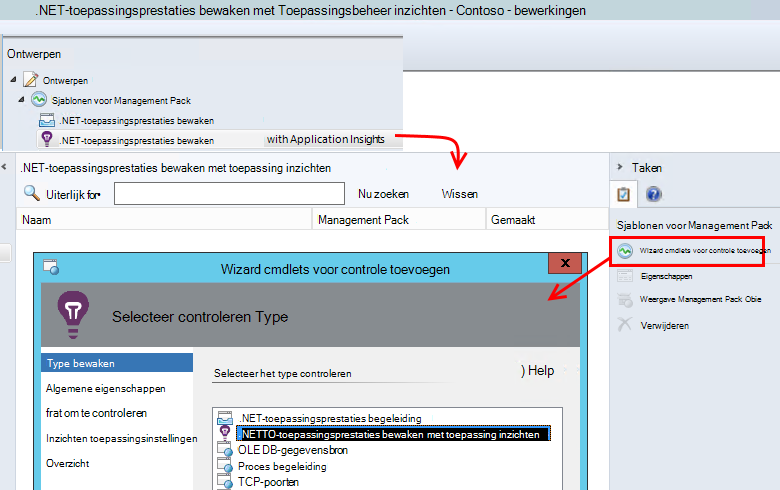
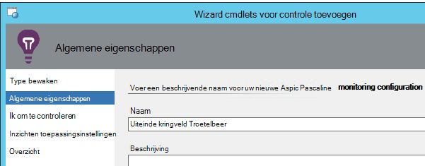
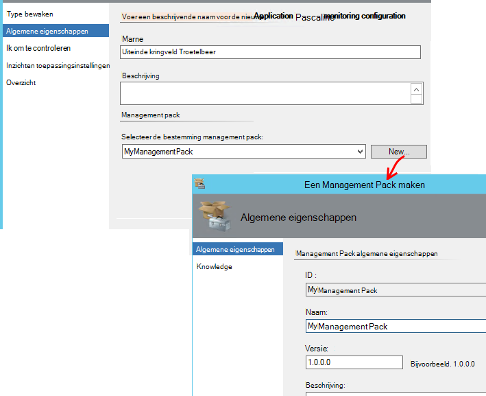
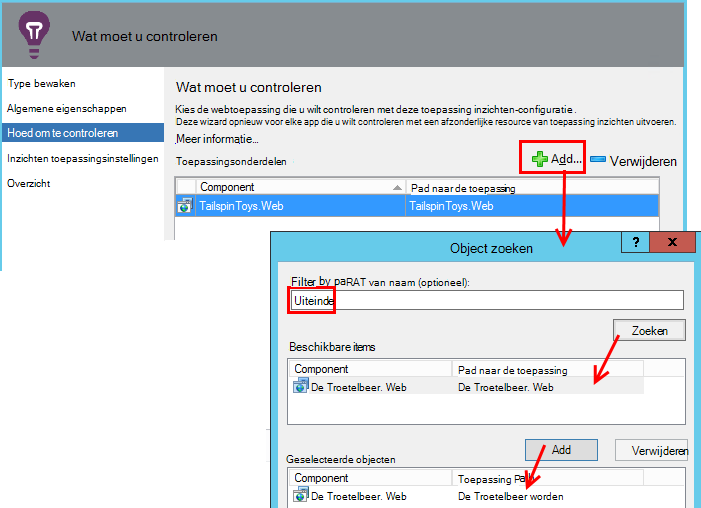
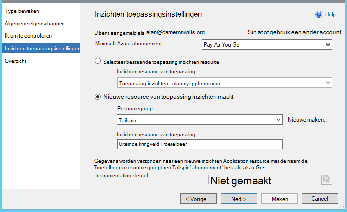
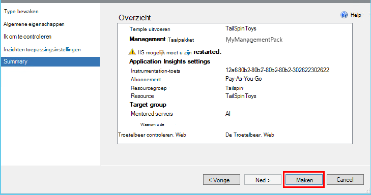
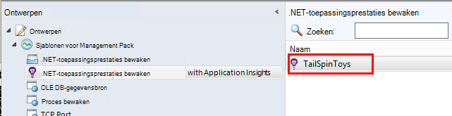
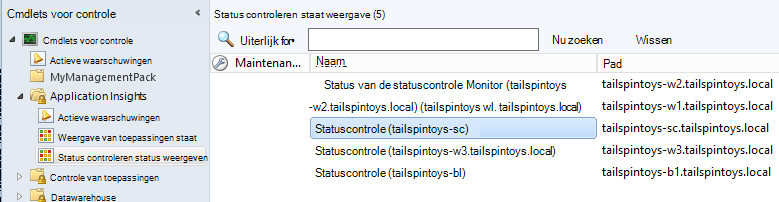

<properties 
    pageTitle="SCOM-integratie met toepassing inzichten | Microsoft Azure" 
    description="Als u een SCOM-gebruiker bent, controleert u de prestaties en een diagnose stellen bij problemen met de toepassing inzichten. Volledig dashboards, slimme waarschuwingen, krachtige diagnostische hulpprogramma's en analyse query's." 
    services="application-insights" 
    documentationCenter=""
    authors="alancameronwills" 
    manager="douge"/>

<tags 
    ms.service="application-insights" 
    ms.workload="tbd" 
    ms.tgt_pltfrm="ibiza" 
    ms.devlang="na" 
    ms.topic="article" 
    ms.date="08/12/2016" 
    ms.author="awills"/>
 
# Toepassing prestatiecontroles toepassing inzichten gebruik voor SCOM

Als u systeem Center Operations Manager (SCOM) voor het beheren van uw servers gebruikt, kunt u prestaties controleren en een diagnose stellen bij prestatieproblemen met behulp van [Visual Studio toepassing inzichten](app-insights-asp-net.md). Toepassing inzichten bewaakt van de webtoepassing verzoeken voor oproepen, uitgaande REST en SQL-oproepen, uitzonderingen en log sporen. Het biedt dashboards metrische grafieken en slimme waarschuwingen, evenals krachtige diagnostische zoeken en analytical query's via deze telemetrielogboek. 

U kunt overstappen op de toepassing inzichten bewaken met behulp van een SCOM management pack.

## Voordat u begint

We wordt ervan uitgegaan dat:

* U bekend bent met SCOM en dat u SCOM 2012 R2 of 2016 gebruiken voor het beheren van uw IIS web servers.
* U hebt al geïnstalleerd op uw servers een webtoepassing die u wilt controleren met toepassing inzichten.
* App framework versie is .NET 4.5 of hoger.
* U toegang hebt tot een abonnement in [Microsoft Azure](https://azure.com) en kan aanmelden bij de [portal van Azure](https://portal.azure.com). Uw organisatie mogelijk een abonnement hebt en uw Microsoft-account kunt toevoegen aan deze.

(Het ontwikkelteam kan de [Toepassing inzichten SDK](app-insights-asp-net.md) in de web-app maken. Deze instrumentation opbouwen-tijd biedt deze meer flexibiliteit bij het schrijven van aangepaste telemetrielogboek. Echter het maakt niet uit: u kunt de stappen die hier worden beschreven, met of zonder de SDK ingebouwd.)

## (Één keer) Toepassing inzichten management pack installeren

Op de computer waarop u Operations Manager uitvoert:

2. Verwijder eventuele oude versie van het management pack:
 1. Open in Operations Manager, beheer van de Management Packs. 
 2. Verwijder de oude versie.
1. Download en installeer het management pack uit de catalogus.
2. Start opnieuw Operations Manager.

## Een management pack maken

1. Operations Manager, open **ontwerpfuncties**, **.NET... met toepassing inzichten**, **Wizard Controle toevoegen**en kies nogmaals **.NET... met toepassing inzichten**.

    

2. De naam van de configuratie na uw app. (U moet een app instrument tegelijk.)
    
    

3. Op dezelfde wizardpagina, maak een nieuw management pack, of Selecteer een pakket dat u eerder voor toepassing inzichten hebt gemaakt.

     (De toepassing inzichten [management pack](https://technet.microsoft.com/library/cc974491.aspx) is een sjabloon, waaruit u een exemplaar maken. U later opnieuw kunt gebruiken hetzelfde exemplaar.)

    

4. Kies een app die u wilt controleren. De zoekfunctie zoekt tussen de apps die op uw servers geïnstalleerd.

    

    Het veld optioneel Monitoring scope kan worden gebruikt om op te geven van een subset van uw servers, als u niet wilt controleren van de app in alle servers.

5. Op de volgende wizardpagina, moet u eerst uw referenties in om aan te melden bij Microsoft Azure opgeven.

    Op deze pagina kiest u de toepassing inzichten resource waar u de telemetriegegevens worden geanalyseerd en weergegeven. 

 * Als de toepassing is geconfigureerd voor de toepassing inzichten tijdens de ontwikkeling, selecteert u de bestaande resource.
 * Anders maakt u een nieuwe resource met de naam voor de app. Als er andere apps die deel uitmaken van hetzelfde systeem, plaatst u deze in dezelfde resourcegroep, access naar het telemetrielogboek gemakkelijker te beheren.

    U kunt deze instellingen later wijzigen.

    

6. Voltooi de wizard.

    
    
Herhaal deze procedure voor elke app die u wilt controleren.

Als u instellingen later wijzigen wilt, opnieuw de eigenschappen van het beeldscherm vanuit het venster ontwerpen te openen.

## Controleer of bewaken

Het beeldscherm dat u wordt gezocht naar uw app hebt geïnstalleerd op alle servers. Waar deze vindt u de App-site en configureert deze toepassing inzichten statuscontrole om te controleren van de app. Indien nodig installeren het eerst statuscontrole op de server.

U kunt controleren welke exemplaren van de app gevonden:

## Weergave-telemetrielogboek in toepassing inzichten

Blader naar de resource voor de app in de [portal van Azure](https://portal.azure.com). U [grafieken met telemetrielogboek zien](app-insights-dashboards.md) van uw app. (Als deze nog niet op de hoofdpagina nog weergegeven, klikt u op Live aan de doelstellingen gegevensstroom.)

## Volgende stappen

* [Een dashboard instellen](app-insights-dashboards.md) de belangrijkste grafieken monitoring dit en andere apps worden samengebracht.
* [Meer informatie over de doelstellingen](app-insights-metrics-explorer.md)
* [Waarschuwingen instellen](app-insights-alerts.md)
* [Oplossen van prestatieproblemen](app-insights-detect-triage-diagnose.md)
* [Krachtige analyses-query 's](app-insights-analytics.md)
* [Beschikbaarheid van web tests](app-insights-monitor-web-app-availability.md)
