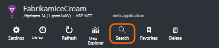
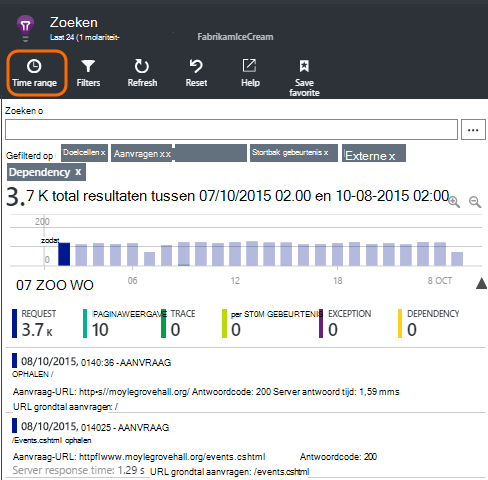
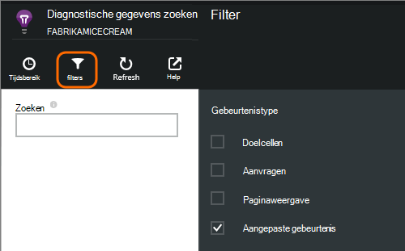
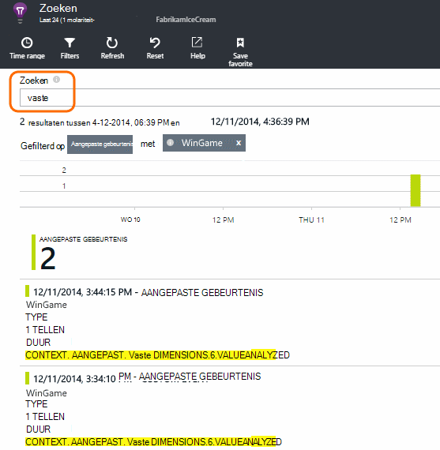
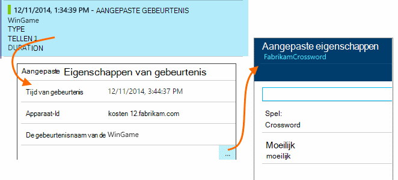
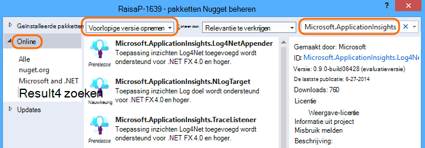
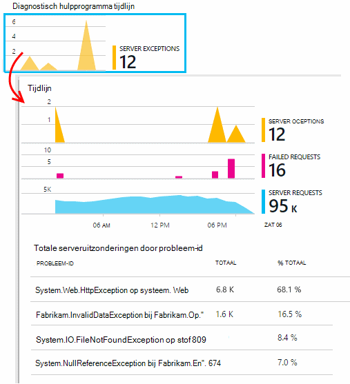
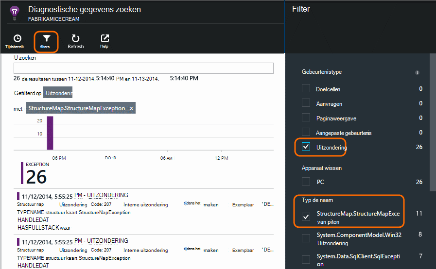

<properties 
    pageTitle="Logboeken, uitzonderingen en aangepaste diagnostische hulpprogramma's voor ASP.NET in toepassing inzichten" 
    description="Een diagnose stellen bij problemen in ASP.NET-WebApps door te zoeken vergaderverzoeken, uitzonderingen en logboeken die zijn gegenereerd met doelcellen, NLog of Log4Net." 
    services="application-insights" 
    documentationCenter=""
    authors="alancameronwills" 
    manager="douge"/>

<tags 
    ms.service="application-insights" 
    ms.workload="tbd" 
    ms.tgt_pltfrm="ibiza" 
    ms.devlang="na" 
    ms.topic="article" 
    ms.date="04/08/2016" 
    ms.author="awills"/>
 
# Logboeken, uitzonderingen en aangepaste diagnostische hulpprogramma's voor ASP.NET in toepassing inzichten

[Toepassing inzichten] [ start] bevat een krachtige [Diagnostische zoeken] [ diagnostic] hulpmiddel waarmee u kunt verkennen en analyseren telemetrielogboek verzonden door de toepassing inzichten SDK vanuit uw toepassing. Veel gebeurtenissen zoals gebruikersweergaven pagina worden automatisch door de SDK verzonden.

U kunt ook code als u wilt verzenden, aangepaste gebeurtenissen, uitzondering rapporten en sporen schrijven. En als u al een kader logboekregistratie zoals log4J, log4net, NLog of System.Diagnostics.Trace gebruikt, kunt u deze logboeken vastleggen en deze opnemen in de zoekopdracht. Hiermee kunt u gemakkelijk log sporen correlatie met gebruikersacties, uitzonderingen en andere gebeurtenissen.

## Voordat u aangepaste telemetrielogboek schrijven

Als u nog niet hebt [ingesteld toepassing inzichten voor uw project][start], dat nu doen.

Wanneer u uw toepassing uitvoert, wordt verzonden sommige telemetrielogboek die wordt weergegeven in de diagnostische zoeken, met inbegrip van aanvragen ontvangen door de server, pagina weergaven die zijn aangemeld op de client en onbekende uitzonderingen.

Open diagnostische zoeken om te zien van het telemetrielogboek waaruit de SDK automatisch worden verzonden.

De details verschillen uit één toepassingstype. U kunt klikken op tot en met een afzonderlijke gebeurtenis wilt u meer informatie.

## Steekproeven 

Als uw toepassing een groot aantal gegevens stuurt en u de toepassing inzichten SDK voor ASP.NET versie 2.0.0-beta3 of hoger gebruikt, kan de functie Geavanceerde steekproeven werken en slechts een percentage van uw telemetrielogboek verzenden. [Meer informatie over steekproeven.](app-insights-sampling.md)

##Aangepaste gebeurtenissen

Aangepaste gebeurtenissen weergegeven beide in [Diagnostische zoeken] [ diagnostic] en in [Metrisch Explorer][metrics]. U kunt ze vanaf apparaten, webpagina's en servertoepassingen verzendt. Ze kunnen worden gebruikt voor diagnose zowel voor [meer informatie over gebruikspatronen][track].

Een aangepaste gebeurtenis heeft een naam en eigenschappen die u, samen met numerieke afmetingen filteren kunt ook kan uitvoeren.

JavaScript op client

    appInsights.trackEvent("WinGame",
         // String properties:
         {Game: currentGame.name, Difficulty: currentGame.difficulty},
         // Numeric measurements:
         {Score: currentGame.score, Opponents: currentGame.opponentCount}
         );

C# op server

    // Set up some properties:
    var properties = new Dictionary <string, string> 
       {{"game", currentGame.Name}, {"difficulty", currentGame.Difficulty}};
    var measurements = new Dictionary <string, double>
       {{"Score", currentGame.Score}, {"Opponents", currentGame.OpponentCount}};

    // Send the event:
    telemetry.TrackEvent("WinGame", properties, measurements);

VB op server

    ' Set up some properties:
    Dim properties = New Dictionary (Of String, String)
    properties.Add("game", currentGame.Name)
    properties.Add("difficulty", currentGame.Difficulty)

    Dim measurements = New Dictionary (Of String, Double)
    measurements.Add("Score", currentGame.Score)
    measurements.Add("Opponents", currentGame.OpponentCount)

    ' Send the event:
    telemetry.TrackEvent("WinGame", properties, measurements)

### Uw app uitvoeren en de resultaten bekijken.

Open diagnostische zoeken.

Selecteer aangepaste gebeurtenis en selecteer de naam van een bepaalde gebeurtenis.

Filter de gegevens meer door een zoekterm op een waarde onroerend goed invoeren.  

Inzoomen op een afzonderlijke gebeurtenis om de uitgebreide eigenschappen weer te geven.

##Paginaweergaven

Pagina weergave telemetrielogboek is verzonden door de oproep trackPageView() in [het JavaScript-fragment dat u in uw webpagina's invoegen][usage]. Het hoofddoel is bijdragen aan de paginaweergaven die u op de overzichtspagina ziet aantallen.

Meestal dit één keer in elke HTML-pagina wordt genoemd, maar u kunt meer oproepen - bijvoorbeeld invoegen als u een app van één pagina hebt en u vastleggen van een nieuwe pagina wilt wanneer de gebruiker wordt verplaatst meer gegevens.

    appInsights.trackPageView(pageSegmentName, "http://fabrikam.com/page.htm"); 

Is het soms handig om te koppelen eigenschappen die u als filters in diagnostische zoeken gebruiken kunt:

    appInsights.trackPageView(pageSegmentName, "http://fabrikam.com/page.htm",
     {Game: currentGame.name, Difficulty: currentGame.difficulty});

##Doelcellen telemetrielogboek

Doelcellen telemetrielogboek is code die u invoegt specifiek als u wilt maken van de diagnostische logboeken. 

U kunt bijvoorbeeld oproepen als volgt invoegen:

    var telemetry = new Microsoft.ApplicationInsights.TelemetryClient();
    telemetry.TrackTrace("Slow response - database01");

####  Installeer een kaart voor uw logboekregistratie framework

U kunt ook zoeken logboeken gegenereerd met een kader logboekregistratie - log4Net, NLog of System.Diagnostics.Trace. 

1. Als u van plan bent om log4Net of NLog te gebruiken, kunt u dit in uw project installeren. 
2. In Solution Explorer met de rechtermuisknop op het project en kies **NuGet-pakketten beheren**.
3. Online selecteren > Alles, selecteer **Opnemen voorlopige versie** en zoek naar "Microsoft.ApplicationInsights"

    

4. Selecteer het juiste pakket - een van:
  + Microsoft.ApplicationInsights.TraceListener (om vast te leggen System.Diagnostics.Trace oproepen)
  + Microsoft.ApplicationInsights.NLogTarget
  + Microsoft.ApplicationInsights.Log4NetAppender

Het pakket NuGet de benodigde stroombaan is geïnstalleerd en wijzigt ook web.config of app.config.

#### Diagnostische logboeken oproepen invoegen

Als u System.Diagnostics.Trace gebruikt, zou een normale oproep:

    System.Diagnostics.Trace.TraceWarning("Slow response - database01");

Als u liever log4net of NLog:

    logger.Warn("Slow response - database01");

Uw app uitvoeren in de foutopsporingsmodus voor of het dashboard implementeren.

Ziet u de berichten in de diagnostische zoeken wanneer u het filter doelcellen selecteren.

### Uitzonderingen

Aan de uitzondering rapporten in de toepassing inzichten beschikt u over een zeer krachtig ervaring, met name omdat u kunt tussen de mislukte aanvragen en de uitzonderingen navigeren en de stapel uitzondering lezen.

In sommige gevallen, moet u [een paar regels met code invoegen] [ exceptions] om ervoor te zorgen dat uw uitzonderingen worden automatisch wordt onderschept.

U kunt ook expliciete code als u wilt verzenden uitzondering telemetrielogboek schrijven:

JavaScript

    try 
    { ...
    }
    catch (ex)
    {
      appInsights.TrackException(ex, "handler loc",
        {Game: currentGame.Name, 
         State: currentGame.State.ToString()});
    }

C#

    var telemetry = new TelemetryClient();
    ...
    try 
    { ...
    }
    catch (Exception ex)
    {
       // Set up some properties:
       var properties = new Dictionary <string, string> 
         {{"Game", currentGame.Name}};

       var measurements = new Dictionary <string, double>
         {{"Users", currentGame.Users.Count}};

       // Send the exception telemetry:
       telemetry.TrackException(ex, properties, measurements);
    }

VB

    Dim telemetry = New TelemetryClient
    ...
    Try
      ...
    Catch ex as Exception
      ' Set up some properties:
      Dim properties = New Dictionary (Of String, String)
      properties.Add("Game", currentGame.Name)

      Dim measurements = New Dictionary (Of String, Double)
      measurements.Add("Users", currentGame.Users.Count)
  
      ' Send the exception telemetry:
      telemetry.TrackException(ex, properties, measurements)
    End Try

De eigenschappen en afmetingen parameters zijn optioneel, maar zijn handig voor het filteren en extra informatie toe te voegen. Als u een app die verschillende spellen kan worden uitgevoerd, kan u bijvoorbeeld alle de uitzondering rapporten met betrekking tot een bepaald spel vinden. U kunt zoveel objecten als u elke woordenlijst wilt toevoegen.

#### Uitzonderingen weergeven

Ziet u een overzicht van uitzonderingen gerapporteerd op het blad Overzicht en u kunt klikken op tot en met meer details kunnen zien. Bijvoorbeeld:

[]

Klik op elk gewenst uitzonderingstype om specifieke exemplaren weer te geven:

[]

U kunt ook rechtstreeks openen van diagnostische gegevens zoeken, filteren op uitzonderingen en kies het uitzonderingstype die u wilt zien.

### Rapportage van onverwerkte uitzonderingen

Rapporten van de toepassing inzichten onverwerkte uitzonderingen waar deze kan, op apparaten, [webbrowsers][usage], of web-servers of geïmplementeerd door [Statuscontrole] [ redfield] of [Toepassing inzichten SDK][greenbrown]. 

Het is echter niet altijd dit niet in sommige gevallen, omdat het .NET framework de uitzonderingen vangt.  Om ervoor te zorgen dat u ziet alle uitzonderingen, dus moet u een kleine uitzonderingshandler schrijven. De aanbevolen procedure varieert met de technologie. Zie [uitzondering telemetrielogboek voor ASP.NET] [ exceptions] voor meer informatie. 

### Correleren met een opbouwen

Wanneer u diagnostische logboeken leest, hoeft u waarschijnlijk dat uw broncode zijn gewijzigd sinds de live code is geïmplementeerd.

Daarom handig opbouwen gegevens, zoals de URL van de huidige versie, in een eigenschap samen met elke uitzondering of doelcellen te plaatsen. 

In plaats van de eigenschap afzonderlijk toevoegen aan elk gesprek uitzondering, kunt u de gegevens in de standaardcontext instellen. 

    // Telemetry initializer class
    public class MyTelemetryInitializer : ITelemetryInitializer
    {
        public void Initialize (ITelemetry telemetry)
        {
            telemetry.Properties["AppVersion"] = "v2.1";
        }
    }

In de app-initialisatiefunctie zoals Global.asax.cs:

    protected void Application_Start()
    {
        // ...
        TelemetryConfiguration.Active.TelemetryInitializers
        .Add(new MyTelemetryInitializer());
    }

###Server webaanvragen

Aanvragen telemetrielogboek wordt automatisch verzonden wanneer u [Statuscontrole op uw webserver installeren][redfield], of wanneer u met het [toevoegen van toepassing inzichten aan uw webproject][greenbrown]. Het is ook-feeds in de vergaderverzoeken en antwoorden tijd grafieken in metrisch Explorer en klik op de pagina overzicht.

Als u verzenden als u meer gebeurtenissen wilt, kunt u de TrackRequest()-API gebruiken.

## Q & A

### Ik krijg een foutmelding 'Instrumentation toets kan niet leeg zijn'

Lijkt erop dat u het pakket van logboekregistratie adapter Nuget zonder installatie van toepassing inzichten hebt geïnstalleerd.

Klik in Solution Explorer met de rechtermuisknop op `ApplicationInsights.config` en kies **Update toepassing inzichten**. Krijgt u een dialoogvenster met een uitnodiging te melden bij een Azure en maak een bron-toepassing inzichten, of een bestaande opnieuw gebruiken. Die dit moet doen.

### Hoeveel gegevens blijven behouden?

Maximaal 500 gebeurtenissen per seconde van elke toepassing. Gebeurtenissen worden gedurende zeven dagen bewaard.

### Notatie van bepaalde Mijn gebeurtenissen of sporen, worden niet weergegeven

Als uw toepassing een groot aantal gegevens stuurt en u de toepassing inzichten SDK voor ASP.NET versie 2.0.0-beta3 of hoger gebruikt, kan de functie Geavanceerde steekproeven werken en slechts een percentage van uw telemetrielogboek verzenden. [Meer informatie over steekproeven.](app-insights-sampling.md)

## Volgende stappen

* [Beschikbaarheid en serverreactie tests instellen][availability]
* [Problemen oplossen][qna]

<!--Link references-->

[availability]: app-insights-monitor-web-app-availability.md
[diagnostic]: app-insights-diagnostic-search.md
[exceptions]: app-insights-asp-net-exceptions.md
[greenbrown]: app-insights-asp-net.md
[metrics]: app-insights-metrics-explorer.md
[qna]: app-insights-troubleshoot-faq.md
[redfield]: app-insights-monitor-performance-live-website-now.md
[start]: app-insights-overview.md
[track]: app-insights-api-custom-events-metrics.md
[usage]: app-insights-web-track-usage.md

 
