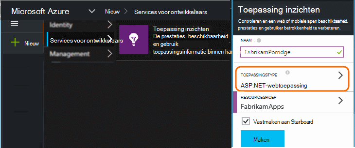
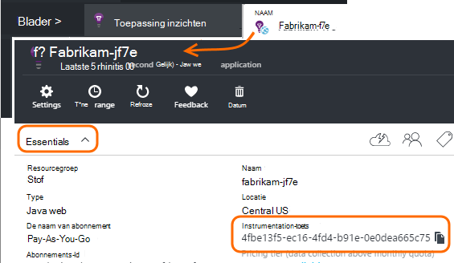

<properties 
    pageTitle="Afzonderlijke toepassing inzichten bronnen voor ontwikkelaar, testomgeving als operationele" 
    description="De prestaties en het gebruik van de toepassing in verschillende stadia van ontwikkeling" 
    services="application-insights" 
    documentationCenter=""
    authors="alancameronwills" 
    manager="douge"/>

<tags 
    ms.service="application-insights" 
    ms.workload="tbd" 
    ms.tgt_pltfrm="ibiza" 
    ms.devlang="na" 
    ms.topic="article" 
    ms.date="05/04/2016" 
    ms.author="awills"/>

# Voor het scheiden van toepassing inzichten resources

Moet de telemetrielogboek uit verschillende onderdelen en versies van uw toepassing worden verzonden naar een andere toepassing inzichten resources of gecombineerd in een? In dit artikel Hiermee wordt gezocht met de beste procedures en de benodigde technieken.

Eerst de vraag begrijpen. De gegevens hebt ontvangen van uw toepassing is opgeslagen en verwerkt door toepassing inzichten in een Microsoft Azure- *resource*. Elke resource wordt aangegeven door een *instrumentation sleutel* (iKey). De sleutel is opgegeven voor de toepassing inzichten SDK in uw app, zodat de gegevens die worden verzameld op de juiste resource kan worden verzonden. De toets kan worden verstrekt in code of in ApplicationInsights.config. Als u de sleutel in de SDK, kunt u gegevens naar verschillende bronnen verwijzen. 

Een eenvoudig voorbeeld, wanneer u de code voor een nieuwe toepassing, maakt maken u ook een nieuwe bron in de toepassing inzichten. Visual Studio wordt het dialoogvenster *Nieuw project* dit voor u.

Als dit een grote hoeveelheden-website is, kan deze worden geïmplementeerd op meer dan één exemplaar van de server.

In meer complexe scenario's moet u een systeem dat uit meerdere onderdelen - bijvoorbeeld een website en een back-enddatabase processor bestaat. 

## Wanneer gebruikt u afzonderlijke iKeys

Hier volgen enkele algemene richtlijnen:

* Waar u een eenheid onafhankelijk bruikbare toepassing die compatibel is met een reeks server omhoog/omlaag-exemplaren die kunnen worden vergroot onafhankelijk van andere onderdelen, en vervolgens u dat meestal aan één resource toewijzen wilt - hebt dat wil zeggen, heeft dit een sleutel één instrumentation (iKey).
* Daarentegen opnemen redenen voor het gebruik van afzonderlijke iKeys:
 - Eenvoudig afzonderlijk aan de doelstellingen van afzonderlijke onderdelen lezen.
 - Bewaar kleinere aantallen telemetrielogboek van grote hoeveelheden, zodat de beperking, quota's en steekproeven op één stream niet van invloed zijn op de andere.
 - Afzonderlijke waarschuwingen, exporteren en werk item configuraties.
 - Verdeel [limieten](app-insights-pricing.md#limits-summary) zoals telemetrielogboek quotum, beperken en web testen tellen.
 - Code in ontwikkeling en test moet worden verzonden naar een afzonderlijke iKey dan het tijdstempel productie.  

Een groot aantal toepassing inzichten portal ervaringen zijn ontworpen met deze richtlijnen in gedachten. De servers Bekijk bijvoorbeeld segmenten op server-instantie, waardoor aangenomen dat telemetrielogboek over een logische onderdeel afkomstig uit verschillende exemplaren van de server zijn kan.

## Eén iKey

Waarin u telemetrielogboek verzenden vanuit meerdere onderdelen naar een enkel iKey:

* Een eigenschap toevoegen aan alle telemetrielogboek waarmee u naar het segment en filteren op de identiteit onderdeel. De rol-ID wordt automatisch toegevoegd aan telemetrielogboek van exemplaren van de rol server, maar in andere gevallen dat kunt u een [telemetrielogboek initialisatiefunctie](app-insights-api-filtering-sampling.md#add-properties) om toe te voegen van de eigenschap.
* De toepassing inzichten SDK's in de verschillende onderdelen op hetzelfde moment bijwerken. Telemetrielogboek voor één iKey moet afkomstig zijn van dezelfde versie van de SDK.

## Afzonderlijke iKeys

Waar hebt u meerdere iKeys voor verschillende toepassingsonderdelen:

* Een [dashboard](app-insights-dashboards.md) voor een weergave van de belangrijkste telemetrielogboek maken vanuit uw logische-toepassing, gecombineerd uit de andere toepassingsonderdelen. Dashboards kunnen worden gedeeld, zodat de weergave van een systeem voor één logische kan worden gebruikt door verschillende teams.
* Het organiseren van [resourcegroepen](app-insights-resources-roles-access-control.md) op het niveau van de teamsite. Toegangsmachtigingen door resourcegroep worden toegewezen en hierbij om de machtigingen voor het instellen van waarschuwingen. 
* [Azure resourcemanager sjablonen en Powershell](app-insights-powershell.md) gebruiken om te helpen beheren onderdelen zoals waarschuwingsregels en tests met webonderdelen.

## Afzonderlijke iKeys voor ontwikkelaar/testomgeving als operationele

Stel om eenvoudiger naar de sleutel automatisch wijzigen wanneer de app wordt uitgebracht, de iKey in code, in plaats van in ApplicationInsights.config.

### Dynamische instrumentation-toets

De sleutel instellen in een initialisatiemethode, zoals global.aspx.cs in een ASP.NET-service:

*C#*

    protected void Application_Start()
    {
      Microsoft.ApplicationInsights.Extensibility.
        TelemetryConfiguration.Active.InstrumentationKey = 
          // - for example -
          WebConfigurationManager.AppSettings["ikey"];
      ...

In dit voorbeeld worden de ikeys voor de verschillende bronnen in verschillende versies van het webconfiguratiebestand geplaatst. Het webconfiguratiebestand - die u kunt doen als onderdeel van het release-script - verwisselen, wordt de doel-resource uitwisselen.

### Webpagina 's

De iKey wordt ook gebruikt in uw app van webpagina's, in het [script dat u hebt ontvangen van het blad snel aan de slag](app-insights-javascript.md). In plaats van bekend letterlijk in het script, kunt u het genereren van de server staat. Bijvoorbeeld in een ASP.NET-app:

*JavaScript in Razor*

    <script type="text/javascript">
    // Standard Application Insights web page script:
    var appInsights = window.appInsights || function(config){ ...
    // Modify this part:
    }({instrumentationKey:  
      // Generate from server property:
      "@Microsoft.ApplicationInsights.Extensibility.
         TelemetryConfiguration.Active.InstrumentationKey"
    }) // ...

## Een extra toepassing inzichten resource maken
  
Als u besluit te scheiden van telemetrielogboek voor verschillende toepassingsonderdelen of voor verschillende stempelen (ontwikkelaar/test/productie) van hetzelfde onderdeel, klikt u vervolgens hebt u een nieuwe toepassing inzichten bron maken.

In de [portal.azure.com](https://portal.azure.com), een resource van toepassing inzichten items toevoegen:

* **Toepassingstype** van invloed is op wat u ziet op het blad overzicht samen met de eigenschappen die beschikbaar zijn in [metrische Verkenner](app-insights-metrics-explorer.md). Als u uw type app niet ziet, kiest u een van de webtypen voor webpagina's.
* **Resourcegroep** is gemakkelijker te maken voor het beheren van eigenschappen zoals [beheren in access](app-insights-resources-roles-access-control.md). U kunt afzonderlijke resourcegroepen voor de ontwikkeling, test- en.
* **Abonnement** is uw account betaling in Azure wordt aangegeven.
* **Locatie** is waar we uw gegevens blijven. Momenteel worden niet gewijzigd. 
* **Toevoegen aan een dashboard** past een tegel voor snelle toegang voor de resource op de startpagina van de Azure. 

Maken van de resource, gaat een paar seconden. U ziet een waarschuwing wanneer deze klaar.

(U kunt een [PowerShell-script](app-insights-powershell-script-create-resource.md) om te maken van een resource automatisch schrijven.)

## De toets instrumentation ophalen

De toets instrumentation geeft de bron die u hebt gemaakt. 

Moet u eerst de instrumentation toetsen van alle resources waaraan uw app gegevens worden verzonden.

 
